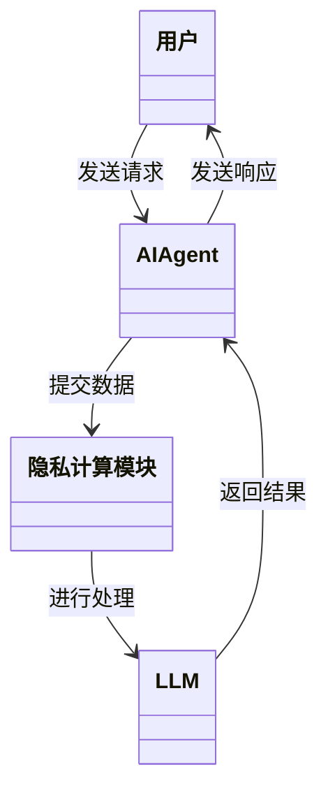
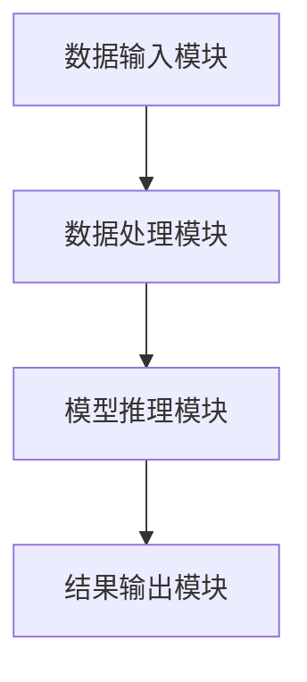
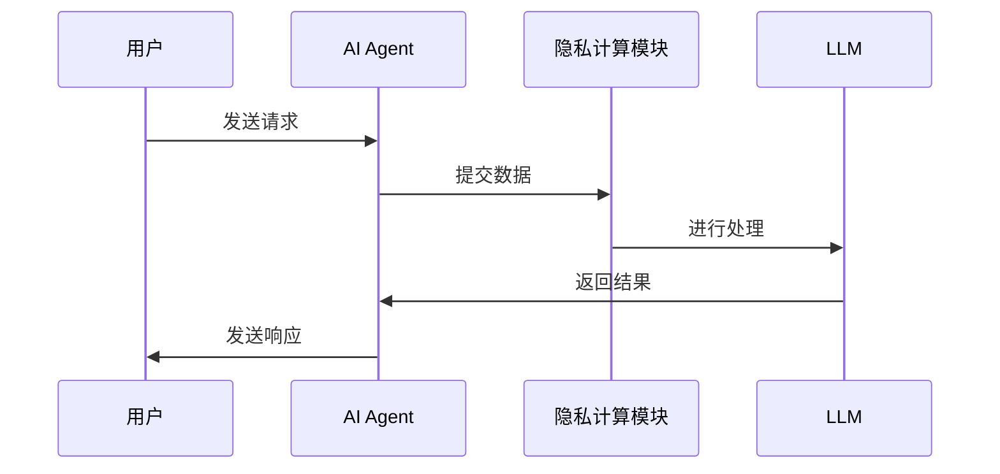

                 


# AI Agent 的隐私计算：在保护数据隐私的同时应用 LLM

> 关键词：AI Agent, 隐私计算, 大语言模型, LLM, 数据隐私, 隐私保护, 安全计算

> 摘要：  
本文深入探讨了AI Agent在隐私计算中的应用，特别是在保护数据隐私的同时利用大语言模型（LLM）进行智能处理。通过分析AI Agent的核心原理、隐私计算的技术手段以及两者结合的实际应用场景，本文旨在为读者提供一个全面的技术视角，帮助理解如何在不泄露数据隐私的前提下，充分发挥AI Agent和大语言模型的潜力。文章内容涵盖AI Agent的基本概念、隐私计算的关键技术、AI Agent与LLM的结合应用、系统架构设计以及实际案例分析，最后总结了最佳实践和未来研究方向。

---

# 第一部分: AI Agent 的隐私计算概述

## 第1章: AI Agent 和隐私计算的背景

### 1.1 AI Agent 的基本概念

#### 1.1.1 AI Agent 的定义
AI Agent（人工智能代理）是一种能够感知环境、自主决策并执行任务的智能实体。它可以是一个软件程序、一个机器人或任何具备AI功能的系统，旨在通过与环境交互来实现特定目标。

#### 1.1.2 AI Agent 的特点
- **自主性**：AI Agent能够自主决策，无需外部干预。
- **反应性**：能够实时感知环境变化并做出反应。
- **目标导向**：所有行为都围绕实现特定目标展开。
- **学习能力**：能够通过数据和经验不断优化自身性能。

#### 1.1.3 AI Agent 的应用场景
AI Agent广泛应用于自动驾驶、智能助手（如Siri、Alexa）、推荐系统、机器人客服等领域。它们能够处理复杂任务，例如路径规划、信息检索和决策支持。

### 1.2 隐私计算的基本概念

#### 1.2.1 隐私计算的定义
隐私计算是指在保护数据隐私的前提下，对数据进行处理和分析的方法。其核心目标是在不泄露原始数据的情况下，实现数据的价值挖掘。

#### 1.2.2 隐私计算的核心原则
- **数据不可见性**：数据在计算过程中保持加密或匿名化，确保原始数据不被泄露。
- **计算可验证性**：计算结果可以通过公开的验证机制确认，确保计算过程的正确性。
- **隐私保护性**：在保护隐私的前提下，确保计算结果的准确性和可用性。

#### 1.2.3 隐私计算的应用场景
隐私计算在金融、医疗、教育等领域有广泛应用，例如数据共享中的隐私保护、匿名数据分析、联邦学习等。

### 1.3 AI Agent 与隐私计算的结合

#### 1.3.1 AI Agent 在隐私计算中的作用
AI Agent作为隐私计算的执行者，能够在不泄露数据隐私的前提下，完成数据处理和分析任务。

#### 1.3.2 隐私计算对 AI Agent 的影响
隐私计算为AI Agent提供了更安全的运行环境，确保其在处理敏感数据时不会泄露用户隐私。

#### 1.3.3 结合应用的潜力
通过结合AI Agent和隐私计算，可以在保护数据隐私的同时，实现更智能、更高效的决策和数据分析。

---

## 第2章: AI Agent 的核心原理

### 2.1 AI Agent 的结构与功能

#### 2.1.1 AI Agent 的核心模块
AI Agent通常由感知模块、决策模块、执行模块和学习模块组成。感知模块负责数据输入和环境感知，决策模块负责制定行动策略，执行模块负责具体操作，学习模块负责优化和更新模型。

#### 2.1.2 各模块的功能与交互
- 感知模块接收外部输入，解析数据并传递给决策模块。
- 决策模块基于当前状态和目标，制定行动策略。
- 执行模块根据决策模块的指令，执行具体操作。
- 学习模块通过反馈机制优化模型，提升整体性能。

#### 2.1.3 AI Agent 的工作流程
1. 感知环境并接收输入数据。
2. 分析数据并制定决策策略。
3. 执行决策并生成输出。
4. 根据反馈优化模型。

### 2.2 隐私计算的原理

#### 2.2.1 数据加密与隐私保护
隐私计算通常采用加密技术（如同态加密）来保护数据隐私。在数据处理过程中，数据始终保持加密状态，确保原始数据不被泄露。

#### 2.2.2 隐私保护机制
隐私保护机制包括数据匿名化、数据分割、同态计算等技术，确保在数据处理过程中，隐私不会被泄露。

#### 2.2.3 隐私保护与数据可用性的平衡
隐私计算的目标是在保护数据隐私的前提下，确保数据的可用性和分析结果的准确性。

---

## 第3章: AI Agent 在 LLM 中的应用

### 3.1 LLM 的基本原理

#### 3.1.1 大语言模型的结构
大语言模型通常基于深度学习架构，如Transformer模型。模型由编码器和解码器组成，能够处理序列数据并生成自然语言文本。

#### 3.1.2 LLM 的训练过程
模型通过大量文本数据的监督学习进行训练，学习语言的分布特征，从而能够生成与训练数据相似的文本。

#### 3.1.3 LLM 的推理机制
LLM在推理阶段通过解码器生成概率最高的下一个词，逐步构建完整的文本输出。

### 3.2 隐私保护在 LLM 应用中的重要性

#### 3.2.1 数据隐私的挑战
在LLM的应用中，训练数据通常包含大量敏感信息，如何保护这些数据的隐私是一个重要挑战。

#### 3.2.2 隐私泄露的风险
如果LLM的训练或推理过程不加以保护，可能导致敏感数据的泄露。

#### 3.2.3 如何在 LLM 中实现隐私保护
通过隐私计算技术，可以在不泄露原始数据的情况下，对数据进行处理和分析，确保LLM的应用符合隐私保护的要求。

---

## 第4章: AI Agent 的隐私计算技术

### 4.1 隐私计算的关键技术

#### 4.1.1 同态加密
同态加密是一种允许在加密数据上进行计算的技术，能够在不泄露原始数据的情况下，对数据进行处理。

#### 4.1.2 联邦学习
联邦学习是一种分布式机器学习技术，允许多个机构在不共享原始数据的情况下，协同训练模型。

#### 4.1.3 差分隐私
差分隐私通过在数据中添加噪声，确保个体数据的隐私不会被泄露。

### 4.2 AI Agent 中的隐私保护技术

#### 4.2.1 数据匿名化
通过去除或屏蔽敏感信息，确保数据在处理过程中无法被逆向还原到原始数据。

#### 4.2.2 计算过程中的隐私保护
通过加密和隐私计算技术，确保计算过程中的数据隐私不被泄露。

#### 4.2.3 结果的隐私性处理
在输出结果时，对结果进行隐私保护处理，确保结果中不包含敏感信息。

---

## 第5章: AI Agent 的系统架构设计

### 5.1 系统架构概述

#### 5.1.1 系统模块划分
AI Agent的系统架构通常包括数据输入模块、数据处理模块、模型推理模块和结果输出模块。

#### 5.1.2 各模块的职责
- 数据输入模块：负责接收外部输入的数据。
- 数据处理模块：对数据进行预处理和加密，确保数据隐私。
- 模型推理模块：基于加密后的数据进行模型推理，生成计算结果。
- 结果输出模块：对计算结果进行解密和处理，输出最终结果。

### 5.2 系统架构的详细设计

#### 5.2.1 数据流的处理流程
1. 数据输入模块接收原始数据。
2. 数据处理模块对数据进行加密或匿名化处理。
3. 模型推理模块基于加密数据进行推理，生成中间结果。
4. 结果输出模块对中间结果进行解密和处理，输出最终结果。

#### 5.2.2 计算过程的隐私保护
通过同态加密或联邦学习技术，确保计算过程中的数据隐私不被泄露。

#### 5.2.3 结果的输出与隐私性
输出结果经过隐私保护处理，确保结果中不包含敏感信息。

---

## 第6章: AI Agent 的实际应用案例

### 6.1 案例背景介绍

#### 6.1.1 问题场景
假设我们需要在保护用户隐私的前提下，利用AI Agent和大语言模型进行智能客服系统的开发。

#### 6.1.2 项目目标
通过AI Agent和LLM的结合，实现智能客服系统的对话理解和任务处理，同时保护用户的隐私数据。

### 6.2 系统功能设计

#### 6.2.1 领域模型设计
使用Mermaid图描述系统的领域模型，包括用户、AI Agent、LLM和隐私计算模块。



#### 6.2.2 系统架构设计
使用Mermaid图描述系统的整体架构，包括数据输入、数据处理、模型推理和结果输出模块。



#### 6.2.3 系统接口设计
系统接口包括数据输入接口、数据处理接口、模型推理接口和结果输出接口。

#### 6.2.4 系统交互设计
使用Mermaid图描述系统的交互流程，包括用户请求、AI Agent处理和结果返回。



### 6.3 项目核心实现

#### 6.3.1 环境配置
需要安装Python、TensorFlow、Keras等库，并配置相应的开发环境。

#### 6.3.2 核心代码实现
以下是AI Agent与LLM结合的Python代码示例：

```python
# AI Agent 类
class AI-Agent:
    def __init__(self):
        self.llm = LLM()  # 初始化大语言模型
        self.privacy_module = Privacy_Module()  # 初始化隐私计算模块

    def process_request(self, request):
        # 对请求进行加密处理
        encrypted_request = self.privacy_module.encrypt(request)
        # 提交到大语言模型进行处理
        response = self.llm.inference(encrypted_request)
        # 对结果进行解密
        decrypted_response = self.privacy_module.decrypt(response)
        return decrypted_response

# 大语言模型类
class LLM:
    def __init__(self):
        # 初始化大语言模型
        pass

    def inference(self, input):
        # 在模型中进行推理
        return processed_output

# 隐私计算模块类
class Privacy_Module:
    def __init__(self):
        # 初始化隐私计算模块
        pass

    def encrypt(self, data):
        # 对数据进行加密处理
        return encrypted_data

    def decrypt(self, data):
        # 对数据进行解密处理
        return decrypted_data
```

#### 6.3.3 代码应用解读与分析
上述代码展示了AI Agent如何与LLM和隐私计算模块交互。AI Agent接收用户请求后，通过隐私计算模块对请求进行加密，然后提交到LLM进行处理，最后对结果进行解密并返回给用户。

### 6.4 实际案例分析

#### 6.4.1 案例分析
通过实际案例分析，展示AI Agent在保护用户隐私的前提下，如何利用LLM完成智能客服系统的对话理解和任务处理。

#### 6.4.2 详细讲解
详细讲解案例中的每个步骤，包括数据加密、模型推理和结果解密，确保读者能够理解整个过程。

---

## 第7章: 总结与展望

### 7.1 总结
本文详细探讨了AI Agent在隐私计算中的应用，特别是在保护数据隐私的同时利用大语言模型进行智能处理。通过分析AI Agent的核心原理、隐私计算的技术手段以及两者结合的实际应用场景，本文为读者提供了一个全面的技术视角。

### 7.2 最佳实践 tips
- 在实际应用中，建议采用同态加密或联邦学习技术来保护数据隐私。
- 定期进行隐私保护技术的更新和优化，确保系统安全性。
- 加强对隐私保护法律法规的遵守，确保合规性。

### 7.3 未来研究方向
- 探索更多隐私计算技术在AI Agent中的应用，例如差分隐私和安全多方计算。
- 研究AI Agent在不同领域的具体应用，例如医疗、金融和教育等。
- 加强对隐私保护技术的理论研究，提升隐私计算的效率和准确性。

---

# 作者：AI天才研究院/AI Genius Institute & 禅与计算机程序设计艺术 /Zen And The Art of Computer Programming

