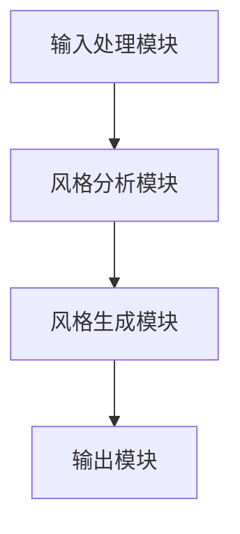
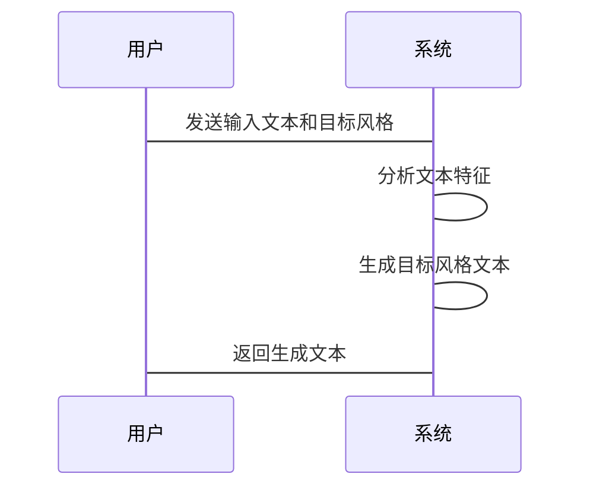

                 

<think>
嗯，我现在需要为这本书设计目录大纲。首先，我得理解书的核心内容是AI Agent的风格迁移，特别是让LLM模仿不同写作风格。这部分技术挺复杂的，涉及到自然语言处理和生成模型。

接下来，我应该考虑结构。通常，技术书籍有背景、原理、系统设计、实战和未来展望等部分。所以，我可能分成五大部分：背景与概念、算法原理、系统架构、项目实战、高级技巧与未来展望。

在背景部分，我需要介绍AI Agent和LLM的基本概念，风格迁移的定义，以及它在不同领域的应用。这部分帮助读者打下基础。

算法原理部分，我需要详细讲解风格迁移的算法，比如基于变换器的模型。可能需要使用数学公式和mermaid图来解释模型结构和训练流程。

系统架构设计部分，我需要设计系统功能模块，画出类图、架构图和交互序列图。这部分要清晰展示各模块如何协作。

项目实战部分，我需要提供环境安装、代码实现和案例分析。使用具体的Python代码示例，解释每一步的作用，并通过案例展示应用。

高级技巧和未来展望部分，讨论模型调优、多模态扩展等，并展望未来的发展趋势。

我需要确保每个部分都覆盖到位，结构合理，逻辑清晰，帮助读者全面掌握技术。同时，使用markdown格式，确保目录完整且详细。
</think>

# 目录大纲：《AI Agent 的风格迁移：让 LLM 模仿不同的写作风格》

---

## 第一部分：背景与概念

### 第1章：AI Agent与风格迁移概述

#### 1.1 AI Agent的基本概念
- **1.1.1 AI Agent的定义与特点**
  - 定义：AI Agent（智能体）是一种能够感知环境并采取行动以实现目标的实体。
  - 特点：自主性、反应性、主动性、社会性。

- **1.1.2 AI Agent在自然语言处理中的应用**
  - 任务：文本生成、对话系统、内容推荐。
  - 案例：智能助手（如Siri、Alexa）、聊天机器人。

#### 1.2 风格迁移的定义与分类
- **1.2.1 风格迁移的定义**
  - 将一种风格的内容转换为另一种风格的过程。
  - 示例：将学术论文的风格转换为博客文章的风格。

- **1.2.2 风格迁移的分类**
  - 基于内容：保持内容不变，仅改变表达方式。
  - 基于情感：根据情感倾向调整语言风格。
  - 综合风格：结合多种风格特征进行迁移。

#### 1.3 LLM与风格迁移的关系
- **1.3.1 LLM的基本原理**
  - 基于Transformer架构，通过自注意力机制捕捉上下文信息。
  - 生成文本基于概率分布，优化目标函数（如交叉熵损失）。

- **1.3.2 LLM在风格迁移中的优势**
  - 大规模预训练参数使模型具备强大的语义理解能力。
  - 可通过微调任务适应特定的风格迁移需求。

---

## 第二部分：算法原理

### 第2章：风格迁移的算法原理

#### 2.1 基于变换器的风格迁移模型
- **2.1.1 变换器的基本结构**
  - 编码器：将输入文本转换为潜在向量。
  - 解码器：根据潜在向量生成目标风格文本。

- **2.1.2 风格迁移的实现流程**
  - 输入：源文本和目标风格标识。
  - 处理：编码器提取文本特征，解码器结合风格向量生成目标文本。

#### 2.2 风格表示方法
- **2.2.1 风格向量的提取**
  - 使用预训练模型提取文本的风格向量。
  - 示例：BERT、GPT等模型的隐藏层输出。

- **2.2.2 风格特征的对比分析**
  - 使用对比学习方法，增强风格特征的区分度。
  - 示例：通过余弦相似度计算不同风格向量的差异。

#### 2.3 风格迁移的训练策略
- **2.3.1 对抗训练方法**
  - 使用生成对抗网络（GAN）框架，判别器区分真实与生成文本。
  - 示例：生成器负责风格迁移，判别器负责区分生成文本与真实文本。

- **2.3.2 监督学习与无监督学习的结合**
  - 监督学习：使用标注数据进行有监督训练。
  - 无监督学习：利用未标注数据进行自监督学习。

---

## 第三部分：系统架构设计

### 第3章：风格迁移系统的架构设计

#### 3.1 系统功能设计
- **3.1.1 输入处理模块**
  - 功能：接收用户输入的文本和目标风格标识。
  - 接口：提供REST API或命令行接口。

- **3.1.2 风格分析模块**
  - 功能：分析输入文本的特征和目标风格的特征。
  - 方法：基于预训练模型提取特征向量。

- **3.1.3 风格生成模块**
  - 功能：根据分析结果生成目标风格文本。
  - 方法：使用变换器模型进行文本生成。

#### 3.2 系统架构图


#### 3.3 接口设计
- **3.3.1 输入接口**
  - 接收JSON格式的输入，包含文本和风格标识。

- **3.3.2 输出接口**
  - 返回生成的文本和可能的置信度分数。

#### 3.4 交互流程


---

## 第四部分：项目实战

### 第4章：风格迁移项目实战

#### 4.1 环境安装与配置
- **4.1.1 安装Python环境**
  - 使用Anaconda或virtualenv创建独立环境。

- **4.1.2 安装必要的库**
  - `transformers`库：用于加载预训练模型。
  - `torch`库：用于深度学习模型训练。

```bash
pip install transformers torch
```

#### 4.2 核心代码实现
- **4.2.1 数据预处理代码**
```python
from transformers import AutoTokenizer, AutoModelForMaskedLM

tokenizer = AutoTokenizer.from_pretrained('bert-base-uncased')
model = AutoModelForMaskedLM.from_pretrained('bert-base-uncased')
```

- **4.2.2 模型训练代码**
```python
def train_model(train_loader, model, criterion, optimizer, device):
    model.train()
    for inputs, labels in train_loader:
        inputs = inputs.to(device)
        labels = labels.to(device)
        outputs = model(inputs)
        loss = criterion(outputs, labels)
        loss.backward()
        optimizer.step()
    return model
```

- **4.2.3 风格生成代码**
```python
def generate_text(prompt, model, tokenizer):
    inputs = tokenizer.encode(prompt, return_tensors='pt')
    outputs = model.generate(inputs, max_length=50)
    return tokenizer.decode(outputs[0], skip_special_tokens=True)
```

#### 4.3 代码解读与分析
- 数据预处理：使用BERT tokenizer对输入文本进行分词和编码。
- 模型训练：使用PyTorch进行模型参数优化，通过反向传播更新参数。
- 风格生成：利用预训练模型生成目标风格的文本。

#### 4.4 实际案例分析
- **4.4.1 文学作品风格迁移案例**
  - 输入：学术论文段落。
  - 输出：生成的小说风格段落。

- **4.4.2 技术文档**
  - 输入：诗歌文本。
  - 输出：生成的技术报告风格段落。

---

## 第五部分：高级技巧与未来展望

### 第5章：高级技巧与最佳实践

#### 5.1 模型调优技巧
- **参数调整**：优化学习率、批次大小等超参数。
- **模型微调**：针对特定领域进行微调，提升迁移效果。

#### 5.2 多模态扩展
- **结合视觉信息**：将图像特征与文本特征结合，生成更具表现力的文本。
- **多语言支持**：支持多种语言的风格迁移，扩展应用范围。

#### 5.3 性能优化
- **使用缓存机制**：减少重复计算，提升推理速度。
- **分布式训练**：利用多GPU加速模型训练。

#### 5.4 最佳实践
- **数据多样性**：确保训练数据覆盖多种风格，避免过拟合。
- **持续学习**：定期更新模型，适应新的风格变化。

### 第6章：未来展望

#### 6.1 风格迁移的发展趋势
- **更细粒度的风格识别**：从句子级别到段落级别的风格迁移。
- **动态风格调整**：根据上下文动态调整生成文本的风格。

#### 6.2 与其他技术的结合
- **增强现实**：结合AR技术，生成虚拟场景中的文本内容。
- **情感计算**：将风格迁移与情感分析结合，生成带有特定情感倾向的文本。

#### 6.3 应用场景扩展
- **教育领域**：辅助学生改写作业，提升写作能力。
- **内容创作**：帮助作者快速生成不同风格的内容。

---

## 附录：参考资料与工具列表

- **参考资料**
  - 论文1：《Style Transfer in Text》
  - 论文2：《Transformer-based Style Transfer Models》

- **工具列表**
  - Hugging Face Transformers库
  - PyTorch框架
  - Colab云开发环境

---

## 作者：AI天才研究院 & 禅与计算机程序设计艺术

---

**摘要**：本文详细探讨了AI Agent在风格迁移中的应用，特别是利用大语言模型（LLM）模仿不同写作风格的技术。通过分析算法原理、系统架构设计和实际项目案例，本文为读者提供了从理论到实践的全面指南，帮助他们理解并掌握这一前沿技术。

