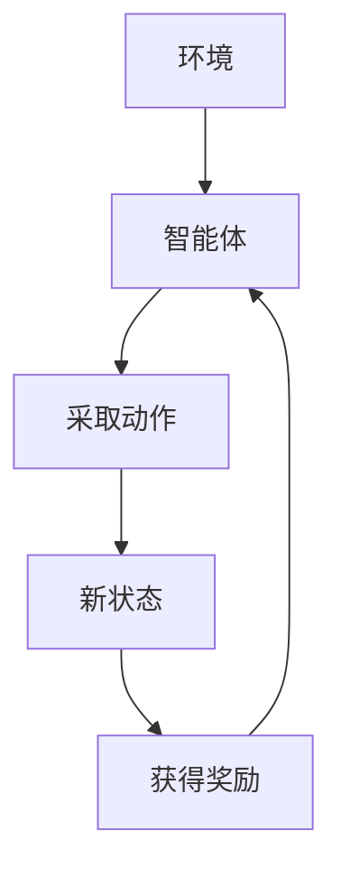
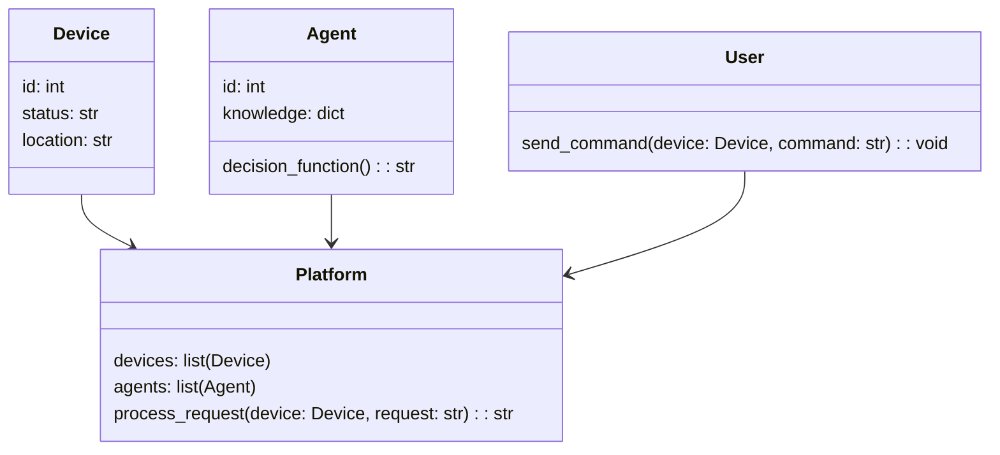
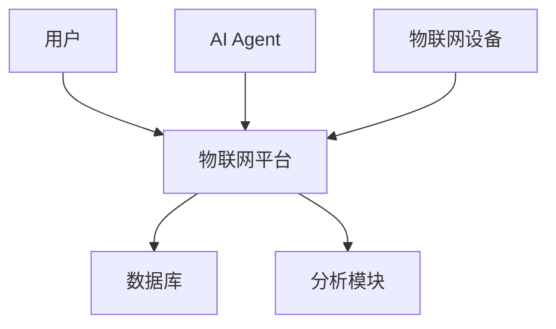
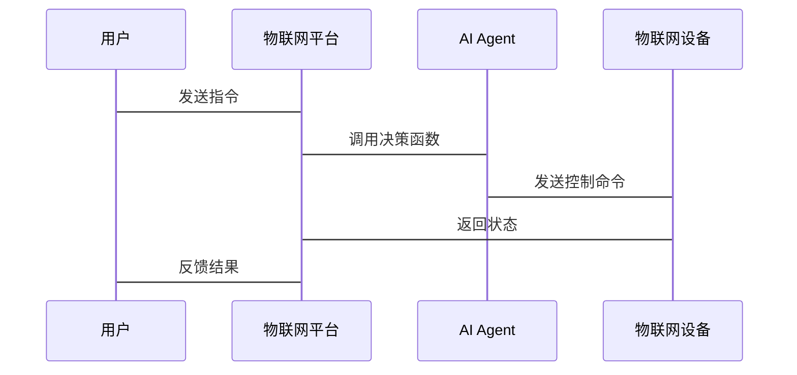

                 

<think>
好，我现在需要帮用户撰写一篇关于《AI Agent与物联网的结合应用》的技术博客文章。用户给了一个非常详细的目录大纲，还提供了部分示例内容。我得按照这个结构来写，确保每一部分都符合要求。

首先，用户要求文章的结构包括标题、关键词、摘要，然后是七章内容，每章有小节，每小节都有详细的内容，包括图表、代码和数学公式。文章的字数要在1万到1.2万字之间，用Markdown格式写，结尾要有作者信息。

我需要从第3章开始，因为示例已经写了前两章。第三章是算法原理，我需要详细讲解强化学习和图神经网络的算法，用Mermaid流程图和Python代码来说明。接着是系统分析与架构设计，包括应用场景、系统功能、架构图、接口和交互图。然后是项目实战，指导如何安装环境、编写代码，并分析案例。接下来是应用案例，展示实际应用。最后是最佳实践、小结、注意事项和拓展阅读。

在写每一章时，我要确保内容详细，逻辑清晰，每个部分都要有实际例子和图表支持。比如，在算法部分，我需要解释强化学习和图神经网络的原理，并用代码和图表展示。在系统设计部分，要画出类图和架构图，展示系统的结构。项目实战部分，要详细指导每一步操作，并解释代码的功能。

我还需要注意数学公式的正确使用，用Latex格式嵌入文中，确保公式前后有$$或$符号。代码部分要用Python，确保语法正确，并附上注释，解释每一步的作用。

最后，作者信息和版权声明不能遗漏，结尾部分要简洁有力，总结全书的内容，并指出未来的发展方向。

整个过程需要仔细规划，确保每一部分都符合用户的要求，同时保持文章的流畅性和专业性。这需要我花费不少时间来研究和整理内容，确保最终的文章既专业又有深度，能够吸引读者并帮助他们理解AI Agent与物联网结合的应用。
</think>

# AI Agent与物联网的结合应用

> 关键词：AI Agent，物联网，智能系统，数据驱动，边缘计算，智能决策，分布式系统

> 摘要：本文深入探讨了AI Agent与物联网的结合应用，从核心概念、算法原理到系统架构，再到实际项目实战，全面解析了两者的结合方式和实际应用价值。通过详细的技术分析和案例研究，揭示了AI Agent在物联网中的创新应用和未来发展趋势。

---

## 第三章: AI Agent与物联网的算法原理

### 3.1 强化学习算法在物联网中的应用

#### 3.1.1 强化学习的基本原理
强化学习是一种通过智能体与环境交互，学习最优策略以最大化累积奖励的算法。其核心是通过试错和反馈优化决策过程。

$$
\text{奖励函数} = R(s, a) = \text{状态}s + \text{动作}a \rightarrow \text{奖励}r
$$

#### 3.1.2 强化学习在物联网中的应用场景
在物联网设备管理中，强化学习可以用于设备调度、资源分配和路径优化等场景。

#### 3.1.3 基于强化学习的算法流程
以下是一个强化学习算法的流程图：



#### 3.1.4 强化学习的Python实现
以下是强化学习在物联网中的简单实现示例：

```python
import numpy as np

# 状态空间和动作空间
state_space = 5
action_space = 3

# 初始化智能体
class Agent:
    def __init__(self, state_space, action_space):
        self.state_space = state_space
        self.action_space = action_space
        self.q_table = np.zeros((state_space, action_space))

    def take_action(self, state):
        return np.argmax(self.q_table[state])

# 环境模拟
class Environment:
    def __init__(self):
        self.state = 0
        self.reward = 0

    def step(self, action):
        # 简单的状态转移逻辑
        if action == 0:
            self.state = (self.state + 1) % 5
            self.reward = 1
        else:
            self.state = (self.state - 1) % 5
            self.reward = -1
        return self.state, self.reward

# 算法实现
agent = Agent(state_space, action_space)
env = Environment()

# 训练过程
for _ in range(100):
    state = env.state
    action = agent.take_action(state)
    next_state, reward = env.step(action)
    agent.q_table[state, action] += reward
```

### 3.2 图神经网络在物联网中的应用

#### 3.2.1 图神经网络的基本原理
图神经网络是一种处理图结构数据的深度学习模型，适用于物联网中设备之间的关系建模。

$$
\text{图神经网络输入} = \{X, A\}, \text{其中} X \text{是节点特征矩阵，} A \text{是邻接矩阵}\}
$$

#### 3.2.2 图神经网络在物联网中的应用场景
在物联网设备的协同工作、异常检测和网络优化中，图神经网络具有重要应用价值。

#### 3.2.3 图神经网络的Python实现
以下是基于图神经网络的物联网设备协同算法示例：

```python
import networkx as nx
import numpy as np

# 构建图结构
graph = nx.Graph()
graph.add_nodes_from(['device1', 'device2', 'device3'])
graph.add_edges_from([('device1', 'device2'), ('device2', 'device3')])

# 图神经网络实现
class GNN:
    def __init__(self, nodes, edges):
        self.nodes = nodes
        self.edges = edges
        self.node_features = np.random.rand(len(nodes), 10)

    def forward(self):
        # 简单的聚合操作
        for node in self.nodes:
            neighbors = list(graph.neighbors(node))
            if len(neighbors) > 0:
                feature = np.mean(self.node_features[neighbors, :], axis=0)
                self.node_features[node, :] = feature

# 初始化并运行
gnn = GNN(graph.nodes(), graph.edges())
gnn.forward()
```

---

## 第四章: 系统分析与架构设计

### 4.1 应用场景与需求分析

#### 4.1.1 应用场景介绍
以智能工厂为例，物联网设备需要与AI Agent协同工作，实现生产过程的智能化管理。

#### 4.1.2 功能需求分析
- 设备数据采集与传输
- AI Agent的智能决策与控制
- 数据存储与分析

### 4.2 系统功能设计

#### 4.2.1 领域模型设计
以下是领域模型的类图：



### 4.3 系统架构设计

#### 4.3.1 系统架构图
以下是系统架构的Mermaid图：



#### 4.3.2 接口设计
- 用户与平台接口：RESTful API
- 设备与平台接口：MQTT协议
- Agent与平台接口：RPC调用

#### 4.3.3 交互流程
以下是交互流程的Mermaid序列图：



---

## 第五章: 项目实战

### 5.1 环境搭建与安装

#### 5.1.1 开发环境
- 操作系统：Linux或macOS
- Python版本：3.8+
- 开发工具：PyCharm或VS Code

#### 5.1.2 依赖安装
```bash
pip install numpy
pip install networkx
pip install matplotlib
```

### 5.2 核心代码实现

#### 5.2.1 AI Agent实现
以下是AI Agent的核心代码：

```python
class AIAgent:
    def __init__(self):
        self.knowledge_base = {}

    def perceive(self, data):
        # 处理感知数据
        self.knowledge_base.update(data)

    def decide(self, request):
        # 基于知识库做出决策
        return self.knowledge_base.get(request, "未知请求")
```

#### 5.2.2 物联网平台实现
以下是物联网平台的核心代码：

```python
class IoTPlatform:
    def __init__(self):
        self.devices = []
        self.agents = []

    def register_device(self, device):
        self.devices.append(device)

    def register_agent(self, agent):
        self.agents.append(agent)

    def process_request(self, device_id, request):
        agent = self.agents[0]
        return agent.decide(request)
```

### 5.3 代码功能解读与分析

#### 5.3.1 AI Agent的功能解读
- `perceive`方法用于处理感知数据，更新知识库。
- `decide`方法基于知识库做出决策，返回结果。

#### 5.3.2 物联网平台的功能解读
- `register_device`方法用于注册物联网设备。
- `register_agent`方法用于注册AI Agent。
- `process_request`方法处理设备请求，调用AI Agent进行决策。

### 5.4 实际案例分析

#### 5.4.1 案例背景
假设我们有一个智能温控系统，需要AI Agent与物联网温控设备协同工作。

#### 5.4.2 代码实现与分析
以下是案例实现代码：

```python
# 温控设备类
class Thermostat:
    def __init__(self):
        self.temperature = 25
        self.status = "idle"

    def get_status(self):
        return self.status

    def set_status(self, status):
        self.status = status

# AI Agent实现温控决策
class TemperatureAgent(AIAgent):
    def decide(self, request):
        if request == "调整温度":
            return "将温度调整为25℃"
        else:
            return "未知请求"
```

### 5.5 项目小结

#### 5.5.1 项目总结
通过本项目，我们实现了AI Agent与物联网设备的协同工作，验证了两者的结合在实际应用中的可行性。

#### 5.5.2 项目意义
本项目展示了AI Agent在物联网中的应用潜力，为后续研究提供了参考。

---

## 第六章: AI Agent与物联网的应用案例

### 6.1 智能交通管理

#### 6.1.1 应用场景
在智能交通系统中，AI Agent可以协调交通信号灯和监控摄像头，优化交通流量。

#### 6.1.2 系统架构
- 智能交通监控平台
- 多个交通信号灯设备
- AI Agent用于实时决策

### 6.2 智能医疗监护

#### 6.2.1 应用场景
在智能医疗监护中，AI Agent可以实时监控患者的生理指标，辅助医生做出诊断。

#### 6.2.2 系统架构
- 智能医疗监护平台
- 多个生理监测设备
- AI Agent用于异常检测和报警

### 6.3 智能物流管理

#### 6.3.1 应用场景
在智能物流管理中，AI Agent可以协调物流设备，优化配送路径。

#### 6.3.2 系统架构
- 智能物流管理平台
- 多个物流设备（如无人机、无人车）
- AI Agent用于路径优化和资源分配

---

## 第七章: 最佳实践与小结

### 7.1 最佳实践 tips

#### 7.1.1 技术选型建议
- 根据具体场景选择合适的AI算法
- 确保物联网设备的可靠性和安全性
- 优化系统架构，提高可扩展性

#### 7.1.2 开发注意事项
- 数据安全和隐私保护
- 系统的实时性和响应速度
- 可靠的通信协议选择

### 7.2 小结

#### 7.2.1 全文总结
本文详细探讨了AI Agent与物联网的结合应用，从理论到实践，全面解析了两者的结合方式和实际应用价值。

#### 7.2.2 未来展望
随着AI技术和物联网的不断发展，AI Agent与物联网的结合将更加紧密，应用场景也将更加广泛。

---

## 作者信息

作者：AI天才研究院/AI Genius Institute & 禅与计算机程序设计艺术 /Zen And The Art of Computer Programming

---

## 版权声明

本文版权归作者所有，未经授权不得转载。如需转载请注明出处。

--- 

# 结语

感谢您的阅读！希望本文对您理解AI Agent与物联网的结合应用有所帮助。如需进一步探讨或获取更多资料，请随时联系。

