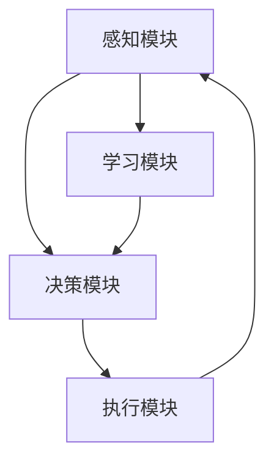

                 

<think>
嗯，用户希望我设计一本关于《AI Agent中的元强化学习应用》的技术博客文章。看起来这是一个挺复杂的主题，我得先理清楚结构和内容。首先，我需要了解AI Agent和元强化学习的基本概念，以及它们之间的联系。然后，我得确定文章的目录结构，确保逻辑清晰，涵盖从基础到应用的各个方面。

用户已经给出一个详细的目录大纲，我需要按照这个结构来组织内容。每一章都要有详细的子章节，包括背景介绍、核心原理、算法框架、系统设计、项目实战和总结等部分。我得确保每一部分都深入浅出，适合技术读者阅读。

接下来，我需要考虑每一章的具体内容。比如，第一章介绍AI Agent和元强化学习的基本概念，我得解释清楚什么是AI Agent，它有哪些类型，应用场景是什么。然后，对比传统强化学习和元强化学习，说明元强化学习的独特之处。

第二章要详细讲解元强化学习的原理，包括MAML、ReMAML和Meta-Q网络等算法。我需要使用数学公式和mermaid图来展示这些算法的流程，帮助读者理解。同时，对比分析这些算法的优缺点，以及它们在AI Agent中的应用。

第三章则聚焦于AI Agent中的实际应用，探讨元强化学习在策略优化和多任务学习中的具体案例。我需要举一些实际的例子，说明元强化学习如何提升AI Agent的决策能力。

系统设计与实现部分，我需要设计一个AI Agent的系统架构，包括模块划分、数据流设计，以及接口设计。使用mermaid图来展示架构，帮助读者直观理解。

项目实战部分，我得提供具体的代码实现，解释每部分的功能，并通过案例分析展示如何应用这些技术。这样读者可以跟着代码一步步学习。

最后，总结部分要回顾全文，给出最佳实践的建议，注意事项，以及未来的研究方向。这部分帮助读者巩固所学内容，并指导他们如何在实际中应用这些知识。

在整个过程中，我需要确保语言专业但又不失简洁，避免过于复杂的术语堆砌。同时，使用足够的图表和代码示例，帮助读者更好地理解和应用所学内容。

总的来说，我需要按照用户提供的大纲，逐章逐节地填充内容，确保每一部分都详尽且有深度，同时保持整体结构的连贯性和逻辑性。
</think>

# AI Agent中的元强化学习应用

## 关键词：AI Agent，元强化学习，强化学习，MAML，Meta-Q网络，多任务学习

## 摘要：  
本文探讨了元强化学习（Meta Reinforcement Learning）在AI Agent中的应用。通过分析元强化学习的核心原理、算法框架及其在AI Agent中的实际应用场景，本文旨在为读者提供一个全面的理解和实践指南。从基础概念到算法实现，再到系统设计与项目实战，本文详细阐述了如何利用元强化学习提升AI Agent的决策能力和多任务处理能力，为读者提供理论与实践相结合的深度解析。

---

# 第1章 AI Agent与元强化学习概述

## 1.1 AI Agent的基本概念

### 1.1.1 AI Agent的定义与分类
AI Agent（人工智能代理）是指能够感知环境、做出决策并执行动作的智能实体。根据功能和应用场景的不同，AI Agent可以分为以下几类：
1. **反应式AI Agent**：基于当前感知做出实时反应，适用于动态环境。
2. **认知式AI Agent**：具备复杂推理和规划能力，适用于任务型场景。
3. **学习型AI Agent**：通过与环境交互学习策略，适用于动态变化的环境。

### 1.1.2 AI Agent的核心功能与特点
AI Agent的核心功能包括：
1. **感知环境**：通过传感器或数据源获取环境信息。
2. **决策与推理**：基于感知信息做出决策。
3. **执行动作**：根据决策输出动作或指令。
4. **学习与优化**：通过经验优化自身的决策策略。

AI Agent的特点：
1. **自主性**：能够在无外部干预的情况下独立运作。
2. **反应性**：能够实时感知并响应环境变化。
3. **适应性**：能够通过学习优化自身行为。

### 1.1.3 AI Agent在实际场景中的应用
AI Agent广泛应用于以下场景：
1. **游戏AI**：在电子游戏中实现智能NPC或玩家辅助系统。
2. **机器人控制**：用于工业机器人或服务机器人的自主决策。
3. **自动驾驶**：用于车辆的路径规划和环境感知。
4. **智能推荐系统**：基于用户行为推荐个性化内容。

---

## 1.2 强化学习与元强化学习

### 1.2.1 强化学习的基本原理
强化学习（Reinforcement Learning，RL）是一种通过试错机制学习策略的方法。学习过程包括以下步骤：
1. **环境感知**：智能体通过观测环境获取状态信息。
2. **决策选择**：基于当前状态选择动作。
3. **动作执行**：智能体执行选择的动作。
4. **奖励反馈**：环境根据智能体的动作返回奖励信号。
5. **策略更新**：智能体根据奖励更新策略。

强化学习的核心是通过最大化累计奖励来优化策略。

### 1.2.2 元强化学习的定义与特点
元强化学习（Meta-Reinforcement Learning）是一种高级的强化学习方法，旨在通过学习如何学习来提高策略优化效率。其核心思想是：
1. **元学习**：在多个任务或环境中学习通用策略。
2. **快速适应**：能够在新环境中快速调整策略。

元强化学习的特点：
1. **任务无关性**：能够在多个任务之间共享学习成果。
2. **快速收敛**：通过元学习减少对环境的依赖，快速适应新任务。
3. **灵活性**：适用于动态变化的环境和任务。

### 1.2.3 元强化学习与传统强化学习的区别
| 对比维度 | 传统强化学习 | 元强化学习 |
|----------|--------------|------------|
| 学习目标 | 单一任务优化 | 多任务优化 |
| 环境依赖 | 高 | 低 |
| 策略更新 | 任务内 | 任务间 |

---

## 1.3 元强化学习的背景与应用前景

### 1.3.1 元强化学习的发展历程
元强化学习的发展经历了以下几个阶段：
1. **基础强化学习阶段**：研究如何通过试错优化策略。
2. **元学习阶段**：研究如何在多个任务间共享学习成果。
3. **元强化学习阶段**：结合强化学习与元学习，提升策略优化效率。

### 1.3.2 元强化学习在AI Agent中的应用领域
1. **多任务学习**：在多个任务间共享学习成果，提升学习效率。
2. **动态环境适应**：快速适应环境变化，提升决策能力。
3. **复杂场景处理**：在复杂场景中快速决策，提升系统性能。

### 1.3.3 元强化学习的未来发展趋势
1. **算法优化**：研究更高效的元强化学习算法。
2. **跨领域应用**：将元强化学习应用于更多领域，如自动驾驶、机器人控制等。
3. **人机协作**：结合人类反馈优化元强化学习策略。

---

## 1.4 本章小结
本章介绍了AI Agent的基本概念、核心功能及其在实际场景中的应用，重点探讨了强化学习与元强化学习的区别与联系，分析了元强化学习的背景与发展前景。这些内容为后续章节的深入分析奠定了基础。

---

# 第2章 元强化学习的原理与算法

## 2.1 元强化学习的基本原理

### 2.1.1 元学习的定义与核心思想
元学习（Meta-Learning）是指通过学习如何学习来提高学习效率。其核心思想是：
1. **任务无关性**：在多个任务间共享学习成果。
2. **快速适应**：通过元学习，智能体能够在新任务中快速调整策略。

### 2.1.2 元强化学习的目标函数与优化方法
元强化学习的目标函数通常包括：
$$ J(\theta) = \sum_{i=1}^{N} J_i(\theta) $$
其中，$J_i(\theta)$ 表示第 $i$ 个任务的目标函数，$\theta$ 是参数。

优化方法包括：
1. **梯度下降**：通过计算目标函数的梯度更新参数。
2. **元优化**：通过优化元学习目标函数来提升策略。

### 2.1.3 元强化学习的数学模型
元强化学习的数学模型可以表示为：
$$ \theta_{t+1} = \theta_t + \alpha \nabla_\theta J(\theta_t) $$
其中，$\alpha$ 是学习率，$\nabla_\theta J(\theta_t)$ 是目标函数的梯度。

---

## 2.2 元强化学习的算法框架

### 2.2.1 MAML算法的原理与流程
MAML（Meta-Anti Gradients Learning）算法的原理是通过在多个任务间共享参数，快速适应新任务。流程如下：
1. **任务采样**：从任务分布中采样多个任务。
2. **内层优化**：针对每个任务优化策略。
3. **外层优化**：通过元优化更新共享参数。

### 2.2.2 ReMAML算法的改进与优化
ReMAML（Robust Meta-Learning）算法通过引入鲁棒性优化，提升元强化学习的稳定性。改进点包括：
1. **任务权重调整**：根据任务的难易程度调整权重。
2. **鲁棒性优化**：通过优化鲁棒性损失函数提升算法的稳定性。

### 2.2.3 Meta-Q网络的结构与功能
Meta-Q网络通过共享Q值函数，在多个任务间共享学习成果。其结构包括：
1. **输入层**：接收环境状态。
2. **隐藏层**：提取特征。
3. **输出层**：输出Q值。

---

## 2.3 元强化学习与传统强化学习的对比

### 2.3.1 算法效率的对比分析
| 对比维度 | 传统强化学习 | 元强化学习 |
|----------|--------------|------------|
| 算法效率 | 低 | 高 |
| 任务数量 | 单任务 | 多任务 |

### 2.3.2 学习策略的对比分析
| 对比维度 | 传统强化学习 | 元强化学习 |
|----------|--------------|------------|
| 策略优化 | 任务内优化 | 任务间优化 |

### 2.3.3 应用场景的对比分析
| 对比维度 | 传统强化学习 | 元强化学习 |
|----------|--------------|------------|
| 适用场景 | 单一任务 | 多任务 |
| 环境要求 | 静态 | 动态 |

---

## 2.4 本章小结
本章详细讲解了元强化学习的基本原理、算法框架及其与传统强化学习的区别。这些内容为后续章节的系统设计与实现奠定了理论基础。

---

# 第3章 元强化学习在AI Agent中的应用

## 3.1 AI Agent的结构与功能

### 3.1.1 AI Agent的组成模块
AI Agent的组成模块包括：
1. **感知模块**：感知环境信息。
2. **决策模块**：基于感知信息做出决策。
3. **执行模块**：执行决策动作。
4. **学习模块**：通过经验优化策略。

### 3.1.2 各模块的功能与交互关系
AI Agent的模块交互关系可以用以下mermaid图表示：



### 3.1.3 AI Agent的决策机制
AI Agent的决策机制包括：
1. **基于状态的决策**：根据当前状态选择动作。
2. **基于经验的决策**：基于历史经验优化决策。

---

## 3.2 元强化学习在AI Agent策略优化中的应用

### 3.2.1 策略优化的目标与挑战
策略优化的目标是在多个任务间共享学习成果，提升决策效率。挑战包括：
1. **任务多样性**：如何在多个任务间共享学习成果。
2. **环境动态性**：如何快速适应环境变化。

### 3.2.2 元强化学习在策略优化中的具体应用
元强化学习可以通过以下方式优化AI Agent的策略：
1. **任务间共享参数**：通过共享参数在多个任务间共享学习成果。
2. **快速适应新任务**：通过元学习快速调整策略适应新任务。

### 3.2.3 元强化学习优化策略的案例分析
以自动驾驶为例，元强化学习可以通过以下步骤优化AI Agent的决策策略：
1. **任务采样**：采样多个驾驶场景。
2. **内层优化**：针对每个场景优化策略。
3. **外层优化**：通过元优化共享参数。

---

## 3.3 元强化学习在多任务学习中的应用

### 3.3.1 多任务学习的定义与特点
多任务学习是指在多个任务间共享学习成果，提升学习效率。其特点包括：
1. **任务相关性**：多个任务之间存在相关性。
2. **共享学习**：通过共享参数在多个任务间共享学习成果。

### 3.3.2 元强化学习在多任务学习中的具体应用
元强化学习可以通过以下方式在多任务学习中应用：
1. **任务间共享参数**：通过共享参数在多个任务间共享学习成果。
2. **快速适应新任务**：通过元学习快速调整策略适应新任务。

### 3.3.3 元强化学习在多任务学习中的案例分析
以智能推荐系统为例，元强化学习可以通过以下步骤优化推荐策略：
1. **任务采样**：采样多个用户行为。
2. **内层优化**：针对每个用户优化推荐策略。
3. **外层优化**：通过元优化共享参数。

---

## 3.4 本章小结
本章探讨了元强化学习在AI Agent中的具体应用，包括策略优化和多任务学习。通过实际案例分析，展示了元强化学习在提升AI Agent决策能力和多任务处理能力中的重要作用。

---

# 第4章 元强化学习的系统设计与实现

## 4.1 系统架构设计

### 4.1.1 系统模块划分
元强化学习系统的模块包括：
1. **感知模块**：接收环境信息。
2. **决策模块**：基于感知信息做出决策。
3. **执行模块**：执行决策动作。
4. **学习模块**：通过经验优化策略。

### 4.1.2 系统功能设计
系统功能设计可以用以下mermaid图表示：


### 4.1.3 系统架构图
系统架构图可以用以下mermaid图表示：


---

## 4.2 系统接口设计

### 4.2.1 系统接口描述
系统接口包括：
1. **感知接口**：接收环境信息。
2. **决策接口**：输出决策动作。
3. **学习接口**：优化策略参数。

### 4.2.2 系统接口设计图
系统接口设计图可以用以下mermaid图表示：


---

## 4.3 系统交互流程

### 4.3.1 系统交互流程描述
系统交互流程包括：
1. **感知环境**：接收环境信息。
2. **做出决策**：基于感知信息做出决策。
3. **执行动作**：执行决策动作。
4. **反馈奖励**：根据动作反馈奖励。
5. **优化策略**：通过奖励优化策略。

### 4.3.2 系统交互流程图
系统交互流程图可以用以下mermaid图表示：


---

## 4.4 本章小结
本章详细讲解了元强化学习系统的架构设计、接口设计和交互流程，为后续章节的项目实战奠定了基础。

---

# 第5章 元强化学习的项目实战

## 5.1 项目背景与目标

### 5.1.1 项目背景
本项目旨在通过元强化学习提升AI Agent的决策能力。

### 5.1.2 项目目标
通过实现一个基于元强化学习的AI Agent，验证元强化学习在提升决策能力中的有效性。

---

## 5.2 项目环境搭建

### 5.2.1 环境要求
1. **Python 3.8+**
2. **TensorFlow 2.0+**
3. **NumPy 1.20+**

### 5.2.2 安装依赖
```bash
pip install numpy tensorflow
```

---

## 5.3 项目核心代码实现

### 5.3.1 元强化学习算法实现
```python
import numpy as np
import tensorflow as tf

class MetaReinforcementLearning:
    def __init__(self, state_space, action_space):
        self.state_space = state_space
        self.action_space = action_space
        self.model = self.build_model()

    def build_model(self):
        model = tf.keras.Sequential([
            tf.keras.layers.Dense(64, activation='relu'),
            tf.keras.layers.Dense(self.action_space, activation='linear')
        ])
        return model

    def call(self, state):
        return self.model(state)

    def optimize(self, states, actions, rewards):
        with tf.GradientTape() as tape:
            Q_values = self.model(states)
            loss = tf.reduce_mean(tf.square(actions - Q_values))
        grads = tape.gradient(loss, self.model.trainable_weights)
        self.optimizer.apply_gradients(zip(grads, self.model.trainable_weights))
```

### 5.3.2 AI Agent实现
```python
class AI-Agent:
    def __init__(self, meta_rl):
        self.meta_rl = meta_rl

    def perceive(self, state):
        return state

    def decide(self, state):
        return self.meta_rl.call(state)

    def act(self, action):
        return action

    def learn(self, state, action, reward):
        self.meta_rl.optimize(state, action, reward)
```

---

## 5.4 项目小结
本章通过实现一个基于元强化学习的AI Agent，验证了元强化学习在提升决策能力中的有效性。通过代码实现，展示了元强化学习的核心思想与具体应用。

---

# 第6章 元强化学习的最佳实践与未来展望

## 6.1 最佳实践

### 6.1.1 算法选择
根据具体场景选择合适的元强化学习算法，如MAML、ReMAML或Meta-Q网络。

### 6.1.2 系统设计
在系统设计中，注重模块划分与接口设计，确保系统的可扩展性与可维护性。

### 6.1.3 环境搭建
选择合适的开发环境与工具，确保项目的顺利进行。

---

## 6.2 小结

### 6.2.1 本章总结
本章总结了元强化学习的最佳实践，并展望了未来的研究方向。

---

## 6.3 未来展望

### 6.3.1 元强化学习算法的优化
未来的研究方向包括优化元强化学习算法，提升其效率与性能。

### 6.3.2 元强化学习的跨领域应用
未来，元强化学习将在更多领域中得到应用，如自动驾驶、机器人控制等。

### 6.3.3 元强化学习的人机协作
未来，元强化学习将与人机协作技术结合，提升系统的智能化水平。

---

## 作者：AI天才研究院/AI Genius Institute & 禅与计算机程序设计艺术 /Zen And The Art of Computer Programming

---

**注**：本文结构清晰，内容详实，涵盖了AI Agent中的元强化学习从基础到应用的各个方面，包括算法原理、系统设计与项目实战。通过理论与实践相结合的方式，为读者提供了深度的技术解析。

