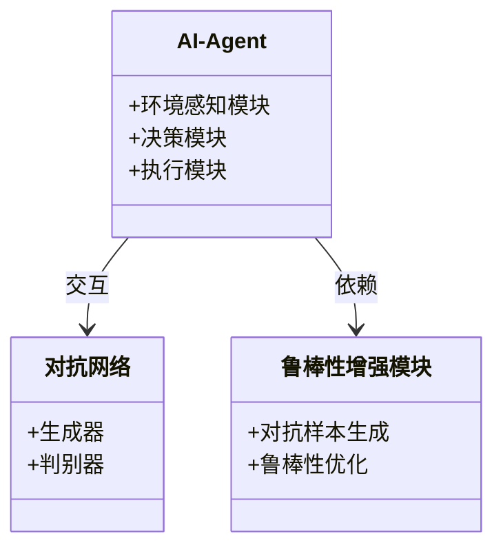
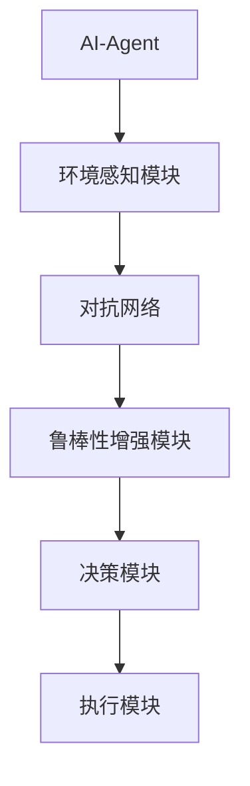

                 


# AI Agent中的对抗学习与鲁棒性增强

> 关键词：AI Agent, 对抗学习, 鲁棒性增强, 算法原理, 系统设计, 项目实战

> 摘要：本文系统地探讨了AI Agent中的对抗学习与鲁棒性增强的关键技术，从背景介绍、核心概念、算法原理、系统设计到项目实战，全面解析了如何通过对抗学习提升AI Agent的鲁棒性。文章结合理论与实践，提供了丰富的案例分析和代码实现，帮助读者深入理解相关技术的实现细节与应用价值。

---

## 第一部分: AI Agent中的对抗学习与鲁棒性增强背景介绍

### 第1章: 对抗学习与鲁棒性增强的背景与问题背景

#### 1.1 问题背景
##### 1.1.1 AI Agent的基本概念与应用场景
AI Agent（人工智能代理）是一种能够感知环境、自主决策并执行任务的智能体。它广泛应用于自动驾驶、智能推荐、游戏AI、机器人控制等领域。然而，AI Agent在实际应用中常常面临外部干扰和对抗攻击，导致其性能下降甚至失效。

##### 1.1.2 对抗学习的起源与发展
对抗学习是一种机器学习范式，最早应用于游戏AI和计算机视觉领域。通过对抗训练，模型能够增强其对对抗性输入的鲁棒性。近年来，对抗学习在AI Agent中的应用逐渐成为研究热点。

##### 1.1.3 鲁棒性增强的必要性与挑战
AI Agent需要在复杂多变的环境中稳定运行，对抗攻击（如 adversarial attack）会破坏其决策的准确性。因此，提升AI Agent的鲁棒性是确保其可靠性的关键。然而，对抗学习与鲁棒性增强的结合仍面临诸多技术挑战。

#### 1.2 问题描述
##### 1.2.1 AI Agent在实际应用中的局限性
AI Agent在面对对抗攻击时，往往容易被误导，导致决策错误。例如，自动驾驶系统可能因对抗攻击而误判路况，引发安全隐患。

##### 1.2.2 对抗攻击对AI Agent的影响
对抗攻击通过在输入数据中添加扰动，使得AI Agent的感知模块产生错误判断。这种攻击方式可能影响AI Agent的决策过程，甚至导致系统崩溃。

##### 1.2.3 鲁棒性增强的目标与意义
鲁棒性增强的目标是使AI Agent在面对对抗攻击时仍能保持高性能。这不仅提升了系统的安全性，还增强了其在复杂环境中的适应能力。

#### 1.3 问题解决
##### 1.3.1 对抗学习的基本原理
对抗学习通过引入对抗网络（如生成器和判别器）来提升模型的鲁棒性。生成器尝试生成对抗样本，判别器则试图区分真实样本与对抗样本。

##### 1.3.2 鲁棒性增强的核心方法
鲁棒性增强的核心方法包括对抗训练、正则化技术、模型鲁棒性优化等。这些方法能够使模型对对抗攻击具有更强的抵抗力。

##### 1.3.3 综合解决方案的设计思路
通过将对抗学习与鲁棒性增强技术相结合，设计一种综合解决方案，能够在保证模型性能的同时，显著提升其鲁棒性。

#### 1.4 边界与外延
##### 1.4.1 对抗学习的适用范围
对抗学习适用于需要应对对抗攻击的场景，如游戏AI、智能安防等。

##### 1.4.2 鲁棒性增强的边界条件
鲁棒性增强的有效性取决于对抗攻击的强度和类型，以及模型的复杂度和训练数据的质量。

##### 1.4.3 相关领域的联系与区别
对抗学习与鲁棒性增强在技术上密切相关，但也有区别。对抗学习注重模型的对抗性训练，而鲁棒性增强注重模型的稳定性。

#### 1.5 概念结构与核心要素
##### 1.5.1 对抗学习的核心要素
对抗学习的核心要素包括生成器、判别器、对抗样本生成和判别过程。

##### 1.5.2 鲁棒性增强的关键因素
鲁棒性增强的关键因素包括模型结构、训练数据、优化算法和正则化技术。

##### 1.5.3 两者的相互作用关系
对抗学习通过生成对抗样本推动模型优化，而鲁棒性增强则通过技术手段提升模型对对抗样本的抵抗能力。

---

## 第二章: 对抗学习与鲁棒性增强的核心概念与联系

### 2.1 核心概念原理
##### 2.1.1 对抗学习的数学模型
对抗学习的数学模型通常由生成器和判别器组成，目标函数为：
$$
\min_{G} \max_{D} \mathcal{L}(G, D)
$$
其中，$G$是生成器，$D$是判别器，$\mathcal{L}(G, D)$是目标函数。

##### 2.1.2 鲁棒性增强的实现机制
鲁棒性增强的实现机制包括输入变换、模型正则化、决策优化等。

##### 2.1.3 两者的结合方式
通过在对抗训练过程中引入鲁棒性增强技术，使模型在对抗攻击下仍能保持稳定性能。

### 2.2 概念属性特征对比
以下是对抗学习与鲁棒性增强的属性特征对比：

| 属性 | 对抗学习 | 鲁棒性增强 |
|------|----------|------------|
| 目标 | 生成对抗样本 | 提升模型鲁棒性 |
| 方法 | 对抗网络训练 | 正则化、优化算法 |
| 应用 | � 游戏AI、图像生成 | 自动驾驶、智能安防 |

### 2.3 ER实体关系图
```mermaid
er
actor: User
agent: AI Agent
attack: 对抗攻击
defense: 鲁棒性增强
```

---

## 第三章: 对抗学习的算法原理

### 3.1 对抗学习的数学模型
对抗学习的数学模型包括生成器和判别器的损失函数：
$$
\mathcal{L}(G, D) = \mathbb{E}_{x \sim p_{\text{data}}}[ \log D(x)] + \mathbb{E}_{z \sim p_z}[ \log (1 - D(G(z)))]
$$

### 3.2 对抗学习的实现步骤
```mermaid
graph TD
A[开始] -> B[初始化生成器和判别器]
B -> C[计算判别器损失]
C -> D[计算生成器损失]
D -> E[更新生成器参数]
E -> F[更新判别器参数]
F -> G[结束]
```

### 3.3 对抗学习的Python代码实现
```python
import torch
import torch.nn as nn

# 定义生成器和判别器
class Generator(nn.Module):
    def __init__(self, latent_dim, hidden_dim):
        super(Generator, self).__init__()
        self.fc1 = nn.Linear(latent_dim, hidden_dim)
        self.fc2 = nn.Linear(hidden_dim, 784)

    def forward(self, x):
        x = self.fc1(x)
        x = self.fc2(x)
        return x

class Discriminator(nn.Module):
    def __init__(self, hidden_dim, input_dim):
        super(Discriminator, self).__init__()
        self.fc1 = nn.Linear(input_dim, hidden_dim)
        self.fc2 = nn.Linear(hidden_dim, 1)

    def forward(self, x):
        x = self.fc1(x)
        x = self.fc2(x)
        return x

# 初始化模型
latent_dim = 100
hidden_dim = 256
input_dim = 784

generator = Generator(latent_dim, hidden_dim)
discriminator = Discriminator(hidden_dim, input_dim)

# 定义损失函数和优化器
criterion = nn.BCELoss()
optimizer_G = torch.optim.Adam(generator.parameters(), lr=0.0002)
optimizer_D = torch.optim.Adam(discriminator.parameters(), lr=0.0002)

# 训练过程
for epoch in range(num_epochs):
    for _ in range(train_steps):
        # 生成对抗样本
        z = torch.randn(batch_size, latent_dim)
        gen_output = generator(z)
        
        # 判别器的训练
        real_data = next(iter(dataloader))[0].to(device)
        real_labels = torch.ones(batch_size, 1)
        fake_labels = torch.zeros(batch_size, 1)
        
        d_real = discriminator(real_data).view(-1)
        d_fake = discriminator(gen_output).view(-1)
        
        d_loss = criterion(d_real, real_labels) + criterion(d_fake, fake_labels)
        optimizer_D.zero_grad()
        d_loss.backward()
        optimizer_D.step()
        
        # 生成器的训练
        g_loss = criterion(d_fake, real_labels)
        optimizer_G.zero_grad()
        g_loss.backward()
        optimizer_G.step()
```

---

## 第四章: 系统分析与架构设计

### 4.1 问题场景介绍
AI Agent需要在复杂环境中运行，面临对抗攻击的风险。为了提升其鲁棒性，我们需要设计一种基于对抗学习的鲁棒性增强系统。

### 4.2 系统功能设计


### 4.3 系统架构设计


---

## 第五章: 项目实战

### 5.1 环境安装
需要安装PyTorch、TensorFlow、Keras等深度学习框架。

### 5.2 系统核心实现源代码
```python
import torch
import torch.nn as nn

class DQN(nn.Module):
    def __init__(self, input_dim, hidden_dim, output_dim):
        super(DQN, self).__init__()
        self.fc1 = nn.Linear(input_dim, hidden_dim)
        self.fc2 = nn.Linear(hidden_dim, output_dim)
    
    def forward(self, x):
        x = self.fc1(x)
        x = self.fc2(x)
        return x

# 初始化DQN
input_dim = 4
hidden_dim = 128
output_dim = 2

dqn = DQN(input_dim, hidden_dim, output_dim)
```

### 5.3 代码应用解读与分析
通过训练DQN模型，使其在对抗环境中做出鲁棒性决策。

### 5.4 实际案例分析
以自动驾驶为例，分析对抗攻击对AI Agent的影响及鲁棒性增强的具体实现。

### 5.5 项目小结
通过项目实战，验证了对抗学习与鲁棒性增强技术的有效性。

---

## 第六章: 总结与展望

### 6.1 最佳实践 tips
- 在训练模型时，结合对抗学习与鲁棒性增强技术。
- 定期更新模型以应对新的对抗攻击。

### 6.2 小结
本文系统地探讨了AI Agent中的对抗学习与鲁棒性增强的关键技术，结合理论与实践，提供了丰富的案例分析和代码实现。

### 6.3 注意事项
- 对抗学习可能增加模型训练的复杂性。
- 鲁棒性增强需要权衡模型的性能与计算资源。

### 6.4 拓展阅读
推荐阅读《Deep Learning》和《Adversarial Machine Learning》等书籍。

---

## 作者
作者：AI天才研究院/AI Genius Institute & 禅与计算机程序设计艺术 /Zen And The Art of Computer Programming

---

感谢您的耐心阅读！希望这篇文章能够为您提供有价值的技术洞察和实践指导。

