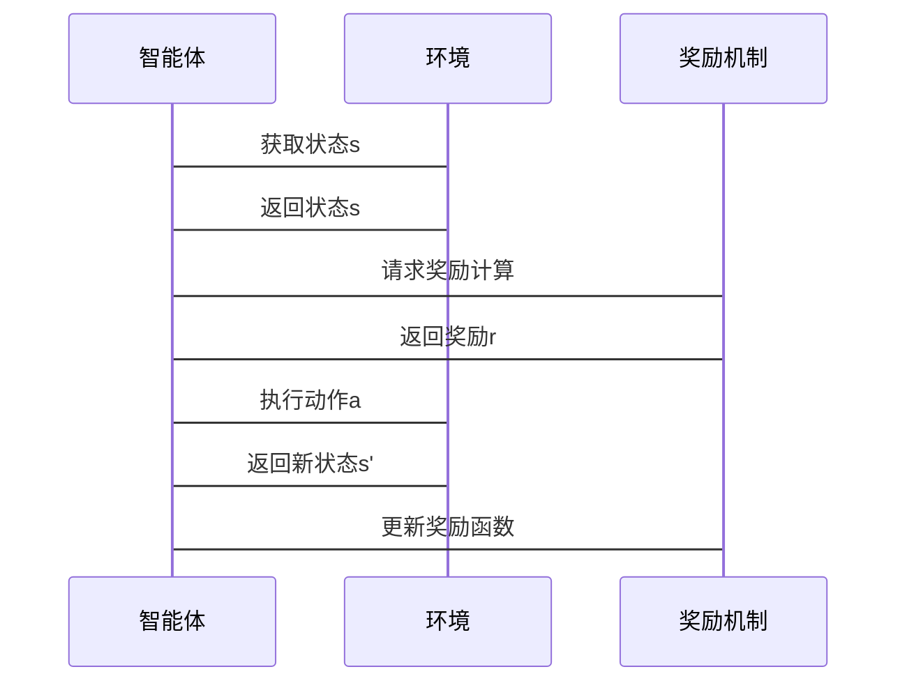

                 

<think>
好的，我现在需要按照用户的要求，撰写一篇关于《AI Agent中的强化学习与奖励塑造》的技术博客文章。首先，我需要理解用户的具体需求。用户希望文章结构清晰，包含摘要、关键词，以及详细的目录大纲，每个部分都要有具体的内容，包括背景介绍、核心概念、算法原理、系统设计、项目实战和总结等。

我首先会从摘要开始，概述文章的核心内容，然后列出关键词，接着按照目录大纲逐步展开每个部分的内容。在每个部分中，我需要确保内容详细、逻辑清晰，并且使用适当的格式，如数学公式用Latex表示，系统架构图用Mermaid绘制，代码示例用Python编写。

在撰写过程中，我需要确保每个章节都有足够的细节，同时保持整体结构的连贯性。例如，在背景介绍部分，我需要解释强化学习和奖励塑造的基本概念，确保读者能够理解这些术语。接着，在核心概念部分，我会深入探讨强化学习和奖励塑造之间的关系，可能包括数学模型和算法的比较。

在算法原理部分，我需要详细分析Q-learning和Deep Q-Network等算法，使用Mermaid图展示流程，并提供Python代码示例。系统设计部分则需要讨论如何构建一个基于强化学习的AI Agent系统，包括架构设计和接口设计。项目实战部分，我会通过实际案例展示如何应用这些理论，提供代码实现和案例分析。

最后，在总结部分，我会回顾全文，提供一些实用的建议和未来的发展趋势。同时，按照用户的要求，文章末尾需要署名作者信息。

在整个过程中，我需要确保内容既全面又深入，涵盖理论和实践两个方面，同时避免内容重复，确保每个章节都有明确的主题和目标。这样，读者能够逐步积累知识，逐步掌握如何在实际中应用这些技术。
</think>

# AI Agent中的强化学习与奖励塑造

> **关键词**：AI Agent，强化学习，奖励塑造，算法原理，系统设计，项目实战

> **摘要**：本文深入探讨AI Agent在强化学习中的应用，特别是奖励塑造的重要性。通过分析核心概念、算法原理、系统架构和项目实战，详细阐述如何设计和优化奖励机制，以提升AI Agent的决策能力。文章结合理论与实践，提供丰富的案例和代码示例，帮助读者全面理解并应用这些技术。

---

## 目录大纲

1. **背景介绍**
   - 1.1 强化学习基础
   - 1.2 奖励机制的重要性
   - 1.3 AI Agent的基本概念与架构

2. **核心概念与联系**
   - 2.1 强化学习与奖励塑造的关系
   - 2.2 强化学习的数学模型与奖励函数的类型
   - 2.3 奖励机制的属性特征对比表

3. **算法原理讲解**
   - 3.1 强化学习算法的核心流程
   - 3.2 基于Q-learning的奖励塑造实现
   - 3.3 深度强化学习算法的代码实现

4. **系统分析与架构设计**
   - 4.1 系统功能设计与领域模型
   - 4.2 系统架构设计与接口设计
   - 4.3 系统交互流程的Mermaid序列图

5. **项目实战**
   - 5.1 小项目：迷宫导航问题的强化学习解决方案
   - 5.2 企业级应用：智能客服中的任务分配优化

6. **最佳实践与总结**
   - 6.1 总结与回顾
   - 6.2 实践中的注意事项
   - 6.3 未来的发展方向与拓展阅读

---

## 正文

### 第1章：背景介绍

#### 1.1 强化学习基础

- **1.1.1 强化学习的基本概念**
  强化学习（Reinforcement Learning, RL）是一种机器学习方法，通过智能体与环境的交互，学习最优策略以最大化累积奖励。智能体会根据当前状态选择动作，环境反馈奖励和新的状态，智能体通过不断试错优化策略。

- **1.1.2 强化学习的核心特点**
  - 基于试错学习：智能体通过与环境互动，逐步优化策略。
  - 延迟奖励：奖励通常不是即时反馈，可能需要多个步骤后才能获得。
  - 动作空间与状态空间：状态是环境的描述，动作是智能体的选择。

- **1.1.3 强化学习与监督学习的区别**
  - 监督学习：已知输入和输出，学习函数映射。
  - 强化学习：通过奖励信号调整策略，优化长期目标。

#### 1.2 奖励机制的重要性

- **1.2.1 奖励在强化学习中的作用**
  奖励是强化学习的核心，指导智能体的学习方向，帮助其理解哪些行为是好的。

- **1.2.2 奖励设计的原则与挑战**
  - 明确性：奖励应清晰地反映目标。
  - 及时性：奖励应及时反馈，避免混淆。
  - 标量性：奖励应为标量，便于计算。
  - 挑战：动态环境中的奖励设计复杂，需平衡短期和长期目标。

#### 1.3 AI Agent的基本概念与架构

- **1.3.1 AI Agent的定义**
  AI Agent是智能体，能够感知环境并采取行动，以实现目标。

- **1.3.2 AI Agent的类型**
  - 简单反射型：基于当前状态做出反应。
  - 目标驱动型：基于目标选择行动。
  - 计划型：具备规划能力，考虑多种可能。

- **1.3.3 AI Agent的架构设计**
  常见架构包括反应式架构和基于模型的架构，选择取决于任务需求。

### 第2章：核心概念与联系

#### 2.1 强化学习与奖励塑造的关系

- **2.1.1 奖励机制在强化学习中的角色**
  奖励机制定义智能体的目标，指导策略优化。

- **2.1.2 奖励机制的类型**
  - 基础奖励：简单的奖励函数。
  - 复合奖励：综合多个因素的奖励。
  - 过程奖励：奖励不仅基于结果，还基于过程。

- **2.1.3 奖励机制与策略优化的关系**
  奖励机制直接影响策略优化的方向和效果。

#### 2.2 强化学习的数学模型与奖励函数的类型

- **2.2.1 强化学习的数学模型**
  状态（S）、动作（A）、奖励（R）、策略（π）、价值函数（V）和Q值函数（Q）是核心概念。

- **2.2.2 奖励函数的类型**
  - 基础奖励：简单直接。
  - 成就奖励：基于目标完成情况。
  - 复杂奖励：结合多种因素。

- **2.2.3 奖励函数的数学表达**
  奖励函数R(s, a)表示在状态s采取动作a时的奖励。

#### 2.3 奖励机制的属性特征对比表

| 属性         | 描述                                                         |
|--------------|--------------------------------------------------------------|
| 明确性       | 奖励是否明确反映目标                                         |
| 及时性       | 奖励反馈的及时程度                                         |
| 标量性       | 奖励是否为标量                                             |
| 动态性       | 奖励是否随环境变化而变化                                   |
| 唯一性       | 奖励是否唯一或有多种可能                                   |

### 第3章：算法原理讲解

#### 3.1 强化学习算法的核心流程

- **3.1.1 核心流程**
  智能体与环境交互，更新Q值函数，优化策略。

- **3.1.2 Q-learning算法**
  Q-learning通过更新Q表，学习状态-动作对的最优价值。

- **3.1.3 Deep Q-Network算法**
  使用神经网络近似Q值函数，解决高维状态空间问题。

#### 3.2 基于Q-learning的奖励塑造实现

- **3.2.1 Q-learning算法的伪代码**
  ```python
  初始化Q表
  while True:
      状态s
      动作a = 选择动作（基于Q表）
      执行动作a，获得奖励r和新状态s'
      Q(s, a) = Q(s, a) + α*(r + γ*max(Q(s', a')) - Q(s, a))
  ```

- **3.2.2 使用Mermaid绘制Q-learning流程图**
  ```mermaid
  graph LR
      A[状态s] --> B[选择动作a]
      B --> C[执行动作a]
      C --> D[获得奖励r和新状态s']
      D --> E[更新Q表]
  ```

- **3.2.3 深度强化学习的Python代码实现**
  ```python
  import numpy as np
  import tensorflow as tf

  class DQN:
      def __init__(self, state_space, action_space, lr=0.01, gamma=0.99):
          self.state_space = state_space
          self.action_space = action_space
          self.lr = lr
          self.gamma = gamma
          self.model = self.build_model()

      def build_model(self):
          model = tf.keras.Sequential([
              tf.keras.layers.Dense(24, activation='relu', input_dim=self.state_space),
              tf.keras.layers.Dense(24, activation='relu'),
              tf.keras.layers.Dense(self.action_space, activation='linear')
          ])
          model.compile(optimizer=tf.keras.optimizers.Adam(lr=self.lr), loss='mse')
          return model

      def remember(self, state, action, reward, next_state):
          self.memory.append((state, action, reward, next_state))

      def act(self, state):
          if np.random.random() < 0.99:  # ε-greedy策略
              q_values = self.model.predict(state.reshape((1, -1)))[0]
              return np.argmax(q_values)
          else:
              return np.random.randint(self.action_space)

      def replay(self, batch_size):
          mini_batch = random.sample(self.memory, batch_size)
          states = np.array([x[0] for x in mini_batch])
          actions = np.array([x[1] for x in mini_batch])
          rewards = np.array([x[2] for x in mini_batch])
          next_states = np.array([x[3] for x in mini_batch])

          targets = self.model.predict(states)
          next_q_values = self.model.predict(next_states)
          targets[range(batch_size), actions] = rewards + self.gamma * np.max(next_q_values, axis=1)
          self.model.fit(states, targets, batch_size=batch_size, epochs=1, verbose=0)
  ```

#### 3.3 深度强化学习算法的数学模型

- **3.3.1 Q值函数的数学表达**
  $$ Q(s, a) = w \cdot \phi(s,a) + \epsilon $$

- **3.3.2 神经网络的损失函数**
  $$ L = \frac{1}{m}\sum_{i=1}^{m}(y_i - Q(s_i,a_i))^2 $$

- **3.3.3 优化目标**
  最小化损失函数，更新权重参数w。

### 第4章：系统分析与架构设计

#### 4.1 系统功能设计与领域模型

- **4.1.1 系统功能设计**
  - 状态感知：获取当前环境状态。
  - 动作选择：基于策略选择动作。
  - 奖励计算：计算并反馈奖励。

- **4.1.2 领域模型设计**
  使用Mermaid类图表示系统各组件及其关系。

#### 4.2 系统架构设计与接口设计

- **4.2.1 系统架构设计**
  采用模块化架构，包括感知层、决策层和执行层。

- **4.2.2 系统接口设计**
  定义REST API，如`/get_state`, `/execute_action`, `/update_reward`。

#### 4.3 系统交互流程的Mermaid序列图



### 第5章：项目实战

#### 5.1 小项目：迷宫导航问题的强化学习解决方案

- **5.1.1 环境配置**
  使用OpenAI Gym库，定义迷宫环境。

- **5.1.2 代码实现**
  ```python
  import gym
  env = gym.make('MazeNavigation-v0')
  ```

- **5.1.3 案例分析**
  分析迷宫导航中的状态和动作，设计奖励函数。

#### 5.2 企业级应用：智能客服中的任务分配优化

- **5.2.1 系统架构**
  设计基于强化学习的智能客服系统，优化任务分配策略。

- **5.2.2 实际案例分析**
  分析任务分配中的状态、动作和奖励，设计奖励函数以提高效率。

### 第6章：最佳实践与总结

#### 6.1 总结与回顾

- 强化学习与奖励塑造的重要性。
- 系统设计与算法实现的关键点。

#### 6.2 实践中的注意事项

- 奖励设计的常见问题及解决方案。
- 系统架构设计中的优化技巧。

#### 6.3 未来的发展方向与拓展阅读

- 深度强化学习的最新进展。
- 多智能体强化学习的研究趋势。

---

**作者：AI天才研究院 & 禅与计算机程序设计艺术**

