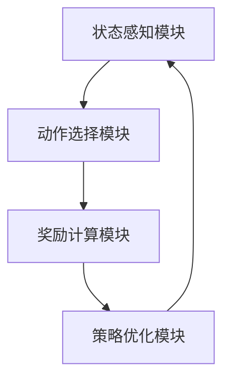
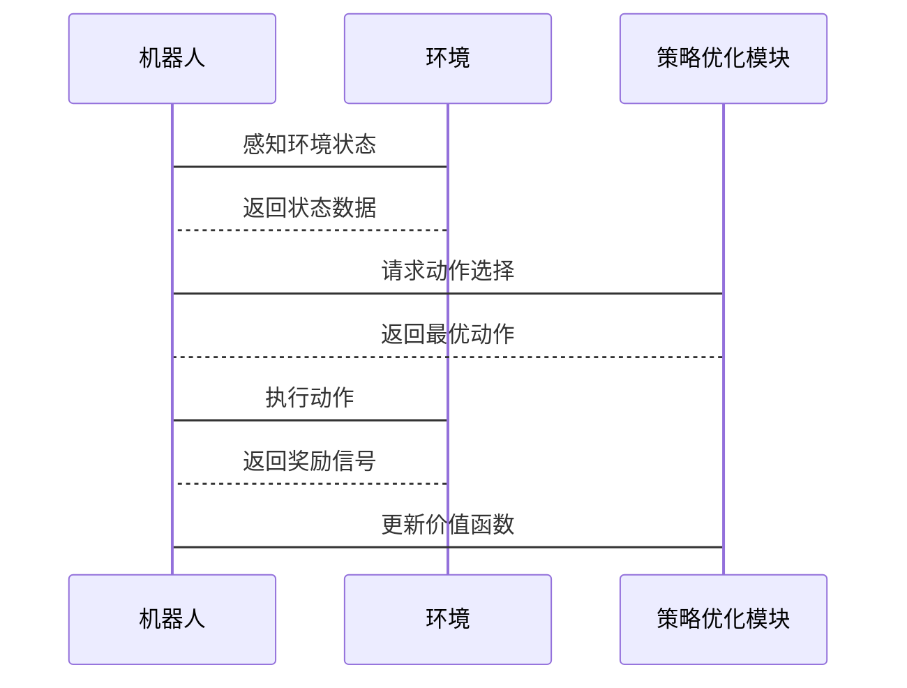

                 

<think>
好的，现在我来一步步分析用户的请求，以撰写这篇关于《AI Agent中的强化学习与探索策略优化》的技术博客文章。

首先，我注意到用户要求文章的标题是《AI Agent中的强化学习与探索策略优化》，并给出了关键词和摘要的示例。用户还提供了详细的目录结构，要求内容丰富、详细，每个部分都需有具体的解释和代码示例。

我开始分析文章的结构。文章分为四个主要部分，每部分包含多个章节，每个章节下又有小节。我需要确保每个部分都覆盖到用户要求的关键内容，如背景介绍、核心概念、算法原理、系统设计和项目实战等。

接下来，我考虑每个部分的具体内容。例如，在“强化学习的核心概念与数学模型”部分，我需要详细解释状态、动作、奖励等基本概念，并用数学公式（如贝尔曼方程）来支持。同时，用表格和图表对比不同概念的特征。

然后，进入“探索策略优化的核心算法”部分，我需要详细讲解ε-greedy、UCB和梯度探索策略的原理、优缺点以及实现步骤，并用伪代码和Mermaid图示来辅助说明。

在“系统分析与架构设计方案”部分，我需要介绍AI Agent的系统结构，用Mermaid画出类图和交互图，说明各个组件之间的关系和功能。

最后，在“项目实战”部分，我需要提供具体的环境安装步骤、代码实现和案例分析，确保读者能够实际操作并理解算法的应用。

我注意到用户要求使用专业技术语言，但又要保持简单易懂。因此，在撰写时，我需要平衡深度与可读性，避免过于复杂的术语堆砌，同时确保内容的准确性。

此外，用户要求文章末尾加上特定的作者信息，我需要在完成正文后，记得添加这一部分。

总结来说，我的思考过程包括：理解用户需求、规划文章结构、详细撰写每个部分、确保内容符合格式和深度要求，最后整合所有内容形成完整的文章。

现在，我将按照这个思路，逐步撰写这篇文章，确保每个部分都符合用户的要求，同时保持逻辑清晰、结构紧凑。
</think>

# AI Agent中的强化学习与探索策略优化

> 关键词：AI Agent, 强化学习, 探索策略, 策略优化, 强化学习算法, AI系统设计

> 摘要：本文深入探讨了AI Agent中的强化学习与探索策略优化的核心概念、算法原理及实际应用。通过详细分析强化学习的基本原理、探索策略优化的必要性，以及具体算法的实现，本文旨在为读者提供一个系统化、结构化的知识框架，帮助他们在AI Agent的设计与优化中更好地理解和应用强化学习与探索策略。

---

# 第一部分: AI Agent中的强化学习与探索策略优化基础

---

## 第1章: AI Agent与强化学习概述

### 1.1 强化学习的基本概念

#### 1.1.1 强化学习的定义与特点

强化学习（Reinforcement Learning, RL）是一种机器学习范式，通过智能体（Agent）与环境的交互，学习如何采取适当的行动以最大化累计奖励。与监督学习和无监督学习不同，强化学习的特点在于其动态的、基于反馈的交互过程。

- **定义**：强化学习通过智能体与环境的交互，逐步学习最优策略，以实现特定目标。
- **特点**：
  - 动态性：环境状态会随着智能体的动作而变化。
  - 延时性：奖励可能不是即时的，而是经过多个步骤后才给出。
  - 不确定性：环境可能具有不确定性，智能体需要在探索与利用之间找到平衡。

#### 1.1.2 强化学习的核心要素

强化学习系统由以下几个核心要素组成：

- **状态（State）**：智能体所处的环境状况，表示为S。
- **动作（Action）**：智能体在给定状态下采取的行为，表示为A。
- **奖励（Reward）**：智能体采取某个动作后，环境给予的反馈，表示为r。
- **策略（Policy）**：智能体选择动作的概率分布，表示为π(a|s)。
- **值函数（Value Function）**：衡量一个状态或状态-动作对的优劣，表示为V(s)或Q(s,a)。
- **目标**：最大化累计奖励，通常采用折扣因子γ来处理长期奖励。

#### 1.1.3 AI Agent的基本概念与类型

AI Agent是指能够感知环境并采取行动以实现目标的智能体。根据智能体的智能水平和决策方式，可以将其分为以下几类：

- **反应式Agent**：仅基于当前状态做出反应，不具备记忆能力。
- **认知式Agent**：具备复杂推理能力，能够基于长期记忆和规划做出决策。
- **协作式Agent**：与其他Agent协作完成复杂任务。
- **对抗式Agent**：在竞争环境中与其他Agent对抗，如游戏中的对手。

### 1.2 AI Agent的应用场景

#### 1.2.1 AI Agent在游戏中的应用

在游戏AI中，强化学习被广泛应用于游戏人物的控制、策略制定等方面。例如，在《英雄联盟》（LoL）或《星际争霸》中，AI Agent可以通过强化学习学会复杂的战术策略。

- **游戏AI的优势**：
  - 动作空间有限，便于建模。
  - 奖励信号清晰，易于优化。
  - 可以通过强化学习快速训练出强大的游戏AI。

#### 1.2.2 AI Agent在机器人控制中的应用

在机器人控制领域，强化学习被用于训练机器人在复杂环境中完成任务，如导航、抓取、避障等。

- **机器人控制的特点**：
  - 状态空间高维，动作空间复杂。
  - 需要处理传感器数据和环境动态。
  - 奖励函数设计需要考虑安全性和效率。

#### 1.2.3 AI Agent在推荐系统中的应用

推荐系统中的AI Agent可以根据用户行为和偏好，实时调整推荐策略，以提高用户满意度。

- **推荐系统的优势**：
  - 可以通过强化学习动态优化推荐策略。
  - 能够处理用户行为的多样性和复杂性。
  - 通过探索策略优化，平衡个性化推荐与系统稳定性。

### 1.3 强化学习与探索策略优化的关系

#### 1.3.1 强化学习中的探索与利用

在强化学习中，智能体需要在探索新动作和利用已知动作之间找到平衡。探索意味着尝试新的动作以发现更好的策略，而利用则是基于当前最佳策略进行动作选择。

- **探索的重要性**：探索可以发现更好的动作，避免陷入局部最优。
- **利用的重要性**：利用当前最优策略可以最大化累计奖励，提高效率。

#### 1.3.2 探索策略优化的必要性

在动态或不确定的环境中，智能体需要不断优化探索策略，以适应环境的变化。探索策略优化的目标是通过动态调整探索与利用的比例，最大化累计奖励。

- **动态环境的挑战**：环境状态可能随时间变化，智能体需要具备自适应能力。
- **策略优化的作用**：通过优化探索策略，智能体可以在复杂环境中找到更优的解决方案。

#### 1.3.3 探索策略优化的核心目标

探索策略优化的核心目标是在强化学习过程中，动态调整探索与利用的比例，以最大化累计奖励。通过优化策略，智能体可以在复杂环境中实现更高效的决策。

---

## 第2章: 强化学习的核心概念与数学模型

### 2.1 状态、动作与奖励

#### 2.1.1 状态空间的定义与特征

状态空间（State Space）是智能体可能遇到的所有状态的集合。状态可以是高维的（如图像）或低维的（如位置坐标）。

- **状态的表示**：
  - 离散状态：有限个可能的状态。
  - 连续状态：无限个可能的状态。

#### 2.1.2 动作空间的定义与特征

动作空间（Action Space）是智能体在给定状态下可以采取的所有动作的集合。

- **动作的类型**：
  - 离散动作：有限个可能的动作。
  - 连续动作：无限个可能的动作。

#### 2.1.3 奖励函数的设计与作用

奖励函数（Reward Function）定义了智能体在执行某个动作后所获得的奖励。

- **奖励函数的作用**：
  - 引导智能体向目标方向优化策略。
  - 通过奖励信号，智能体可以评估其动作的好坏。

### 2.2 策略与价值函数

#### 2.2.1 策略函数的定义与类型

策略函数（Policy Function）定义了智能体在给定状态下选择动作的概率分布。

- **策略的类型**：
  - 确定性策略：智能体在给定状态下选择唯一动作。
  - 概率性策略：智能体在给定状态下选择多个动作的概率分布。

#### 2.2.2 价值函数的定义与类型

价值函数（Value Function）衡量了智能体从当前状态出发，遵循策略所能获得的累计奖励。

- **价值函数的类型**：
  - 状态价值函数：仅考虑当前状态。
  - 状态-动作价值函数：同时考虑状态和动作。

#### 2.2.3 策略与价值函数的关系

策略和价值函数是强化学习中的两个核心概念，它们相互关联，共同指导智能体的决策过程。

- **策略的优化**：通过优化价值函数，可以得到最优策略。
- **价值函数的计算**：基于当前策略，计算每个状态或状态-动作对的价值。

### 2.3 强化学习的数学模型

#### 2.3.1 贝尔曼方程的定义与推导

贝尔曼方程（Bellman Equation）是强化学习中的基本方程，描述了状态价值函数的递归性质。

$$ V(s) = \max_{a} [ r(s,a) + \gamma V(s') ] $$

其中，\( r(s,a) \) 是状态s下采取动作a的即时奖励，\( V(s') \) 是下一状态s'的价值函数，\( \gamma \) 是折扣因子，表示未来奖励的现值。

#### 2.3.2 动态规划的定义与应用

动态规划（Dynamic Programming）是一种用于计算价值函数的迭代方法。

- **动态规划的步骤**：
  1. 初始化价值函数。
  2. 迭代更新价值函数，直到收敛。
  3. 根据收敛后的价值函数，提取最优策略。

#### 2.3.3 马尔可夫决策过程的定义与应用

马尔可夫决策过程（Markov Decision Process, MDP）是强化学习的核心模型，描述了智能体与环境之间的交互过程。

- **MDP的组成部分**：
  - 状态空间S
  - 动作空间A
  - 转移概率P(s'|s,a)
  - 奖励函数r(s,a)
  - 折扣因子γ

---

## 第3章: 探索策略优化的基本算法

### 3.1 基于ε-greedy的探索策略

#### 3.1.1 ε-greedy算法的定义与原理

ε-greedy算法是一种常用的探索策略，通过在每一步以概率ε选择随机动作，以概率1-ε选择当前最优动作。

- **算法的步骤**：
  1. 初始化所有状态-动作对的价值函数。
  2. 在每一步，以概率ε选择随机动作，以概率1-ε选择当前最优动作。
  3. 根据环境反馈更新价值函数。

#### 3.1.2 ε-greedy算法的优缺点

- **优点**：
  - 实现简单，计算效率高。
  - 能够在有限时间内找到最优策略。
- **缺点**：
  - 在高维或连续动作空间中，ε-greedy算法的效率较低。
  - 需要预先确定ε的值，可能影响探索与利用的平衡。

#### 3.1.3 ε-greedy算法的实现步骤

1. 初始化价值函数Q(s,a)为0。
2. 在每一步，随机选择动作的概率ε。
3. 根据当前状态s，选择动作a：
   - 以概率ε，随机选择一个动作a。
   - 以概率1-ε，选择Q(s,a)最大的动作a。
4. 执行动作a，获得奖励r。
5. 更新Q(s,a) = Q(s,a) + α(r - Q(s,a))，其中α是学习率。
6. 重复步骤2-5，直到收敛。

### 3.2 基于UCB的探索策略

#### 3.2.1 UCB算法的定义与原理

UCB（Upper Confidence Bound）算法是一种基于置信区间的选择策略，通过平衡探索与利用，找到最优动作。

- **算法的步骤**：
  1. 初始化所有状态-动作对的价值函数Q(s,a)。
  2. 在每一步，计算每个动作a的置信区间上限。
  3. 选择具有最高置信区间上限的动作a。
  4. 执行动作a，获得奖励r。
  5. 更新Q(s,a) = Q(s,a) + α(r - Q(s,a))。

#### 3.2.2 UCB算法的优缺点

- **优点**：
  - 能够在有限时间内找到最优策略。
  - 适用于离散动作空间。
- **缺点**：
  - 实现复杂，计算效率较低。
  - 需要预设置信区间宽度，可能影响探索效果。

#### 3.2.3 UCB算法的实现步骤

1. 初始化价值函数Q(s,a)为0。
2. 在每一步，计算每个动作a的置信区间上限：
   $$ UCB(a) = Q(s,a) + \sqrt{\frac{\ln t}{t_a}} $$
   其中，t是当前步数，t_a是动作a被选择的次数。
3. 选择具有最高UCB(a)的动作a。
4. 执行动作a，获得奖励r。
5. 更新Q(s,a) = Q(s,a) + α(r - Q(s,a))。
6. 重复步骤2-5，直到收敛。

### 3.3 基于梯度的探索策略

#### 3.3.1 梯度探索算法的定义与原理

梯度探索算法通过优化策略参数，实现探索与利用的平衡。

- **算法的步骤**：
  1. 初始化策略参数θ。
  2. 在每一步，根据当前策略选择动作a。
  3. 执行动作a，获得奖励r。
  4. 计算策略梯度：
     $$ \nabla J(\theta) = \sum_{t=1}^T \nabla \log π(a_t|s_t,θ) \cdot r_t $$
  5. 更新策略参数：
     $$ θ = θ + α \nabla J(θ) $$
  6. 重复步骤2-5，直到收敛。

#### 3.3.2 梯度探索算法的优缺点

- **优点**：
  - 能够处理高维或连续动作空间。
  - 适用于复杂的策略优化问题。
- **缺点**：
  - 实现复杂，计算效率较低。
  - 需要计算策略梯度，可能增加计算成本。

#### 3.3.3 梯度探索算法的实现步骤

1. 初始化策略参数θ。
2. 在每一步，根据当前策略π(a|s,θ)选择动作a。
3. 执行动作a，获得奖励r。
4. 计算策略梯度：
   $$ \nabla J(θ) = \sum_{t=1}^T \nabla \log π(a_t|s_t,θ) \cdot r_t $$
5. 更新策略参数：
   $$ θ = θ + α \nabla J(θ) $$
6. 重复步骤2-5，直到收敛。

---

## 第4章: 系统分析与架构设计方案

### 4.1 问题场景介绍

在实际应用中，AI Agent需要在复杂的环境中完成任务。以一个典型的机器人控制问题为例，智能体需要在动态的环境中导航、避障并完成特定任务。

#### 4.1.1 问题场景描述

机器人需要在动态的环境中导航，避开障碍物并到达目标位置。环境中存在多个移动的障碍物，机器人需要实时调整路径。

#### 4.1.2 系统需求

- 实时性：机器人需要在有限时间内完成任务。
- 灵活性：机器人需要根据环境变化调整路径。
- 安全性：机器人需要避免碰撞，确保任务完成。

### 4.2 系统功能设计

#### 4.2.1 系统功能模块

1. 状态感知模块：
   - 传感器数据采集（如激光雷达、摄像头）。
   - 状态特征提取。

2. 动作选择模块：
   - 根据当前状态选择动作。
   - 探索策略优化。

3. 奖励计算模块：
   - 计算即时奖励。
   - 更新价值函数。

4. 策略优化模块：
   - 动态调整策略参数。
   - 优化探索策略。

#### 4.2.2 系统功能流程

1. 机器人感知环境状态。
2. 根据当前状态选择动作。
3. 执行动作，获得奖励。
4. 更新价值函数或策略参数。
5. 重复步骤1-4，直到任务完成。

### 4.3 系统架构设计

#### 4.3.1 系统架构图



#### 4.3.2 系统交互图



---

## 第5章: 项目实战

### 5.1 环境安装

#### 5.1.1 环境需求

- 操作系统：Linux/Windows/MacOS
- Python版本：3.6+
- 额外依赖：numpy, gym, matplotlib

#### 5.1.2 安装步骤

1. 安装Python和pip。
2. 安装必要的库：
   ```bash
   pip install numpy gym matplotlib
   ```

### 5.2 系统核心实现

#### 5.2.1 探索策略优化的实现

以下是一个基于ε-greedy的探索策略优化的Python实现示例：

```python
import numpy as np
import gym

# 初始化环境
env = gym.make('CartPole-v0')
env.seed(42)
np.random.seed(42)

# 参数设置
epsilon = 0.1
learning_rate = 0.01
discount_factor = 0.99

# 初始化价值函数
value_function = np.zeros(env.observation_space.shape)

# 探索策略优化函数
def epsilon_greedy_policy(observation):
    if np.random.random() < epsilon:
        return env.action_space.sample()  # 随机选择动作
    else:
        return np.argmax(value_function[observation])

# 强化学习算法实现
for episode in range(1000):
    state = env.reset()
    total_reward = 0
    while True:
        action = epsilon_greedy_policy(state)
        next_state, reward, done, _ = env.step(action)
        total_reward += reward
        # 更新价值函数
        target = reward + discount_factor * np.max(value_function[next_state])
        value_function[state] += learning_rate * (target - value_function[state])
        state = next_state
        if done:
            break
    # 输出每集的奖励
    print(f"Episode {episode}, Reward: {total_reward}")

env.close()
```

#### 5.2.2 代码应用解读

上述代码实现了一个基于ε-greedy的探索策略优化算法，应用于CartPole-v0环境。

- **初始化环境**：使用OpenAI Gym库创建CartPole环境。
- **参数设置**：设置ε、学习率和折扣因子。
- **价值函数初始化**：创建一个数组保存状态价值。
- **探索策略函数**：基于当前状态选择动作，随机选择或选择当前最优动作。
- **强化学习算法实现**：在每个 episodic 中，智能体与环境交互，更新价值函数。
- **输出结果**：每集的奖励值，用于监控训练过程。

#### 5.2.3 实际案例分析

在CartPole环境中，智能体需要通过摆动杆子，使其保持在垂直状态。通过上述算法，智能体可以在有限时间内学会如何控制杆子，获得较高的累计奖励。

#### 5.2.4 项目小结

通过上述实现，读者可以理解基于ε-greedy的探索策略优化的基本原理和实现步骤。在实际应用中，可以尝试不同的算法（如UCB或梯度探索策略）来优化性能。

---

## 第6章: 最佳实践与小结

### 6.1 最佳实践

在实际应用中，建议采取以下最佳实践：

1. **选择合适的算法**：根据问题特点选择适合的探索策略优化算法。
2. **动态调整参数**：根据训练过程动态调整ε、学习率等参数。
3. **结合多种策略**：将多种探索策略结合使用，提高性能。
4. **监控训练过程**：实时监控训练过程，及时调整策略。

### 6.2 小结

本文系统地介绍了AI Agent中的强化学习与探索策略优化的核心概念、算法原理及实际应用。通过详细分析强化学习的基本原理、探索策略优化的必要性，以及具体算法的实现，本文为读者提供了一个系统化、结构化的知识框架，帮助他们在AI Agent的设计与优化中更好地理解和应用强化学习与探索策略。

### 6.3 注意事项

- **环境的不确定性**：智能体需要具备处理不确定性的能力。
- **策略的鲁棒性**：策略需要具备一定的鲁棒性，能够在不同环境下有效。
- **计算资源的限制**：在实际应用中，需要考虑计算资源的限制。

### 6.4 拓展阅读

建议读者进一步阅读以下内容：

1. **深度强化学习**：如Deep Q-Network（DQN）、Policy Gradient等。
2. **多智能体强化学习**：研究多个智能体之间的协作与竞争。
3. **强化学习的理论基础**：深入理解贝尔曼方程、值函数等理论。

---

# 作者：AI天才研究院/AI Genius Institute & 禅与计算机程序设计艺术 /Zen And The Art of Computer Programming

