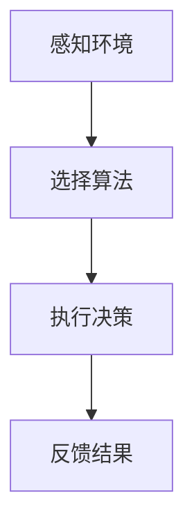
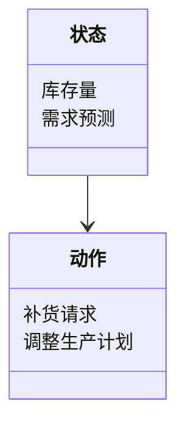
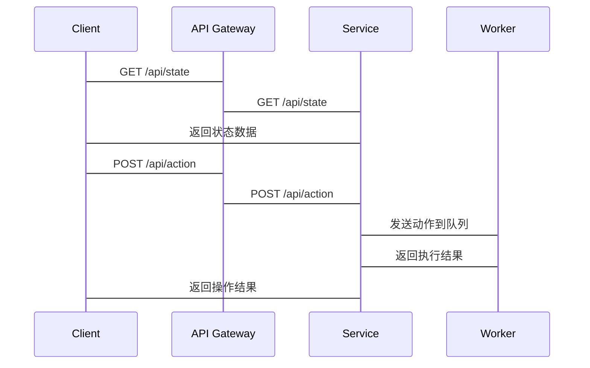

                 

<think>
好，我现在需要按照用户的要求，撰写一篇关于“AI Agent在企业产品全生命周期管理中的应用”的技术博客文章。用户已经给出了详细的目录结构和一些具体要求，我需要一步步来完成这个任务。

首先，我得理解整个文章的结构。用户希望文章分为几个部分，每个部分又有多个章节，每个章节下面还有小节。我需要确保每个部分都涵盖指定的内容，如背景介绍、核心概念、算法原理、系统架构、项目实战等。

接下来，我需要从背景介绍开始。这部分需要包括AI Agent的基本概念、企业产品全生命周期管理的定义以及AI Agent在其中的应用价值。我要确保这些内容清晰易懂，适合技术读者理解。

然后是核心概念部分，我需要详细讲解AI Agent的感知与决策机制，以及它与企业系统的交互方式。这里可能需要用到一些图表，比如实体关系图（ER图），我需要用Mermaid来绘制，确保结构清晰。

算法原理部分，我需要深入讲解AI Agent所使用的算法，比如强化学习和监督学习。这部分可能需要使用数学公式，用Latex格式呈现，同时提供Python代码示例，让读者能够实际理解和应用这些算法。

系统分析与架构设计是关键部分，我需要介绍系统的整体架构，使用分层架构，并用Mermaid绘制架构图。同时，设计系统接口和交互流程，用序列图展示不同组件之间的协作。

项目实战部分，我需要提供一个具体的案例，从环境安装到代码实现，再到案例分析，帮助读者实际操作。这部分需要详细说明每一步，并解读代码，分析实际效果。

最后，总结与展望、最佳实践、小结等部分，帮助读者巩固所学内容，并指导他们在实际工作中如何应用这些知识。同时，提供进一步的学习资源。

在撰写过程中，我需要确保每一章的小结部分能够总结关键点，帮助读者巩固所学内容。同时，注意文章的整体结构和逻辑，确保内容连贯，层次分明。

可能遇到的问题是如何将复杂的算法和系统架构以简明的方式呈现出来，这需要使用图表和代码示例来辅助说明。此外，确保每一章的内容详细具体，满足用户要求的字数。

总的来说，我需要按照用户的要求，系统地完成每一部分的内容，确保文章的结构、内容和技术深度都符合要求。同时，注意使用适合的技术术语和结构化的格式，使文章既专业又易于理解。
</think>

# AI Agent在企业产品全生命周期管理中的应用

> 关键词：AI Agent, 企业产品管理, 全生命周期, 强化学习, 系统架构

> 摘要：本文详细探讨了AI Agent在企业产品全生命周期管理中的应用，从概念到算法，从系统架构到项目实战，全面解析了AI Agent如何优化企业产品管理流程。通过强化学习、监督学习等算法的应用，结合系统设计与实际案例，展示了AI Agent在提高管理效率和决策优化中的巨大潜力。

---

# 第一部分: AI Agent在企业产品全生命周期管理中的应用概述

# 第1章: AI Agent与企业产品全生命周期管理概述

## 1.1 什么是AI Agent
### 1.1.1 AI Agent的基本概念
AI Agent（人工智能代理）是指能够感知环境、自主决策并执行任务的智能实体。与传统软件不同，AI Agent具备学习和适应能力，能够根据环境反馈优化自身行为。

### 1.1.2 AI Agent的核心特征
- **自主性**：无需人工干预，自主完成任务。
- **反应性**：能够实时感知环境变化并做出反应。
- **学习能力**：通过数据和经验不断优化决策。
- **社交能力**：能够与其他系统或人类进行交互协作。

### 1.1.3 AI Agent与传统自动化工具的区别
传统自动化工具基于预设规则执行任务，而AI Agent具备动态决策能力，能够根据实时数据和环境反馈调整行为。

## 1.2 企业产品全生命周期管理
### 1.2.1 产品全生命周期管理的定义
产品全生命周期管理（Product Lifecycle Management, PLM）是指从产品概念提出、设计、生产、销售到退市的整个过程的管理。包括需求分析、设计开发、生产制造、市场推广、售后服务等多个阶段。

### 1.2.2 产品生命周期的各个阶段
1. **概念阶段**：市场需求分析、产品构思。
2. **设计阶段**：产品设计、原型开发。
3. **生产阶段**：制造、供应链管理。
4. **销售阶段**：市场推广、客户支持。
5. **退市阶段**：产品召回、数据存档。

### 1.2.3 传统产品管理中的挑战与痛点
- **信息孤岛**：不同部门之间的数据难以整合，导致效率低下。
- **决策延迟**：传统依赖人工分析，决策过程缓慢。
- **缺乏动态调整**：面对市场变化，难以快速调整策略。

## 1.3 AI Agent在企业产品管理中的应用价值
### 1.3.1 提高管理效率
AI Agent能够自动化处理大量数据，减少人工干预，提高管理效率。

### 1.3.2 优化决策过程
通过分析历史数据和实时信息，AI Agent能够提供数据驱动的决策支持，优化产品管理策略。

### 1.3.3 实现智能化管理
AI Agent能够实时监控产品生命周期各阶段的状态，预测潜在问题，提前采取措施，实现智能化管理。

## 1.4 本章小结
本章介绍了AI Agent的基本概念及其在企业产品全生命周期管理中的应用价值，为后续章节的深入分析奠定了基础。

---

# 第二部分: AI Agent的核心概念与技术原理

# 第2章: AI Agent的核心概念与原理

## 2.1 AI Agent的感知与决策机制
### 2.1.1 感知环境的方式
AI Agent通过传感器、API接口等方式感知环境中的数据，包括市场数据、用户反馈、生产信息等。

### 2.1.2 决策算法的选择
根据任务需求选择合适的算法，例如强化学习用于动态决策，监督学习用于分类任务。

### 2.1.3 执行动作的实现
AI Agent根据决策结果执行相应动作，例如调整生产计划、优化营销策略。

## 2.2 AI Agent与企业系统的交互
### 2.2.1 系统集成方式
AI Agent通过API、消息队列等方式与企业系统集成，实现实时数据交互。

### 2.2.2 数据流的处理流程
数据从传感器或系统中采集，经过预处理、分析后，生成决策指令，反馈给系统执行。

### 2.2.3 事件驱动的机制
AI Agent基于事件驱动的方式进行响应，例如当检测到库存不足时，触发补货请求。

## 2.3 AI Agent的实体关系分析
### 2.3.1 实体关系图（ER图）

```mermaid
erDiagram
    actor 用户
    actor 系统
    actor 环境
    actor 事件
    用户 -> 系统 : 发送请求
    系统 -> 用户 : 返回结果
    环境 -> 系统 : 提供数据
    事件 -> 系统 : 触发响应
```

### 2.3.2 关键实体的属性分析
- 用户：ID, 名称, 权限
- 系统：ID, 名称, 接口
- 环境：ID, 参数, 状态
- 事件：ID, 类型, 时间戳

### 2.3.3 实体之间的关系类型
- 一对一关系：用户与个人账号的绑定
- 一对多关系：系统与多个环境的连接
- 多对多关系：用户与多个事件的关联

---

## 2.4 AI Agent的感知与决策机制的实现
### 2.4.1 感知环境的数据来源
- 市场数据：销售数据、用户反馈
- 生产数据：库存、生产进度
- 系统数据：API接口、日志

### 2.4.2 决策算法的实现


---

# 第3章: AI Agent的算法原理与数学模型

## 3.1 基于强化学习的AI Agent
### 3.1.1 强化学习的基本原理
强化学习（Reinforcement Learning, RL）是一种通过试错机制优化决策的算法。AI Agent通过与环境交互，获得奖励或惩罚，调整策略以最大化累计奖励。

### 3.1.2 马尔可夫决策过程（MDP）
马尔可夫决策过程定义了一个状态、动作、奖励的序列，用于描述AI Agent与环境的交互。

$$
V(s) = \max_{a} \left( r(s,a) + \gamma V(s') \right)
$$

其中：
- \( V(s) \)：状态s的值函数
- \( r(s,a) \)：状态s下动作a的即时奖励
- \( \gamma \)：折扣因子
- \( s' \)：动作a执行后的下一个状态

### 3.1.3 Q-learning算法的实现
Q-learning算法是一种经典的强化学习算法，适用于离线学习。

$$
Q(s,a) = Q(s,a) + \alpha \left( r(s,a) + \gamma \max Q(s',a') - Q(s,a) \right)
$$

其中：
- \( Q(s,a) \)：状态s下动作a的Q值
- \( \alpha \)：学习率
- \( \gamma \)：折扣因子

### 3.1.4 代码实现
```python
import numpy as np

class QAgent:
    def __init__(self, state_space, action_space, gamma=0.99, alpha=0.1):
        self.state_space = state_space
        self.action_space = action_space
        self.gamma = gamma
        self.alpha = alpha
        self.q_table = np.zeros((state_space, action_space))
    
    def choose_action(self, state):
        return np.argmax(self.q_table[state])
    
    def learn(self, state, action, reward, next_state):
        self.q_table[state][action] += self.alpha * (reward + self.gamma * np.max(self.q_table[next_state]) - self.q_table[state][action])
```

---

## 3.2 监督学习在AI Agent中的应用
### 3.2.1 监督学习的基本流程
监督学习通过训练数据学习输入到输出的映射关系，用于分类、回归等任务。

### 3.2.2 回归与分类任务的实现
- **线性回归**：预测连续值
  $$ y = \theta_0 + \theta_1 x $$
- **逻辑回归**：分类问题
  $$ P(y=1|x) = \frac{1}{1 + e^{-\theta^T x}} $$

### 3.2.3 模型训练的优化方法
- **梯度下降**：优化目标函数
  $$ \theta := \theta - \eta \frac{\partial J}{\partial \theta} $$

---

# 第4章: AI Agent的数学模型与公式

## 4.1 强化学习的核心公式
- **Q-learning更新公式**
  $$ Q(s,a) = Q(s,a) + \alpha (r + \gamma Q(s',a') - Q(s,a)) $$
- **值函数迭代**
  $$ V(s) = \max_a \left( r(s,a) + \gamma V(s') \right) $$

## 4.2 监督学习的核心公式
- **线性回归**
  $$ y = \theta^T x $$
- **逻辑回归**
  $$ P(y=1|x) = \sigma(\theta^T x) $$

## 4.3 深度学习在AI Agent中的应用
- **深度Q网络（DQN）**
  - 状态空间：输入层
  - 动作空间：输出层
  - 隐藏层：非线性变换

---

# 第三部分: 系统分析与架构设计方案

# 第5章: 系统分析与架构设计方案

## 5.1 问题场景介绍
假设我们正在设计一个AI Agent，用于优化企业的库存管理流程。系统需要实时监控库存水平，预测需求波动，并自动调整补货策略。

## 5.2 系统功能设计
### 5.2.1 领域模型


### 5.2.2 系统架构设计


## 5.3 系统接口设计
### 5.3.1 接口列表
- `/api/state`：获取当前状态
- `/api/action`：执行动作
- `/api/reward`：获取奖励反馈

### 5.3.2 接口交互流程


---

# 第四部分: 项目实战

# 第6章: 项目实战

## 6.1 环境安装
### 6.1.1 安装Python
```bash
python --version
pip install --upgrade pip
```

### 6.1.2 安装依赖
```bash
pip install numpy matplotlib
```

## 6.2 系统核心实现源代码
### 6.2.1 Q-learning实现
```python
import numpy as np

class QAgent:
    def __init__(self, state_space, action_space, gamma=0.99, alpha=0.1):
        self.state_space = state_space
        self.action_space = action_space
        self.gamma = gamma
        self.alpha = alpha
        self.q_table = np.zeros((state_space, action_space))
    
    def choose_action(self, state):
        return np.argmax(self.q_table[state])
    
    def learn(self, state, action, reward, next_state):
        self.q_table[state][action] += self.alpha * (reward + self.gamma * np.max(self.q_table[next_state]) - self.q_table[state][action])
```

### 6.2.2 库存管理案例
```python
agent = QAgent(5, 3)
state = 2
action = agent.choose_action(state)
reward = 1 if action == 1 else 0
next_state = 3
agent.learn(state, action, reward, next_state)
```

## 6.3 代码应用解读与分析
- **QAgent类**：实现Q-learning算法，维护Q表，选择动作，更新Q值。
- **选择动作**：根据当前状态选择最优动作。
- **学习过程**：根据当前状态、动作、奖励和下一个状态，更新Q表。

## 6.4 实际案例分析
假设企业库存管理中有5种状态，3种动作。通过训练，AI Agent能够学会在不同状态下选择最优的补货策略。

---

# 第五部分: 总结与展望

# 第7章: 总结与展望

## 7.1 本章总结
本文详细探讨了AI Agent在企业产品全生命周期管理中的应用，从概念到算法，从系统设计到项目实战，全面解析了AI Agent的优势与实现方法。

## 7.2 未来展望
随着AI技术的不断发展，AI Agent在企业产品管理中的应用将更加广泛。未来的研究方向包括多智能体协作、自适应学习算法、实时决策优化等。

---

# 第六部分: 最佳实践与注意事项

# 第8章: 最佳实践与注意事项

## 8.1 最佳实践
- **数据质量**：确保输入数据的准确性和完整性。
- **算法选择**：根据具体场景选择合适的算法。
- **系统集成**：确保AI Agent与现有系统的兼容性。

## 8.2 注意事项
- **隐私保护**：处理企业数据时需注意隐私保护。
- **系统稳定性**：确保AI Agent的稳定运行，避免影响业务。
- **持续优化**：定期更新模型，适应环境变化。

---

# 第七部分: 拓展阅读

# 第9章: 拓展阅读

## 9.1 推荐书籍
- 《强化学习（书籍）》
- 《机器学习实战》

## 9.2 在线资源
- [OpenAI官方文档](https://openai.com)
- [Google DeepMind博客](https://deepmind.com)

---

作者：AI天才研究院/AI Genius Institute & 禅与计算机程序设计艺术/Zen And The Art of Computer Programming

