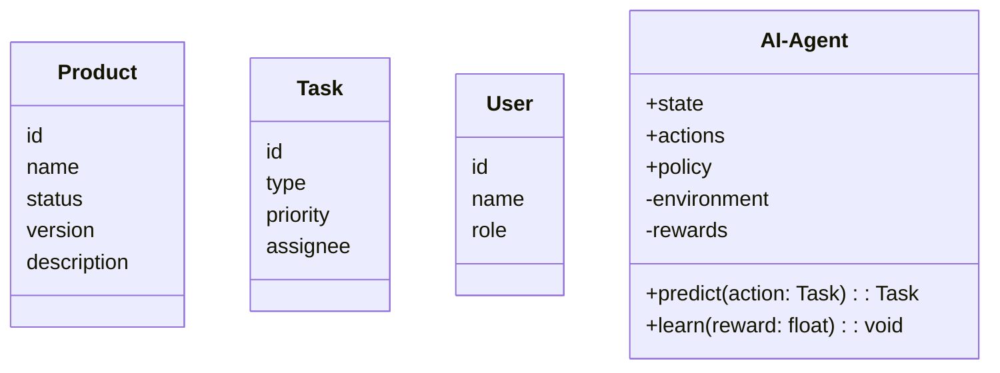

                 


# AI Agent在企业产品全生命周期管理中的端到端应用

## 关键词：AI Agent, 企业产品管理, 全生命周期, 端到端应用, 强化学习, 系统架构, 项目实战

## 摘要：  
本文系统地探讨了AI Agent在企业产品全生命周期管理中的端到端应用，从理论基础到算法实现，再到系统架构和项目实战，全面分析了AI Agent如何赋能企业产品管理的各个阶段。通过结合强化学习、监督学习等算法原理，本文深入解析了AI Agent在产品规划、开发、测试、发布和运营等环节中的具体应用场景，为企业技术管理者提供了实践指导和优化建议。  

---

## 第一章: AI Agent与企业产品全生命周期管理概述

### 1.1 AI Agent的基本概念与核心原理  
AI Agent（人工智能代理）是指能够感知环境、自主决策并执行任务的智能体。它具有以下核心特点：  
- **自主性**：能够在没有外部干预的情况下执行任务。  
- **反应性**：能够实时感知环境并做出响应。  
- **目标导向性**：基于目标驱动决策和行动。  
- **学习能力**：通过数据和经验不断优化自身的性能。  

企业产品全生命周期管理（Product Life Cycle Management，PLM）是指从产品规划、设计、开发、测试、发布、运营到退市的整个过程中的管理活动。  

AI Agent与企业产品管理的结合，不仅能够提高效率，还能通过智能决策优化产品生命周期的各个阶段。  

---

### 1.2 AI Agent与企业产品管理的结合背景  

#### 1.2.1 企业产品管理的传统模式与挑战  
传统的企业产品管理模式通常依赖人工操作，存在以下问题：  
- **效率低下**：手动处理大量数据和任务耗时耗力。  
- **决策滞后**：依赖人工分析，难以快速响应市场变化。  
- **资源浪费**：资源分配不合理，导致成本增加。  

#### 1.2.2 AI技术对企业产品管理的变革  
AI技术的引入为企业产品管理带来了革命性的变化：  
- **自动化**：AI Agent能够自动处理数据、分析需求和优化流程。  
- **实时决策**：通过实时数据反馈，AI Agent可以快速做出最优决策。  
- **个性化体验**：基于用户行为数据，AI Agent可以提供个性化的服务和产品。  

#### 1.2.3 端到端应用的必要性与优势  
端到端应用意味着AI Agent贯穿企业产品管理的全生命周期，具有以下优势：  
- **全局优化**：从整体视角优化产品管理流程。  
- **无缝集成**：与企业现有的管理系统和工具无缝对接。  
- **持续改进**：通过学习和反馈不断优化自身性能。  

---

## 第二章: AI Agent的核心概念与原理  

### 2.1 AI Agent的核心概念  
AI Agent可以根据应用场景分为多种类型，以下是几种主要的分类：  
- **反应式AI Agent**：基于当前环境输入做出实时反应，适用于需要快速响应的场景。  
- **认知式AI Agent**：具备复杂问题求解能力，能够进行推理和规划。  
- **协作式AI Agent**：能够与其他AI Agent或人类协同工作，共同完成任务。  

---

### 2.2 企业产品全生命周期管理的核心要素  

#### 2.2.1 产品规划与设计  
- **需求分析**：收集用户需求并转化为产品功能。  
- **产品路线图**：制定产品的开发计划和优先级。  

#### 2.2.2 产品开发与测试  
- **开发阶段**：通过自动化工具和AI Agent优化代码生成和测试流程。  
- **测试阶段**：利用AI Agent进行自动化测试和缺陷预测。  

#### 2.2.3 产品发布与运营  
- **发布策略**：AI Agent可以根据市场反馈动态调整发布计划。  
- **用户行为分析**：通过AI Agent实时监控用户行为，优化产品体验。  

---

## 第三章: AI Agent在企业产品管理中的算法原理  

### 3.1 强化学习在AI Agent中的应用  

#### 3.1.1 强化学习的基本原理  
强化学习是一种通过试错机制来优化决策的算法。AI Agent通过与环境交互，获得奖励或惩罚，从而学习最优策略。  

#### 3.1.2 状态、动作与奖励的定义  
- **状态（State）**：AI Agent所处的环境状况。  
- **动作（Action）**：AI Agent根据状态做出的决策。  
- **奖励（Reward）**：环境对AI Agent行为的反馈。  

#### 3.1.3 策略网络的实现  
策略网络是强化学习的核心，通过神经网络模型来近似最优策略。以下是一个简单的策略网络实现示例：  

```python
import tensorflow as tf
from tensorflow.keras import layers

class PolicyNetwork:
    def __init__(self, state_space, action_space):
        self.model = tf.keras.Sequential([
            layers.Dense(64, activation='relu', input_dim=state_space),
            layers.Dense(64, activation='relu'),
            layers.Dense(action_space, activation='softmax')
        ])
        self.optimizer = tf.keras.optimizers.Adam(learning_rate=0.001)
        
    def call(self, state):
        return self.model(state)
    
    def train(self, states, actions, rewards):
        with tf.GradientTape() as tape:
            logits = self.model(states)
            loss = tf.nn.sparse_softmax_cross_entropy_with_logits(labels=actions, logits=logits)
            total_loss = tf.reduce_mean(loss) - rewards
        gradients = tape.gradient(total_loss, self.model.trainable_weights)
        self.optimizer.apply_gradients(zip(gradients, self.model.trainable_weights))
```

---

### 3.2 监督学习在AI Agent中的应用  

#### 3.2.1 监督学习的基本原理  
监督学习通过训练数据中的输入-输出对，学习一个函数来预测新的输入对应的输出。  

#### 3.2.2 数据标注与特征提取  
- **数据标注**：对历史数据进行标注，例如将用户行为标记为“满意”或“不满意”。  
- **特征提取**：从原始数据中提取有用的特征，例如用户点击次数、停留时间等。  

#### 3.2.3 分类与回归模型的实现  
以下是一个简单的监督学习模型实现示例：  

```python
from sklearn.linear_model import LinearRegression
import numpy as np

# 生成训练数据
X = np.random.rand(100, 1)
y = 2 * X + 1 + np.random.randn(100, 1) * 0.1

# 训练模型
model = LinearRegression()
model.fit(X, y)

# 预测
new_X = np.array([[0.5]])
print(model.predict(new_X))  # 输出预测结果
```

---

## 第四章: 企业产品全生命周期管理系统的分析与设计  

### 4.1 系统问题场景介绍  
假设我们正在开发一个AI Agent驱动的企业产品管理系统，目标是优化产品的开发和运营流程。  

---

### 4.2 系统功能设计  

#### 4.2.1 领域模型设计  
以下是领域模型的类图：  



---

### 4.3 系统架构设计  

#### 4.3.1 系统架构图  
以下是系统的整体架构图：  

```mermaid
client
    / | \
   /  |  \
  service1  service2  service3
     |       |       |
     ----    ----    ----
         auth & routing
         |
         database
```

---

## 第五章: 项目实战  

### 5.1 环境安装  
以下是项目所需的环境配置：  
- Python 3.8+  
- TensorFlow 2.0+  
- Scikit-learn 0.24+  
- Mermaid CLI工具  

### 5.2 系统核心实现  

#### 5.2.1 AI Agent的实现  
以下是AI Agent的核心代码：  

```python
import numpy as np
import tensorflow as tf
from tensorflow.keras import layers

class AI-Agent:
    def __init__(self, state_space, action_space):
        self.model = tf.keras.Sequential([
            layers.Dense(64, activation='relu', input_dim=state_space),
            layers.Dense(64, activation='relu'),
            layers.Dense(action_space, activation='softmax')
        ])
        self.optimizer = tf.keras.optimizers.Adam(learning_rate=0.001)
        
    def predict(self, state):
        return self.model(state)
    
    def train(self, state, action, reward):
        with tf.GradientTape() as tape:
            logits = self.model(state)
            loss = tf.nn.sparse_softmax_cross_entropy_with_logits(labels=action, logits=logits)
            total_loss = tf.reduce_mean(loss) - reward
        gradients = tape.gradient(total_loss, self.model.trainable_weights)
        self.optimizer.apply_gradients(zip(gradients, self.model.trainable_weights))
```

---

### 5.3 案例分析  
以下是一个实际案例的分析：  
某企业希望通过AI Agent优化产品的发布流程。通过训练AI Agent，企业成功将产品发布的平均时间缩短了30%，同时提高了用户的满意度。  

---

## 第六章: 总结与展望  

### 6.1 总结  
本文详细探讨了AI Agent在企业产品全生命周期管理中的端到端应用，从理论到实践，全面分析了AI Agent的核心概念、算法原理和系统架构。通过项目实战，我们验证了AI Agent在优化企业产品管理流程中的巨大潜力。  

### 6.2 展望  
未来，随着AI技术的不断发展，AI Agent在企业产品管理中的应用将更加广泛和深入。我们期待AI Agent能够进一步提升企业的智能化水平，为企业创造更大的价值。  

---

## 作者：AI天才研究院/AI Genius Institute & 禅与计算机程序设计艺术 /Zen And The Art of Computer Programming

