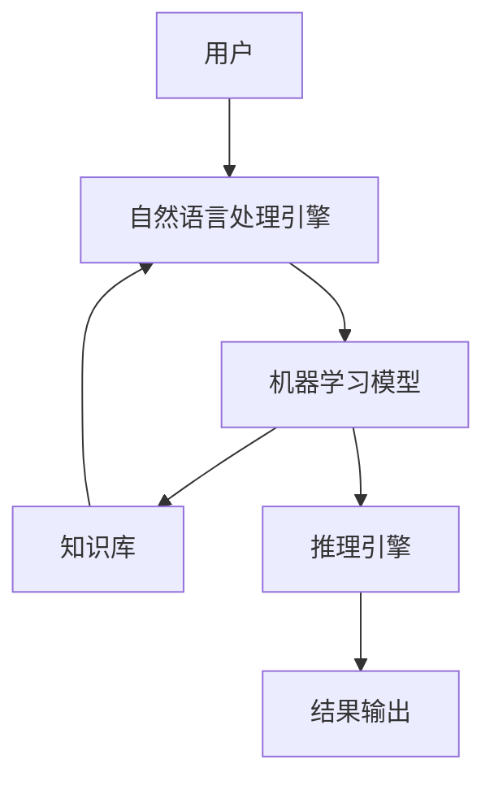
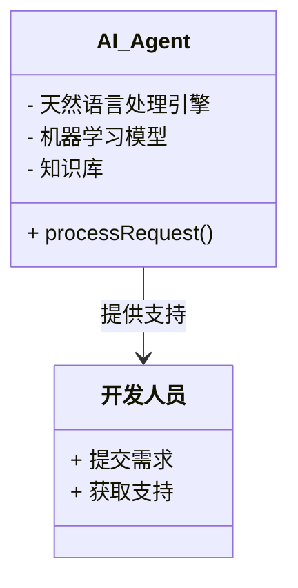

                 


# AI Agent在企业产品开发与创新中的角色

> **关键词**：AI Agent、企业产品开发、创新、人工智能、自然语言处理、机器学习、系统架构

> **摘要**：本文探讨AI Agent在企业产品开发与创新中的角色，涵盖其基本概念、核心技术、应用场景、系统架构及未来趋势，结合实际案例分析，帮助读者全面理解AI Agent在企业中的应用价值。

---

## 第一部分：AI Agent的基本概念与背景

### 第1章：AI Agent的定义与背景

#### 1.1 AI Agent的定义与特点

- **1.1.1 AI Agent的定义**
  AI Agent是一种智能实体，能够感知环境并采取行动以实现目标。它具备自主性、反应性、主动性、社交能力和学习能力。

- **1.1.2 AI Agent的核心特点**
  - **自主性**：无需外部干预，自主决策。
  - **反应性**：能实时感知环境变化并做出反应。
  - **主动性**：主动采取行动以达成目标。
  - **社交能力**：能与人类或其他系统进行有效交互。
  - **学习能力**：通过数据和经验提升性能。

- **1.1.3 AI Agent与传统软件的区别**
  AI Agent具备智能性和适应性，能够处理复杂任务，而传统软件依赖于预设规则。

#### 1.2 AI Agent在企业中的作用

- **1.2.1 企业产品开发中的AI Agent**
  AI Agent在需求分析、设计、测试等阶段提供支持，提升开发效率和产品质量。

- **1.2.2 AI Agent推动企业创新的方式**
  通过自动化流程、数据驱动决策和智能辅助设计，AI Agent激发创新潜能。

- **1.2.3 AI Agent的应用范围**
  包括产品设计、客户服务、市场分析等领域，广泛应用于企业各个层面。

---

## 第二部分：AI Agent的核心技术

### 第2章：自然语言处理与生成

#### 2.1 自然语言处理（NLP）的核心原理

- **2.1.1 NLP的目标**
  理解和生成人类语言，使AI Agent能够与用户进行自然交互。

- **2.1.2 常见NLP任务**
  包括文本分类、实体识别、情感分析和机器翻译。

- **2.1.3 NLP的关键技术**
  涉及词嵌入、序列模型和注意力机制，常用模型如BERT和GPT。

#### 2.2 基于Transformer的文本生成模型

- **2.2.1 Transformer模型的工作原理**
  通过自注意力机制捕捉文本全局信息，生成连贯文本。

- **2.2.2 基于Transformer的文本生成算法**
  使用解码器结构，逐步生成文本，模型结构包括嵌入层、多头注意力层和前馈网络层。

- **2.2.3 案例分析：AI Agent生成产品需求文档**
  展示AI Agent如何根据用户输入生成详细的产品需求文档，提高开发效率。

#### 2.3 代码实现：简单的文本生成模型

```python
import tensorflow as tf
from tensorflow.keras.layers import Dense, Dropout, MultiHeadAttention

# 定义Transformer解码器
class TransformerDecoder(tf.keras.Model):
    def __init__(self, d_model, nhead, dropout=0.1):
        super(TransformerDecoder, self).__init__()
        self.dropout = Dropout(dropout)
        self.attention = MultiHeadAttention(nhead, d_model)
        self.dense1 = Dense(2*d_model, activation='relu')
        self.dense2 = Dense(d_model)

    def call(self, x, training):
        x = self.dropout(x, training=training)
        x = self.attention(x, x)
        x = self.dense1(x)
        x = self.dense2(x)
        return x

# 示例使用
model = TransformerDecoder(d_model=512, nhead=8)
sample_input = tf.random.normal((64, 10, 512))  # 假设输入形状为(批量大小, 序列长度, 嵌入维度)
output = model(sample_input, training=True)
print(output.shape)  # 输出形状为(64, 10, 512)
```

---

## 第三部分：AI Agent在企业产品开发中的应用

### 第3章：产品需求分析与设计

#### 3.1 需求分析中的AI Agent应用

- **3.1.1 需求收集与分析**
  AI Agent通过NLP技术分析用户反馈，提取关键需求，生成需求文档。

- **3.1.2 用例分析**
  展示AI Agent如何从用户需求中提取功能点，帮助开发团队理解用户需求。

#### 3.2 产品设计中的AI Agent辅助

- **3.2.1 系统设计工具**
  AI Agent协助设计系统架构，生成类图和流程图。

- **3.2.2 用户界面设计**
  AI Agent提供设计建议，优化用户体验。

#### 3.3 开发与测试中的AI Agent支持

- **3.3.1 代码生成**
  AI Agent根据需求文档生成代码框架，提高开发效率。

- **3.3.2 自动化测试**
  AI Agent辅助编写测试用例，执行自动化测试，提升测试覆盖率。

---

## 第四部分：AI Agent的创新与未来趋势

### 第4章：AI Agent驱动的产品创新

#### 4.1 创新方法论

- **4.1.1 设计思维**
  运用设计思维，结合AI Agent的能力，推动产品创新。

- **4.1.2 快速原型开发**
  AI Agent协助快速构建原型，缩短开发周期。

#### 4.2 未来趋势与挑战

- **4.2.1 AGI的实现**
  通用人工智能的发展将显著提升AI Agent的能力。

- **4.2.2 伦理与隐私问题**
  数据隐私和算法偏见是AI Agent应用中的重要挑战。

---

## 第五部分：系统架构与实现

### 第5章：AI Agent系统架构设计

#### 5.1 系统架构设计

- **5.1.1 系统组件**
  包括用户界面、自然语言处理引擎、机器学习模型和知识库。

- **5.1.2 系统架构图**
  使用Mermaid绘制系统架构图，展示各组件之间的交互关系。



---

## 第六部分：项目实战

### 第6章：AI Agent在企业产品开发中的应用案例

#### 6.1 项目背景与需求分析

- **6.1.1 项目背景**
  某企业希望引入AI Agent辅助产品开发，提升效率。

- **6.1.2 需求分析**
  开发一个AI Agent，辅助需求分析、设计和测试。

#### 6.2 系统设计与实现

- **6.2.1 系统设计**
  使用Mermaid绘制系统类图，展示各组件之间的关系。



---

## 第七部分：总结与展望

### 第7章：总结与未来展望

#### 7.1 总结

- AI Agent在企业产品开发中扮演重要角色，通过技术手段提升效率和创新。

#### 7.2 未来展望

- 随着技术进步，AI Agent将在企业中发挥更大作用，推动更多创新。

#### 7.3 最佳实践

- 建议企业在引入AI Agent时，注重数据安全和伦理问题，确保技术应用的合规性。

---

**作者**：AI天才研究院/AI Genius Institute & 禅与计算机程序设计艺术 /Zen And The Art of Computer Programming

