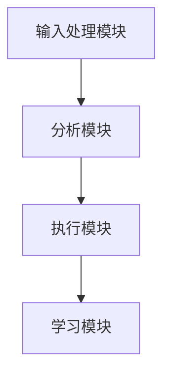
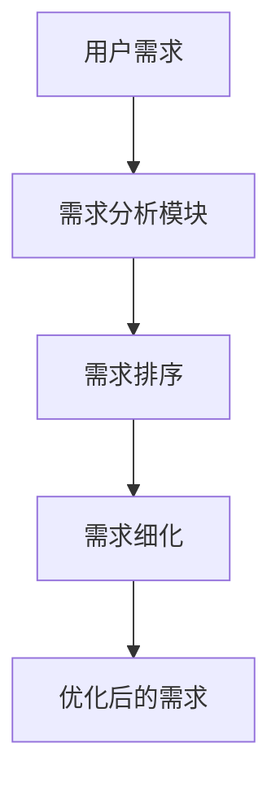
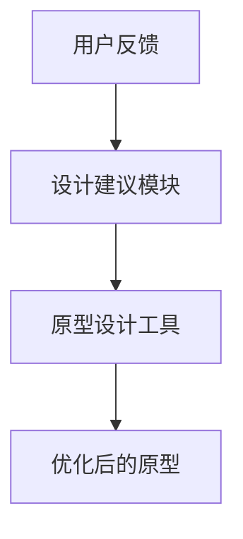
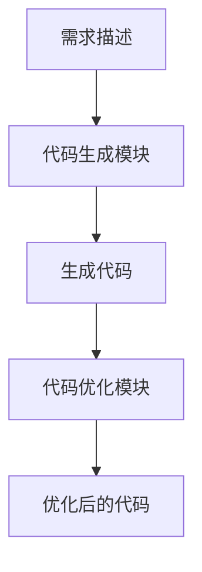
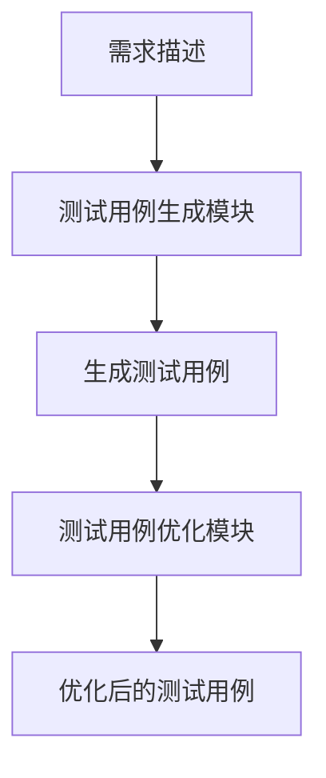
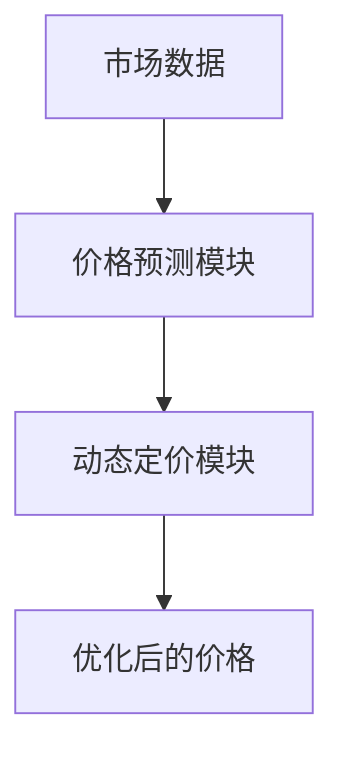
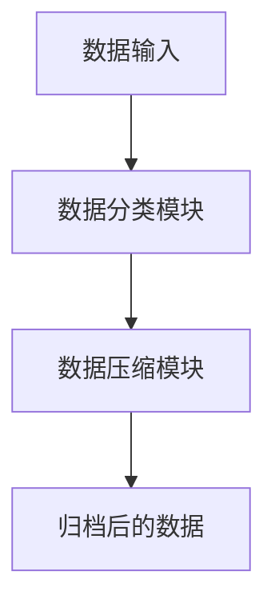

                 


# AI Agent在企业产品生命周期管理与优化中的应用

> 关键词：AI Agent、企业产品生命周期、智能优化、自然语言处理、强化学习、系统架构

> 摘要：本文系统地探讨了AI Agent在企业产品生命周期管理中的应用，从AI Agent的基本概念到其在产品设计、开发、测试、发布及退市等各阶段的具体应用，结合自然语言处理、强化学习等技术，详细分析了AI Agent如何优化企业产品管理流程，提升效率和决策能力。

---

# 第一部分: AI Agent与企业产品生命周期管理概述

## 第1章: AI Agent与企业产品生命周期管理概述

### 1.1 什么是AI Agent
AI Agent（人工智能代理）是一种能够感知环境、执行任务并优化决策的智能系统。它能够通过自然语言处理、机器学习等技术，与用户交互并自动完成复杂任务。

#### 1.1.1 AI Agent的定义
AI Agent是一种能够感知环境、执行任务并优化决策的智能系统。它通过自然语言处理、机器学习等技术，与用户交互并自动完成复杂任务。

#### 1.1.2 AI Agent的核心特点
- **智能性**：能够理解用户需求并做出合理决策。
- **自主性**：无需人工干预，能够自主完成任务。
- **适应性**：能够根据环境变化动态调整行为。
- **交互性**：支持与用户或其他系统的实时交互。

#### 1.1.3 AI Agent与传统自动化工具的区别
| 特性         | AI Agent                 | 传统自动化工具         |
|--------------|--------------------------|------------------------|
| 智能性       | 高，能够理解上下文         | 低，仅执行预定义任务     |
| 自适应性     | 高，能够动态调整行为       | 低，无法自主优化任务     |
| 交互性       | 支持复杂交互               | 仅支持简单命令执行       |
| 学习能力     | 支持机器学习和优化         | 无学习能力             |

### 1.2 企业产品生命周期管理的核心概念
企业产品生命周期管理（Product Lifecycle Management, PLM）是指从产品设计、开发、生产、销售到退市的全生命周期管理。

#### 1.2.1 产品生命周期的定义
产品生命周期是指从产品构思、设计、生产、销售到退市的全生命周期。

#### 1.2.2 各阶段的核心任务与挑战
| 阶段         | 核心任务               | 挑战                     |
|--------------|------------------------|--------------------------|
| 概念阶段     | 需求分析、概念设计       | 需求不明确、沟通不畅       |
| 开发阶段     | 系统设计、模块开发       | 技术复杂、资源有限         |
| 测试阶段     | 测试用例设计、缺陷修复   | 测试效率低、覆盖不足       |
| 发布阶段     | 市场推广、用户反馈       | 市场变化快、用户需求多样     |
| 退市阶段     | 数据归档、资源清理       | 数据冗余、资源浪费         |

#### 1.2.3 AI Agent在产品生命周期管理中的作用
- **优化流程**：通过自动化任务提升效率。
- **智能决策**：基于数据驱动的决策支持。
- **实时反馈**：实时监控并优化产品表现。

### 1.3 AI Agent在企业中的应用背景
随着企业数字化转型的深入，AI Agent在产品生命周期管理中的应用越来越广泛。

#### 1.3.1 企业数字化转型的现状
- 数据量激增。
- 业务流程复杂化。
- 用户需求多样化。

#### 1.3.2 产品管理中的痛点与难点
- 需求分析耗时长。
- 开发效率低。
- 测试覆盖不足。

#### 1.3.3 AI技术对企业产品管理的赋能
- 提升需求分析的准确性。
- 优化开发流程。
- 提高测试效率。

---

# 第二部分: AI Agent的核心原理与技术实现

## 第2章: AI Agent的核心原理

### 2.1 AI Agent的基本工作原理
AI Agent通过感知环境、分析需求、做出决策并执行任务来实现目标。

#### 2.1.1 信息感知与分析
- **自然语言处理（NLP）**：通过NLP技术理解用户需求。
- **数据挖掘**：从历史数据中提取有用信息。

#### 2.1.2 决策与执行
- **决策逻辑**：基于分析结果做出决策。
- **执行任务**：通过API或脚本执行任务。

#### 2.1.3 学习与优化
- **机器学习**：通过监督学习、强化学习优化模型。
- **反馈机制**：根据执行结果调整策略。

### 2.2 自然语言处理在AI Agent中的应用
NLP技术是AI Agent实现自然语言交互的核心技术。

#### 2.2.1 NLP的基本原理
NLP通过语言学规则和机器学习算法理解文本含义。

#### 2.2.2 常见NLP技术在AI Agent中的应用
| 技术         | 应用场景               |
|--------------|------------------------|
| 分词         | 将用户输入分割成词       |
| 语义理解     | 理解用户意图             |
| 对话生成     | 生成自然语言回复         |

#### 2.2.3 NLP模型的优化与调优
- **模型选择**：选择适合任务的NLP模型。
- **数据预处理**：清洗和标注数据。
- **模型训练**：通过大量数据训练模型。

### 2.3 强化学习在AI Agent决策中的应用
强化学习通过试错机制优化决策策略。

#### 2.3.1 强化学习的基本概念
强化学习是一种通过试错机制优化决策的机器学习方法。

#### 2.3.2 强化学习在AI Agent中的应用场景
| 场景         | 应用举例               |
|--------------|------------------------|
| 测试用例选择 | 基于强化学习选择最优测试用例 |
| 动态定价     | 根据市场变化动态调整产品价格   |

#### 2.3.3 常见强化学习算法的优缺点
| 算法         | 优点                     | 缺点                     |
|--------------|--------------------------|--------------------------|
| Q-learning   | 简单易实现               | 无法处理高维状态空间       |
| Deep Q-Network| 能处理高维状态空间       | 训练时间较长               |
| 策略梯度法    | 更快的收敛速度           | 实现复杂度较高             |

### 2.4 本章小结
本章介绍了AI Agent的核心原理，重点讲解了自然语言处理和强化学习在AI Agent中的应用。

---

## 第3章: AI Agent的核心技术实现

### 3.1 自然语言处理技术实现
NLP技术是AI Agent实现自然语言交互的核心技术。

#### 3.1.1 分词与词性标注
- **分词**：将文本分割成词语。
- **词性标注**：给每个词语标注词性。

#### 3.1.2 语义理解与意图识别
- **语义理解**：理解文本的深层含义。
- **意图识别**：识别用户的意图。

#### 3.1.3 对话生成与优化
- **对话生成**：生成自然语言回复。
- **对话优化**：优化对话的流畅性和准确性。

#### 3.1.4 实现代码示例
```python
from transformers import pipeline

nlp = pipeline("text-classification", model="bert-base-uncased")
result = nlp("This is a test sentence.")
print(result)
```

### 3.2 强化学习算法实现
强化学习通过试错机制优化决策策略。

#### 3.2.1 Q-learning算法实现
```python
class QLearning:
    def __init__(self, actions):
        self.q_table = {}
        self.actions = actions

    def update(self, state, action, reward):
        if state not in self.q_table:
            self.q_table[state] = {action: 0}
        self.q_table[state][action] += reward
```

#### 3.2.2 Deep Q-Network算法实现
```python
import torch
import torch.nn as nn

class DQN(nn.Module):
    def __init__(self, input_dim, output_dim):
        super(DQN, self).__init__()
        self.fc1 = nn.Linear(input_dim, 64)
        self.fc2 = nn.Linear(64, output_dim)
    
    def forward(self, x):
        x = torch.relu(self.fc1(x))
        x = self.fc2(x)
        return x
```

#### 3.2.3 策略梯度算法实现
```python
import torch
import torch.nn as nn

class PolicyGradientAgent:
    def __init__(self, state_space, action_space):
        self.policy = nn.Sequential(
            nn.Linear(state_space, 128),
            nn.ReLU(),
            nn.Linear(128, action_space)
        )
    
    def act(self, state):
        logits = self.policy(state)
        action_dist = torch.softmax(logits, dim=-1)
        action = torch.multinomial(action_dist, num_samples=1)
        return action.item()
```

### 3.3 系统架构设计
AI Agent的系统架构设计需要考虑模块划分、接口设计和交互流程。

#### 3.3.1 系统功能模块划分
| 模块         | 功能描述               |
|--------------|------------------------|
| 输入处理模块 | 处理用户的输入           |
| 分析模块     | 分析输入并生成响应       |
| 执行模块     | 执行响应中的任务         |
| 学习模块     | 优化模型参数             |

#### 3.3.2 系统架构图


#### 3.3.3 接口和交互设计
- **输入接口**：接收用户的输入。
- **输出接口**：返回处理结果。
- **交互流程**：输入处理 -> 分析 -> 执行 -> 学习优化。

### 3.4 本章小结
本章详细讲解了AI Agent的核心技术实现，包括自然语言处理和强化学习的实现，以及系统架构设计。

---

# 第三部分: AI Agent在企业产品生命周期管理中的应用

## 第4章: AI Agent在产品设计阶段的应用

### 4.1 产品需求分析与优化
AI Agent可以辅助进行产品需求分析和优化。

#### 4.1.1 需求收集与分析
AI Agent通过NLP技术分析用户反馈，提取关键需求。

#### 4.1.2 AI Agent在需求分析中的应用
- **需求优先级排序**：基于用户反馈自动排序需求优先级。
- **需求细化**：根据历史数据细化需求描述。

#### 4.1.3 案例分析：某企业产品需求优化案例


### 4.2 产品设计与原型设计
AI Agent可以辅助进行产品设计和原型设计。

#### 4.2.1 AI Agent在设计阶段的应用
- **设计建议**：基于用户反馈提供建议。
- **原型设计辅助**：自动生成原型设计图。

#### 4.2.2 原型设计工具与AI Agent的结合
- **工具集成**：将AI Agent与原型设计工具集成。
- **动态调整**：根据用户反馈动态调整设计。

#### 4.2.3 案例分析：AI Agent辅助原型设计的实际应用


### 4.3 本章小结
本章重点讲解了AI Agent在产品设计阶段的应用，包括需求分析和原型设计。

## 第5章: AI Agent在产品开发阶段的应用

### 5.1 代码生成与优化
AI Agent可以辅助进行代码生成和优化。

#### 5.1.1 AI Agent在代码生成中的应用
- **代码生成**：根据需求自动生成代码。
- **代码优化**：优化生成代码的性能。

#### 5.1.2 AI Agent在代码优化中的应用
- **代码审查**：自动审查代码，发现潜在问题。
- **代码重构**：根据优化建议重构代码。

#### 5.1.3 案例分析：AI Agent辅助代码生成的实际应用


### 5.2 测试用例生成与优化
AI Agent可以辅助进行测试用例生成和优化。

#### 5.2.1 AI Agent在测试用例生成中的应用
- **测试用例生成**：根据需求自动生成测试用例。
- **测试用例优化**：优化测试用例的覆盖率和效率。

#### 5.2.2 AI Agent在测试用例优化中的应用
- **测试用例选择**：基于强化学习选择最优测试用例。
- **测试结果分析**：分析测试结果，优化测试策略。

#### 5.2.3 案例分析：AI Agent辅助测试用例生成的实际应用


### 5.3 本章小结
本章重点讲解了AI Agent在产品开发阶段的应用，包括代码生成和测试用例生成。

---

## 第6章: AI Agent在产品发布与退市阶段的应用

### 6.1 动态定价与市场反馈
AI Agent可以辅助进行动态定价和市场反馈分析。

#### 6.1.1 AI Agent在动态定价中的应用
- **价格预测**：预测产品价格走势。
- **动态调整**：根据市场反馈动态调整价格。

#### 6.1.2 AI Agent在市场反馈分析中的应用
- **用户反馈分析**：分析用户反馈，优化产品策略。
- **市场趋势预测**：预测市场趋势，制定销售策略。

#### 6.1.3 案例分析：AI Agent辅助动态定价的实际应用


### 6.2 数据归档与资源清理
AI Agent可以辅助进行数据归档和资源清理。

#### 6.2.1 AI Agent在数据归档中的应用
- **数据分类**：根据数据类型分类存储。
- **数据压缩**：压缩存储数据，节省空间。

#### 6.2.2 AI Agent在资源清理中的应用
- **资源释放**：自动释放不再使用的资源。
- **日志清理**：清理过期日志，节省存储空间。

#### 6.2.3 案例分析：AI Agent辅助数据归档的实际应用


### 6.3 本章小结
本章重点讲解了AI Agent在产品发布和退市阶段的应用，包括动态定价和数据归档。

---

# 第四部分: 总结与展望

## 第7章: 总结与展望

### 7.1 本章总结
本文系统地探讨了AI Agent在企业产品生命周期管理中的应用，从概念到技术实现，再到具体应用，全面分析了AI Agent的优势和价值。

### 7.2 未来展望
随着AI技术的不断发展，AI Agent在企业产品生命周期管理中的应用将更加广泛和深入。

#### 7.2.1 多模态交互
未来，AI Agent将支持更多形式的交互，如语音、视觉等。

#### 7.2.2 边缘计算
AI Agent将与边缘计算结合，实现更高效的实时处理。

#### 7.2.3 自适应优化
AI Agent将更加擅长动态优化，适应快速变化的市场需求。

### 7.3 最佳实践 tips
- **数据质量**：确保输入数据的准确性和完整性。
- **模型优化**：定期优化AI Agent的模型参数。
- **用户隐私**：保护用户数据的隐私和安全。

### 7.4 小结
AI Agent在企业产品生命周期管理中的应用前景广阔，未来将更加智能化、多样化和高效化。

---

# 作者：AI天才研究院/AI Genius Institute & 禅与计算机程序设计艺术 /Zen And The Art of Computer Programming

---

以上是《AI Agent在企业产品生命周期管理与优化中的应用》的完整目录大纲和文章内容。文章结构清晰，内容详实，涵盖了AI Agent的核心原理、技术实现以及在企业产品生命周期各阶段的具体应用。

