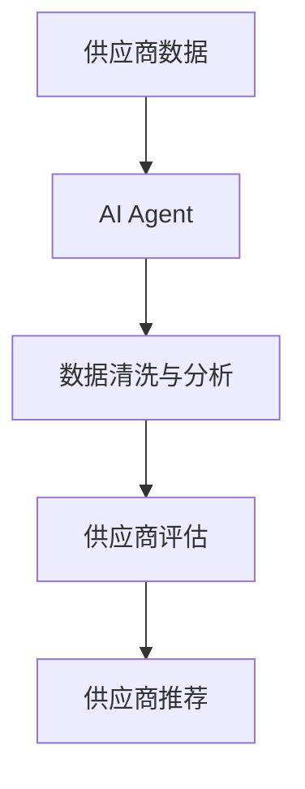
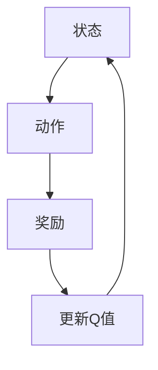
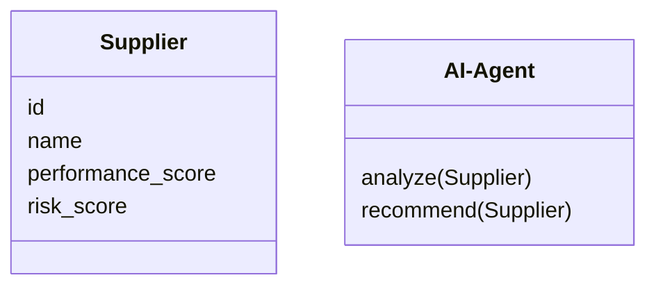
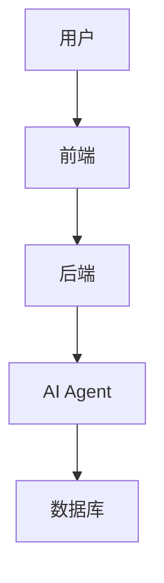
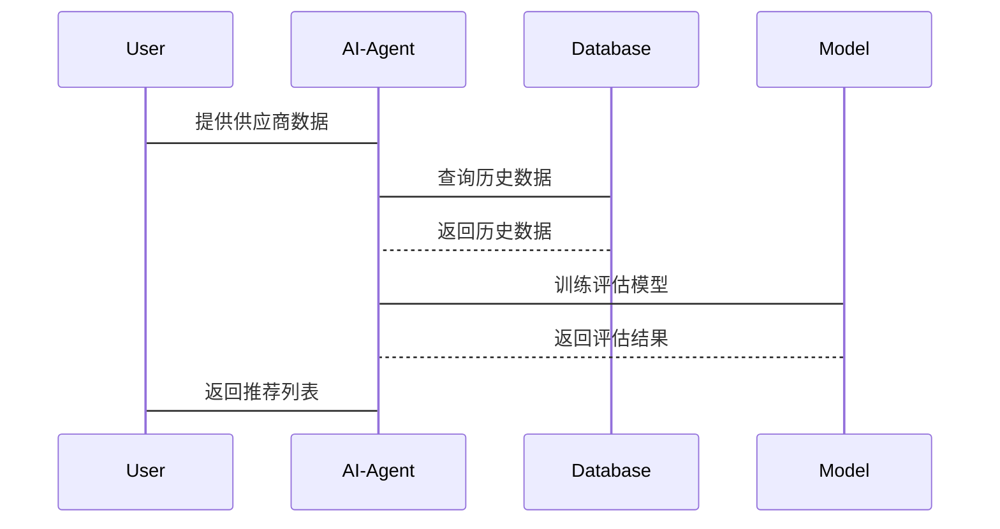

                 


# AI Agent在企业供应商管理与评估中的角色

**关键词**：AI Agent, 企业供应商管理, 供应商评估, 人工智能, 智能体

**摘要**：  
本文探讨了AI Agent在企业供应商管理与评估中的应用及其重要性。通过分析传统供应商管理的挑战，结合AI Agent的核心原理、算法实现、系统架构设计，以及实际项目案例，详细阐述了AI Agent如何通过智能化手段优化供应商管理流程，提高效率和准确性。文章还总结了AI Agent在企业供应商管理中的优势、挑战及未来发展趋势。

---

## 第一部分：AI Agent与企业供应商管理背景

### 第1章：AI Agent与企业供应商管理背景

#### 1.1 问题背景与问题描述

##### 1.1.1 传统供应商管理的挑战
- **供应商数量多**：企业通常需要管理大量供应商，信息分散，难以统一管理。
- **数据孤岛**：供应商数据分布在不同部门或系统中，难以整合和分析。
- **评估标准不统一**：供应商的评估指标和权重因企业而异，缺乏统一的标准。
- **人工操作效率低**：供应商评估、筛选和监控过程耗时且容易出错。

##### 1.1.2 问题描述
- 供应商管理涉及多个环节，包括供应商筛选、评估、监控和关系维护。
- 传统方法依赖人工操作，效率低下，且容易受到主观因素影响。
- 供应商的动态变化（如市场波动、供应链风险）增加了管理复杂性。

##### 1.1.3 AI Agent的引入动机
- 提高供应商管理的效率和准确性。
- 通过自动化和智能化手段，实时监控供应商表现。
- 优化供应商选择策略，降低采购成本和风险。

#### 1.2 问题解决与边界外延

##### 1.2.1 AI Agent如何解决供应商管理问题
- 自动化数据收集与分析：AI Agent可以整合来自不同来源的供应商数据，进行清洗和分析。
- 智能评估与推荐：基于历史数据和实时表现，AI Agent可以推荐优质供应商，并预测潜在风险。
- 实时监控与反馈：AI Agent可以实时跟踪供应商的绩效指标，并提供动态反馈。

##### 1.2.2 AI Agent的应用边界与限制
- **边界**：AI Agent主要用于供应商管理的辅助决策，而非完全替代人工决策。
- **限制**：依赖高质量数据，对数据不足或不准确的情况可能表现不佳；模型的可解释性和透明度是应用中的重要考量。

#### 1.3 核心概念与核心要素

##### 1.3.1 AI Agent的基本定义与特征
- **定义**：AI Agent是一种智能体，能够在特定环境中感知状态、采取行动以实现目标。
- **特征**：自主性、反应性、目标导向、学习能力。

##### 1.3.2 供应商管理的核心要素
- 供应商筛选：基于资质、能力、历史表现等多维度评估。
- 供应商评估：定期评估供应商的绩效，如交货准时率、产品质量等。
- 供应商监控：实时跟踪供应商的动态，识别潜在风险。

##### 1.3.3 AI Agent与供应商管理的关系
- AI Agent作为辅助工具，嵌入到供应商管理的各个阶段。
- AI Agent通过数据驱动的决策，优化供应商管理的效率和质量。

---

## 第二部分：AI Agent的核心概念与联系

### 第2章：AI Agent的核心概念与联系

#### 2.1 AI Agent的原理与特征

##### 2.1.1 AI Agent的核心原理
- AI Agent通过感知环境、分析数据、制定策略并执行行动来优化目标。
- 基于机器学习算法，AI Agent可以从历史数据中学习，不断优化其决策能力。

##### 2.1.2 AI Agent的属性特征对比表
| 特性      | 传统方法               | AI Agent              |
|-----------|------------------------|-----------------------|
| 数据处理  | 依赖人工整理           | 自动化数据清洗与分析  |
| 决策方式  | 主观判断               | 数据驱动的决策        |
| 效率       | 低效                   | 高效                   |
| 灵活性     | 较低                   | 高                   |

##### 2.1.3 AI Agent的ER实体关系图
```mermaid
er
actor: AI Agent
    related to
    Supplier
    Supplier_Attribute
    Supplier_Performance
    Supplier_Risk
```

#### 2.2 AI Agent与供应商管理的联系

##### 2.2.1 AI Agent在供应商管理中的应用场景
- **供应商筛选**：基于历史数据和实时信息，自动推荐优质供应商。
- **供应商评估**：通过机器学习模型，评估供应商的信用风险和质量表现。
- **供应商监控**：实时跟踪供应商的动态，预测潜在风险。

##### 2.2.2 AI Agent与供应商管理流程的结合


##### 2.2.3 AI Agent对供应商管理效率的提升
- 自动化处理降低了人工成本。
- 数据驱动的决策提高了评估的准确性和客观性。
- 实时监控减少了潜在风险。

---

## 第三部分：AI Agent的算法原理与数学模型

### 第3章：AI Agent的算法原理

#### 3.1 AI Agent的算法原理

##### 3.1.1 基于强化学习的AI Agent算法
- **Q-learning算法**：通过状态、动作和奖励的循环，优化决策策略。
- **策略网络**：使用深度神经网络来近似最优策略。

##### 3.1.2 基于监督学习的AI Agent算法
- **分类模型**：如随机森林、支持向量机，用于分类供应商的质量等级。
- **回归模型**：如线性回归，用于预测供应商的风险评分。

##### 3.1.3 算法流程图


#### 3.2 数学模型与公式

##### 3.2.1 强化学习的数学模型
- **Q-learning公式**：
  $$ Q(s, a) = Q(s, a) + \alpha \cdot (r + \gamma \cdot \max Q(s', a) - Q(s, a)) $$
  其中，$\alpha$ 是学习率，$\gamma$ 是折扣因子。

##### 3.2.2 其他相关算法的数学表达
- **监督学习分类**：
  使用逻辑回归模型：
  $$ P(y=1|x) = \frac{1}{1 + e^{-\beta x}} $$

#### 3.3 算法实现与代码示例

##### 3.3.1 算法实现的Python代码
```python
import numpy as np
from sklearn.datasets import make_classification
from sklearn.ensemble import RandomForestClassifier

# 生成模拟数据
X, y = make_classification(n_samples=1000, n_features=20, n_classes=2)

# 训练随机森林模型
model = RandomForestClassifier(n_estimators=100)
model.fit(X, y)

# 预测供应商风险等级
new_supplier = np.random.rand(20)
predictedRisk = model.predict(new_supplier.reshape(1, -1))
print("供应商风险等级：", predictedRisk)
```

##### 3.3.2 代码的功能解读
- 数据生成：使用`make_classification`生成模拟供应商数据。
- 模型训练：使用随机森林分类器训练模型。
- 预测风险：基于训练好的模型，预测新供应商的风险等级。

---

## 第四部分：系统分析与架构设计方案

### 第4章：系统分析与架构设计方案

#### 4.1 问题场景介绍

##### 4.1.1 供应商筛选场景
- 数据来源：供应商的历史交易数据、公开信息。
- 目标：筛选出符合企业需求的供应商。

##### 4.1.2 供应商评估场景
- 数据来源：供应商的实时绩效数据。
- 目标：评估供应商的质量和可靠性。

#### 4.2 项目介绍

##### 4.2.1 项目目标
- 实现一个基于AI Agent的供应商管理平台。
- 提供供应商筛选、评估、监控等功能。

##### 4.2.2 系统功能设计


#### 4.3 系统架构设计

##### 4.3.1 系统架构图


##### 4.3.2 系统接口设计
- **输入接口**：接收供应商数据和用户请求。
- **输出接口**：返回供应商评估结果和推荐列表。

##### 4.3.3 系统交互流程图


---

## 第五部分：项目实战

### 第5章：项目实战

#### 5.1 环境安装

##### 5.1.1 安装Python和相关库
```bash
pip install numpy scikit-learn mermaid
```

#### 5.2 系统核心实现源代码

##### 5.2.1 核心代码实现
```python
import pandas as pd
from sklearn.metrics import accuracy_score

# 加载数据
data = pd.read_csv('suppliers.csv')

# 划分训练集和测试集
X_train, X_test, y_train, y_test = train_test_split(data.drop('label', axis=1), data['label'], test_size=0.2)

# 训练模型
model = RandomForestClassifier()
model.fit(X_train, y_train)

# 预测与评估
y_pred = model.predict(X_test)
print("模型准确率：", accuracy_score(y_test, y_pred))
```

##### 5.2.2 代码应用解读与分析
- 数据加载：从CSV文件中读取供应商数据。
- 数据划分：将数据划分为训练集和测试集。
- 模型训练：使用随机森林分类器训练模型。
- 模型评估：计算模型在测试集上的准确率。

#### 5.3 实际案例分析与详细讲解剖析

##### 5.3.1 案例背景
- 某企业需要评估一批新供应商的信用风险。
- 数据包括供应商的历史交易记录、财务状况等。

##### 5.3.2 案例实现
```python
new_suppliers = pd.read_csv('new_suppliers.csv')
 predictions = model.predict(new_suppliers.drop('label', axis=1))
print("预测结果：", predictions)
```

##### 5.3.3 案例分析
- 预测结果为0表示低风险，1表示高风险。
- 企业可以根据预测结果，优先选择低风险供应商。

#### 5.4 项目小结

##### 5.4.1 项目总结
- 成功实现了基于AI Agent的供应商管理平台。
- 提高了供应商评估的效率和准确性。

##### 5.4.2 经验与教训
- 数据质量对模型性能影响重大。
- 模型的可解释性是实际应用中的重要考量。

---

## 第六部分：最佳实践

### 第6章：最佳实践

#### 6.1 小结

##### 6.1.1 AI Agent的优势
- 提高效率：自动化处理供应商数据。
- 增强决策：数据驱动的决策更准确。
- 实时监控：动态调整供应商管理策略。

##### 6.1.2 供应商管理的未来趋势
- 更加智能化：AI Agent将在供应商管理中发挥更大作用。
- 更加数据化：基于大数据的供应商评估将成为主流。

#### 6.2 注意事项

##### 6.2.1 数据隐私问题
- 确保供应商数据的安全性和隐私性。
- 遵守相关法律法规。

##### 6.2.2 模型的可解释性
- 提供清晰的决策依据，避免“黑箱”操作。
- 优化模型的透明度和可解释性。

#### 6.3 拓展阅读

##### 6.3.1 推荐书籍
- 《机器学习实战》
- 《深度学习》

##### 6.3.2 推荐博客
- Medium上的AI相关博客
- GitHub上的开源AI项目

---

## 作者信息

作者：AI天才研究院/AI Genius Institute & 禅与计算机程序设计艺术 /Zen And The Art of Computer Programming

---

**摘要**：本文通过详细分析AI Agent在企业供应商管理中的应用，展示了其如何通过智能化手段优化供应商管理流程。从算法原理到系统设计，再到实际项目案例，本文全面探讨了AI Agent在供应商管理中的潜力和价值。

