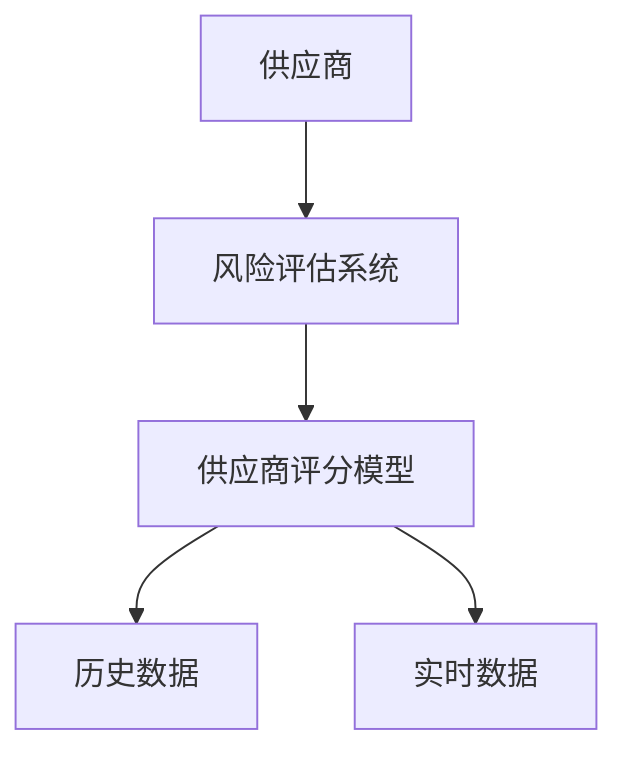
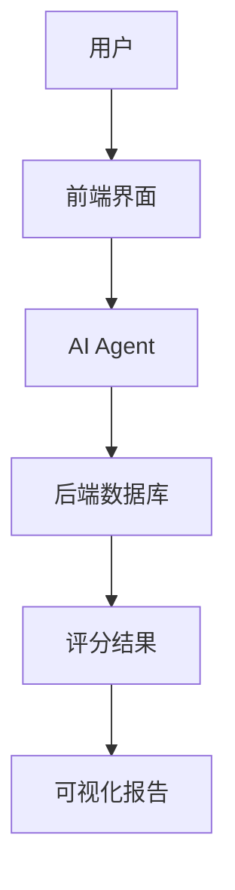
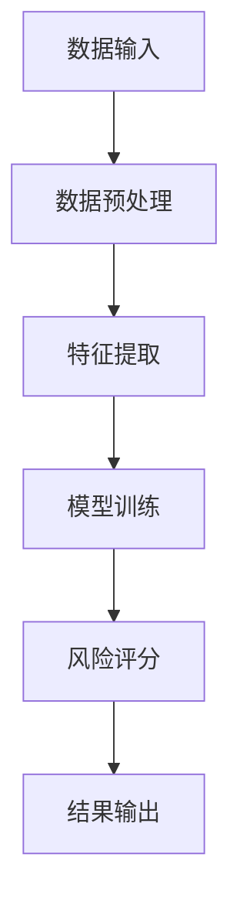
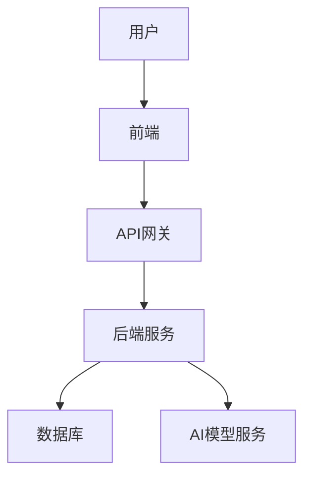
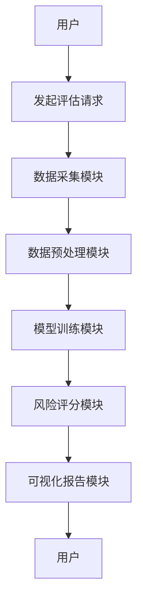

                 


# AI Agent在企业供应商风险评估与管理中的应用

## 关键词：AI Agent，供应商风险评估，供应链管理，机器学习，风险管理

## 摘要：  
本文探讨了AI Agent在企业供应商风险评估与管理中的应用，分析了传统供应商管理的局限性，介绍了AI Agent的核心概念及其在供应商风险评估中的作用，详细讲解了AI Agent在供应商风险评估中的算法原理、数学模型、系统架构设计以及项目实战案例。文章最后总结了AI Agent在供应商风险评估中的优势和未来发展趋势。

---

# 第1章: AI Agent与供应商风险评估的背景介绍

## 1.1 AI Agent的核心概念

### 1.1.1 AI Agent的定义与特点  
AI Agent（人工智能代理）是指能够感知环境、自主决策并执行任务的智能系统。其特点包括：  
1. **自主性**：能够在没有人工干预的情况下自主运行。  
2. **反应性**：能够实时感知环境并做出反应。  
3. **目标导向**：以特定目标为导向，优化决策过程。  
4. **学习能力**：能够通过数据和经验不断优化自身性能。  

### 1.1.2 供应商风险评估的基本概念  
供应商风险评估是指对企业供应链中的供应商进行风险分析，以确保供应链的稳定性和可靠性。常见的风险包括：  
1. **信用风险**：供应商的财务状况是否稳健。  
2. **交付风险**：供应商是否能够按时交付货物。  
3. **合规风险**：供应商是否符合行业标准和法律法规。  
4. **操作风险**：供应商的运营是否稳定。  

### 1.1.3 AI Agent在供应商风险评估中的作用  
AI Agent可以通过以下方式提升供应商风险评估的效率和准确性：  
1. **实时监控**：实时收集和分析供应商的动态数据。  
2. **预测模型**：利用机器学习算法预测供应商的潜在风险。  
3. **自动化决策**：基于数据分析结果，自动推荐最优供应商。  

---

## 1.2 供应商风险评估的背景与挑战

### 1.2.1 传统供应商管理的局限性  
传统的供应商管理方法通常依赖人工经验，存在以下问题：  
1. **效率低下**：人工评估耗时且成本高。  
2. **主观性**：评估结果可能受到人为因素的影响。  
3. **数据孤岛**：各部门之间的数据难以整合，导致信息不透明。  

### 1.2.2 数字化转型对企业供应链管理的影响  
随着数字化转型的推进，企业越来越依赖数据和技术来优化供应链管理。AI Agent作为一项新兴技术，为企业提供了新的工具来应对供应链管理的挑战。

### 1.2.3 AI技术在供应链管理中的应用趋势  
AI技术在供应链管理中的应用日益广泛，尤其是在风险评估领域。通过AI Agent，企业可以实现供应商的智能化管理，降低供应链风险。

---

## 1.3 本章小结  
本章介绍了AI Agent的核心概念及其在供应商风险评估中的作用，分析了传统供应商管理的局限性和数字化转型对企业供应链管理的影响，为后续章节的深入探讨奠定了基础。

---

# 第2章: AI Agent在供应商风险评估中的核心概念与联系

## 2.1 AI Agent的实体关系分析



从上图可以看出，AI Agent通过整合历史数据和实时数据，对供应商进行评分，从而实现风险评估。

---

## 2.2 供应商风险评估的系统架构



该架构展示了AI Agent如何与前端界面、后端数据库以及可视化报告进行交互，实现供应商风险评估的闭环。

---

## 2.3 算法原理与流程



从上图可以看出，AI Agent的风险评估流程包括数据输入、数据预处理、特征提取、模型训练和结果输出五个步骤。

---

## 2.4 本章小结  
本章通过实体关系图和系统架构图，详细分析了AI Agent在供应商风险评估中的核心概念和联系，为后续章节的算法原理和系统设计奠定了基础。

---

# 第3章: AI Agent的算法原理与数学模型

## 3.1 数据预处理与特征工程

### 3.1.1 数据清洗与标准化  
数据清洗是去除无效数据、填充缺失值、处理异常值的过程。标准化则是将数据缩放到统一范围内，例如0-1标准化：  
$$ x' = \frac{x - \text{min}(x)}{\text{max}(x) - \text{min}(x)} $$  

### 3.1.2 特征选择与降维  
特征选择可以通过相关性分析或主成分分析（PCA）进行降维，以减少数据维度并提高模型性能。

---

## 3.2 风险评分模型

### 3.2.1 线性回归模型  
线性回归模型用于预测供应商的信用风险评分：  
$$ y = \beta_0 + \beta_1x_1 + \beta_2x_2 + \dots + \beta_nx_n $$  

### 3.2.2 机器学习模型（如随机森林）  
随机森林是一种基于树的集成学习方法，能够处理高维数据并捕捉非线性关系：  
$$ y = f(X) $$  

---

## 3.3 模型优化与评估

### 3.3.1 超参数优化  
通过网格搜索或随机搜索优化模型参数，例如随机森林的树深（max_depth）和树的数量（n_estimators）。

### 3.3.2 模型评估指标  
常用的评估指标包括准确率（Accuracy）、召回率（Recall）、F1分数（F1 Score）和ROC-AUC曲线。

---

## 3.4 本章小结  
本章详细讲解了AI Agent在供应商风险评估中的算法原理和数学模型，包括数据预处理、特征工程、模型训练和评估等内容。

---

# 第4章: AI Agent的系统分析与架构设计

## 4.1 系统功能设计

### 4.1.1 数据采集模块  
负责收集供应商的历史数据和实时数据，例如财务数据、交付记录和行业新闻。

### 4.1.2 风险评估模块  
基于机器学习模型对供应商进行风险评分，生成风险报告。

### 4.1.3 可视化报告模块  
将风险评估结果以图表形式展示，帮助企业管理者直观了解供应商风险。

---

## 4.2 系统架构设计



该架构展示了AI Agent系统的整体架构，包括前端、后端服务、数据库和AI模型服务。

---

## 4.3 系统接口设计

### 4.3.1 数据接口  
用于接收供应商的历史数据和实时数据。

### 4.3.2 API接口  
提供RESTful API供前端调用，例如获取供应商风险评分。

### 4.3.3 报告生成接口  
用于生成可视化风险报告并发送给用户。

---

## 4.4 系统交互流程



该流程展示了用户发起评估请求后，系统如何逐步处理并生成最终报告。

---

## 4.5 本章小结  
本章详细分析了AI Agent系统的功能设计、架构设计和交互流程，为后续章节的项目实战奠定了基础。

---

# 第5章: 项目实战

## 5.1 项目介绍

### 5.1.1 项目背景  
某跨国企业希望通过AI Agent技术优化其供应商风险评估流程。

### 5.1.2 项目目标  
开发一个基于AI Agent的供应商风险评估系统，实现供应商风险的智能化评估和管理。

---

## 5.2 核心实现

### 5.2.1 数据预处理  
```python
import pandas as pd
from sklearn.preprocessing import StandardScaler

# 读取数据
df = pd.read_csv('suppliers.csv')

# 删除缺失值
df.dropna(inplace=True)

# 标准化处理
scaler = StandardScaler()
df_normalized = scaler.fit_transform(df)
```

### 5.2.2 模型训练  
```python
from sklearn.ensemble import RandomForestClassifier

# 训练模型
model = RandomForestClassifier(n_estimators=100, max_depth=5)
model.fit(X_train, y_train)

# 预测结果
y_pred = model.predict(X_test)
```

### 5.2.3 可视化报告  
```python
import matplotlib.pyplot as plt

# 绘制ROC-AUC曲线
plt.plot(fpr, tpr, color='darkorange', lw=2)
plt.xlabel('False Positive Rate')
plt.ylabel('True Positive Rate')
plt.title('Receiver Operating Characteristic (ROC)')
plt.show()
```

---

## 5.3 项目小结  
本章通过一个实际项目展示了AI Agent在供应商风险评估中的应用，包括数据预处理、模型训练和可视化报告的生成。

---

# 第6章: 总结与展望

## 6.1 最佳实践  
1. **数据质量管理**：确保数据的准确性和完整性。  
2. **模型持续优化**：定期更新模型参数，提升预测精度。  
3. **多维度风险评估**：结合定量和定性分析，全面评估供应商风险。  

## 6.2 小结  
本文详细探讨了AI Agent在供应商风险评估中的应用，从理论到实践，全面分析了其优势和实现方法。

## 6.3 未来展望  
随着AI技术的不断发展，AI Agent在供应商风险评估中的应用将更加广泛，可能的方向包括：  
1. **实时监控与预警**：基于实时数据，实现供应商风险的实时预警。  
2. **智能化决策支持**：通过AI Agent提供更精准的供应商选择建议。  
3. **跨行业应用**：将AI Agent技术推广到更多行业，提升供应链管理效率。

---

# 作者：AI天才研究院/AI Genius Institute & 禅与计算机程序设计艺术 /Zen And The Art of Computer Programming

---

以上内容是《AI Agent在企业供应商风险评估与管理中的应用》的技术博客文章，希望对您有所帮助！

