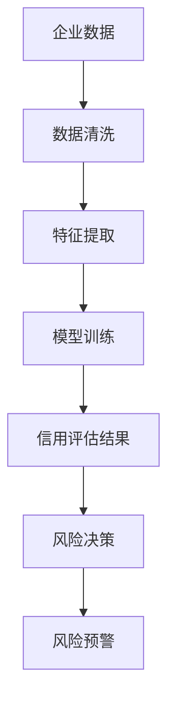
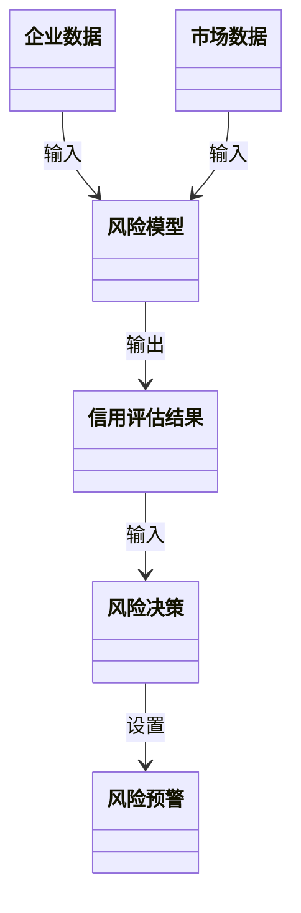
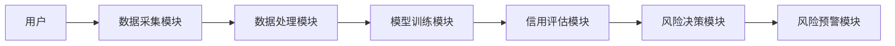
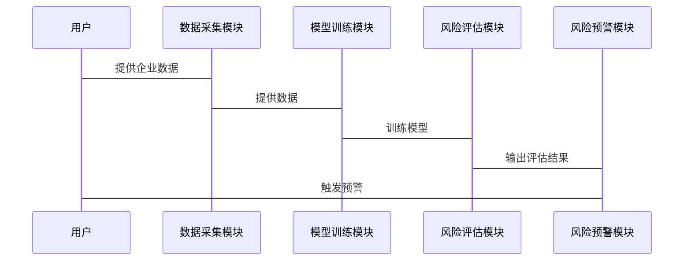

                 


# AI Agent在企业信用风险评估中的应用

## 关键词：
- 人工智能，AI Agent，企业信用风险，信用评估，风险管理，智能决策

## 摘要：
本文深入探讨了AI Agent在企业信用风险评估中的应用，分析了AI Agent的基本概念、核心功能及其在信用风险评估中的具体应用场景。通过详细讲解算法原理、系统架构设计、项目实战案例等，本文揭示了AI Agent如何提升信用风险评估的效率和准确性，为企业风险管理提供了新的思路和解决方案。最终，本文总结了AI Agent在信用风险评估中的优势，并展望了其未来的发展前景。

---

# 第1章: 企业信用风险评估的背景与AI Agent的引入

## 1.1 信用风险评估的基本概念

### 1.1.1 信用风险的定义
信用风险是指在企业或个人借贷活动中，由于债务人或交易对手无法履行其合同义务，导致债权人或相关方遭受损失的风险。在企业信用风险评估中，主要关注企业客户的还款能力和还款意愿。

### 1.1.2 信用风险的分类
信用风险可以分为以下几类：
- **系统性风险**：由宏观经济因素（如经济衰退、政策变化）引起的整体风险。
- **非系统性风险**：由企业自身的财务状况、管理能力等因素引起的特定风险。
- **流动性风险**：企业在短时间内无法变现资产以偿还债务的风险。

### 1.1.3 信用风险评估的重要性
信用风险评估是企业风险管理的核心环节之一，直接关系到企业的信贷决策、资产保全和财务健康。准确的信用风险评估能够帮助企业在信贷业务中规避潜在风险，优化资源配置。

## 1.2 企业信用风险评估的流程

### 1.2.1 数据收集与整理
信用风险评估的第一步是收集和整理与企业相关的数据，包括财务数据（收入、利润、负债等）、经营数据（行业地位、市场份额）、信用历史（还款记录、违约情况）等。

### 1.2.2 风险评估模型的选择
根据企业的特点和评估目标，选择合适的信用风险评估模型。常用的模型包括：
- **信用评分模型**：基于企业的财务指标和市场表现，计算信用评分。
- **违约概率模型**：通过统计方法预测企业在一定期限内违约的概率。

### 1.2.3 结果分析与决策
根据评估结果，企业可以做出相应的信贷决策，如批准或拒绝贷款申请、调整信用额度、制定风险 mitigation策略等。

## 1.3 传统信用风险评估方法的局限性

### 1.3.1 传统方法的优缺点
- **优点**：方法相对成熟，易于理解和实施。
- **缺点**：
  - 数据依赖性强，难以应对复杂多变的市场环境。
  - 评估结果可能滞后，无法及时反映企业的最新状况。
  - 人工干预较多，效率较低，且易受主观因素影响。

### 1.3.2 传统方法在实际应用中的挑战
- 数据获取成本高，尤其是实时数据的获取和处理。
- 评估模型的泛化能力有限，难以应对非线性关系和复杂场景。
- 人工审核环节耗时长，难以满足企业对快速决策的需求。

### 1.3.3 引入AI Agent的必要性
AI Agent具有智能决策、自动化执行和持续学习的能力，能够有效克服传统方法的局限性，提升信用风险评估的效率和准确性。

---

## 1.4 本章小结
本章介绍了信用风险评估的基本概念、传统评估方法的流程及其局限性，并阐述了引入AI Agent的必要性。通过对比传统方法与AI Agent的优势，为后续章节的分析奠定了基础。

---

# 第2章: AI Agent的基本概念与功能

## 2.1 AI Agent的定义与特点

### 2.1.1 AI Agent的定义
AI Agent（人工智能代理）是指能够感知环境、自主决策并执行任务的智能实体。它能够通过数据输入、模型推理和决策优化，实现对复杂问题的自动化解决。

### 2.1.2 AI Agent的核心特点
- **智能性**：能够理解和处理复杂信息，具备推理和学习能力。
- **自主性**：无需人工干预，能够自主完成任务。
- **适应性**：能够根据环境变化调整行为和策略。
- **交互性**：能够与用户、系统或其他AI Agent进行有效交互。

### 2.1.3 AI Agent与传统软件的区别
| 特性 | 传统软件 | AI Agent |
|------|----------|----------|
| 智能性 | 无智能性，按规则执行 | 具备智能性，能够自主决策 |
| 自主性 | 依赖人工操作 | 具备自主性，能够独立运行 |
| 适应性 | 静态，无法自适应 | 具备适应性，能够动态调整 |

## 2.2 AI Agent的主要功能

### 2.2.1 数据采集与处理
AI Agent能够从多种来源（如企业财务报表、市场数据、新闻资讯）获取信息，并通过数据清洗、特征提取等技术，为信用风险评估提供高质量的数据支持。

### 2.2.2 智能决策与推荐
基于机器学习模型和知识图谱，AI Agent能够对企业的信用状况进行智能分析，并提供风险评估结果和优化建议。

### 2.2.3 自动化执行与反馈
AI Agent能够在评估结果的基础上，自动化执行相应的信贷决策（如调整贷款额度、触发预警机制），并根据反馈不断优化自身的决策模型。

## 2.3 AI Agent在企业中的应用场景

### 2.3.1 企业信用风险评估中的应用
AI Agent可以通过实时数据分析和模型推理，对企业客户的信用状况进行动态评估，并及时发现潜在风险。

### 2.3.2 其他相关领域的应用
- **供应链管理**：优化供应商选择和库存管理。
- **市场营销**：精准定位客户，制定个性化营销策略。
- **风险管理**：实时监控企业运营风险，制定应对策略。

### 2.3.3 AI Agent的优势与潜力
- 提升决策效率和准确性。
- 实现企业运营的智能化和自动化。
- 为企业创造更大的价值和竞争优势。

## 2.4 本章小结
本章详细介绍了AI Agent的基本概念、核心功能及其在企业中的应用场景，突出了AI Agent在信用风险评估中的巨大潜力。

---

# 第3章: 企业信用风险评估中的AI Agent解决方案

## 3.1 问题背景与目标

### 3.1.1 问题背景的描述
企业信用风险评估的核心目标是通过分析企业的信用状况，预测其违约概率，并制定相应的风险管理策略。传统的评估方法存在效率低、准确性差、难以应对复杂场景等问题。

### 3.1.2 问题目标的设定
- 提升信用风险评估的效率和准确性。
- 实现评估过程的自动化和智能化。
- 建立实时动态的信用评估机制。

## 3.2 核心概念与联系

### 3.2.1 核心概念的原理
AI Agent在信用风险评估中的应用基于以下原理：
- 数据驱动的决策：通过收集和分析企业数据，构建信用评估模型。
- 智能推理与预测：利用机器学习算法，预测企业的信用风险。
- 自适应优化：根据反馈不断优化模型和策略。

### 3.2.2 核心概念的属性特征对比表格
| 特性 | 传统方法 | AI Agent方法 |
|------|----------|--------------|
| 数据依赖 | 高 | 较低，依赖AI模型的泛化能力 |
| 决策效率 | 低 | 高，自动化决策 |
| 灵活性 | 低，难以适应变化 | 高，能够动态调整 |

### 3.2.3 ER实体关系图架构的 Mermaid 流程图

```mermaid
erDiagram
    actor 企业客户
    actor 金融机构
    actor 第三方数据源
    database 企业数据
    database 市场数据
    database 风险模型
    process 信用评估
    process 风险决策
    process 风险预警

    企业客户 --> 企业数据: 提供
    企业客户 --> 市场数据: 提供
    企业数据 --> 风险模型: 输入
    市场数据 --> 风险模型: 输入
    风险模型 --> 信用评估: 计算
    信用评估 --> 风险决策: 输出
    风险决策 --> 风险预警: 设置
```

## 3.3 解决方案的详细设计

### 3.3.1 数据流的处理流程



### 3.3.2 AI Agent的交互机制
AI Agent通过与企业客户、金融机构和第三方数据源的交互，实现信用数据的采集、分析和评估。其交互机制包括：
- 数据采集：从企业客户、金融机构和第三方数据源获取相关信息。
- 智能分析：利用机器学习模型对数据进行分析和推理。
- 决策反馈：根据分析结果，生成风险评估报告并触发相应预警机制。

### 3.3.3 系统的模块划分与功能分配
- **数据采集模块**：负责收集企业数据。
- **模型训练模块**：负责构建和训练信用评估模型。
- **风险评估模块**：负责对企业信用状况进行评估。
- **风险决策模块**：根据评估结果制定风险管理策略。
- **风险预警模块**：实时监控风险变化并触发预警。

## 3.4 本章小结
本章详细分析了AI Agent在企业信用风险评估中的解决方案，从数据流处理、模型构建到交互机制，全面展示了AI Agent的优势和应用场景。

---

# 第4章: AI Agent驱动的信用风险评估算法原理

## 4.1 算法原理概述

### 4.1.1 信用评分模型
信用评分模型是基于企业的财务指标和市场表现，计算其信用评分的模型。常用的模型包括：
- **线性回归模型**：通过线性关系预测信用评分。
- **逻辑回归模型**：用于分类问题，预测企业违约概率。

### 4.1.2 强化学习算法
强化学习是一种通过试错机制优化决策的算法，适用于动态环境下的信用风险评估。其核心在于通过不断试错，优化决策策略以最大化期望收益。

---

## 4.2 算法实现细节

### 4.2.1 信用评分模型的实现
```python
import numpy as np
from sklearn.linear_model import LinearRegression

# 示例数据
X = np.array([[1, 2], [3, 4], [5, 6]])
y = np.array([10, 20, 30])

# 训练模型
model = LinearRegression()
model.fit(X, y)

# 预测信用评分
new_X = np.array([[2, 3]])
predicted_score = model.predict(new_X)
print(predicted_score)
```

### 4.2.2 强化学习算法的实现
```python
import numpy as np
import gym

# 示例强化学习环境
env = gym.make('CartPole-v0')

# 初始化策略网络
class Policy:
    def __init__(self, input_dim, output_dim):
        self.w = np.random.randn(input_dim, output_dim)

    def predict(self, state):
        return np.argmax(state.dot(self.w))

# 强化学习循环
agent = Policy(env.observation_space.shape[0], env.action_space.n)
for _ in range(1000):
    state = env.reset()
    done = False
    while not done:
        action = agent.predict(state)
        next_state, reward, done, _ = env.step(action)
        # 更新策略网络（此处简化为随机更新）
        agent.w += np.random.randn(*agent.w.shape) * 0.1
```

---

## 4.3 本章小结
本章详细讲解了AI Agent驱动的信用风险评估算法，包括信用评分模型和强化学习算法的实现细节，展示了AI Agent在提升信用评估准确性和效率方面的巨大潜力。

---

# 第5章: 系统分析与架构设计方案

## 5.1 问题场景介绍
本章以一个典型的信用风险评估系统为例，介绍AI Agent在系统设计中的应用。

## 5.2 项目介绍
- **项目目标**：构建一个基于AI Agent的企业信用风险评估系统。
- **项目范围**：涵盖数据采集、模型训练、风险评估和预警机制。
- **项目需求**：实时动态的信用评估、高准确率的预测结果、高效的决策反馈。

## 5.3 系统功能设计

### 5.3.1 领域模型类图


## 5.4 系统架构设计

### 5.4.1 系统架构图


## 5.5 接口设计与交互流程

### 5.5.1 接口设计
- **数据采集接口**：从企业客户和第三方数据源获取数据。
- **模型调用接口**：调用信用评估模型进行预测。
- **预警触发接口**：根据风险评估结果触发预警机制。

### 5.5.2 交互流程


## 5.6 本章小结
本章通过系统架构设计和交互流程图，详细展示了AI Agent在信用风险评估系统中的应用，为后续的项目实施提供了理论基础和设计指导。

---

# 第6章: 项目实战——基于AI Agent的企业信用风险评估系统实现

## 6.1 环境安装与配置

### 6.1.1 环境要求
- **操作系统**：Linux/MacOS/Windows（推荐Linux）
- **Python版本**：3.6+
- **依赖库**：numpy、pandas、scikit-learn、gym、matplotlib

### 6.1.2 安装依赖
```bash
pip install numpy pandas scikit-learn gym matplotlib
```

## 6.2 系统核心实现源代码

### 6.2.1 数据采集模块
```python
import pandas as pd
import requests

def fetch_data(api_key):
    url = f"https://api.example.com/credit_data?api_key={api_key}"
    response = requests.get(url)
    data = response.json()
    df = pd.DataFrame(data['result'])
    return df
```

### 6.2.2 风险评估模块
```python
from sklearn.model_selection import train_test_split
from sklearn.ensemble import RandomForestClassifier

def train_model(X_train, y_train):
    model = RandomForestClassifier()
    model.fit(X_train, y_train)
    return model

def evaluate_model(model, X_test, y_test):
    accuracy = model.score(X_test, y_test)
    print(f"模型准确率：{accuracy}")
```

### 6.2.3 风险预警模块
```python
import numpy as np
import matplotlib.pyplot as plt

def generate_alert(threshold, probability):
    if probability > threshold:
        plt.figure(figsize=(4, 3))
        plt.title("Risk Alert")
        plt.text(0.5, 0.5, "High Risk!", ha='center', va='center')
        plt.show()
```

## 6.3 代码应用解读与分析
- **数据采集模块**：通过API接口获取企业信用数据，并将其存储为DataFrame格式。
- **风险评估模块**：使用随机森林算法训练信用评估模型，并对测试数据进行预测。
- **风险预警模块**：根据模型预测结果，判断是否需要触发预警机制。

## 6.4 实际案例分析与详细讲解
以一家中型制造企业为例，假设其财务数据如下：
- 营业收入：1000万元
- 净利润：100万元
- 负债总额：500万元
- 信用历史：无违约记录

通过AI Agent的评估，系统预测该企业的违约概率为5%，并根据预设阈值触发预警机制，提示企业需要注意现金流问题。

## 6.5 项目总结与经验分享
- **项目总结**：通过AI Agent实现了高效、准确的信用风险评估，显著提升了企业的风险管理能力。
- **经验分享**：
  - 数据质量是模型准确性的关键，需确保数据的完整性和实时性。
  - 模型的选择和调优直接影响评估结果，需结合业务需求进行优化。
  - 系统的可解释性和透明度是用户信任的基础，需在设计中予以重视。

---

# 第7章: 总结与展望

## 7.1 全文总结
本文系统性地探讨了AI Agent在企业信用风险评估中的应用，从理论基础到实际应用，全面展示了AI Agent的优势和潜力。通过详细讲解算法原理、系统架构设计和项目实战案例，本文为AI Agent在信用风险评估中的应用提供了有价值的参考。

## 7.2 未来展望
随着人工智能技术的不断发展，AI Agent在信用风险评估中的应用将更加广泛和深入。未来的研究方向包括：
- **模型优化**：探索更高效、更准确的信用评估算法。
- **多模态数据融合**：结合文本、图像等多种数据源，提升评估的全面性。
- **实时性提升**：优化数据处理和模型推理的速度，实现真正的实时评估。

## 7.3 最佳实践 Tips
- 在实际应用中，建议企业结合自身特点选择合适的AI Agent解决方案。
- 数据安全和隐私保护是实施AI Agent系统的重要考虑因素。
- 定期对模型进行更新和优化，确保评估结果的准确性和时效性。

---

# 作者：AI天才研究院/AI Genius Institute & 禅与计算机程序设计艺术/Zen And The Art of Computer Programming

---

感谢您的阅读！希望本文能为您提供有价值的洞见，帮助您更好地理解和应用AI Agent在企业信用风险评估中的潜力！

