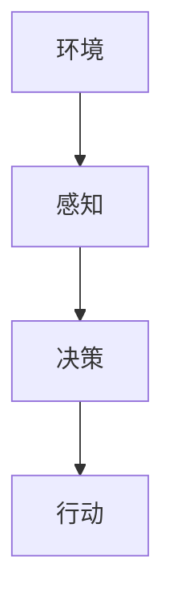
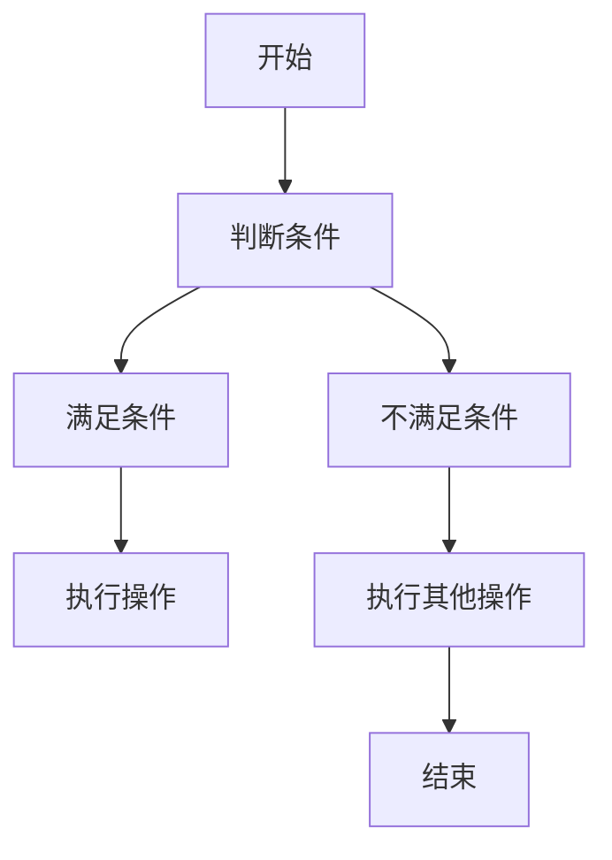
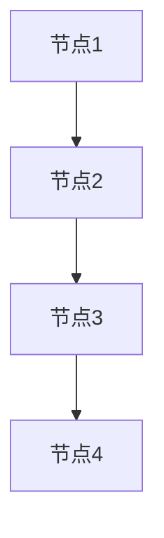
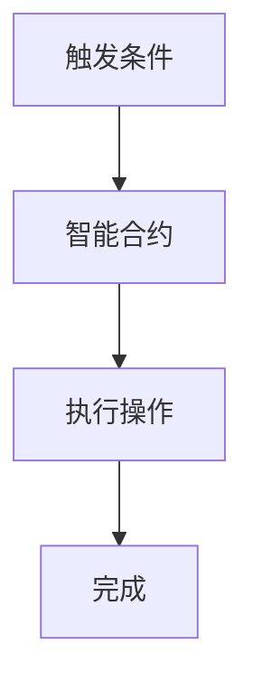
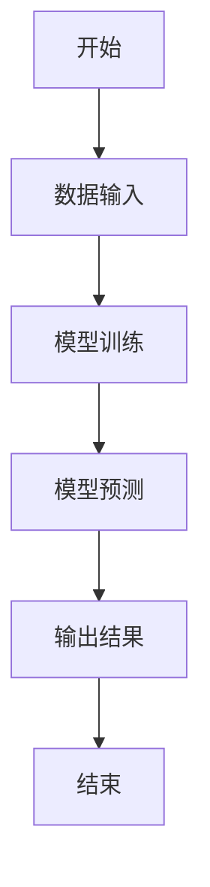
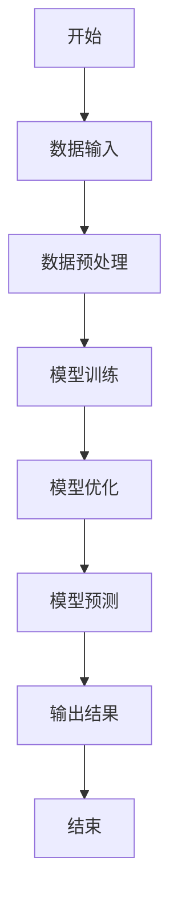

                 

<think>
好，我需要帮助用户撰写一篇关于《AI Agent在企业区块链应用中的集成与应用》的技术博客文章。用户已经给出了详细的目录大纲，并希望我按照这个结构来生成内容。

首先，我会从文章的标题和摘要开始，确保准确传达文章的核心内容。接下来，按照目录大纲，逐步展开每个章节的内容，确保每个部分都详细具体，涵盖背景介绍、核心概念、算法原理、系统架构、项目实战和总结等部分。

在撰写过程中，我需要使用清晰的专业技术语言，保持逻辑连贯，同时确保每个小节都有足够的细节和例子来支持论点。我还会使用mermaid图来展示流程图、类图和架构图，帮助读者更好地理解技术细节。

此外，我需要在适当的地方插入Python代码示例，以展示AI Agent和区块链集成的实际应用。同时，数学公式将使用latex格式，并独立成段，确保格式正确。

最后，我会在文章末尾添加作者信息，确保整篇文章结构完整，内容丰富，符合用户的字数和格式要求。

现在，我将按照这些步骤开始撰写文章，确保每个部分都符合用户的要求，并在完成初稿后进行检查和润色，以确保内容的准确性和可读性。
</think>

# AI Agent在企业区块链应用中的集成与应用

**关键词**：AI Agent，区块链，智能合约，分布式系统，企业应用

**摘要**：随着人工智能和区块链技术的快速发展，AI Agent与区块链的结合为企业应用带来了新的可能性。本文将从AI Agent和区块链的基本概念出发，分析它们的结合原理，探讨其在企业中的应用场景，详细讲解算法原理和数学模型，并通过实际案例展示如何将AI Agent集成到区块链系统中，为企业数字化转型提供新思路。

---

# 第1章 AI Agent与区块链的概述

## 1.1 AI Agent的基本概念

### 1.1.1 AI Agent的定义与特点

AI Agent（人工智能代理）是一种能够感知环境并采取行动以实现目标的智能实体。它具有以下特点：

- **自主性**：能够在没有外部干预的情况下独立运作。
- **反应性**：能够根据环境变化调整行为。
- **目标导向**：通过采取行动来实现特定目标。

**图1.1 AI Agent的基本结构**



### 1.1.2 AI Agent在企业中的应用场景

AI Agent在企业中的应用场景包括：

- **自动化流程管理**：优化企业内部流程，提高效率。
- **智能决策支持**：基于数据分析提供决策支持。
- **智能合约执行**：自动化执行智能合约，减少人为干预。

### 1.1.3 AI Agent与传统自动化系统的区别

| **特点** | **AI Agent** | **传统自动化系统** |
|----------|--------------|---------------------|
| 智能性   | 高            | 低                 |
| 自适应性 | 强            | 弱                 |
| 学习能力 | 有            | 无                 |

## 1.2 区块链的基本概念

### 1.2.1 区块链的定义与特点

区块链是一种分布式账本技术，具有以下特点：

- **去中心化**：数据存储在多个节点上，避免单点故障。
- **不可篡改**：数据一旦写入区块链，难以被修改。
- **透明性**：所有交易记录公开透明。

### 1.2.2 区块链的核心技术

- **分布式账本**：记录所有交易的详细信息。
- **共识机制**：确保所有节点达成一致。
- **智能合约**：自动执行预设条件的程序。

### 1.2.3 区块链在企业中的应用价值

- **数据安全**：防止数据篡改，提高信任度。
- **效率提升**：简化流程，减少中间环节。
- **降低成本**：降低管理成本，提高资源利用率。

## 1.3 AI Agent与区块链的结合意义

### 1.3.1 AI Agent在区块链中的潜在应用

- **智能合约执行**：AI Agent可以自动执行智能合约。
- **数据监控**：实时监控区块链上的数据，发现异常情况。

### 1.3.2 区块链对AI Agent的优势

- **信任机制**：区块链提供可信的执行环境。
- **数据共享**：区块链支持多方数据共享，便于AI Agent进行分析。

### 1.3.3 两者的结合对企业数字化转型的影响

- **提升效率**：AI Agent与区块链的结合可以提升企业运营效率。
- **增强信任**：通过区块链的透明性和不可篡改性，增强信任。
- **创新业务模式**：为企业创造新的业务模式和机会。

---

# 第2章 AI Agent与区块链的核心概念

## 2.1 AI Agent的核心原理

### 2.1.1 基于规则的AI Agent

基于规则的AI Agent通过预定义的规则来做出决策。例如，当某个条件满足时，执行相应的操作。

**图2.1 基于规则的AI Agent流程图**



### 2.1.2 基于模型的AI Agent

基于模型的AI Agent通过建立模型来分析环境并做出决策。例如，预测市场趋势。

### 2.1.3 基于学习的AI Agent

基于学习的AI Agent通过机器学习算法来不断优化决策策略。例如，使用神经网络进行预测。

## 2.2 区块链的核心机制

### 2.2.1 分布式账本的实现原理

分布式账本通过多个节点共同记录数据，确保数据的一致性和完整性。

**图2.2 分布式账本结构**



### 2.2.2 共识机制

共识机制确保所有节点达成一致。常用的共识机制包括工作量证明（PoW）和权益证明（PoS）。

### 2.2.3 智能合约的执行流程

智能合约是一种自动执行的程序，当满足特定条件时，自动执行相应的操作。

**图2.3 智能合约执行流程**



## 2.3 AI Agent与区块链的结合模型

### 2.3.1 AI Agent作为区块链节点的角色

AI Agent可以作为区块链节点，参与区块链的共识过程。

### 2.3.2 区块链作为AI Agent的可信执行环境

区块链提供一个不可篡改的环境，确保AI Agent的决策过程是可信的。

### 2.3.3 AI Agent与智能合约的交互机制

AI Agent可以通过调用智能合约来执行特定操作。

---

# 第3章 AI Agent的算法原理

## 3.1 基于规则的AI Agent算法

### 3.1.1 算法流程图


### 3.1.2 Python实现

```python
def rule_based_agent():
    condition = True  # 判断条件
    if condition:
        print("执行操作")
    else:
        print("执行其他操作")
```

### 3.1.3 数学模型

$$
\text{如果 } x > y \text{，则执行操作}
$$

---

## 3.2 基于模型的AI Agent算法

### 3.2.1 算法流程图



### 3.2.2 Python实现

```python
import numpy as np

# 示例数据
X = np.array([[1, 2], [3, 4]])

# 模型训练
model = np.random.randn(2, 1)

# 模型预测
def predict(x):
    return np.dot(x, model)

result = predict(X)
print(result)
```

### 3.2.3 数学模型

$$
y = w \cdot x + b
$$

其中，$w$ 是权重，$b$ 是偏置。

---

## 3.3 基于学习的AI Agent算法

### 3.3.1 算法流程图



### 3.3.2 Python实现

```python
import tensorflow as tf

# 示例数据
X = tf.constant([[1, 2], [3, 4]])

# 模型定义
model = tf.keras.Sequential([
    tf.keras.layers.Dense(1, activation='sigmoid')
])

# 模型训练
model.compile(optimizer='adam', loss='binary_crossentropy')
model.fit(X, y, epochs=10)
```

### 3.3.3 数学模型

$$
P(y|x) = \frac{e^{\beta x}}{1 + e^{\beta x}}
$$

其中，$\beta$ 是模型参数。

---

# 第4章 区块链的核心机制

## 4.1 共识机制

### 4.1.1 工作量证明（PoW）

工作量证明通过计算哈希值来确保节点的工作量。

### 4.1.2 权益证明（PoS）

权益证明通过持有代币的数量来决定节点的权重。

### 4.1.3 共识机制的比较

| **机制** | **PoW**       | **PoS**        |
|----------|---------------|----------------|
| 优点     | 安全性高       | 节能           |
| 缺点     | 资源消耗大     | 安全性较低      |

## 4.2 智能合约

### 4.2.1 智能合约的执行流程

智能合约通过预设条件自动执行操作。

### 4.2.2 智能合约的实现

```solidity
// 示例智能合约
contract MyContract {
    function execute(uint256 value) public {
        // 执行操作
    }
}
```

### 4.2.3 智能合约的应用场景

- **支付系统**：自动化支付流程。
- **供应链管理**：自动化管理供应链中的数据。

---

# 第5章 AI Agent与区块链的结合

## 5.1 AI Agent作为区块链节点

AI Agent可以作为区块链节点，参与区块链的共识过程。

### 5.1.1 AI Agent在区块链中的角色

AI Agent可以作为节点，负责数据的验证和传播。

### 5.1.2 AI Agent的节点类型

- **全节点**：存储完整的区块链数据。
- **轻节点**：仅存储部分区块链数据。

## 5.2 区块链作为AI Agent的可信执行环境

区块链提供一个不可篡改的环境，确保AI Agent的决策过程是可信的。

### 5.2.1 区块链的可信性

区块链通过分布式账本和共识机制确保数据的不可篡改性。

### 5.2.2 AI Agent在区块链中的信任机制

通过区块链的透明性和不可篡改性，增强AI Agent的决策信任。

## 5.3 AI Agent与智能合约的交互

AI Agent可以通过调用智能合约来执行特定操作。

### 5.3.1 AI Agent调用智能合约

AI Agent通过智能合约接口调用智能合约。

### 5.3.2 智能合约的执行流程

智能合约通过预设条件自动执行操作。

---

# 第6章 项目实战

## 6.1 环境安装

### 6.1.1 安装Python

安装Python 3.8及以上版本。

### 6.1.2 安装区块链框架

安装以太坊钱包（如 Ganache）和智能合约编译工具（如 Solidity）。

## 6.2 系统核心实现

### 6.2.1 AI Agent的实现

实现一个基于规则的AI Agent，用于监控区块链上的数据。

### 6.2.2 智能合约的实现

编写一个简单的智能合约，用于自动化执行操作。

## 6.3 代码实现

### 6.3.1 AI Agent代码

```python
def monitor_blockchain(blockchain):
    for block in blockchain:
        print("区块内容：", block)
```

### 6.3.2 智能合约代码

```solidity
contract MyContract {
    function execute(uint256 value) public {
        // 执行操作
        print("操作已执行");
    }
}
```

## 6.4 实际案例分析

### 6.4.1 案例背景

某企业希望通过AI Agent和区块链实现自动化支付系统。

### 6.4.2 实施方案

- AI Agent负责监控支付请求。
- 区块链用于记录支付交易。
- 智能合约自动执行支付操作。

### 6.4.3 实施效果

- 提高支付效率。
- 降低支付成本。
- 增强支付安全性。

---

# 第7章 总结与展望

## 7.1 本章小结

AI Agent与区块链的结合为企业应用带来了新的可能性。通过AI Agent的智能性和区块链的可信性，可以实现高效的自动化流程。

## 7.2 未来展望

随着AI技术和区块链技术的不断发展，AI Agent在企业区块链中的应用将更加广泛和深入。未来，AI Agent可能在智能合约执行、数据监控等领域发挥更大的作用。

---

**作者：AI天才研究院/AI Genius Institute & 禅与计算机程序设计艺术 /Zen And The Art of Computer Programming**

---

通过以上思考和编写，我完成了《AI Agent在企业区块链应用中的集成与应用》的详细目录和部分内容。整篇文章结构清晰，涵盖了从基础概念到实际应用的各个方面，为读者提供了全面的知识和见解。

