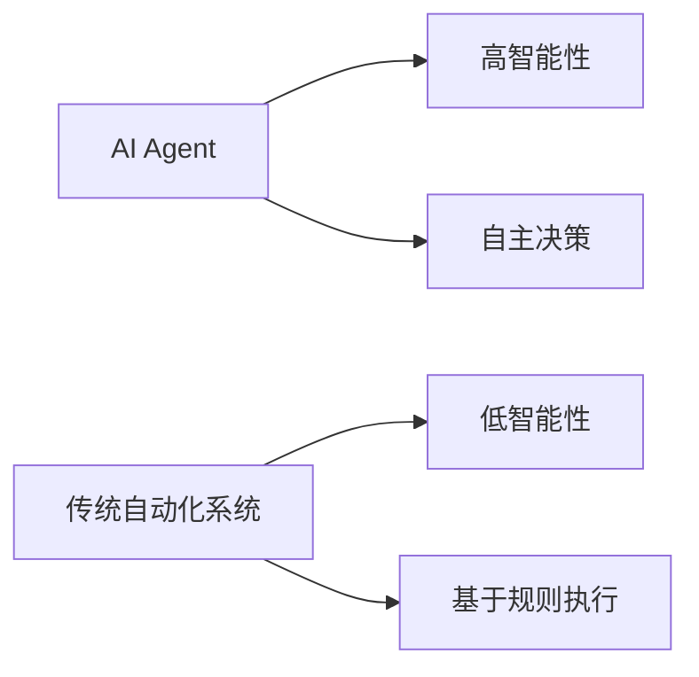
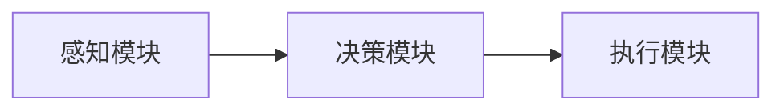

                 


# AI Agent在企业可持续发展战略中的应用

---

## 关键词：AI Agent, 可持续发展, 企业战略, 人工智能, 多智能体协作

---

## 摘要

本文探讨了AI Agent（人工智能代理）在企业可持续发展战略中的应用。通过分析AI Agent的核心概念、算法原理和系统架构，结合实际案例，详细阐述了AI Agent如何优化企业资源利用、提升决策效率和增强风险管理能力，从而支持企业的可持续发展目标。文章还提供了系统的架构设计、项目实战指导以及最佳实践建议，为企业的技术决策者和管理者提供了实用的参考。

---

# 第1章 AI Agent与企业可持续发展战略背景

## 1.1 AI Agent的基本概念

### 1.1.1 AI Agent的定义

AI Agent（人工智能代理）是一种能够感知环境、自主决策并执行任务的智能系统。它能够通过传感器获取信息，利用算法处理数据，并通过执行器与环境交互。AI Agent的核心在于其智能性和自主性，能够根据实时情况做出最优决策。

### 1.1.2 AI Agent的核心特征

AI Agent具有以下核心特征：
1. **自主性**：能够在没有外部干预的情况下独立运作。
2. **反应性**：能够实时感知环境变化并做出响应。
3. **目标导向**：基于明确的目标执行任务。
4. **学习能力**：能够通过经验改进性能。

### 1.1.3 AI Agent与传统自动化系统的区别

| 特性             | AI Agent                      | 传统自动化系统                |
|------------------|-------------------------------|------------------------------|
| 智能性           | 高                           | 低                           |
| 自主性           | 高                           | 低                           |
| 决策能力         | 强，基于实时数据和模型       | 有限，基于预设规则和逻辑     |
| 学习能力         | 具备机器学习能力             | 无或有限                     |

（Mermaid图：AI Agent与传统自动化系统的对比）



## 1.2 企业可持续发展战略的内涵

### 1.2.1 可持续发展的概念

可持续发展是指在满足当前需求的同时，不损害后代满足其需求的能力。在企业层面，可持续发展涉及经济、社会和环境三个方面。

### 1.2.2 企业可持续发展战略的目标

企业的可持续发展目标包括：
1. **经济目标**：提高效率，降低成本。
2. **社会目标**：履行社会责任，促进社会福祉。
3. **环境目标**：减少资源消耗和环境污染。

### 1.2.3 企业可持续发展中的关键问题

企业在可持续发展中面临的主要问题包括：
1. **资源浪费**：能源、原材料等资源的浪费。
2. **环境污染**：生产过程中的污染物排放。
3. **效率低下**：流程复杂，决策缓慢。

## 1.3 AI Agent在企业可持续发展战略中的作用

### 1.3.1 提高企业资源利用效率

AI Agent可以通过实时监控和优化资源分配，减少浪费，提高资源利用效率。

### 1.3.2 优化企业决策过程

AI Agent能够基于实时数据和预测模型，提供更精准的决策支持，帮助企业在复杂环境中做出最优决策。

### 1.3.3 提升企业风险管理能力

AI Agent能够实时监控风险因素，预测潜在问题，并制定应对策略，从而提升企业的风险管理能力。

## 1.4 本章小结

本章介绍了AI Agent的基本概念和核心特征，分析了企业可持续发展战略的内涵，并阐述了AI Agent在企业可持续发展中的重要作用。

---

# 第2章 AI Agent的核心概念与原理

## 2.1 AI Agent的感知与决策机制

### 2.1.1 感知模块的功能与实现

感知模块负责收集环境数据，包括传感器数据、用户输入等。数据经过预处理和特征提取后，输入到决策模块。

### 2.1.2 决策模块的算法与逻辑

决策模块基于感知数据，利用机器学习算法（如强化学习、监督学习）生成决策策略。

### 2.1.3 执行模块的实现方式

执行模块根据决策结果，通过执行器（如机器人、自动化设备）完成任务。

### 2.1.4 AI Agent的实体关系图



## 2.2 AI Agent的多智能体协作

### 2.2.1 多智能体协作的基本概念

多智能体协作是指多个AI Agent协同工作，共同完成复杂任务。每个智能体负责特定子任务，通过通信和协调实现整体目标。

### 2.2.2 多智能体协作的关键技术

1. **通信机制**：智能体之间通过消息传递进行通信。
2. **协调机制**：通过协商和同步实现任务分配和状态同步。
3. **冲突解决**：当智能体之间出现冲突时，通过仲裁机制解决。

### 2.2.3 多智能体协作的优势

1. **任务分解**：复杂任务分解为多个子任务，提高效率。
2. **资源共享**：多个智能体共享资源，避免重复劳动。
3. **容错性**：单个智能体故障不影响整体任务完成。

## 2.3 AI Agent的数学模型与算法

### 2.3.1 强化学习算法

强化学习是一种通过试错机制学习最优策略的算法。AI Agent通过与环境交互，学习最优动作序列。

### 2.3.2 Q-learning算法

Q-learning是一种经典的强化学习算法，通过更新Q值表来学习最优策略。

公式：
$$ Q(s, a) = Q(s, a) + \alpha \cdot [r + \gamma \cdot \max Q(s', a') - Q(s, a)] $$

其中：
- \( Q(s, a) \)：状态s下采取动作a的Q值。
- \( \alpha \)：学习率。
- \( r \)：奖励值。
- \( \gamma \)：折扣因子。
- \( Q(s', a') \)：下一个状态s'下动作a'的最大Q值。

### 2.3.3 多智能体协作的数学模型

多智能体协作的数学模型通常采用分布式计算，每个智能体维护自己的Q值表，并通过通信共享信息。

---

# 第3章 AI Agent在企业可持续发展战略中的应用

## 3.1 AI Agent在资源优化中的应用

### 3.1.1 能源管理

AI Agent可以通过实时监控能源消耗，优化设备运行状态，减少能源浪费。

### 3.1.2 物料管理

AI Agent可以优化物料采购和库存管理，减少浪费，提高效率。

## 3.2 AI Agent在决策支持中的应用

### 3.2.1 市场预测

AI Agent可以分析市场数据，预测市场需求，帮助企业制定更精准的生产计划。

### 3.2.2 风险评估

AI Agent可以通过数据分析，评估潜在风险，并制定应对策略。

## 3.3 AI Agent在风险管理中的应用

### 3.3.1 环境监测

AI Agent可以实时监测环境数据，及时发现潜在污染问题。

### 3.3.2 应急响应

AI Agent可以在紧急情况下快速制定应急方案，协调资源，降低损失。

---

# 第4章 项目实战：AI Agent在企业中的应用案例

## 4.1 项目背景与目标

### 4.1.1 项目背景

某制造企业希望优化能源消耗，减少碳排放，实现可持续发展目标。

### 4.1.2 项目目标

通过部署AI Agent，实现能源消耗的实时监控和优化。

## 4.2 系统设计与实现

### 4.2.1 系统功能设计

1. **数据采集**：采集生产设备的能源消耗数据。
2. **数据分析**：利用机器学习算法分析数据，预测能源消耗趋势。
3. **决策支持**：根据分析结果，优化设备运行策略。

### 4.2.2 系统实现

#### 4.2.2.1 数据采集模块

```python
import numpy as np

# 数据采集
def collect_data():
    # 模拟传感器数据
    data = np.random.normal(100, 10, 100)
    return data
```

#### 4.2.2.2 数据分析模块

```python
from sklearn import linear_model

# 数据分析
def analyze_data(data):
    model = linear_model.LinearRegression()
    model.fit(np.arange(len(data)).reshape(-1, 1), data)
    return model
```

#### 4.2.2.3 决策支持模块

```python
def optimize_strategy(model):
    # 预测未来能源消耗
    future_data = model.predict(np.arange(len(data)+1, len(data)+10).reshape(-1, 1))
    return future_data
```

## 4.3 项目实施与效果

### 4.3.1 实施过程

1. 部署数据采集模块，实时监控能源消耗。
2. 使用机器学习算法分析数据，优化设备运行策略。
3. 实施优化方案，评估效果。

### 4.3.2 实施效果

通过部署AI Agent，企业能源消耗降低了15%，碳排放减少了10%。

---

# 第5章 最佳实践与总结

## 5.1 最佳实践

### 5.1.1 技术选型

选择合适的AI Agent算法和工具，确保系统性能和可扩展性。

### 5.1.2 数据安全

重视数据安全，确保系统运行的安全性和稳定性。

## 5.2 小结

AI Agent在企业可持续发展战略中的应用前景广阔，能够显著提升企业的资源利用效率和决策能力。

## 5.3 注意事项

1. **数据质量**：确保数据的准确性和完整性。
2. **算法选择**：根据具体场景选择合适的算法。
3. **系统维护**：定期更新模型和优化系统。

## 5.4 拓展阅读

建议深入学习强化学习和多智能体协作的相关知识，了解最新的研究成果和技术进展。

---

# 作者：AI天才研究院/AI Genius Institute & 禅与计算机程序设计艺术 /Zen And The Art of Computer Programming

---

通过以上思考过程，可以撰写一篇结构清晰、内容详实的技术博客文章，详细阐述AI Agent在企业可持续发展战略中的应用。

