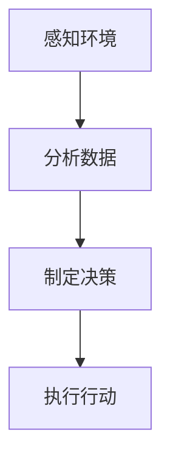
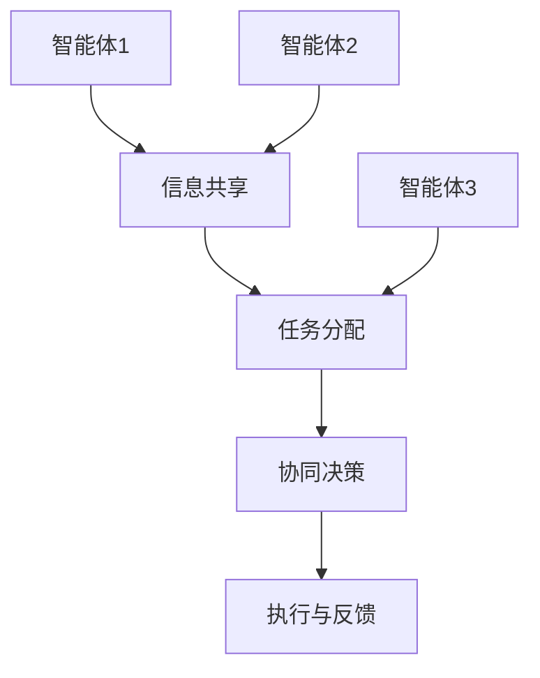
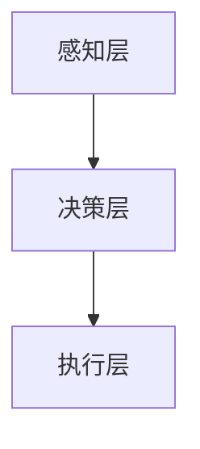
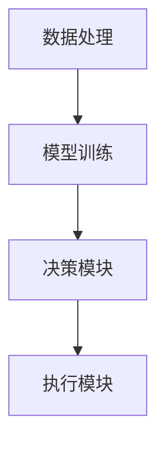
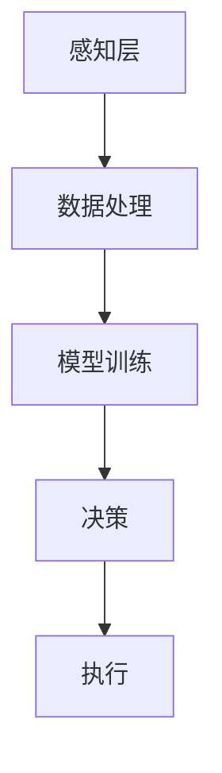
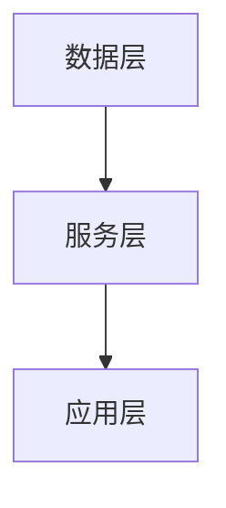
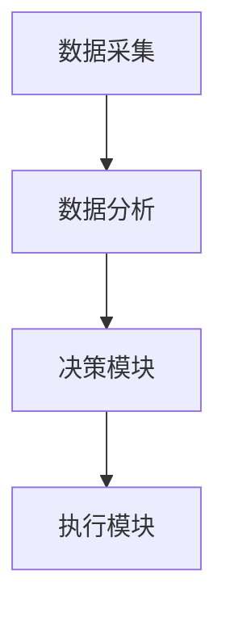
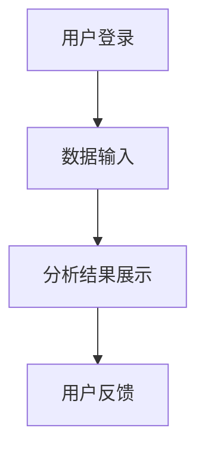

                 

<think>
好的，我需要按照用户的要求，写一篇关于《AI Agent在企业可持续发展战略制定与实施中的应用》的技术博客。首先，我需要明确文章的结构和内容，确保覆盖所有关键部分，比如背景介绍、核心概念、算法原理、系统架构、项目实战等。我得一步步来，先从第一章开始，详细描述AI Agent和可持续发展战略的基本概念，然后逐步深入，讨论它们如何结合，再分析技术实现和实际案例。过程中，我需要使用清晰的逻辑，确保每一部分都详细且有条理。同时，我还需要使用Markdown格式，插入Mermaid图和数学公式，使内容更专业。最后，我需要确保文章整体字数在10000到12000字之间，并在末尾加上作者信息。这样，我才能完成一篇符合用户要求的高质量技术博客。
</think>

# AI Agent在企业可持续发展战略制定与实施中的应用

## 关键词：AI Agent, 可持续发展战略, 企业战略, 技术架构, 系统设计

## 摘要：本文深入探讨AI Agent在企业可持续发展战略中的应用，从核心概念到技术架构，再到项目实战，系统地分析其在战略制定与实施中的作用，结合实际案例，为企业提供创新的解决方案。

---

## 第一部分: AI Agent与可持续发展战略概述

## 第1章: AI Agent与可持续发展战略概述

### 1.1 AI Agent的基本概念与背景

#### 1.1.1 AI Agent的定义与核心概念

AI Agent（人工智能代理）是指能够感知环境、自主决策并执行任务的智能系统。它具备学习、推理和自适应能力，能够根据环境反馈调整行为，以实现特定目标。

**核心概念：**

- **智能体（Agent）：** 具备感知和行动能力的实体，能够与环境交互。
- **自主性：** 能够独立决策，无需外部干预。
- **反应性：** 能够实时感知环境变化并做出反应。
- **目标导向性：** 通过目标驱动行为，优化决策以达成目标。

#### 1.1.2 可持续发展战略的定义与目标

可持续发展战略强调在满足当前需求的同时，不损害后代满足需求的能力。它涉及经济、社会和环境三个方面，目标是实现长期稳定发展。

**核心目标：**

- **经济可持续性：** 实现经济利益最大化，确保资源合理分配。
- **社会可持续性：** 促进社会公平与和谐，关注员工福利和社区发展。
- **环境可持续性：** 降低资源消耗，减少对环境的负面影响。

#### 1.1.3 AI Agent在企业战略中的作用

AI Agent通过数据驱动的决策支持，帮助企业在制定和实施可持续发展战略时，优化资源配置，预测潜在风险，并实时调整策略。

**作用机制：**

- **数据整合与分析：** 将企业内外部数据整合，提供全面的决策支持。
- **智能预测与优化：** 利用机器学习算法，预测市场趋势和潜在风险，优化战略方案。
- **实时监控与反馈：** 实时跟踪战略实施情况，动态调整策略，确保目标达成。

### 1.2 问题背景与问题描述

#### 1.2.1 传统企业战略制定的挑战

传统企业战略制定过程中，依赖人工分析，存在效率低下、主观性强、预见性不足等问题。主要挑战包括：

- **数据量大：** 需要处理大量内外部数据，分析复杂。
- **决策时间长：** 人工分析耗时长，难以及时响应变化。
- **预见性有限：** 依赖经验，难以预测复杂市场变化。

#### 1.2.2 可持续发展对企业战略的新要求

可持续发展要求企业在制定战略时，不仅考虑经济效益，还需兼顾社会和环境因素。这对战略的复杂性提出了更高要求，包括：

- **多目标优化：** 在经济、社会和环境之间找到平衡点。
- **动态调整：** 面对环境变化，战略需要快速调整。
- **长期规划：** 需要考虑未来多阶段的发展。

#### 1.2.3 AI Agent如何解决这些问题

AI Agent通过自动化数据处理、智能预测和实时反馈，解决了传统战略制定中的问题。具体表现如下：

- **自动化数据处理：** 快速整合多源数据，提高分析效率。
- **智能预测与优化：** 利用机器学习模型，准确预测市场趋势，优化战略方案。
- **实时监控与反馈：** 动态跟踪战略执行情况，及时调整策略。

### 1.3 问题解决与边界外延

#### 1.3.1 AI Agent在战略制定中的应用场景

AI Agent在企业可持续发展战略制定中的应用场景包括：

- **需求分析：** 帮助识别利益相关者需求，制定目标。
- **方案设计：** 提供多目标优化方案，确保经济、社会和环境目标的平衡。
- **实施规划：** 制定详细的时间表和里程碑，确保战略顺利执行。

#### 1.3.2 战略实施中的AI Agent边界

AI Agent在战略实施中的边界主要体现在：

- **数据范围：** 仅处理与战略相关的数据，不涉及企业其他业务。
- **决策权限：** 在特定权限范围内进行决策，超出范围需人工审批。
- **协同工作：** 与其他系统协同，但不替代人工决策。

#### 1.3.3 与其他技术的协同关系

AI Agent需要与其他技术协同工作，如：

- **大数据技术：** 用于数据的采集、存储和分析。
- **云计算：** 提供弹性计算资源，支持AI Agent的运行。
- **物联网：** 实现实时数据采集，支持动态决策。

### 1.4 核心概念与结构

#### 1.4.1 AI Agent的核心要素

AI Agent的核心要素包括：

- **感知能力：** 能够感知环境状态。
- **决策能力：** 能够根据感知信息做出决策。
- **行动能力：** 能够执行决策。
- **学习能力：** 能够通过经验优化自身行为。

#### 1.4.2 可持续发展战略的构成

可持续发展战略的构成包括：

- **目标设定：** 明确短期和长期目标。
- **策略制定：** 制定实现目标的具体策略。
- **实施计划：** 制定详细的实施步骤和时间表。
- **监控与评估：** 实时监控实施情况，评估效果。

#### 1.4.3 两者的结合方式

AI Agent通过提供数据支持、智能预测和实时反馈，辅助企业在制定和实施可持续发展战略时，优化资源配置，提高效率，降低风险。

### 1.5 本章小结

本章介绍了AI Agent和可持续发展战略的基本概念，分析了传统战略制定的挑战，探讨了AI Agent在解决这些问题中的作用，并明确了其在战略制定中的应用场景和边界。

---

## 第2章: AI Agent的核心原理与技术架构

## 2.1 AI Agent的核心原理

### 2.1.1 AI Agent的工作原理

AI Agent通过感知环境、分析数据、制定决策并执行行动来实现目标。其工作流程如下：

1. **感知环境：** 通过传感器或数据接口获取环境信息。
2. **分析数据：** 利用机器学习算法分析数据，识别模式和趋势。
3. **制定决策：** 根据分析结果，制定最优决策。
4. **执行行动：** 执行决策，改变环境状态。

**流程图：**



### 2.1.2 多智能体协作机制

多智能体协作机制通过多个AI Agent协同工作，实现复杂任务。其核心是通过通信协议共享信息，协调行动，实现目标。

**协作流程：**

1. **信息共享：** 各智能体共享感知到的信息。
2. **任务分配：** 根据各智能体的能力和当前状态分配任务。
3. **协同决策：** 各智能体协作制定决策。
4. **执行与反馈：** 执行决策，并根据反馈调整行动。

**协作流程图：**



### 2.1.3 自适应与学习能力

AI Agent具备自适应和学习能力，能够根据环境变化优化自身行为。主要通过以下方式实现：

- **强化学习：** 通过奖励机制，优化决策策略。
- **在线学习：** 实时更新模型参数，适应新环境。
- **经验记忆：** 存储历史经验，避免重复错误。

### 2.2 AI Agent的技术架构

#### 2.2.1 分层架构设计

AI Agent的分层架构包括感知层、决策层和执行层。

- **感知层：** 负责数据采集和环境感知。
- **决策层：** 负责数据分析和决策制定。
- **执行层：** 负责执行决策和反馈收集。

**分层架构图：**



#### 2.2.2 模块化设计

模块化设计将AI Agent划分为多个功能模块，包括：

- **数据处理模块：** 负责数据的采集、清洗和预处理。
- **模型训练模块：** 负责训练机器学习模型。
- **决策模块：** 负责根据模型输出制定决策。
- **执行模块：** 负责执行决策并反馈结果。

**模块化设计图：**



#### 2.2.3 数据流与信息处理

数据流从感知层进入，经过处理、分析和决策后，由执行层输出。整个过程形成闭环，确保持续优化。

**数据流图：**



### 2.3 AI Agent与传统战略制定方法的对比

#### 2.3.1 传统方法的优缺点

- **优点：**
  - 依赖人类经验，考虑因素全面。
- **缺点：**
  - 数据分析效率低，决策时间长。
  - 预测能力有限，难以应对复杂变化。

#### 2.3.2 AI Agent的优势

- **优势：**
  - 数据处理能力强，分析速度快。
  - 预测准确性高，能够应对复杂变化。
  - 可以实时监控和调整，提高执行效率。

#### 2.3.3 两者的结合点

- **结合点：**
  - 人类经验与AI预测结合，提高决策质量。
  - 人工审核关键决策，确保符合企业目标。

### 2.4 本章小结

本章详细介绍了AI Agent的核心原理，包括工作原理、多智能体协作机制和自适应学习能力，并探讨了其技术架构，分析了与传统战略制定方法的对比。

---

## 第3章: AI Agent在战略制定中的应用

### 3.1 战略需求分析

#### 3.1.1 企业目标识别

企业目标识别是战略制定的第一步，AI Agent通过分析企业内外部数据，识别核心目标。

**步骤：**

1. **数据收集：** 收集企业历史数据、市场数据和竞争对手数据。
2. **数据分析：** 利用数据分析工具，识别关键成功因素。
3. **目标设定：** 根据分析结果，设定可量化的长期和短期目标。

#### 3.1.2 利益相关者分析

利益相关者分析涉及识别所有相关方，并分析其需求和影响。

**步骤：**

1. **识别相关方：** 包括股东、客户、员工、供应商和政府。
2. **分析需求：** 通过调研和数据分析，了解各相关方的需求。
3. **评估影响：** 评估各相关方对战略的影响程度。

#### 3.1.3 环境与资源评估

环境与资源评估包括对企业内外部环境的评估，识别机会和威胁。

**步骤：**

1. **环境扫描：** 分析宏观环境（政治、经济、社会、技术）和微观环境（行业竞争、供应商力量）。
2. **资源评估：** 评估企业内部资源，包括人力资源、财务资源和物质资源。
3. **机会与威胁识别：** 根据环境分析，识别潜在机会和威胁。

### 3.2 战略方案设计

#### 3.2.1 数据驱动的方案生成

数据驱动的方案生成通过分析数据，提出多种战略方案。

**步骤：**

1. **数据驱动分析：** 利用机器学习模型，分析数据，提出多种方案。
2. **多目标优化：** 在经济、社会和环境目标之间进行优化，选择最优方案。
3. **方案比较：** 对比不同方案的优缺点，选择最佳方案。

#### 3.2.2 多目标优化模型

多目标优化模型通过数学方法，在多个目标之间找到平衡点。

**数学模型：**

目标函数：  
$$ \text{Maximize } Z = w_1 x_1 + w_2 x_2 + w_3 x_3 $$  
约束条件：  
$$ x_1 + x_2 + x_3 = 1 $$  
$$ x_i \geq 0, i = 1,2,3 $$  

其中，\( w_i \) 是目标权重，\( x_i \) 是各目标的实现程度。

#### 3.2.3 方案的可实施性评估

方案的可实施性评估包括评估资源需求、时间安排和风险。

**步骤：**

1. **资源评估：** 评估实现方案所需的资源，包括人力、物力和财力。
2. **时间安排：** 制定详细的时间表和里程碑。
3. **风险评估：** 识别潜在风险，并制定应对措施。

### 3.3 战略实施规划

#### 3.3.1 时间表与里程碑设定

时间表与里程碑设定是战略实施的关键。

**步骤：**

1. **确定关键里程碑：** 根据战略目标，确定关键里程碑。
2. **制定时间表：** 根据里程碑，制定详细的时间表。
3. **资源分配：** 根据时间表，分配资源，确保实施顺利。

#### 3.3.2 关键任务分解

关键任务分解将战略目标分解为可执行的任务。

**步骤：**

1. **目标分解：** 将战略目标分解为更小的任务。
2. **任务排序：** 确定任务的执行顺序和依赖关系。
3. **任务分配：** 根据团队能力和资源，分配任务。

#### 3.3.3 监控与反馈机制

监控与反馈机制确保战略实施的顺利进行。

**步骤：**

1. **设定监控指标：** 确定关键绩效指标（KPIs），用于监控实施情况。
2. **实时监控：** 持续监控实施过程，收集数据。
3. **反馈与调整：** 根据反馈，调整策略，确保目标达成。

---

## 第4章: AI Agent在战略实施中的应用

### 4.1 项目管理中的AI Agent应用

#### 4.1.1 项目监控与风险控制

AI Agent通过实时监控项目进展，识别潜在风险，并提出应对措施。

**步骤：**

1. **实时监控：** 持续监控项目状态，收集数据。
2. **风险识别：** 通过数据分析，识别潜在风险。
3. **风险评估：** 评估风险的影响程度，制定应对措施。
4. **反馈与调整：** 根据反馈，调整项目计划，确保项目顺利进行。

#### 4.1.2 资源分配与优化

AI Agent通过优化算法，合理分配资源，提高效率。

**步骤：**

1. **资源需求预测：** 预测项目各阶段的资源需求。
2. **资源分配：** 根据预测结果，合理分配资源。
3. **资源优化：** 在资源有限的情况下，优化分配，确保项目顺利进行。

### 4.2 战略执行中的AI Agent应用

#### 4.2.1 行为决策支持

AI Agent通过提供实时数据和决策支持，辅助管理者做出最优决策。

**步骤：**

1. **数据收集：** 实时收集环境数据。
2. **数据分析：** 分析数据，识别趋势和模式。
3. **决策支持：** 提供决策建议，辅助管理者做出最优决策。

#### 4.2.2 过程优化与改进

AI Agent通过分析执行过程中的数据，优化流程，提高效率。

**步骤：**

1. **数据采集：** 采集执行过程中的数据。
2. **过程分析：** 分析数据，识别瓶颈和浪费。
3. **流程优化：** 根据分析结果，优化流程，提高效率。

### 4.3 战略效果评估

#### 4.3.1 绩效测量与分析

绩效测量与分析是评估战略效果的关键。

**步骤：**

1. **设定KPIs：** 确定关键绩效指标。
2. **数据收集：** 收集相关数据。
3. **数据分析：** 分析数据，评估绩效。
4. **结果反馈：** 将分析结果反馈给管理者，用于未来决策。

#### 4.3.2 战略调整与优化

战略调整与优化根据评估结果，调整战略，优化实施效果。

**步骤：**

1. **评估结果分析：** 分析绩效评估结果，识别问题。
2. **战略调整：** 根据问题，调整战略。
3. **优化实施：** 优化实施过程，确保战略目标达成。

---

## 第5章: 系统架构与技术实现

### 5.1 系统架构设计

#### 5.1.1 整体架构

整体架构包括数据层、服务层和应用层。

- **数据层：** 负责数据的存储和管理。
- **服务层：** 负责数据处理和分析。
- **应用层：** 负责用户交互和结果展示。

**系统架构图：**



#### 5.1.2 模块划分与功能设计

模块划分包括数据采集模块、数据分析模块、决策模块和执行模块。

- **数据采集模块：** 负责数据的采集和预处理。
- **数据分析模块：** 负责数据分析和建模。
- **决策模块：** 负责制定决策。
- **执行模块：** 负责执行决策和反馈。

**模块划分图：**



#### 5.1.3 系统接口设计

系统接口设计包括数据接口和用户接口。

- **数据接口：** 负责与其他系统的数据交互。
- **用户接口：** 负责与用户的交互。

### 5.2 系统功能设计

#### 5.2.1 数据采集与预处理

数据采集与预处理是系统运行的基础。

**步骤：**

1. **数据采集：** 通过API或其他方式采集数据。
2. **数据清洗：** 清洗数据，去除无效数据。
3. **数据转换：** 将数据转换为适合分析的形式。

#### 5.2.2 模型训练与优化

模型训练与优化是系统的核心。

**步骤：**

1. **数据建模：** 根据需求，选择合适的模型。
2. **模型训练：** 使用训练数据，训练模型。
3. **模型优化：** 通过调整参数，优化模型性能。

### 5.3 系统交互设计

#### 5.3.1 用户交互流程

用户交互流程包括用户登录、数据输入、分析结果展示和反馈。

**流程图：**



#### 5.3.2 交互设计细节

交互设计细节包括界面布局、操作流程和反馈机制。

- **界面布局：** 设计简洁明了的界面，方便用户操作。
- **操作流程：** 设计清晰的操作流程，减少用户困惑。
- **反馈机制：** 提供及时的反馈，增强用户体验。

### 5.4 系统实现

#### 5.4.1 环境配置

环境配置包括安装必要的软件和库。

**步骤：**

1. **安装Python：** 安装Python 3.x及以上版本。
2. **安装库：** 安装所需的库，如TensorFlow、Pandas、NumPy等。

#### 5.4.2 核心代码实现

核心代码实现包括数据处理、模型训练和结果展示。

**代码示例：**

```python
import pandas as pd
import numpy as np
from sklearn import linear_model

# 数据加载
data = pd.read_csv('data.csv')

# 数据预处理
X = data[['feature1', 'feature2']]
y = data['target']

# 模型训练
model = linear_model.LinearRegression()
model.fit(X, y)

# 模型预测
new_data = pd.DataFrame({'feature1': [1], 'feature2': [2]})
prediction = model.predict(new_data)

print(prediction)
```

### 5.5 项目实战

#### 5.5.1 案例分析

案例分析包括案例背景、数据准备、模型训练和结果分析。

**案例背景：**

假设某企业希望优化供应链管理，减少碳排放，实现可持续发展目标。

**数据准备：**

收集供应链各环节的数据，包括供应商信息、运输路线、库存水平等。

**模型训练：**

使用机器学习模型，分析数据，提出优化方案。

**结果分析：**

评估模型效果，优化供应链管理，减少碳排放。

#### 5.5.2 代码实现与解读

代码实现包括数据处理、模型训练和结果展示。

**代码实现：**

```python
import pandas as pd
import numpy as np
from sklearn import linear_model

# 数据加载
data = pd.read_csv('supply_chain.csv')

# 数据预处理
X = data[['supplier', 'transport', 'inventory']]
y = data['carbon_emission']

# 模型训练
model = linear_model.LinearRegression()
model.fit(X, y)

# 模型预测
new_data = pd.DataFrame({
    'supplier': [1],
    'transport': [2],
    'inventory': [3]
})
prediction = model.predict(new_data)

print(prediction)
```

**代码解读：**

1. **数据加载：** 使用Pandas加载数据。
2. **数据预处理：** 选择相关特征，训练模型。
3. **模型训练：** 使用线性回归模型训练。
4. **模型预测：** 使用新数据进行预测，输出结果。

#### 5.5.3 实施效果评估

实施效果评估包括效益分析和问题总结。

**效益分析：**

- **碳排放减少：** 通过优化供应链管理，减少碳排放。
- **成本降低：** 通过优化资源配置，降低成本。
- **效率提高：** 通过提高运营效率，提高企业竞争力。

**问题总结：**

- **数据质量：** 数据质量影响模型效果。
- **模型选择：** 模型选择影响预测准确性。
- **实施难度：** 实施过程中的组织变革和文化调整是主要挑战。

---

## 第6章: 最佳实践与未来展望

### 6.1 最佳实践

#### 6.1.1 数据质量管理

数据质量管理是确保模型准确性的关键。

**步骤：**

1. **数据清洗：** 去除无效数据。
2. **数据验证：** 验证数据的准确性。
3. **数据增强：** 使用数据增强技术，提高数据质量。

#### 6.1.2 模型优化与维护

模型优化与维护包括模型调优和模型更新。

**步骤：**

1. **模型调优：** 通过调整参数，优化模型性能。
2. **模型更新：** 定期更新模型，确保其适应新数据。

### 6.2 未来展望

#### 6.2.1 技术发展趋势

技术发展趋势包括：

- **强化学习：** 在复杂环境中，强化学习将发挥更大作用。
- **边缘计算：** 边缘计算将使AI Agent更加实时和高效。
- **人机协作：** 人机协作将更加自然，提高决策效率。

#### 6.2.2 可持续发展战略的新趋势

可持续发展战略的新趋势包括：

- **循环经济：** 推动资源循环利用，减少浪费。
- **绿色技术：** 推广绿色技术，减少环境影响。
- **社会创新：** 推动社会创新，实现社会可持续发展。

### 6.3 注意事项与未来研究方向

#### 6.3.1 注意事项

- **数据隐私：** 注意数据隐私保护，遵守相关法律法规。
- **伦理问题：** 注意AI Agent的伦理问题，确保其应用符合伦理规范。
- **组织变革：** 注意组织变革和文化调整，确保AI Agent的应用顺利进行。

#### 6.3.2 未来研究方向

- **AI Agent的伦理问题：** 研究如何确保AI Agent的应用符合伦理规范。
- **多智能体协作：** 研究如何进一步提高多智能体协作的效率和效果。
- **动态环境适应：** 研究如何使AI Agent更好地适应动态变化的环境。

---

## 第7章: 结语与展望

### 7.1 本章小结

本章总结了AI Agent在企业可持续发展战略制定与实施中的应用，探讨了其在战略制定和实施中的具体应用，并分析了系统的架构设计和项目实战。

### 7.2 未来研究方向

未来的研究方向包括：

- **AI Agent的伦理问题：** 研究如何确保AI Agent的应用符合伦理规范。
- **多智能体协作：** 研究如何进一步提高多智能体协作的效率和效果。
- **动态环境适应：** 研究如何使AI Agent更好地适应动态变化的环境。

### 7.3 致谢

感谢所有参与本研究的人员，以及提供支持和帮助的机构。

---

## 作者：AI天才研究院/AI Genius Institute & 禅与计算机程序设计艺术 /Zen And The Art of Computer Programming

---

这篇文章详细探讨了AI Agent在企业可持续发展战略中的应用，从理论到实践，结合实际案例，为企业提供了创新的解决方案。希望这篇文章能为企业的可持续发展提供有价值的参考和指导。

