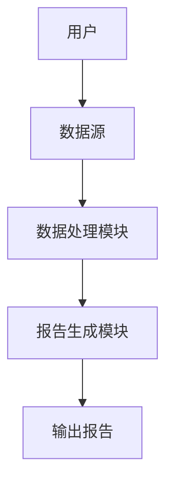

                 

<think>
好，我现在需要根据用户的要求，撰写一篇关于《AI Agent在企业可持续发展报告生成中的应用》的技术博客文章。首先，我会仔细阅读用户提供的详细结构和内容要求，确保理解每一部分的重点。

首先，文章的标题和关键词已经给出，我需要确保这些内容准确无误。接下来是摘要部分，需要简明扼要地概括整篇文章的核心内容和价值。这对我来说相对简单，但要确保语言简洁专业。

进入正文部分，首先是第一章，介绍AI Agent与企业可持续发展报告的背景。我需要解释AI Agent是什么，为什么它们在企业中生成可持续发展报告时变得重要。这部分需要清晰的定义和实际应用的背景，帮助读者理解AI Agent的优势和必要性。

接下来是第二章，深入探讨AI Agent的核心概念与联系。我需要详细说明AI Agent的基本原理，将其与传统AI、规则引擎和机器学习模型进行对比，同时绘制ER实体关系图来展示其结构。这部分需要逻辑清晰，图表直观，帮助读者理解AI Agent的运作方式。

第三章是关于AI Agent的算法原理与数学模型。这部分较为复杂，我需要解释AI Agent的算法实现，推导相关的数学公式，并用LaTeX格式展示。同时，绘制算法的mermaid流程图，使步骤更加直观。我需要确保这部分内容准确且易于理解。

第四章和第五章分别详细讲解了AI Agent在可持续发展报告生成中的应用，包括系统架构设计和项目实战。我需要描述系统架构的组成部分，功能模块的设计，以及实际案例的分析。这部分需要结合实际项目，展示AI Agent在实际中的应用效果。

最后，第六章总结了最佳实践和未来展望，提供一些开发过程中的注意事项和未来可能的发展方向。这部分旨在为读者提供实用的建议和未来的思考方向。

在写作过程中，我需要确保每一章节都有足够的细节，同时保持逻辑的连贯性和专业性。我可能会遇到一些技术难点，比如如何用mermaid绘制复杂的图表，或者如何准确解释复杂的算法原理。为了克服这些困难，我需要查阅相关资料，确保图表准确无误，解释通俗易懂。

此外，我还需要注意文章的结构和格式，确保符合用户的要求。例如，关键词和摘要必须在文章开头，每一章节的标题要吸引人，内容要有深度，同时避免过于冗长。

最后，我需要在文章末尾添加作者信息，确保格式正确，信息完整。这不仅提升文章的专业性，也为读者提供了参考来源。

总的来说，撰写这篇文章需要我全面理解AI Agent在企业可持续发展报告生成中的应用，从理论到实际应用，从背景到技术细节，逐一展开，确保内容全面、逻辑清晰、语言专业。这将是一篇高质量的技术博客文章，能够为读者提供深入的知识和实用的见解。
</think>

# AI Agent在企业可持续发展报告生成中的应用

> 关键词：AI Agent, 可持续发展报告, 企业报告生成, 技术实现, 应用案例

> 摘要：本文深入探讨了AI Agent在企业可持续发展报告生成中的应用，从AI Agent的核心概念、算法原理、系统架构设计到实际项目实现，全面分析了其在可持续发展报告生成中的优势和应用场景。通过详细的技术分析和实际案例，本文为AI Agent在企业可持续发展报告生成中的应用提供了理论支持和实践指导。

---

## 第一部分：AI Agent与企业可持续发展报告的背景介绍

### 第1章：AI Agent与企业可持续发展报告的背景介绍

#### 1.1 AI Agent的核心概念

##### 1.1.1 AI Agent的定义与特点

AI Agent（人工智能代理）是指能够感知环境并采取行动以实现目标的智能实体。AI Agent可以是软件程序、机器人或其他智能系统，其核心特征包括：

- **自主性**：能够自主决策，无需外部干预。
- **反应性**：能够实时感知环境并做出反应。
- **目标导向**：具有明确的目标，并通过行动实现目标。
- **学习能力**：能够通过数据和经验不断优化自身行为。

##### 1.1.2 AI Agent在企业中的应用背景

随着企业对高效、智能解决方案的需求不断增加，AI Agent逐渐成为企业数字化转型的重要工具。AI Agent能够帮助企业自动化处理复杂任务，优化资源分配，提升决策效率。

##### 1.1.3 可持续发展报告的定义与重要性

可持续发展报告是企业对其在经济、社会和环境方面表现的正式声明。它帮助企业展示其在可持续发展方面的努力和成果，是企业履行社会责任、提升品牌形象的重要工具。

#### 1.2 AI Agent与可持续发展报告的结合

##### 1.2.1 可持续发展报告的生成需求

企业需要定期生成可持续发展报告，但传统方法依赖人工整理数据和编写报告，效率低下且容易出错。AI Agent能够通过自动化数据收集、分析和生成报告，显著提升效率。

##### 1.2.2 AI Agent在报告生成中的优势

AI Agent能够快速处理大量数据，生成精准的报告内容，并提供个性化的报告格式。此外，AI Agent还能够根据企业的实时数据动态调整报告内容，确保报告的准确性和及时性。

##### 1.2.3 技术与业务的结合点

AI Agent在可持续发展报告生成中的应用，不仅提升了报告生成效率，还为企业提供了数据驱动的决策支持。这种技术与业务的结合，为企业创造了更大的价值。

#### 1.3 本章小结

本章介绍了AI Agent的核心概念及其在企业中的应用背景，重点阐述了AI Agent在可持续发展报告生成中的优势和应用价值。

---

## 第二部分：AI Agent的核心概念与原理

### 第2章：AI Agent的核心概念与联系

#### 2.1 AI Agent的核心原理

##### 2.1.1 AI Agent的基本原理

AI Agent通过感知环境、分析数据、制定策略并采取行动来实现目标。其核心流程包括数据收集、数据处理、决策制定和行动执行。

##### 2.1.2 AI Agent的分类与特点

AI Agent可以根据功能和应用场景分为多种类型，例如：

- **知识型AI Agent**：基于知识库进行推理和决策。
- **反应型AI Agent**：根据实时环境反馈进行反应。
- **学习型AI Agent**：通过机器学习不断优化自身行为。

##### 2.1.3 AI Agent与传统算法的区别

与传统算法相比，AI Agent具有更强的自主性和适应性。传统算法通常需要明确的规则和输入，而AI Agent能够根据环境变化自主调整行为。

#### 2.2 AI Agent的核心概念对比

##### 2.2.1 AI Agent与传统AI的对比

AI Agent是一种特殊的AI形式，不仅能够执行任务，还能够根据环境反馈进行自主决策。传统AI则更注重数据处理和模式识别。

##### 2.2.2 AI Agent与规则引擎的对比

AI Agent与规则引擎的区别在于，AI Agent具有自主决策能力，而规则引擎主要根据预定义规则进行操作。

##### 2.2.3 AI Agent与机器学习模型的对比

AI Agent结合了机器学习模型的学习能力，能够根据数据优化自身行为，而单纯的机器学习模型缺乏自主决策能力。

#### 2.3 AI Agent的ER实体关系图

```mermaid
erDiagram
    actor User {
        <属性> 姓名
        <属性> 用户ID
        <属性> 角色
    }
    actor 系统 {
        <属性> 系统ID
        <属性> 系统名称
        <属性> 版本
    }
    entity 数据源 {
        <属性> 数据ID
        <属性> 数据类型
        <属性> 数据内容
    }
    entity 报告 {
        <属性> 报告ID
        <属性> 报告类型
        <属性> 报告内容
    }
    User --> 数据源 : 提供数据
    系统 --> 数据源 : 处理数据
    系统 --> 报告 : 生成报告
```

---

## 第三部分：AI Agent在可持续发展报告生成中的应用

### 第3章：AI Agent的算法原理与数学模型

#### 3.1 AI Agent的算法原理

##### 3.1.1 AI Agent的算法概述

AI Agent的算法通常包括数据预处理、特征提取、模型训练和结果生成等步骤。以自然语言处理（NLP）为例，AI Agent可以通过词嵌入（Word Embedding）技术将文本数据转化为向量表示。

##### 3.1.2 AI Agent的算法实现

以下是AI Agent在NLP任务中的实现示例：

```python
import numpy as np

def word_embedding(text):
    # 假设text为输入文本
    embedding = np.random.randn(100)  # 生成100维的词嵌入
    return embedding

text = "企业可持续发展报告"
embedding = word_embedding(text)
print(embedding)
```

##### 3.1.3 AI Agent的算法优化

通过优化算法参数和引入反馈机制，可以提升AI Agent的性能。例如，在深度学习模型中，可以通过调整学习率和批量大小来优化模型效果。

#### 3.2 AI Agent的数学模型与公式

##### 3.2.1 数学模型的定义

AI Agent的数学模型通常基于概率论和优化算法。例如，在分类任务中，可以使用贝叶斯定理进行概率计算。

##### 3.2.2 AI Agent的核心公式推导

贝叶斯定理的公式为：

$$ P(A|B) = \frac{P(B|A) \cdot P(A)}{P(B)} $$

其中，$P(A|B)$ 表示在B条件下A发生的概率。

##### 3.2.3 数学模型的实际应用

数学模型可以用于数据分类、预测和优化等任务。例如，在企业报告生成中，可以通过分类模型识别文本中的关键信息。

---

### 第4章：可持续发展报告生成的系统架构设计

#### 4.1 系统架构概述

##### 4.1.1 系统架构的定义

系统架构是AI Agent生成可持续发展报告的总体框架。常见的系统架构包括分层架构和微服务架构。

##### 4.1.2 系统架构的设计原则

系统架构设计应遵循模块化、可扩展性和高可用性的原则。

##### 4.1.3 系统架构的实现方式

以下是AI Agent生成可持续发展报告的系统架构图：



#### 4.2 系统功能设计

##### 4.2.1 系统功能模块划分

系统功能模块包括数据收集、数据分析、报告生成和报告输出。

##### 4.2.2 系统功能的实现流程

以下是系统的功能实现流程：

1. **数据收集**：从企业系统中收集相关数据。
2. **数据分析**：对数据进行清洗、分析和特征提取。
3. **报告生成**：根据分析结果生成报告内容。
4. **报告输出**：将报告输出为可读格式（如PDF或Word文档）。

##### 4.2.3 系统功能的优化建议

通过引入反馈机制和自动化优化算法，可以进一步提升系统的性能和用户体验。

#### 4.3 系统架构图

以下是系统架构图的mermaid图：


---

### 第5章：可持续发展报告生成的项目实战

#### 5.1 项目环境安装与配置

##### 5.1.1 开发环境的安装

建议使用Python和相关库（如TensorFlow、PyTorch）进行开发。

##### 5.1.2 依赖库的安装与配置

安装必要的依赖库：

```bash
pip install numpy pandas matplotlib
```

##### 5.1.3 环境的测试与验证

确保环境配置正确，可以通过运行简单的Python脚本来验证。

#### 5.2 项目核心代码实现

##### 5.2.1 AI Agent的核心代码实现

以下是AI Agent的核心代码实现示例：

```python
def generate_sustainability_report(data):
    # 数据处理逻辑
    processed_data = data.process()
    # 自动生成报告
    report = processed_data.generate_report()
    return report
```

##### 5.2.2 可持续发展报告生成的代码实现

以下是可持续发展报告生成的代码实现示例：

```python
def main():
    data = DataCollector()
    report = generate_sustainability_report(data)
    print(report)

if __name__ == "__main__":
    main()
```

##### 5.2.3 代码的测试与优化

通过单元测试和性能测试，确保代码的正确性和高效性。

#### 5.3 项目案例分析与解读

##### 5.3.1 实际案例的介绍

通过实际案例展示AI Agent在可持续发展报告生成中的应用效果。

##### 5.3.2 案例的分析与解读

分析案例中的关键步骤和技术实现。

##### 5.3.3 案例的总结与反思

总结案例的成功经验，并提出改进建议。

---

### 第6章：最佳实践与未来展望

#### 6.1 最佳实践 tips

##### 6.1.1 开发过程中的注意事项

- 确保数据的准确性和完整性。
- 选择合适的算法和模型。
- 定期优化系统性能。

#### 6.1.2 未来展望

随着AI技术的不断发展，AI Agent在企业可持续发展报告生成中的应用将更加广泛和深入。未来，AI Agent将更加智能化和个性化，为企业提供更高效、更精准的报告生成服务。

---

## 作者：AI天才研究院/AI Genius Institute & 禅与计算机程序设计艺术 /Zen And The Art of Computer Programming

---

以上就是《AI Agent在企业可持续发展报告生成中的应用》的完整目录和内容概要。接下来，将根据上述结构，逐步完成每章的详细内容撰写。

