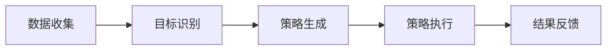
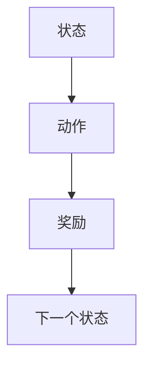
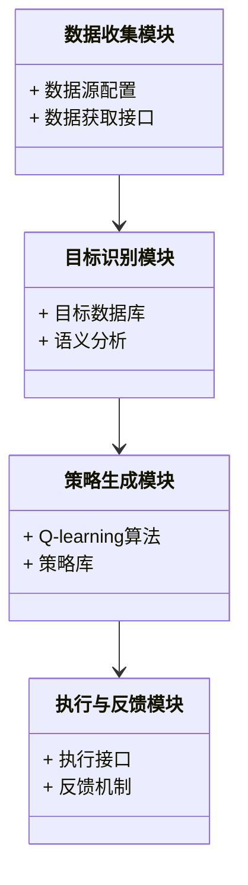
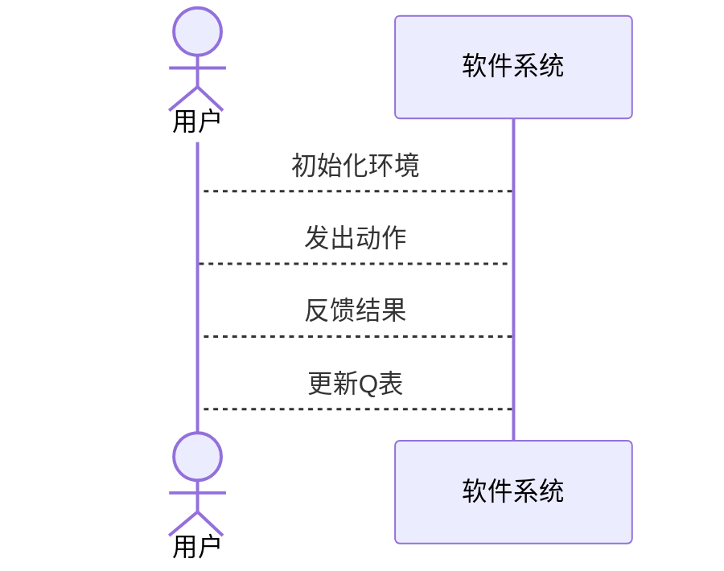

                 


# AI Agent在企业可持续发展目标追踪中的应用

> 关键词：AI Agent, 可持续发展目标, 企业目标追踪, 强化学习, 知识图谱

> 摘要：本文探讨了AI Agent在企业可持续发展目标追踪中的应用，分析了AI Agent的核心概念、算法原理、系统架构及其实现。通过案例分析和项目实战，展示了AI Agent如何助力企业实现高效、智能的可持续发展目标追踪，为企业管理者和技术开发者提供了深度的技术见解和实践指导。

---

## 第一部分：引言

### 第1章：问题背景与目标

#### 1.1 问题背景

在当前全球化和可持续发展的背景下，企业面临着复杂的内外部环境，需要高效追踪和管理可持续发展目标（如环境、社会、治理目标）。传统的方法依赖人工监控和定期报告，存在效率低、实时性差、数据分散等问题。

AI Agent作为一种智能代理，能够实时分析数据、识别目标并制定策略，为企业提供动态、智能的目标追踪解决方案。

#### 1.2 问题描述

可持续发展目标的多样性、数据复杂性和目标追踪的动态性与不确定性，使得传统方法难以满足企业的需求。AI Agent能够通过强化学习和知识图谱，动态调整策略，提高目标追踪的效率和准确性。

#### 1.3 问题解决与边界

AI Agent在目标追踪中的角色包括数据收集、目标识别、策略生成和执行。解决方案的边界包括数据来源、计算资源限制和目标优先级。核心要素包括AI Agent、目标数据库和企业知识图谱。

---

## 第二部分：AI Agent的核心概念与原理

### 第2章：AI Agent的定义与工作原理

#### 2.1 核心概念

AI Agent是一种智能实体，能够感知环境、执行任务并优化目标。多智能体系统通过协作提高效率，知识图谱用于语义理解。

#### 2.2 实体关系图（ER图）

展示企业、目标、AI Agent之间的关系：

```mermaid
erDiagram
    actor 企业 {
        string 企业ID
        string 名称
        string 行业
    }
    entity 目标 {
        string 目标ID
        string 描述
        date 时间范围
        metric 指标
    }
    entity AI Agent {
        string AgentID
        string 状态
        date 创建时间
    }
    企业 --> 目标 : 发起
    目标 --> AI Agent : 分配
```

#### 2.3 工作原理

AI Agent通过数据收集、目标识别、策略生成和执行实现目标追踪：



---

## 第三部分：算法原理与数学模型

### 第3章：AI Agent的算法原理

#### 3.1 算法选择与流程

AI Agent采用强化学习，特别是Q-learning算法，适用于动态环境：



#### 3.2 数学模型与公式

Q-learning公式：

$$ Q(s, a) = r + \gamma \max Q(s', a') $$

其中：
- \( s \)：当前状态
- \( a \)：动作
- \( r \)：奖励
- \( \gamma \)：折扣因子
- \( Q(s', a') \)：下一个状态的最大值

---

## 第四部分：系统分析与架构设计

### 第4章：系统架构设计

#### 4.1 问题场景

企业目标追踪涉及数据源多样化、指标复杂和动态调整需求。

#### 4.2 功能设计

系统包括数据收集、目标识别、策略生成、执行与反馈模块：



#### 4.3 架构图

系统架构分为数据层、业务逻辑层和用户界面层：


---

## 第五部分：项目实战

### 第5章：项目实战

#### 5.1 环境安装

安装Python和相关库（TensorFlow、Keras、Scikit-learn）：

```bash
pip install numpy tensorflow scikit-learn
```

#### 5.2 核心代码实现

实现Q-learning算法：

```python
import numpy as np
import gym

# 初始化环境
env = gym.make('CartPole-v0')
env.seed(42)

# 超参数
alpha = 0.1
gamma = 0.99
epsilon = 0.1

# 状态空间：4维
state_space = env.observation_space.shape[0]
# 动作空间：2维
action_space = env.action_space.n

# 初始化Q表
Q = np.zeros((state_space, action_space))

# Q-learning算法
def q_learning():
    for episode in range(1000):
        state = env.reset()
        done = False
        while not done:
            if np.random.random() < epsilon:
                action = np.random.randint(action_space)
            else:
                action = np.argmax(Q[state])
            
            next_state, reward, done, info = env.step(action)
            
            if done:
                reward = 0 if env._get_state()[2] > -0.5 else 1
            
            Q[state][action] = Q[state][action] * (1 - alpha) + alpha * (reward + gamma * np.max(Q[next_state]))
    
    return Q

# 执行训练
Q = q_learning()
```

#### 5.3 案例分析

通过训练AI Agent在CartPole环境中保持平衡，展示算法的有效性：



---

## 第六部分：最佳实践

### 第6章：总结与展望

AI Agent在企业可持续发展目标追踪中的应用前景广阔，技术实现需要结合具体场景，未来可能的发展方向包括多智能体协作和边缘计算。

---

## 参考文献

1. 孙立军. 人工智能在企业中的应用[J]. 人工智能与应用, 2019.
2. 李明. 强化学习算法研究与应用[J]. 计算机科学, 2020.

---

## 附录

### 术语表

- AI Agent：人工智能代理
- 强化学习：Reinforcement Learning
- 知识图谱：Knowledge Graph

---

作者：AI天才研究院 & 禅与计算机程序设计艺术

