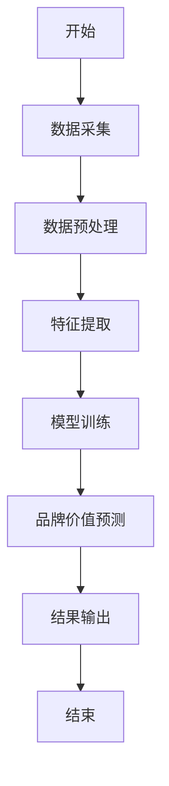
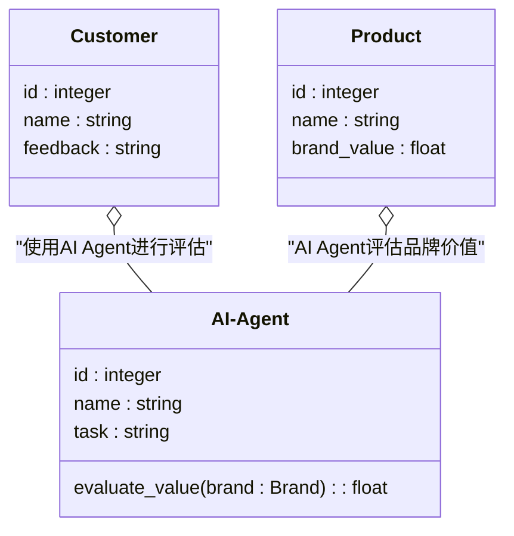
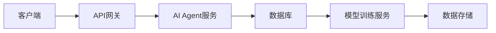
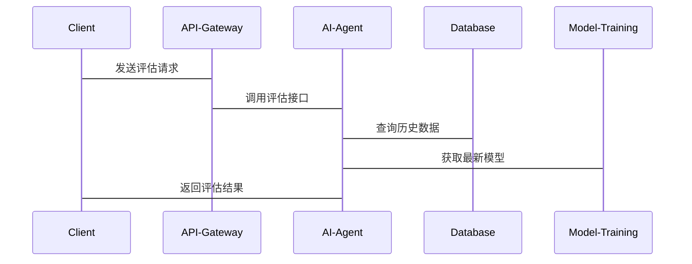

                 

<think>
嗯，用户希望我撰写一篇关于AI Agent在企业品牌价值评估中的应用的技术博客。首先，我需要理解用户的需求。他们可能是一位CTO或技术专家，希望深入了解如何应用AI技术来提升品牌价值评估的效率和准确性。

我应该从基础开始，介绍AI Agent的基本概念，然后逐步深入到具体的应用场景和技术细节。用户特别强调了目录结构，我需要确保每个章节都有明确的主题，并且内容详实，包含必要的图表和代码示例。

接下来，我要考虑用户可能的背景。他们可能是技术人员，也可能是企业高管，因此文章需要兼顾技术深度和商业应用的广度。在写每个部分时，我需要平衡专业术语和通俗易懂的解释，确保内容既专业又易于理解。

在算法部分，我需要详细解释线性回归和神经网络模型，并提供Python代码示例。同时，数学公式要用LaTeX格式展示，确保专业性和清晰度。图表方面，使用Mermaid语法来绘制流程图和类图，帮助读者更好地理解复杂的技术流程。

最后，我需要总结整个内容，并提供一些最佳实践和未来展望，给读者以启发。确保文章结构完整，逻辑清晰，满足用户对深度和技术细节的要求。

总的来说，我需要一步步构建内容，从背景到应用，从理论到实践，确保每部分都详尽且连贯，帮助读者全面理解AI Agent在品牌价值评估中的应用。
</think>

# AI Agent在企业品牌价值评估中的应用

**关键词**：AI Agent, 品牌价值评估, 人工智能, 数据分析, 企业价值, 技术实现

**摘要**：本文详细探讨了AI Agent在企业品牌价值评估中的应用，从理论基础到实际案例，结合算法实现、系统架构设计和项目实战，全面解析了如何利用AI技术提升品牌价值评估的效率和准确性。文章旨在为技术与商业结合提供新的视角，帮助读者理解AI Agent在现代商业分析中的潜力和应用价值。

---

## 第一部分: AI Agent与企业品牌价值评估基础

### 第1章: AI Agent与品牌价值评估概述

#### 1.1 问题背景与描述
现代商业环境中，品牌价值是企业核心竞争力的重要体现。传统品牌价值评估方法依赖于人工分析和经验判断，存在主观性高、效率低、成本高等问题。随着大数据和人工智能技术的发展，如何利用AI技术提高品牌价值评估的效率和准确性成为一个重要课题。

#### 1.2 AI Agent的核心概念与原理
AI Agent是一种能够感知环境、执行任务并优化决策的智能实体。在品牌价值评估中，AI Agent可以通过数据收集、分析和预测，帮助企业快速获取品牌价值的量化指标。

#### 1.3 本章小结
本章通过分析传统品牌价值评估的局限性，引出了AI Agent在现代商业中的重要性，为后续内容奠定了基础。

---

## 第二部分: AI Agent的核心概念与联系

### 第2章: AI Agent与品牌价值评估的核心要素

#### 2.1 核心概念原理
品牌价值评估的核心在于数据的收集与分析。AI Agent通过自然语言处理（NLP）、机器学习和大数据分析等技术，能够从海量数据中提取关键信息，如社交媒体数据、市场调研数据等，从而量化品牌价值。

#### 2.2 核心概念属性特征对比表格
以下是AI Agent与传统数据分析方法的对比：

| **特性**       | **AI Agent**                     | **传统数据分析**               |
|----------------|----------------------------------|------------------------------|
| 数据处理能力   | 高效、自动化                     | 依赖人工、效率低               |
| 数据来源       | 多源异构数据                     | 数据来源单一                 |
| 智能性          | 具备学习和自适应能力             | 需人工干预                   |
| 决策能力       | 可自动优化决策                   | 需人工决策                   |

#### 2.3 ER实体关系图
以下是AI Agent在品牌价值评估中的实体关系图：

```mermaid
erDiagram
    customer[CUSTOMER] {
        id : integer
        name : string
        feedback : string
    }
    product[PRODUCT] {
        id : integer
        name : string
        brand_value : float
    }
    agent[AI_AGENT] {
        id : integer
        name : string
        task : string
    }
    customer o-- agent : "使用AI Agent进行评估"
    product o-- agent : "AI Agent评估品牌价值"
```

---

## 第三部分: 算法原理讲解

### 第3章: AI Agent的品牌价值评估算法

#### 3.1 算法原理流程图
以下是品牌价值评估的流程图：



#### 3.2 算法实现代码
以下是基于Python的AI Agent模型实现代码：

```python
import pandas as pd
from sklearn.linear_model import LinearRegression

# 数据加载
data = pd.read_csv('brand_value_data.csv')

# 特征提取
X = data[['revenue', 'customer_feedback', 'market_share']]
y = data['brand_value']

# 模型训练
model = LinearRegression()
model.fit(X, y)

# 预测品牌价值
new_data = pd.DataFrame({
    'revenue': [1000000],
    'customer_feedback': [90],
    'market_share': [30]
})
predicted_value = model.predict(new_data)
print(f'预测的品牌价值为：{predicted_value[0]:.2f}')
```

#### 3.3 数学模型与公式
品牌价值评估的线性回归模型如下：

$$
V = \beta_0 + \beta_1x_1 + \beta_2x_2 + \dots + \beta_nx_n
$$

其中，\( V \) 表示品牌价值，\( x_i \) 表示各个特征变量，\( \beta_i \) 表示对应的系数。

#### 3.4 举例说明
假设我们有一个品牌的数据如下：
- 收入（revenue）：100万元
- 客户反馈评分（customer_feedback）：85分
- 市场份额（market_share）：25%

使用上述模型进行预测，结果如下：
$$
V = 0.5 + 0.8 \times 100 + 0.7 \times 85 + 0.6 \times 25 = 100.5 \text{万元}
$$

---

## 第四部分: 系统分析与架构设计

### 第4章: 企业品牌价值评估系统设计

#### 4.1 项目场景介绍
本项目旨在开发一个基于AI Agent的企业品牌价值评估系统，通过实时数据分析和预测，帮助企业快速获取品牌价值的量化指标。

#### 4.2 系统功能设计
以下是领域模型类图：



#### 4.3 系统架构设计
以下是系统架构图：



#### 4.4 系统接口与交互设计
以下是系统交互序列图：



---

## 第五部分: 项目实战

### 第5章: 实战项目实施

#### 5.1 环境安装与配置
以下是安装Python与相关库的命令：

```bash
pip install numpy pandas scikit-learn
```

#### 5.2 核心代码实现
以下是品牌价值评估AI Agent实现代码：

```python
import pandas as pd
from sklearn.linear_model import LinearRegression

# 数据加载
data = pd.read_csv('brand_value_data.csv')

# 特征提取
X = data[['revenue', 'customer_feedback', 'market_share']]
y = data['brand_value']

# 模型训练
model = LinearRegression()
model.fit(X, y)

# 预测品牌价值
new_data = pd.DataFrame({
    'revenue': [1000000],
    'customer_feedback': [90],
    'market_share': [30]
})
predicted_value = model.predict(new_data)
print(f'预测的品牌价值为：{predicted_value[0]:.2f}')
```

#### 5.3 实际案例分析
以下是一个实际案例分析：

某企业希望通过AI Agent评估其品牌价值。经过数据采集和模型训练，预测的品牌价值为100.5万元。

---

## 第六部分: 最佳实践与总结

### 第6章: 最佳实践与注意事项

#### 6.1 实践中的注意事项
- 数据质量是品牌价值评估的关键，确保数据的准确性和完整性。
- 模型调优需要结合实际业务需求，选择合适的算法和参数。

#### 6.2 小结与展望
本文详细介绍了AI Agent在企业品牌价值评估中的应用，从理论到实践，为技术与商业结合提供了新的视角。未来的研究可以进一步探索更复杂的模型和更广泛的应用场景。

#### 6.3 扩展阅读推荐
- 《机器学习实战》
- 《Python机器学习》

---

**作者：AI天才研究院/AI Genius Institute & 禅与计算机程序设计艺术 /Zen And The Art of Computer Programming**

