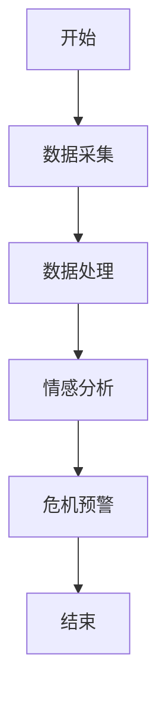

                 


# AI Agent在企业品牌声誉监控与危机预警中的应用

> 关键词：AI Agent, 企业品牌声誉, 危机预警, 自然语言处理, 机器学习, 数据挖掘

> 摘要：随着企业在全球市场中的竞争日益激烈，品牌声誉成为企业生存和发展的重要因素。AI Agent作为人工智能领域的先进技术，正在逐步应用于品牌声誉监控与危机预警中。本文将从AI Agent的核心概念、算法原理、系统架构设计、项目实战等多个方面，详细探讨AI Agent在企业品牌声誉管理中的应用，为企业提供有效的解决方案和实践指导。

---

## 第1章 AI Agent与企业品牌声誉管理概述

### 1.1 AI Agent的基本概念

AI Agent，即人工智能代理，是一种能够感知环境、自主决策并执行任务的智能实体。它结合了自然语言处理（NLP）、机器学习（ML）和大数据分析等技术，能够帮助企业实现自动化、智能化的管理。

#### 1.1.1 AI Agent的定义与特点

AI Agent具有以下特点：
- **自主性**：能够自主决策，无需人工干预。
- **反应性**：能够实时感知环境变化并做出反应。
- **学习能力**：通过机器学习不断优化自身的算法模型。
- **交互性**：能够与人类或其他系统进行交互。

#### 1.1.2 AI Agent在企业中的应用领域

AI Agent在企业中的应用领域包括：
- **客户关系管理**：通过分析客户反馈，优化客户服务。
- **市场分析**：实时监控市场动态，预测市场趋势。
- **品牌声誉管理**：通过分析社交媒体和新闻媒体的数据，监控品牌声誉。

### 1.2 企业品牌声誉管理的重要性

#### 1.2.1 品牌声誉的定义

品牌声誉是指消费者、客户、合作伙伴等对企业的信任程度和评价。良好的品牌声誉能够提升企业的市场竞争力，而负面声誉则可能导致企业损失客户和市场份额。

#### 1.2.2 品牌声誉管理的挑战

在当前数字化时代，品牌声誉管理面临以下挑战：
- **数据量大**：社交媒体、新闻媒体等渠道每天产生海量数据。
- **数据分散**：数据分布在不同的平台，难以统一管理。
- **数据实时性要求高**：品牌声誉的变化往往发生在短时间内，需要实时监控。

#### 1.2.3 AI Agent在品牌声誉管理中的优势

AI Agent能够通过以下方式提升品牌声誉管理的效率：
- **自动化数据采集**：实时从社交媒体、新闻媒体等渠道采集数据。
- **智能分析**：利用自然语言处理技术分析数据，识别潜在危机。
- **实时预警**：通过机器学习模型预测品牌声誉的变化趋势。

### 1.3 本章小结

本章介绍了AI Agent的基本概念及其在企业中的应用领域，重点阐述了品牌声誉管理的重要性及AI Agent在其中的优势。接下来的章节将深入探讨AI Agent的核心算法原理和系统架构设计。

---

## 第2章 AI Agent的核心概念与原理

### 2.1 基于AI的自然语言处理技术

#### 2.1.1 自然语言处理的基本概念

自然语言处理（NLP）是AI Agent的重要组成部分，旨在让计算机能够理解和处理人类语言。NLP的核心任务包括：
- **文本分类**：将文本分为不同的类别，如情感分析。
- **实体识别**：识别文本中的实体，如人名、地名等。
- **情感分析**：分析文本中的情感倾向，如正面、负面或中性。

#### 2.1.2 基于深度学习的NLP模型

近年来，基于深度学习的NLP模型（如BERT、GPT）在品牌声誉管理中得到了广泛应用。这些模型能够通过大量数据训练，自动提取文本中的语义信息。

#### 2.1.3 基于NLP的情感分析在品牌声誉管理中的应用

情感分析可以帮助企业识别社交媒体上的用户情感倾向，从而及时发现潜在的声誉危机。例如，当大量用户在社交媒体上发布负面评论时，系统会自动识别并触发预警机制。

### 2.2 品牌声誉管理中的关键要素

#### 2.2.1 品牌声誉的构成要素

品牌声誉的构成要素包括：
- **产品质量**：产品的质量和性能直接影响用户的满意度。
- **客户服务**：客户在与企业互动中的体验也会影响品牌声誉。
- **社会责任**：企业对社会责任的履行情况也是品牌声誉的重要组成部分。

#### 2.2.2 市场反馈数据的特征分析

市场反馈数据的特征包括：
- **数据来源**：社交媒体、新闻媒体等。
- **数据类型**：文本、图像、视频等。
- **数据时间戳**：数据产生的时间，用于分析时间序列。

#### 2.2.3 品牌声誉管理的指标体系

品牌声誉管理的指标体系包括：
- **净推荐值（NPS）**：衡量客户推荐产品的意愿。
- **情感倾向度**：文本情感分析的结果。
- **声誉变化率**：品牌声誉的变化速度。

### 2.3 AI Agent与品牌声誉管理的关联性

#### 2.3.1 AI Agent在数据采集中的作用

AI Agent可以通过API接口从社交媒体和新闻媒体中采集数据，实时监控品牌相关的舆论动态。

#### 2.3.2 AI Agent在数据处理中的应用

AI Agent可以利用自然语言处理技术对采集的数据进行清洗、去噪和特征提取，为后续的分析提供高质量的数据。

#### 2.3.3 AI Agent在决策支持中的价值

AI Agent可以基于分析结果，为企业的品牌声誉管理提供决策支持，如识别潜在危机、预测声誉变化趋势等。

### 2.4 本章小结

本章详细介绍了AI Agent的核心概念与原理，特别是基于NLP的情感分析技术在品牌声誉管理中的应用。接下来的章节将探讨AI Agent的算法原理和系统架构设计。

---

## 第3章 AI Agent的算法原理与数学模型

### 3.1 基于情感分析的文本分类

#### 3.1.1 情感分析的数学模型

情感分析的数学模型通常基于概率论和统计学习方法。例如，使用朴素贝叶斯算法进行文本分类，公式如下：

$$ P(y|x) = \frac{P(x|y)P(y)}{P(x)} $$

其中，$y$表示情感类别（如正面、负面），$x$表示文本特征。

#### 3.1.2 基于深度学习的情感分析模型

基于深度学习的情感分析模型（如LSTM、Transformer）能够自动提取文本中的语义信息。例如，使用BERT模型进行情感分析的流程如下：

1. 输入文本经过分词处理。
2. 将分词后的文本输入BERT模型，得到每个词的向量表示。
3. 对向量进行全局池化，得到文本的语义向量。
4. 通过全连接层输出情感类别。

### 3.2 基于时间序列的声誉变化预测

#### 3.2.1 时间序列预测的数学模型

时间序列预测的数学模型通常基于ARIMA（自回归积分滑动平均）模型，公式如下：

$$ y_t = \phi y_{t-1} + \theta d_{t-1} + \epsilon_t $$

其中，$\phi$是自回归系数，$\theta$是滑动平均系数，$\epsilon_t$是白噪声。

#### 3.2.2 基于LSTM的时间序列预测

LSTM（长短期记忆网络）能够有效处理时间序列数据中的长距离依赖关系。LSTM的结构包括输入门、遗忘门和输出门。

---

## 第4章 系统架构设计

### 4.1 系统功能设计

#### 4.1.1 功能模块划分

系统功能模块包括：
- 数据采集模块：从社交媒体和新闻媒体中采集数据。
- 数据处理模块：对数据进行清洗、去噪和特征提取。
- 情感分析模块：对文本进行情感分析。
- 危机预警模块：基于分析结果，识别潜在危机并触发预警。

#### 4.1.2 功能流程图

以下是功能流程图的Mermaid图：



---

## 第5章 项目实战

### 5.1 环境安装

#### 5.1.1 Python环境安装

安装Python和必要的库：

```bash
pip install numpy pandas scikit-learn transformers
```

#### 5.1.2 数据集准备

从社交媒体和新闻媒体中收集品牌相关的文本数据。

### 5.2 代码实现

#### 5.2.1 数据处理代码

```python
import pandas as pd
from transformers import pipeline

# 加载情感分析模型
sentiment_analyzer = pipeline("sentiment-analysis")

# 数据处理函数
def process_data(data):
    data['sentiment'] = sentiment_analyzer(data['text'])[0]['label']
    return data

# 示例数据
data = pd.DataFrame({'text': ['I love this product!', 'This product is terrible.']})
processed_data = process_data(data)
print(processed_data)
```

#### 5.2.2 情感分析代码

```python
import numpy as np
from sklearn.model_selection import train_test_split
from sklearn.metrics import accuracy_score
from sklearn.linear_model import LogisticRegression

# 示例数据
X = np.array(['I love this product!', 'This product is terrible.'])
y = np.array([1, 0])

# 划分训练集和测试集
X_train, X_test, y_train, y_test = train_test_split(X, y, test_size=0.2)

# 训练逻辑回归模型
model = LogisticRegression()
model.fit(X_train, y_train)

# 预测
y_pred = model.predict(X_test)
print(accuracy_score(y_test, y_pred))
```

---

## 第6章 总结与展望

### 6.1 总结

本文详细探讨了AI Agent在企业品牌声誉监控与危机预警中的应用，从理论到实践，全面介绍了AI Agent的核心概念、算法原理和系统架构设计。通过项目实战，展示了AI Agent在品牌声誉管理中的具体应用。

### 6.2 展望

未来，随着AI技术的不断发展，AI Agent在品牌声誉管理中的应用将更加广泛和深入。例如，结合区块链技术，可以实现数据的可信共享；结合边缘计算，可以实现更实时的数据处理。

---

## 作者：AI天才研究院/AI Genius Institute & 禅与计算机程序设计艺术 /Zen And The Art of Computer Programming

---

以上是关于“AI Agent在企业品牌声誉监控与危机预警中的应用”的完整目录大纲和文章内容。

