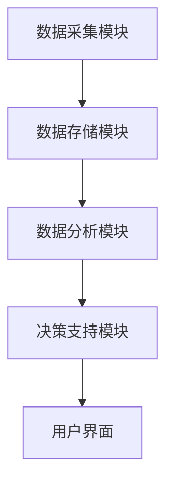
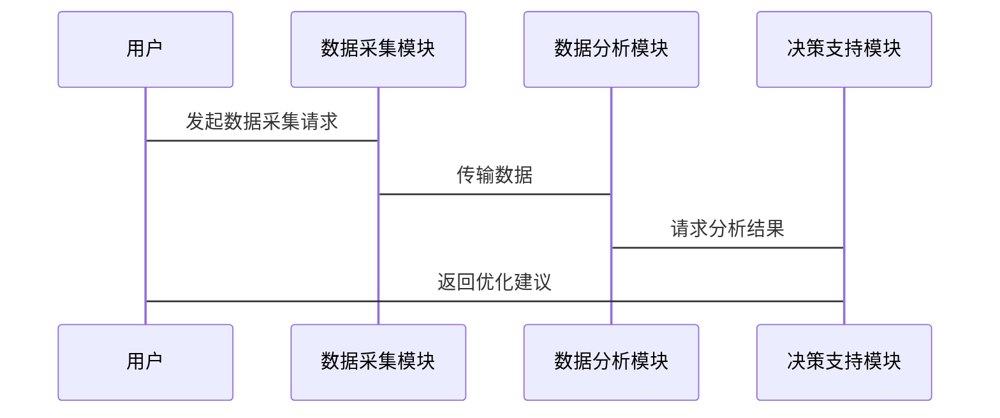

                 

<think>
嗯，用户希望我撰写一篇关于AI Agent在企业品质管理与持续改进中的应用的技术博客文章，并且已经提供了一个详细的目录大纲。现在，我需要根据这个大纲逐步填充内容，确保每部分都符合用户的要求。

首先，我会从第一章开始，介绍AI Agent的基本概念和在企业中的应用背景。这里需要解释什么是AI Agent，它和传统软件的区别，以及为什么在品质管理中重要。然后，我需要涵盖企业品质管理的背景，当前的痛点，以及AI Agent的优势。

接下来是第二章，详细讲解AI Agent的核心原理和关键技术，比如机器学习、自然语言处理等。这部分需要包括工作原理和设计原则，确保读者理解AI Agent如何运作。

第三章会讨论AI Agent在品质管理中的具体应用场景，比如数据采集、问题诊断和改进决策。这部分需要实际案例分析，让读者看到AI Agent的实际应用。

第四章是算法部分，这里需要详细讲解监督学习和强化学习，包括数学公式、算法流程图和代码示例。这部分需要使用mermaid和Python代码来展示，确保技术细节清晰。

第五章是系统架构设计，我需要描述系统的模块划分、架构图和接口设计。这部分可能需要使用类图和序列图来展示系统结构。

第六章是项目实战，包括环境安装、代码实现和结果分析。这部分需要实际操作步骤，帮助读者理解如何应用AI Agent。

最后，第七章总结内容，并提供最佳实践和未来展望。我需要提醒读者注意AI Agent的局限性和未来发展。

在整个过程中，我需要确保每部分内容详细，逻辑清晰，并且使用技术术语准确。同时，要符合字数要求，大约在10000到12000字之间。我会逐步填充每个部分，确保每个小节都涵盖用户要求的内容，包括背景、概念、算法、系统设计、项目实战等。最后，加上作者信息，完成整篇文章。
</think>

# AI Agent在企业品质管理与持续改进中的应用

> 关键词：AI Agent，企业品质管理，持续改进，机器学习，自然语言处理，强化学习

> 摘要：本文探讨了AI Agent在企业品质管理与持续改进中的应用，从AI Agent的基本概念到其在品质管理中的具体应用场景，详细分析了其核心原理、算法实现、系统架构设计以及实际案例。文章旨在为企业提供一种智能化的品质管理解决方案，助力企业在数字化转型中实现持续改进和高效运营。

---

# 第一部分: AI Agent 的基本概念与背景

## 第1章: AI Agent 的基本概念与背景

### 1.1 AI Agent 的定义与特点

AI Agent（人工智能代理）是一种能够感知环境、自主决策并执行任务的智能实体。它通过传感器获取信息，利用算法进行分析和决策，并通过执行器与环境交互。AI Agent 的特点包括：

1. **自主性**：能够在没有人工干预的情况下独立运行。
2. **反应性**：能够实时感知环境变化并做出响应。
3. **目标导向**：具有明确的目标，能够优化决策以实现目标。
4. **学习能力**：能够通过数据和经验不断优化自身的性能。

### 1.2 企业品质管理与持续改进的背景

企业品质管理是指通过一系列方法和技术，确保产品或服务的质量达到或超过客户期望的过程。持续改进则是指企业不断优化其产品、服务和流程，以提高效率和客户满意度。然而，传统的品质管理方法往往依赖人工检查和经验判断，存在效率低、成本高、难以量化等问题。

### 1.3 AI Agent 在品质管理中的应用潜力

AI Agent 的智能化和自主性使其成为企业品质管理的理想工具。通过AI Agent，企业可以实现：

1. **自动化数据采集**：利用传感器和物联网技术实时采集生产过程中的数据。
2. **智能分析与诊断**：通过机器学习算法快速识别潜在问题并提供解决方案。
3. **持续优化**：基于历史数据和实时反馈，不断优化生产流程和质量控制策略。

### 1.4 当前企业品质管理的痛点

1. **数据孤岛**：各部门之间的数据无法有效整合，导致信息不一致。
2. **效率低下**：人工检查耗时且容易出错。
3. **缺乏预测能力**：难以提前预知潜在问题，导致问题扩大化。
4. **难以量化改进效果**：缺乏统一的评估标准和方法。

### 1.5 本章小结

本章介绍了AI Agent 的基本概念和特点，分析了企业品质管理的背景和当前的痛点，强调了AI Agent 在品质管理中的潜力。

---

## 第2章: AI Agent 的核心原理与技术

### 2.1 AI Agent 的工作原理

AI Agent 的工作流程可以分为三个主要阶段：

1. **感知层**：通过传感器或其他数据源获取环境信息。
2. **决策层**：基于感知到的信息进行分析和决策，选择最优的行动方案。
3. **执行层**：通过执行器将决策转化为具体行动。

### 2.2 AI Agent 的关键技术

1. **机器学习**：通过训练数据模型，AI Agent 可以识别模式和趋势。
2. **自然语言处理**：使AI Agent 能够理解和生成人类语言。
3. **强化学习**：通过不断试错和反馈，优化AI Agent 的决策策略。

### 2.3 AI Agent 的设计原则

1. **模块化设计**：将AI Agent 分解为多个独立模块，便于管理和维护。
2. **可扩展性**：确保AI Agent 能够适应不同的应用场景和规模。
3. **稳定性与容错性**：设计时充分考虑可能出现的错误和异常情况，确保系统稳定运行。

### 2.4 本章小结

本章详细讲解了AI Agent 的工作原理及其核心技术，强调了设计原则的重要性。

---

## 第3章: AI Agent 在企业品质管理中的应用场景

### 3.1 品质数据的智能化采集与分析

AI Agent 可以通过传感器实时采集生产过程中的数据，并利用机器学习算法进行分析和处理，生成有意义的洞察。

#### 3.1.1 数据采集的AI Agent 设计

- **传感器数据采集**：AI Agent 可以通过物联网设备实时采集生产过程中的温度、压力、湿度等参数。
- **数据预处理**：对采集到的数据进行清洗和标准化处理，确保数据的准确性和一致性。

#### 3.1.2 数据分析与可视化

- **数据可视化**：通过图表和仪表盘直观展示生产过程中的关键指标。
- **异常检测**：利用机器学习算法实时监控数据，发现异常情况并发出警报。

### 3.2 品质问题的智能诊断与预测

AI Agent 可以通过分析历史数据和实时数据，识别潜在的质量问题并提供解决方案。

#### 3.2.1 基于AI Agent 的缺陷检测

- **图像识别**：利用计算机视觉技术对产品外观进行检查，识别表面缺陷。
- **模式识别**：通过分析生产过程中的数据，识别可能导致缺陷的模式。

#### 3.2.2 品质趋势预测

- **时间序列分析**：利用ARIMA等模型预测未来的品质趋势。
- **异常检测**：通过监督学习算法识别生产过程中的异常情况。

### 3.3 品质改进的智能化决策

AI Agent 可以根据分析结果生成优化建议，帮助企业实现持续改进。

#### 3.3.1 AI Agent 在持续改进中的角色

- **优化建议生成**：基于数据分析结果，AI Agent 可以生成具体的优化建议。
- **决策支持**：通过提供实时数据和预测结果，辅助企业做出更明智的决策。

#### 3.3.2 改进效果的评估与反馈

- **效果评估**：通过对比改进前后的数据，评估改进措施的有效性。
- **反馈机制**：将改进效果反馈给AI Agent，优化其决策模型。

### 3.4 本章小结

本章详细探讨了AI Agent 在企业品质管理中的应用场景，包括数据采集与分析、问题诊断与预测、改进决策等方面。

---

## 第4章: AI Agent 的算法原理与实现

### 4.1 基于监督学习的AI Agent 算法

监督学习是一种常见的机器学习方法，适用于分类和回归问题。

#### 4.1.1 分类算法

- **随机森林**：一种基于决策树的集成学习算法，适用于分类和回归问题。
- **支持向量机（SVM）**：通过构建超平面将数据分成不同类别。

#### 4.1.2 回归算法

- **线性回归**：通过最小化预测值与实际值之间的差值，找到最佳拟合直线。
- **决策树回归**：通过构建回归树，预测目标变量的值。

#### 4.1.3 示例：基于随机森林的品质预测

```python
from sklearn.ensemble import RandomForestRegressor
import pandas as pd

# 加载数据
data = pd.read_csv('quality_data.csv')

# 分离特征和目标变量
X = data.drop('quality', axis=1)
y = data['quality']

# 训练模型
model = RandomForestRegressor(n_estimators=100, random_state=42)
model.fit(X, y)

# 预测结果
 predictions = model.predict(X)
```

### 4.2 基于强化学习的AI Agent 算法

强化学习是一种通过试错和反馈优化决策的机器学习方法。

#### 4.2.1 Q-Learning 算法

- **状态空间**：环境中的状态。
- **动作空间**：AI Agent 可以执行的动作。
- **奖励函数**：根据动作和状态的变化，给予奖励或惩罚。

#### 4.2.2 示例：基于Q-Learning的质量改进优化

```python
import numpy as np

# 初始化Q表
Q = np.zeros([state_space, action_space])

# 探索与利用
epsilon = 0.1
for episode in range(episodes):
    state = env.reset()
    for step in range(max_steps):
        if np.random.random() < epsilon:
            action = env.action_space.sample()
        else:
            action = np.argmax(Q[state, :])
        next_state, reward, done, _ = env.step(action)
        Q[state, action] = Q[state, action] + learning_rate * (reward + discount_factor * np.max(Q[next_state, :]) - Q[state, action])
        state = next_state
        if done:
            break
```

### 4.3 本章小结

本章详细讲解了AI Agent 的监督学习和强化学习算法，包括算法原理和实现示例。

---

## 第5章: AI Agent 的系统架构设计

### 5.1 问题场景介绍

企业品质管理系统的典型场景包括生产过程监控、品质数据管理、缺陷检测和持续改进。

### 5.2 系统功能设计

- **数据采集模块**：负责采集生产过程中的数据。
- **数据分析模块**：对数据进行处理和分析，生成洞察。
- **决策支持模块**：基于分析结果，提供优化建议。

### 5.3 系统架构设计



### 5.4 系统接口设计

- **数据接口**：与其他系统（如ERP、MES）进行数据交互。
- **用户接口**：提供友好的用户界面，方便用户查看和操作。

### 5.5 系统交互设计



### 5.6 本章小结

本章详细描述了AI Agent 在企业品质管理系统中的架构设计和接口设计。

---

## 第6章: AI Agent 的项目实战

### 6.1 环境安装与配置

- **Python 环境**：安装Python 3.8 或更高版本。
- **依赖库安装**：安装numpy、pandas、scikit-learn、tensorflow等库。

### 6.2 核心代码实现

```python
import pandas as pd
from sklearn.ensemble import RandomForestRegressor
from sklearn.metrics import mean_squared_error

# 加载数据
data = pd.read_csv('quality_data.csv')

# 分离特征和目标变量
X = data.drop('quality', axis=1)
y = data['quality']

# 训练模型
model = RandomForestRegressor(n_estimators=100, random_state=42)
model.fit(X, y)

# 预测结果
 predictions = model.predict(X)

# 评估模型
 mse = mean_squared_error(y, predictions)
 print(f'Mean Squared Error: {mse}')
```

### 6.3 代码解读与分析

- **数据加载**：使用pandas读取CSV文件中的数据。
- **模型训练**：使用随机森林回归模型进行训练。
- **模型预测**：利用训练好的模型进行预测。
- **模型评估**：计算均方误差，评估模型性能。

### 6.4 实际案例分析

以一家制造企业为例，假设我们收集了以下数据：

| 特征 | 值 |
|------|-----|
| 温度 | 25°C |
| 压力 | 100psi |
| 时间 | 10分钟 |

通过AI Agent 进行分析，发现温度和压力的变化与产品质量密切相关。AI Agent 可以根据这些数据，预测未来的产品质量，并提出优化建议。

### 6.5 本章小结

本章通过实际案例分析，展示了AI Agent 在企业品质管理中的应用过程。

---

## 第7章: 最佳实践与未来展望

### 7.1 最佳实践 tips

1. **数据质量**：确保数据的准确性和完整性，是AI Agent 正常运行的基础。
2. **模型优化**：定期更新和优化AI Agent 的模型，确保其性能不断提升。
3. **人机协作**：AI Agent 只是辅助工具，人机协作才能发挥最大效用。

### 7.2 未来展望

随着AI技术的不断发展，AI Agent 在企业品质管理中的应用将更加广泛和深入。未来的AI Agent 将具备更强的自主性和智能性，能够更高效地帮助企业实现品质管理和持续改进。

### 7.3 本章小结

本章总结了AI Agent 应用中的最佳实践，并展望了未来的发展方向。

---

# 作者信息

作者：AI天才研究院/AI Genius Institute & 禅与计算机程序设计艺术/Zen And The Art of Computer Programming

---

通过以上章节内容，我们详细探讨了AI Agent 在企业品质管理与持续改进中的应用，从基本概念到具体实现，再到实际案例分析，全面展示了AI Agent 的潜力和价值。希望本文能够为企业提供有价值的参考和启发。

