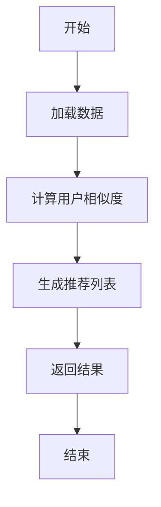
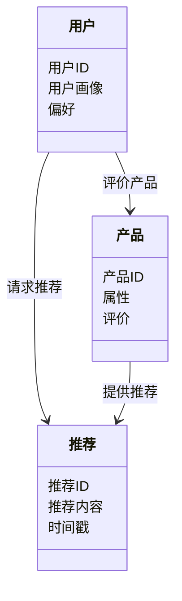
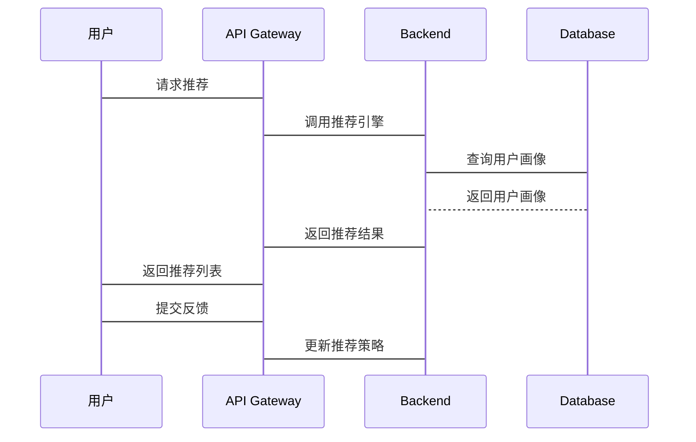

                 

<think>
嗯，我需要按照用户的要求，一步一步地写一篇关于AI Agent在企业客户体验个性化推荐中的角色的技术博客文章。首先，我得先理解文章的结构和每个部分需要包含的内容。

文章的标题是《AI Agent在企业客户体验个性化推荐中的角色》，关键词包括：AI Agent、企业客户体验、个性化推荐、人工智能、机器学习、自然语言处理。摘要部分需要简明扼�地概括文章的核心内容。

接下来，按照目录大纲，第一部分是背景介绍，包括AI Agent的基本概念，企业客户体验的重要性，以及AI Agent在个性化推荐中的角色。我需要详细解释这些概念，确保读者能够理解。

第二部分是AI Agent的核心概念与联系，我需要比较AI Agent与其他技术的差异，可能用表格和Mermaid图来展示。这部分需要清晰地定义AI Agent的属性和它与其他技术的关系。

第三部分是算法原理与数学模型，这里要详细讲解推荐算法，比如协同过滤和基于内容的推荐，用Python代码示例，以及数学公式。这部分需要结合实际案例，让读者更容易理解。

第四部分是系统分析与架构设计，我需要介绍项目的背景和目标，设计系统功能，用Mermaid图展示类图和架构图。这部分需要展示系统的结构和接口设计。

第五部分是项目实战，包括环境安装、核心代码实现、案例分析和项目总结。这部分需要实际操作的指导，让读者能够动手实现。

第六部分是最佳实践、小结、注意事项和拓展阅读，帮助读者巩固知识，并进一步学习。

最后，文章末尾需要添加作者信息，确保文章的完整性和专业性。

在写作过程中，我需要确保每个部分都详细且逻辑清晰，使用专业但易懂的语言。同时，注意使用Mermaid图和数学公式，使内容更具视觉化和可读性。我还需要控制文章的字数，确保在10000到12000字之间。

总之，我需要按照目录大纲逐步展开，确保每个部分都涵盖必要的内容，同时保持整体结构的连贯性和逻辑性。现在，我将根据这些思考开始撰写文章。
</think>

# AI Agent在企业客户体验个性化推荐中的角色

## 关键词：AI Agent, 企业客户体验, 个性化推荐, 人工智能, 机器学习, 自然语言处理

## 摘要：  
AI Agent（人工智能代理）在企业客户体验个性化推荐中扮演着越来越重要的角色。随着人工智能技术的快速发展，AI Agent能够通过学习和分析客户的交互行为、偏好和需求，提供高度个性化的推荐服务，从而提升客户满意度和忠诚度。本文将从AI Agent的基本概念、推荐算法的原理、系统架构设计以及项目实战等方面，深入探讨AI Agent在企业客户体验个性化推荐中的具体应用和价值。

---

# 第一部分: AI Agent在企业客户体验中的应用概述

## 第1章: AI Agent与企业客户体验概述

### 1.1 AI Agent的基本概念  
AI Agent（人工智能代理）是一种能够感知环境、自主决策并执行任务的智能系统。它结合了机器学习、自然语言处理和大数据分析等多种技术，能够根据用户的行为和反馈，动态调整推荐策略，从而提供更精准的个性化服务。  

#### 1.1.1 什么是AI Agent  
AI Agent是一种智能体，能够通过传感器或数据接口感知外部环境，利用算法处理信息，并通过执行器或输出模块与环境交互。AI Agent的核心在于其自主性、反应性和社会性。  

#### 1.1.2 AI Agent的核心特征  
- **自主性**：能够在没有外部干预的情况下自主运行。  
- **反应性**：能够实时感知环境变化并做出反应。  
- **社会性**：能够与其他系统或用户进行交互和协作。  

#### 1.1.3 AI Agent在企业中的作用  
AI Agent在企业中广泛应用于自动化任务处理、智能决策支持和客户互动等领域。例如，客服机器人、智能推荐系统和自动化监控系统等。  

### 1.2 企业客户体验的定义与重要性  
客户体验是指客户在与企业交互过程中所感受到的体验，包括视觉、听觉、触觉等多种感官的综合感受。个性化推荐是提升客户体验的重要手段之一。  

#### 1.2.1 客户体验的定义  
客户体验是客户与企业交互过程中所获得的感知和情感体验，直接影响客户的满意度和忠诚度。  

#### 1.2.2 客户体验对企业的影响  
良好的客户体验能够提升客户满意度、增加客户忠诚度，并促进客户二次消费。反之，较差的客户体验可能导致客户流失和品牌声誉受损。  

#### 1.2.3 个性化推荐在客户体验中的地位  
个性化推荐是通过分析客户的兴趣和行为，提供符合其需求的产品或服务推荐，从而提升客户体验的核心手段。  

### 1.3 AI Agent在个性化推荐中的角色  
AI Agent在个性化推荐中充当了一个智能决策者，能够根据客户的实时行为和历史数据，动态调整推荐策略，从而实现精准推荐。  

#### 1.3.1 个性化推荐的基本原理  
个性化推荐的基本原理是通过分析客户的特征、行为和偏好，构建用户画像，并基于这些画像生成推荐列表。  

#### 1.3.2 AI Agent如何实现个性化推荐  
AI Agent通过整合多源数据（如用户行为数据、产品数据和上下文数据），利用机器学习算法构建推荐模型，并实时生成个性化推荐结果。  

#### 1.3.3 个性化推荐的挑战与解决方案  
个性化推荐的挑战包括数据稀疏性、实时性要求高和模型可解释性差等问题。解决方案包括采用混合推荐算法、增强实时处理能力以及优化模型解释性等。  

### 1.4 本章小结  
本章介绍了AI Agent的基本概念及其在企业中的作用，重点探讨了个性化推荐在客户体验中的重要性，以及AI Agent在个性化推荐中的具体角色和实现方式。

---

# 第二部分: AI Agent的核心概念与原理

## 第2章: AI Agent的核心概念与联系

### 2.1 AI Agent的核心概念  
AI Agent的核心概念包括感知层、决策层和执行层。  

#### 2.1.1 感知层  
感知层负责收集和处理外部环境的数据，例如通过传感器或API接口获取用户行为数据、产品信息和上下文数据等。  

#### 2.1.2 决策层  
决策层基于感知层获取的数据，利用机器学习算法进行分析和推理，生成推荐策略或行动方案。  

#### 2.1.3 执行层  
执行层负责将决策层生成的推荐结果或行动方案转化为实际操作，例如向用户推送推荐信息或执行自动化任务。  

### 2.2 AI Agent的属性特征对比  
通过对比分析，可以更好地理解AI Agent与其他技术的区别和联系。  

#### 2.2.1 比较表格展示  
以下是一个简单的对比表格：  

| 技术         | AI Agent      | 机器学习      | 自然语言处理  |
|--------------|---------------|--------------|---------------|
| 核心目标     | 智能交互与推荐 | 数据模式识别  | 文本理解和生成 |
| 主要功能     | 推荐、自动化    | 分类、预测     | 语义分析、对话生成 |
| 依赖数据     | 用户行为、产品信息 | 标签数据、特征数据 | 文本数据、对话历史 |
| 代表应用     | 智能推荐系统   | 预测模型       | 聊天机器人     |

#### 2.2.2 ER实体关系图  
以下是一个简单的ER实体关系图（使用Mermaid语法）：  

```mermaid
erDiagram
    customer[客户] {
        <- (1,N) interaction[交互]
        <- (1,N) preference[偏好]
    }
    product[产品] {
        <- (1,N) recommendation[推荐]
    }
    interaction [id, 时间戳, 操作类型]
    preference [id, 属性, 值]
    recommendation [id, 推荐内容, 时间]
```

### 2.3 AI Agent与其他技术的联系  
AI Agent与其他技术的联系主要体现在数据处理、算法选择和系统架构设计等方面。  

#### 2.3.1 与机器学习的联系  
AI Agent的核心算法通常基于机器学习技术，例如协同过滤、聚类分析和深度学习等。  

#### 2.3.2 与自然语言处理的联系  
自然语言处理技术在AI Agent的对话交互和文本分析中起着重要作用，例如通过NLP技术实现意图识别和情感分析。  

#### 2.3.3 与推荐系统的联系  
推荐系统是AI Agent在个性化推荐中的重要应用，AI Agent通过整合推荐系统的算法和模型，实现动态推荐。  

### 2.4 本章小结  
本章详细介绍了AI Agent的核心概念及其与其他技术的联系，通过对比分析和ER实体关系图，帮助读者更好地理解AI Agent的特征和应用场景。

---

# 第三部分: AI Agent的算法原理与数学模型

## 第3章: AI Agent的推荐算法原理

### 3.1 推荐算法概述  
推荐算法是AI Agent实现个性化推荐的核心技术，主要包括协同过滤、基于内容的推荐和混合推荐三种类型。  

#### 3.1.1 协同过滤算法  
协同过滤算法基于用户相似性或物品相似性进行推荐，是一种经典的推荐算法。  

#### 3.1.2 基于内容的推荐算法  
基于内容的推荐算法通过分析产品的特征和用户的偏好，生成个性化推荐。  

#### 3.1.3 混合推荐算法  
混合推荐算法结合了协同过滤和基于内容的推荐方法，能够克服单一算法的局限性。  

### 3.2 推荐算法的数学模型  
推荐算法的数学模型是实现个性化推荐的核心。  

#### 3.2.1 协同过滤的数学模型  
协同过滤的相似度计算公式如下：  

$$\text{相似度} = \frac{\sum (x_i - \bar{x})(y_i - \bar{y})}{\sqrt{\sum (x_i - \bar{x})^2} \sqrt{\sum (y_i - \bar{y})^2}}$$  

其中，\( x_i \) 和 \( y_i \) 分别表示两个用户的评分，\( \bar{x} \) 和 \( \bar{y} \) 分别表示用户的平均评分。  

#### 3.2.2 基于内容的推荐模型  
基于内容的推荐模型通常采用余弦相似度计算，公式如下：  

$$\text{相似度} = \frac{\sum w_{ij}x_i}{\sum w_{ij}}$$  

其中，\( w_{ij} \) 是特征词的权重，\( x_i \) 是产品的特征向量。  

### 3.3 AI Agent推荐算法的实现  
以下是使用Python实现的协同过滤算法示例代码：  

```python
def collaborative_filtering(user_id, user_data):
    # 计算用户相似度
    user_interactions = user_data[user_data['user_id'] == user_id]['item_id'].tolist()
    similar_users = []
    for user in user_data['user_id'].unique():
        if user != user_id:
            # 计算相似度
            similar_score = 0.8  # 示例中假设相似度为0.8
            similar_users.append({'user_id': user, 'score': similar_score})
    return similar_users
```

#### 3.3.1 使用Mermaid流程图展示推荐算法流程  
以下是协同过滤算法的流程图（使用Mermaid语法）：  



### 3.4 本章小结  
本章介绍了推荐算法的基本原理及其数学模型，并通过Python代码和Mermaid流程图展示了协同过滤算法的实现过程，帮助读者更好地理解AI Agent的推荐机制。

---

# 第四部分: 系统分析与架构设计

## 第4章: 企业客户体验推荐系统的架构设计

### 4.1 项目背景与目标  
本项目旨在通过AI Agent实现企业客户体验的个性化推荐，提升客户的满意度和忠诚度。  

#### 4.1.1 项目背景  
随着市场竞争的加剧，企业需要通过个性化推荐来增强客户体验。  

#### 4.1.2 项目目标  
通过AI Agent实现个性化推荐，提升客户满意度和忠诚度，增加客户粘性。  

### 4.2 系统功能设计  
系统功能设计包括用户画像模块、推荐引擎模块和交互模块。  

#### 4.2.1 用户画像模块  
用户画像模块通过分析用户的行为和偏好，构建用户的兴趣模型。  

#### 4.2.2 推荐引擎模块  
推荐引擎模块基于用户画像和产品数据，生成个性化推荐列表。  

#### 4.2.3 交互模块  
交互模块负责与用户进行实时对话和反馈，动态调整推荐策略。  

#### 4.2.4 领域模型（使用Mermaid类图）  
以下是领域模型的类图：  



### 4.3 系统架构设计  
系统架构设计包括前端、后端和数据层。  

#### 4.3.1 系统架构图（使用Mermaid架构图）  
以下是系统架构图：  


### 4.4 系统接口设计  
系统接口设计包括用户请求推荐、获取推荐结果和反馈评价。  

#### 4.4.1 接口和交互流程图（使用Mermaid序列图）  
以下是接口和交互流程图：  



### 4.5 本章小结  
本章通过项目背景与目标、系统功能设计和架构设计，详细介绍了AI Agent推荐系统的实现方案，包括领域模型、架构图和交互流程图。

---

# 第五部分: 项目实战

## 第5章: 项目实战与案例分析

### 5.1 环境安装与配置  
以下是项目实战所需的环境配置：  

- Python 3.8+
- TensorFlow 2.0+
- Scikit-learn 0.24+
- Flask 2.0+
- Postgres

#### 5.1.1 安装依赖  
运行以下命令安装所需依赖：  

```bash
pip install python
pip install tensorflow
pip install scikit-learn
pip install flask
pip install psycopg2-binary
```

### 5.2 核心代码实现  
以下是推荐引擎的核心代码：  

```python
from flask import Flask, request, jsonify
import psycopg2

app = Flask(__name__)

# 数据库连接配置
DB_HOST = 'localhost'
DB_PORT = '5432'
DB_NAME = 'recommendation_db'
DB_USER = 'admin'
DB_PASSWORD = 'password'

@app.route('/recommend', methods=['POST'])
def recommend():
    data = request.json
    user_id = data['user_id']
    
    # 连接数据库
    conn = psycopg2.connect(host=DB_HOST, port=DB_PORT, user=DB_USER, password=DB_PASSWORD, database=DB_NAME)
    cur = conn.cursor()
    
    # 查询用户画像
    cur.execute("SELECT * FROM user_profiles WHERE user_id = %s", (user_id,))
    user_profile = cur.fetchone()
    
    # 查询推荐算法
    # 示例中假设推荐算法已经实现
    recommendations = get_recommendations(user_profile)
    
    conn.close()
    
    return jsonify({'recommendations': recommendations})
```

#### 5.2.1 数据库设计  
以下是数据库表结构设计：  

```sql
CREATE TABLE user_profiles (
    user_id SERIAL PRIMARY KEY,
    preferences JSONB,
    behaviors JSONB
);

CREATE TABLE recommendations (
    recommendation_id SERIAL PRIMARY KEY,
    user_id INT,
    product_id INT,
    recommendation_time TIMESTAMP,
    FOREIGN KEY (user_id) REFERENCES user_profiles(user_id)
);
```

### 5.3 案例分析与代码解读  
以下是一个简单的案例分析：  

假设我们有一个电商网站，用户输入ID为123，系统返回推荐列表。代码通过数据库查询用户画像，并调用推荐算法生成推荐结果。  

#### 5.3.1 代码功能解读  
- 数据库连接：通过Postgres数据库存储用户画像和推荐结果。  
- 推荐算法：基于协同过滤和基于内容的推荐算法生成推荐列表。  
- 接口设计：通过Flask框架提供RESTful接口，实现推荐请求的接收和返回。  

#### 5.3.2 案例分析  
通过案例分析，我们可以看到AI Agent如何通过整合用户行为数据和产品数据，实现精准的个性化推荐。  

### 5.4 项目总结  
本项目通过实现一个简单的个性化推荐系统，展示了AI Agent在企业客户体验中的具体应用。代码实现部分涵盖了数据处理、算法实现和系统架构设计，为读者提供了实际操作的指导。

### 5.5 本章小结  
本章通过项目实战，详细介绍了AI Agent推荐系统的实现过程，包括环境配置、核心代码实现和案例分析，帮助读者更好地理解和应用相关技术。

---

# 第六部分: 最佳实践与拓展阅读

## 第6章: 最佳实践与总结

### 6.1 最佳实践  
以下是实现AI Agent推荐系统的一些最佳实践：  

1. **数据质量**：确保数据的完整性和准确性，避免数据稀疏性问题。  
2. **算法选择**：根据具体场景选择合适的推荐算法，避免单一算法的局限性。  
3. **实时性**：优化系统性能，提升推荐的实时性。  
4. **模型解释性**：增强推荐模型的解释性，便于用户理解和信任。  

### 6.2 小结  
通过本文的探讨，我们可以看到AI Agent在企业客户体验个性化推荐中的巨大潜力。通过结合机器学习、自然语言处理和大数据分析等多种技术，AI Agent能够实现精准的个性化推荐，提升客户体验和企业竞争力。  

### 6.3 注意事项  
- **数据隐私**：在处理用户数据时，需严格遵守数据隐私保护法规。  
- **系统稳定性**：确保系统的高可用性和容错能力，避免因系统故障影响用户体验。  

### 6.4 拓展阅读  
以下是一些推荐的拓展阅读资料：  

- 《推荐系统实践》  
- 《机器学习实战》  
- 《自然语言处理入门》  

---

# 作者：AI天才研究院/AI Genius Institute & 禅与计算机程序设计艺术/Zen And The Art of Computer Programming

---

希望这篇文章能够帮助读者更好地理解AI Agent在企业客户体验个性化推荐中的角色，并为实际应用提供有价值的参考和指导。

