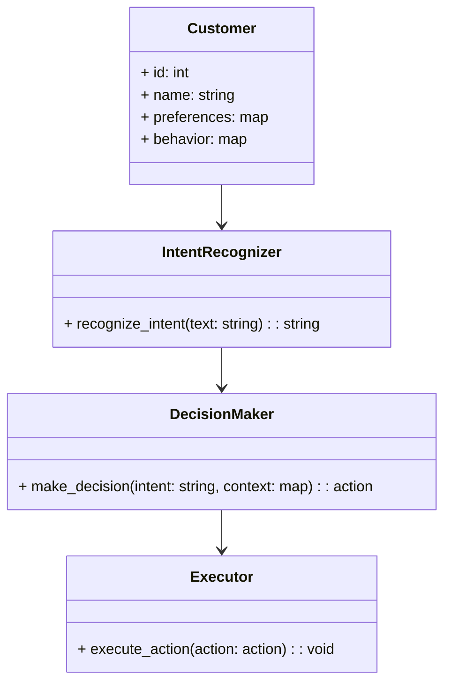
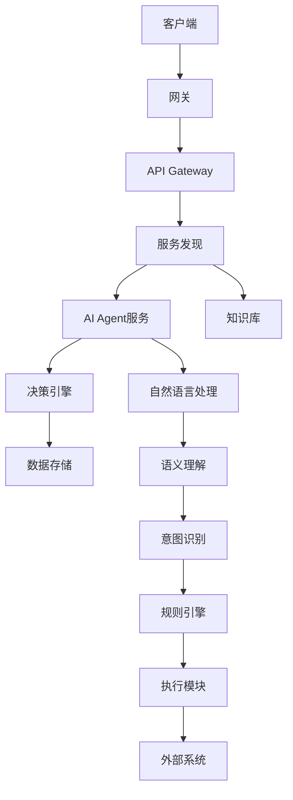
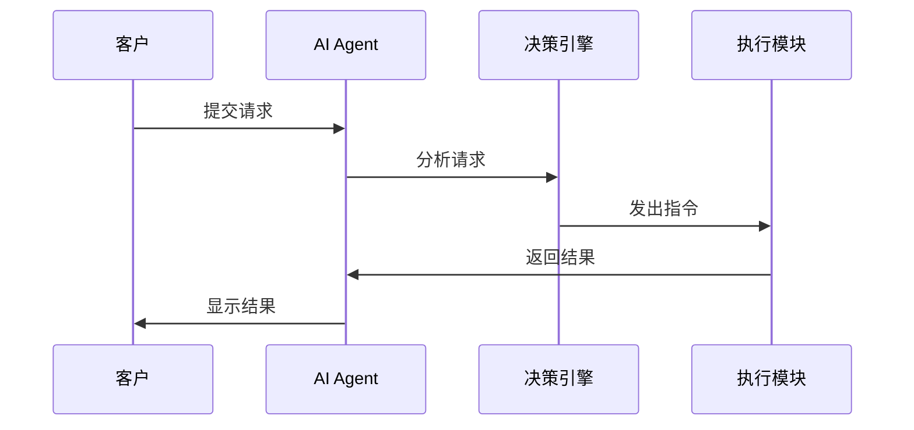

                 

<think>
好的，我来详细分析一下如何撰写这篇关于AI Agent在企业客户体验优化中的角色的文章。

首先，我需要明确文章的主题和目标读者。这篇文章是针对技术人员、企业决策者以及对AI技术感兴趣的读者，旨在探讨AI Agent在提升企业客户体验中的具体应用和价值。

接下来，我考虑文章的结构。根据用户的要求，我将文章分为几个主要部分，包括背景介绍、核心概念、算法原理、系统分析、项目实战、最佳实践和小结。每个部分都需要详细展开，确保内容全面且有深度。

在背景介绍部分，我需要解释什么是AI Agent，它如何在企业客户体验中发挥作用，以及当前的应用现状和未来趋势。这部分帮助读者建立基本的理解。

然后，核心概念部分将详细讲解AI Agent的定义、类型、工作原理，并与其他技术进行对比，帮助读者区分不同概念之间的差异。这部分需要使用表格和图表来辅助说明，确保内容清晰易懂。

算法原理部分是技术性的重点，我将详细解释自然语言处理、机器学习和知识图谱等技术在AI Agent中的应用。这部分需要通过mermaid流程图和数学公式来展示算法的工作流程和模型，使读者能够理解其背后的科学原理。

系统分析与架构设计部分将介绍如何在企业环境中应用AI Agent，包括系统功能设计、架构图、接口设计和交互流程。这部分需要实际案例的支持，展示AI Agent在不同场景下的应用，帮助读者理解其在实际中的效果。

项目实战部分将指导读者如何安装环境、实现核心功能、分析案例。这部分需要提供具体的代码示例和详细的操作步骤，让读者能够动手实践，巩固所学知识。

最后，最佳实践和小结部分将总结全书内容，提供实用的建议和未来的展望，帮助读者将所学知识应用到实际工作中，并指导他们进一步的学习方向。

在写作过程中，我需要确保每个部分都详细且逻辑清晰，避免内容重复或遗漏重要知识点。同时，使用适当的图表和代码示例，能够增强文章的可读性和实用性。通过分步骤的分析和详细的技术说明，确保读者能够深入理解AI Agent在企业客户体验优化中的应用和价值。
</think>

# AI Agent在企业客户体验优化中的角色

**关键词**：AI Agent, 企业客户体验, 人工智能, 自然语言处理, 机器学习, 知识图谱

**摘要**：本文探讨了AI Agent在企业客户体验优化中的核心作用，从背景、技术原理到系统设计和项目实战，全面分析了AI Agent如何通过智能化交互、个性化服务和数据驱动的决策支持，提升企业的客户体验管理能力。文章详细介绍了AI Agent的核心概念、算法原理、系统架构，并结合实际案例展示了其在企业客户体验优化中的应用场景和实施方法。

---

## 第1章：AI Agent的定义与核心概念

### 1.1 AI Agent的基本定义

AI Agent（人工智能代理）是指能够感知环境并采取行动以实现目标的智能体。它通过处理输入信息、分析状态、做出决策并执行操作，从而实现与用户的交互或完成特定任务。

#### AI Agent的核心属性
- **自主性**：能够在没有人工干预的情况下独立运行。
- **反应性**：能够实时感知环境并做出响应。
- **目标导向性**：通过目标驱动行为，优化决策以实现最佳结果。
- **学习能力**：能够通过数据和经验不断优化自身性能。

### 1.2 AI Agent的类型

AI Agent可以根据功能、智能水平和应用场景进行分类，以下是主要的类型：

| 类型                | 描述                                                                 |
|---------------------|----------------------------------------------------------------------|
| 基于规则的AI Agent  | 通过预定义的规则和逻辑进行决策，适用于规则明确的场景。                  |
| 基于机器学习的AI Agent | 使用机器学习模型进行预测和决策，适用于复杂和动态变化的场景。        |
| 基于知识图谱的AI Agent | 利用知识图谱进行语义理解，适用于需要深度语义分析的场景。              |

### 1.3 AI Agent的工作原理

AI Agent的工作流程可以分为以下几个步骤：

1. **输入处理**：接收用户的输入，如文本、语音或图像。
2. **状态分析**：解析输入内容，分析当前状态和需求。
3. **行为决策**：基于分析结果，选择合适的行动方案。
4. **输出执行**：执行决策并返回结果。

### 1.4 AI Agent在企业客户体验中的角色

AI Agent在企业客户体验优化中扮演着关键角色，包括：

- **客户交互的智能化**：通过自然语言处理和机器学习，提供智能客服、个性化推荐等服务。
- **个性化服务的实现**：根据客户行为和偏好，提供定制化的产品和服务。
- **数据驱动的决策支持**：利用数据分析和预测模型，优化客户体验管理策略。

### 1.5 本章小结

本章详细介绍了AI Agent的基本定义、类型和工作原理，并重点阐述了其在企业客户体验优化中的核心作用，为后续的技术分析和系统设计奠定了基础。

---

## 第2章：AI Agent的核心技术

### 2.1 自然语言处理（NLP）

自然语言处理是AI Agent实现智能交互的核心技术之一。

#### NLP的基本概念
自然语言处理（NLP）是指计算机对人类语言的理解和生成。它涉及文本解析、语义分析、情感分析等技术。

#### NLP在AI Agent中的应用
- **文本解析**：将用户的输入文本转化为结构化的数据，以便进一步处理。
- **语义理解**：理解文本的深层含义，识别用户的意图和需求。
- **对话生成**：根据分析结果生成自然流畅的回复。

#### 常见NLP模型
- **BERT**：一种基于Transformer的预训练语言模型，广泛应用于文本理解和生成。
- **GPT**：生成式预训练模型，能够生成连贯且自然的文本。

### 2.2 机器学习（ML）

机器学习是AI Agent实现智能决策的重要技术。

#### 监督学习
- **定义**：通过标记的训练数据，学习输入与输出之间的映射关系。
- **应用**：用于分类、回归等任务，如客户情感分析、需求预测。

#### 无监督学习
- **定义**：在无标签数据上进行学习，发现数据中的隐含结构。
- **应用**：用于聚类、主题挖掘等任务，如客户分群、热点话题分析。

#### 强化学习
- **定义**：通过与环境的交互，学习最优策略以最大化累积奖励。
- **应用**：用于智能决策和优化，如游戏AI、机器人控制。

### 2.3 知识图谱与语义理解

知识图谱是一种结构化的数据表示方式，用于存储和组织知识。

#### 知识图谱的构建
- **数据收集**：从多种来源收集数据，如文本、数据库、API等。
- **实体识别**：识别文本中的实体并建立关联。
- **知识推理**：通过逻辑推理扩展知识图谱。

#### 语义理解的实现
- **语义分析**：理解文本的深层含义，识别实体之间的关系。
- **意图识别**：识别用户的意图，如查询、预订、投诉等。

### 2.4 本章小结

本章详细介绍了AI Agent的核心技术，包括自然语言处理、机器学习和知识图谱。这些技术共同支撑了AI Agent的智能交互和决策能力，为后续的系统设计和项目实施提供了技术基础。

---

## 第3章：AI Agent的算法原理

### 3.1 基于规则的AI Agent算法

基于规则的AI Agent通过预定义的规则进行决策。

#### 规则的定义与实现
- **规则定义**：规则通常以If-Else语句的形式定义，如If天气是晴天，Then推荐穿轻便衣物。
- **规则实现**：通过编程语言（如Python）实现规则的判断和执行。

#### 规则的优先级与冲突解决
- **规则优先级**：根据规则的重要性设定优先级，优先执行高优先级的规则。
- **冲突解决**：当多个规则同时满足时，采用优先级或其他策略（如随机选择）来解决冲突。

### 3.2 基于机器学习的AI Agent算法

基于机器学习的AI Agent通过模型进行预测和决策。

#### 监督学习模型
- **线性回归**：用于回归任务，如预测客户满意度。
- **支持向量机（SVM）**：用于分类任务，如识别客户情感。

#### 无监督学习模型
- **K均值聚类**：用于客户分群。
- **主题模型（LDA）**：用于主题挖掘。

### 3.3 基于知识图谱的AI Agent算法

基于知识图谱的AI Agent通过语义理解进行决策。

#### 知识图谱构建算法
- **实体识别**：使用命名实体识别（NER）技术提取文本中的实体。
- **关系抽取**：识别实体之间的关系，如公司-产品关系。

#### 语义理解算法
- **意图识别**：使用机器学习模型识别用户的意图。
- **实体链接**：将识别出的实体链接到知识图谱中的具体概念。

### 3.4 本章小结

本章详细介绍了AI Agent的算法原理，包括基于规则、机器学习和知识图谱的算法。这些算法为AI Agent提供了强大的决策能力和智能交互能力。

---

## 第4章：AI Agent的系统分析与架构设计

### 4.1 问题场景介绍

#### 客户体验优化的挑战
- **客户需求多样化**：不同客户的需求和偏好各不相同。
- **数据孤岛**：企业内部数据分散，难以统一管理。
- **实时响应**：客户期望得到快速的响应和个性化的服务。

#### 项目介绍
- **目标**：通过AI Agent优化企业客户体验，提升客户满意度和忠诚度。
- **范围**：涵盖客户服务、产品推荐、投诉处理等多个场景。

### 4.2 系统功能设计

#### 领域模型设计
- **客户信息管理**：存储客户的基本信息、行为数据和偏好。
- **需求分析**：分析客户的输入，识别需求和意图。
- **决策与执行**：根据分析结果做出决策并执行。

#### 领域模型类图


### 4.3 系统架构设计

#### 系统架构图


### 4.4 系统接口设计

#### 输入接口
- **自然语言处理接口**：接收用户的文本输入，返回解析结果。
- **意图识别接口**：识别用户的意图，返回意图标签。

#### 输出接口
- **决策执行接口**：根据意图，执行相应的操作，如发送邮件、更新数据库。
- **反馈接口**：返回执行结果或错误信息。

### 4.5 系统交互流程

#### 交互流程图


### 4.6 本章小结

本章通过系统分析和架构设计，详细描述了AI Agent在企业客户体验优化中的实现方案。通过类图和流程图的展示，清晰地呈现了系统的各个组成部分及其交互关系。

---

## 第5章：AI Agent的项目实战

### 5.1 环境安装

#### 安装Python环境
- 使用Anaconda安装Python 3.8及以上版本。
- 安装必要的库，如`transformers`、`numpy`、`scikit-learn`。

#### 安装NLP库
- 使用以下命令安装常用的NLP库：
  ```bash
  pip install transformers numpy scikit-learn
  ```

### 5.2 核心代码实现

#### 自然语言处理模块
```python
from transformers import pipeline

# 初始化自然语言处理管道
nlp = pipeline("text-classification", model="text-classification")

# 文本分类示例
def classify_text(text):
    result = nlp(text)
    return result[0]['label']
```

#### 意图识别模块
```python
from sklearn.feature_extraction.text import TfidfVectorizer
from sklearn.naive_bayes import MultinomialNB

# 初始化向量器和分类器
vectorizer = TfidfVectorizer()
classifier = MultinomialNB()

# 训练模型
def train_model(X, y):
    vectorizer.fit(X)
    X_vec = vectorizer.transform(X)
    classifier.fit(X_vec, y)

# 预测意图
def predict_intent(text, X, y):
    X_new = [text]
    X_new_vec = vectorizer.transform(X_new)
    return classifier.predict(X_new_vec)[0]
```

### 5.3 案例分析与解读

#### 案例：客户投诉处理
- **输入**：客户发送一条投诉信息。
- **处理流程**：
  1. 自然语言处理模块对文本进行分类，识别出投诉类别。
  2. 意图识别模块进一步细化投诉内容，确定具体的问题。
  3. 决策引擎根据分类结果，调用相应的处理流程。
  4. 执行模块处理投诉并反馈结果。

### 5.4 项目总结

#### 成功经验
- **技术实现**：通过自然语言处理和机器学习实现智能分类和意图识别。
- **系统设计**：模块化设计使系统易于扩展和维护。

#### 改进方向
- **模型优化**：引入更先进的NLP模型，如BERT，提升分类准确率。
- **数据增强**：通过数据增强技术，增加训练数据的多样性。

### 5.5 本章小结

本章通过具体的项目实战，详细讲解了AI Agent的实现过程。从环境安装到代码实现，再到案例分析，帮助读者掌握AI Agent在企业客户体验优化中的具体应用。

---

## 第6章：最佳实践与小结

### 6.1 最佳实践

#### 技术实现方面
- **模型选择**：根据具体场景选择合适的模型和算法。
- **数据管理**：确保数据质量和多样性，避免数据偏差。
- **系统优化**：通过日志监控和性能调优，提升系统的稳定性和响应速度。

#### 应用场景方面
- **客户分群**：根据客户特征和行为，进行客户分群，制定差异化策略。
- **实时反馈**：通过实时数据分析，快速响应客户的需求和反馈。
- **多渠道集成**：将AI Agent集成到多种渠道，如网站、APP、社交媒体，提供统一的服务入口。

### 6.2 小结

AI Agent作为企业客户体验优化的重要工具，通过智能化的交互和个性化的服务，显著提升了客户满意度和忠诚度。本文从技术原理到系统设计，再到项目实战，全面探讨了AI Agent的应用场景和实现方法，为企业的数字化转型提供了有力支持。

### 6.3 注意事项

- **数据隐私**：在处理客户数据时，必须遵守相关法律法规，保护客户隐私。
- **系统容错性**：设计时考虑系统的容错性和可扩展性，确保在高并发场景下的稳定运行。
- **用户体验**：注重用户体验设计，确保AI Agent的交互流程简洁明了，避免让用户感到困惑。

### 6.4 拓展阅读

- **《Deep Learning》——Ian Goodfellow**
- **《Natural Language Processing with PyTorch》——Andrej Karpathy**
- **《Hands-On Machine Learning with Scikit-Learn, Keras, and TensorFlow》——Aurélien Géron**

---

## 作者：AI天才研究院/AI Genius Institute & 禅与计算机程序设计艺术 /Zen And The Art of Computer Programming

---

通过以上目录和内容，我们可以看到，AI Agent在企业客户体验优化中的应用是一个复杂而有趣的过程。从技术实现到系统设计，再到实际应用，每一部分都需要深入理解和精心设计。希望本文能为读者提供有价值的参考和启发。

