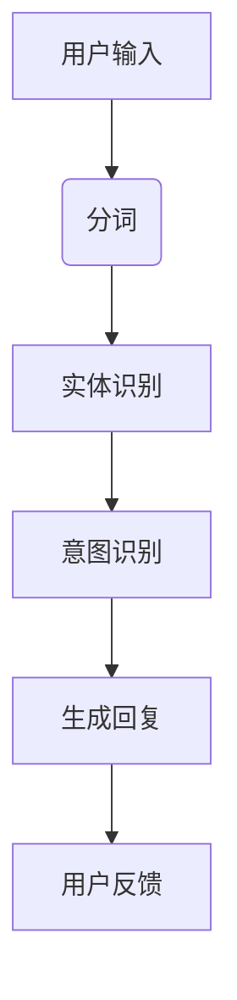
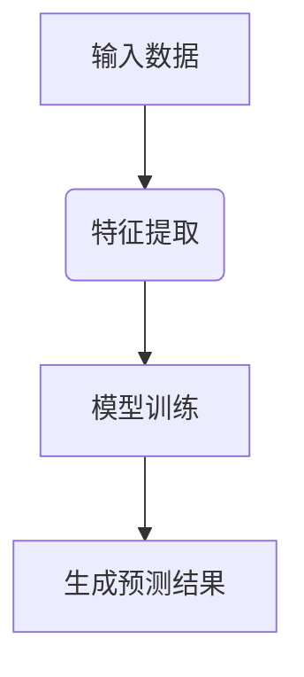
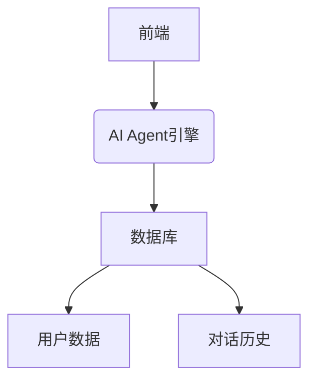

                 

<think>
嗯，用户希望我撰写一篇关于《AI Agent在企业客户服务自动化中的角色》的技术博客，要求内容详细、结构清晰，并且包含丰富的技术细节和案例分析。用户还提供了详细的目录结构，包括概述、核心技术、设计原则、工具实现、应用场景、系统设计、实战和未来趋势等部分。

首先，我需要理解每个章节的核心内容。第一章是概述，介绍AI Agent的基本概念和其在企业客户服务中的作用。我需要确保内容简单易懂，适合不同背景的读者理解。

接下来是第二章，讲解AI Agent的核心技术，包括自然语言处理、机器学习和对话系统。这部分需要深入浅出地解释这些技术如何支持AI Agent的功能，并结合实际案例说明。

第三章是设计原则，这部分需要详细阐述设计AI Agent时应遵循的原则，比如以用户为中心、可扩展性等。同时，还需要提供一些最佳实践的建议，帮助读者在实际项目中应用这些原则。

第四章是关于工具和技术实现，这里需要介绍一些常用的开发框架，如Rasa、Dialogflow等，并比较它们的优缺点。同时，要指导读者如何选择和部署合适的模型，以及开发流程中的工具链。

第五章是应用场景与案例分析，这部分需要展示AI Agent在企业客户中的实际应用，比如售前咨询、售后服务等。通过具体的案例分析，让读者更好地理解AI Agent在实际中的效果和挑战。

第六章是系统设计，包括对话树设计、系统架构和接口设计。这部分需要详细的技术分析，可能需要使用Mermaid图来展示系统结构和交互流程，帮助读者更好地理解复杂的设计。

第七章是实战部分，这里需要提供一个具体的项目案例，包括环境安装、代码实现、案例分析和项目小结。这部分需要动手实践，让读者能够应用所学知识，巩固理解。

最后是第八章，展望未来趋势，讨论AI Agent技术的发展方向，以及企业在应用中可能面临的新挑战和机会。

在写作过程中，我需要确保每个章节都有足够的细节，比如在第二章中，不仅要解释自然语言处理和机器学习的基本原理，还要用Mermaid图展示流程，并提供Python代码示例。这样，读者可以不仅理解理论，还能实际操作。

此外，用户还要求使用技术语言，但保持简单易懂，所以在解释复杂的技术时，我会尽量结合实际场景和通俗的例子，帮助读者更好地理解。

最后，整篇文章需要有逻辑性，每个部分之间要有自然的过渡，确保读者能够顺畅地跟随内容，逐步深入理解AI Agent在企业客户服务中的应用和价值。
</think>

# AI Agent在企业客户服务自动化中的角色

## 关键词：AI Agent, 企业客户, 自动化服务, 自然语言处理, 机器学习, 对话系统, 企业系统架构

## 摘要：AI Agent（人工智能代理）正在逐步改变企业客户服务的方式。通过自然语言处理、机器学习和深度学习等技术，AI Agent能够实现自动化、智能化的客户服务，提升客户满意度和企业效率。本文将从AI Agent的基本概念、核心技术、设计原则、应用场景、系统架构、开发实践和未来趋势等多个方面，深入分析AI Agent在企业客户服务自动化中的角色和价值。

---

# 第一部分: AI Agent在企业客户服务自动化中的角色概述

## 第1章: AI Agent的基本概念与核心作用

### 1.1 AI Agent的定义与特点

- **1.1.1 什么是AI Agent？**
  AI Agent是一种能够感知环境、执行任务并做出决策的智能实体。它通过自然语言处理（NLP）、机器学习（ML）和深度学习（DL）等技术，实现与用户的交互，并完成特定的任务。

- **1.1.2 AI Agent的核心特点**
  | 特性 | 描述 |
  |------|------|
  | 智能性 | 能够理解上下文，执行复杂任务 |
  | 自主性 | 能够在没有人工干预的情况下运行 |
  | 可扩展性 | 支持多种场景和任务的扩展 |
  | 实时性 | 能够快速响应用户需求 |

- **1.1.3 AI Agent与传统客服系统的主要区别**
  - 传统客服系统：基于规则的自动回复，无法处理复杂问题。
  - AI Agent：基于机器学习和NLP，能够理解上下文，处理复杂问题。

### 1.2 企业客户服务自动化的背景与需求

- **1.2.1 传统客户服务的痛点**
  - 响应速度慢
  - 服务成本高
  - 服务质量不稳定

- **1.2.2 企业对自动化服务的需求**
  - 提高客户满意度
  - 降低运营成本
  - 提升服务效率

- **1.2.3 AI Agent在企业客户中的应用场景**
  - 售前咨询
  - 售后服务
  - 技术支持
  - 信息查询

### 1.3 本章小结

通过本章的介绍，我们了解了AI Agent的基本概念、特点以及其在企业客户服务中的重要作用。接下来，我们将深入探讨AI Agent的核心技术与实现原理。

---

## 第2章: AI Agent的核心技术与实现原理

### 2.1 自然语言处理技术

- **2.1.1 NLP的基本概念**
  自然语言处理（NLP）是研究如何让计算机理解和生成人类语言的学科。

- **2.1.2 常见的NLP技术**
  - 分词（Tokenization）
  - 实体识别（Named Entity Recognition）
  - 情感分析（Sentiment Analysis）
  - 机器翻译（Machine Translation）

- **2.1.3 NLP在AI Agent中的应用**
  - 用户意图识别
  - 文本摘要
  - 对话生成

#### 使用Mermaid图展示NLP在AI Agent中的流程



### 2.2 机器学习与深度学习

- **2.2.1 机器学习的基本原理**
  机器学习是一种通过数据训练模型，使其能够从数据中学习规律的技术。

- **2.2.2 深度学习的核心算法**
  - 卷积神经网络（CNN）
  - 循环神经网络（RNN）
  - 变量自编码器（VAE）

- **2.2.3 机器学习在AI Agent中的应用**
  - 用户行为预测
  - 对话系统优化
  - 情感分析

#### 使用Mermaid图展示机器学习在AI Agent中的流程



### 2.3 对话系统的设计与实现

- **2.3.1 对话系统的整体架构**
  - 用户输入
  - 意图识别
  - 生成回复

- **2.3.2 对话系统的训练与优化**
  - 数据标注
  - 模型调优
  - 系统测试

- **2.3.3 基于规则的对话系统与基于模型的对话系统对比**
  | 对比维度 | 基于规则 | 基于模型 |
  |----------|----------|----------|
  | 灵活性   | 低       | 高       |
  | 开发难度 | 低       | 高       |
  | 可扩展性 | 低       | 高       |

### 2.4 本章小结

通过本章的介绍，我们了解了AI Agent的核心技术，包括自然语言处理、机器学习和对话系统的设计与实现。接下来，我们将探讨AI Agent的设计原则与最佳实践。

---

## 第3章: AI Agent的设计原则与最佳实践

### 3.1 设计AI Agent的五大原则

- **以用户为中心的设计理念**
  - 用户体验是设计的核心。
  - 确保对话流程简洁明了。

- **简洁性与易用性原则**
  - 避免复杂的功能设计。
  - 提供清晰的用户指引。

- **可扩展性与可维护性原则**
  - 系统设计要预留扩展接口。
  - 确保代码的可维护性。

- **安全性与隐私保护原则**
  - 保护用户数据的安全。
  - 遵守相关法律法规。

- **可解释性与透明性原则**
  - 确保系统的决策过程可被解释。
  - 提供透明的用户反馈机制。

### 3.2 AI Agent的对话设计与优化

- **对话流程的设计**
  - 明确用户意图。
  - 设计合理的对话树。

- **对话树的构建与优化**
  - 使用树状结构表示对话流程。
  - 定期优化对话路径，提升用户体验。

- **对话系统的可扩展性设计**
  - 留出接口，方便后续功能扩展。
  - 设计模块化的对话组件。

### 3.3 本章小结

通过本章的介绍，我们了解了AI Agent的设计原则与最佳实践。接下来，我们将探讨AI Agent的主流工具与技术实现。

---

## 第4章: AI Agent的主流工具与技术实现

### 4.1 常见的AI Agent开发框架

- **Rasa**
  - 开源的对话系统框架。
  - 支持多种语言和数据格式。

- **Dialogflow**
  - Google提供的对话系统平台。
  - 提供丰富的API和工具。

- **Microsoft Bot Framework**
  - 微软提供的机器人开发框架。
  - 支持多种平台和语言。

- **其他开源框架对比**
  | 框架名称 | 开源性 | 支持语言 | 主要功能 |
  |----------|--------|----------|----------|
  | Rasa     | 开源    | Python    | 对话系统 |
  | Dialogflow | 闭源   | Python/JavaScript | 对话系统 |
  | Bot Framework | 开源    | C#，JavaScript | 机器人开发 |

### 4.2 自然语言处理模型的选择与部署

- **预训练模型的选择**
  - GPT系列：适合生成性任务。
  - BERT系列：适合理解性任务。

- **模型的微调与优化**
  - 根据具体任务调整模型参数。
  - 使用少量数据进行微调。

- **模型的部署与应用**
  - 将模型部署到云服务器。
  - 通过API接口调用模型。

### 4.3 AI Agent的开发流程与工具链

- **开发流程概述**
  1. 需求分析
  2. 数据收集与标注
  3. 模型训练与优化
  4. 系统集成与测试

- **开发工具的选择与使用**
  - 数据标注工具：Label Studio
  - 模型训练工具：TensorFlow，PyTorch
  - 系统集成工具：Docker，Kubernetes

- **CI/CD在AI Agent开发中的应用**
  - 持续集成：自动化测试和构建。
  - 持续交付：自动化部署和发布。

### 4.4 本章小结

通过本章的介绍，我们了解了AI Agent的主流工具与技术实现。接下来，我们将探讨AI Agent在企业客户中的应用场景与案例分析。

---

## 第5章: AI Agent在企业客户中的应用场景与案例分析

### 5.1 售前咨询与客户支持

- **售前咨询的自动化处理**
  - 用户需求分析。
  - 产品信息查询。

- **客户支持的智能化服务**
  - 常见问题解答。
  - 技术支持。

- **案例分析：某电商平台的AI Agent应用**
  - 用户咨询产品信息。
  - AI Agent自动回答问题。

### 5.2 售后服务与客户反馈

- **售后服务的自动化流程**
  - 用户反馈收集。
  - 问题分类与处理。

- **客户反馈的智能化分析**
  - 情感分析。
  - 反馈数据挖掘。

- **案例分析：某银行的AI Agent应用**
  - 用户查询账户信息。
  - AI Agent自动处理交易。

### 5.3 本章小结

通过本章的案例分析，我们了解了AI Agent在企业客户中的应用场景。接下来，我们将探讨AI Agent的系统设计与实现。

---

## 第6章: AI Agent的系统设计与实现

### 6.1 系统功能设计

- **领域模型设计**
  - 用户信息管理。
  - 对话历史记录。

- **系统架构设计**
  - 前端：用户界面。
  - 后端：AI Agent引擎。
  - 数据库：存储用户数据和对话历史。

#### 使用Mermaid图展示系统架构



### 6.2 系统接口设计

- **API接口设计**
  - GET /api/v1/chat
  - POST /api/v1/message

- **接口文档编写**
  - 使用OpenAPI规范。

### 6.3 系统交互设计

- **交互流程设计**
  - 用户发送消息。
  - 系统解析并生成回复。
  - 用户接收回复。

#### 使用Mermaid图展示系统交互流程

```mermaid
graph TD
    A[用户] --> B[前端]
    B --> C[A

