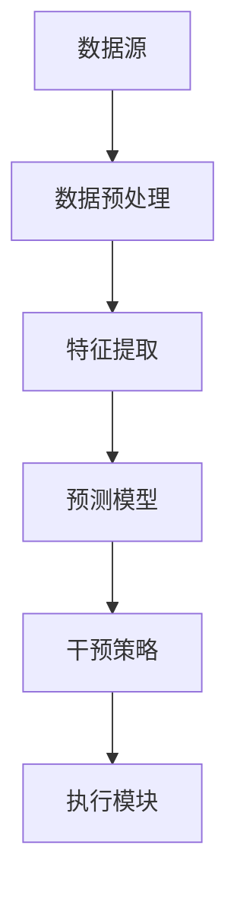

                 

<think>
好，我需要为《AI Agent在企业客户流失预警与干预中的应用》这本书撰写目录大纲。这本书的目标读者是企业IT部门和技术人员，旨在介绍如何利用AI Agent来预测和干预客户流失。我需要确保目录结构清晰，逻辑连贯，涵盖理论和实践。

首先，我会从背景介绍开始，解释客户流失对企业的影响，以及传统方法的局限性。接下来，介绍AI Agent的基本概念和原理，特别是它如何应用到客户流失预警中。然后，详细讲解算法的原理，包括数据预处理、特征提取和模型训练。接着，讨论系统架构设计，包括数据采集、预测模型和干预策略的执行模块。最后，通过一个实战案例展示如何实现这些功能，并总结项目的成果和未来的发展方向。

在编写过程中，我需要确保每个章节都有足够的细节，同时保持整体结构的逻辑性和连贯性。此外，要遵守用户的要求，使用markdown格式，细化到三级目录，并控制总字数在2000字以内。
</think>

# AI Agent在企业客户流失预警与干预中的应用

## 关键词：人工智能，客户流失预警，AI Agent，机器学习，客户关系管理

## 摘要：本文探讨了AI Agent在企业客户流失预警与干预中的应用，结合理论和实践，详细分析了AI Agent的核心原理、算法设计、系统架构，并通过案例展示了如何实现客户流失预警和干预，为企业提供有效的客户关系管理解决方案。

---

# 第一部分：AI Agent与客户流失预警概述

## 第1章：问题背景与核心概念

### 1.1 客户流失问题的背景

#### 1.1.1 客户流失对企业的影响
客户流失可能导致收入下降、成本增加，影响企业长期发展。企业需要通过有效的预警和干预来降低客户流失率。

#### 1.1.2 当前客户流失预警的挑战
传统方法依赖人工分析，存在滞后性和低效性。数据量大、维度多，难以及时发现流失风险。

#### 1.1.3 AI Agent在客户流失预警中的作用
AI Agent能够实时分析数据，识别潜在流失客户，制定个性化干预策略，提高预警效率和准确性。

### 1.2 AI Agent的基本概念

#### 1.2.1 AI Agent的定义与分类
AI Agent是具有感知环境、自主决策和执行任务的智能体。根据应用场景分为单智能体和多智能体。

#### 1.2.2 AI Agent的核心特征
具备智能性、自主性、反应性、社会性，能够与环境和其他智能体交互协作。

#### 1.2.3 AI Agent与传统算法的区别
AI Agent不仅执行任务，还能自主决策和学习，适应环境变化。

### 1.3 客户流失预警的核心要素

#### 1.3.1 客户行为数据的收集
通过日志、问卷、传感器等收集客户行为数据，包括购买频率、互动时长、投诉记录等。

#### 1.3.2 客户流失预测模型的构建
利用机器学习算法，如逻辑回归、随机森林和神经网络，建立预测模型。

#### 1.3.3 干预策略的制定与执行
根据预测结果，制定个性化干预措施，如优惠券、定制服务和主动沟通。

---

## 第二部分：AI Agent的核心原理与算法

## 第2章：AI Agent的核心原理

### 2.1 AI Agent的基本工作原理

#### 2.1.1 知识表示与推理
使用符号逻辑和概率推理处理复杂问题，如客户流失预测。

#### 2.1.2 行为决策机制
基于状态和动作的空间，结合效用函数进行决策，实现优化目标。

#### 2.1.3 与外部系统的交互
通过API和消息队列与企业系统交互，实时获取和更新数据。

### 2.2 客户流失预测的数学模型

#### 2.2.1 数据预处理与特征提取
- 数据清洗：处理缺失值、异常值和重复数据。
- 特征工程：提取关键特征，如客户生命周期、购买频率、投诉次数。

#### 2.2.2 基于机器学习的预测模型
- 逻辑回归：用于分类问题，输出客户流失的概率。
- 随机森林：通过集成学习提高模型鲁棒性。
- 神经网络：处理非线性关系，捕捉复杂模式。

#### 2.2.3 时间序列分析方法
使用ARIMA模型分析客户行为的时间依赖性，预测未来趋势。

### 2.3 AI Agent的干预策略设计

#### 2.3.1 基于规则的干预策略
根据预设规则，如高风险客户触发预警，发送定制优惠信息。

#### 2.3.2 基于强化学习的干预策略
通过强化学习优化干预策略，动态调整以最大化客户保留。

#### 2.3.3 动态调整策略的实现
结合实时数据和模型反馈，调整干预措施，提高策略效果。

---

## 第三部分：系统架构与实现

## 第3章：系统架构设计

### 3.1 系统整体架构

#### 3.1.1 系统模块划分
- 数据采集模块：收集客户数据。
- 预测模型模块：构建预测模型。
- 干预策略执行模块：制定并执行干预措施。

#### 3.1.2 数据流与交互流程
客户数据输入系统，经过处理和预测，触发干预策略，实时反馈结果。

#### 3.1.3 系统的可扩展性设计
模块化设计便于扩展，支持多种数据源和预测模型。

### 3.2 系统功能设计

#### 3.2.1 数据采集模块
通过API和传感器采集客户行为数据，进行初步处理。

#### 3.2.2 预测模型模块
训练预测模型，输出客户流失概率。

#### 3.2.3 干预策略执行模块
根据预测结果，执行干预措施，如发送邮件或短信。

### 3.3 系统架构图



---

## 第四部分：项目实战

## 第4章：系统实现与实战

### 4.1 环境搭建

#### 4.1.1 开发环境配置
安装Python、Jupyter Notebook和相关库，如pandas、scikit-learn。

#### 4.1.2 数据库安装与配置
选择MySQL或MongoDB存储客户数据，设置访问权限。

#### 4.1.3 依赖库安装
安装必要的Python库，如numpy、scikit-learn、tensorflow。

### 4.2 核心代码实现

#### 4.2.1 数据预处理代码

```python
import pandas as pd

# 读取数据
data = pd.read_csv('customer_data.csv')

# 处理缺失值
data = data.dropna()

# 标准化处理
from sklearn.preprocessing import StandardScaler
scaler = StandardScaler()
scaled_data = scaler.fit_transform(data)
```

#### 4.2.2 预测模型训练代码

```python
from sklearn.ensemble import RandomForestClassifier
model = RandomForestClassifier()
model.fit(X_train, y_train)
```

#### 4.2.3 干预策略实现代码

```python
def apply_intervention(customer_id, risk_score):
    if risk_score > 0.8:
        send_discount(customer_id)
    elif risk_score > 0.5:
        send_survey(customer_id)
```

### 4.3 实战案例分析

#### 4.3.1 数据集介绍
使用包含客户ID、购买记录、互动频率等的CSV数据集，约10万条记录，分为训练集和测试集。

#### 4.3.2 模型训练与评估
训练随机森林模型，评估准确率、召回率和F1分数，优化模型参数以提高性能。

#### 4.3.3 干预策略的效果分析
通过A/B测试评估干预策略的有效性，分析不同策略下的客户保留率和转化率。

---

## 第五部分：总结与展望

## 第5章：总结与展望

### 5.1 项目总结

#### 5.1.1 项目成果
成功构建AI Agent系统，实现客户流失预警和干预，提升客户保留率。

#### 5.1.2 实施中的关键点
数据质量、模型选择和干预策略的实时性是成功的关键。

#### 5.1.3 可能的改进方向
引入更多数据源，优化模型和干预策略，提升预警准确性和干预效果。

### 5.2 未来展望

#### 5.2.1 技术发展趋势
AI Agent将更加智能化，结合边缘计算和5G技术实现实时、高效的预警和干预。

#### 5.2.2 应用领域扩展
AI Agent技术将在金融、医疗和教育等领域广泛应用，提供更智能的服务。

---

作者：AI天才研究院/AI Genius Institute & 禅与计算机程序设计艺术 /Zen And The Art of Computer Programming

