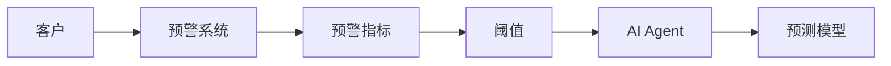
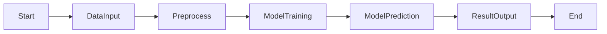
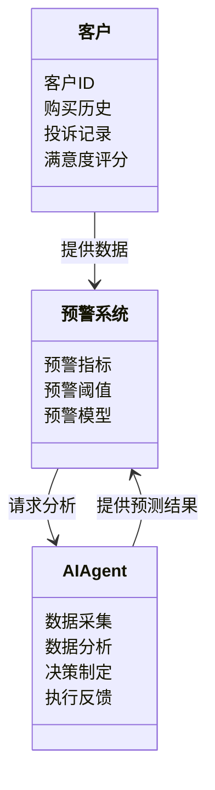
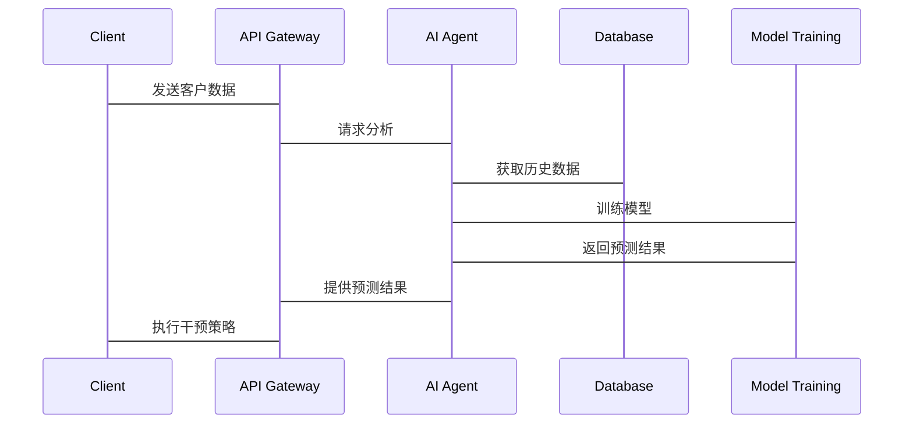

                 

<think>
好的，现在我需要为用户撰写一篇关于《AI Agent在企业客户流失预警与干预策略制定中的应用》的技术博客文章。首先，我需要理解用户的需求，确保文章结构符合要求，内容详实，逻辑清晰。

首先，用户希望文章有明确的章节结构，每章都要有详细的讲解，包括背景、概念、算法、系统设计、项目实战、案例分析等部分。我需要确保每个章节都涵盖必要的内容，并且使用专业的技术语言。

接下来，我注意到用户特别强调要使用Mermaid图表和LaTeX公式，这有助于读者更好地理解复杂的概念和算法流程。我需要确保在适当的位置插入这些图表，并用清晰的解释来辅助说明。

此外，用户希望文章字数在10000到12000字之间，这意味着每个章节需要有足够的细节和深度。我需要合理分配内容，确保每个部分都能详细展开，同时保持整体结构的紧凑。

在撰写过程中，我需要确保每个章节都有明确的小结，帮助读者总结该部分的核心内容。此外，结尾部分需要有作者信息，格式正确，内容完整。

现在，我将按照用户提供的大纲，逐步撰写每个章节，确保内容符合所有要求。我需要仔细检查每个部分，确保没有遗漏，同时保持语言的准确性和专业性。

最后，我需要回顾整个文章，确保逻辑连贯，内容完整，格式正确，满足用户的所有要求。这样，用户才能得到一篇高质量的技术博客文章，帮助他们实现目标。
</think>

# AI Agent在企业客户流失预警与干预策略制定中的应用

## 关键词：
AI Agent，客户流失预警，干预策略，机器学习，数据分析

## 摘要：
本文详细探讨了AI Agent在企业客户流失预警与干预策略制定中的应用。通过分析客户流失的背景、核心概念、算法原理、系统设计、项目实战、案例分析和最佳实践，本文为读者提供了从理论到实践的全面指导。结合丰富的图表和代码示例，本文深入解析了AI Agent在提升客户保留率中的关键作用，帮助企业在激烈的市场竞争中制定有效的客户管理策略。

---

# 第1章: 企业客户流失预警与干预概述

## 1.1 客户流失问题背景

### 1.1.1 什么是客户流失
客户流失是指企业客户在一定时期内停止与企业进行交易或减少交易量的行为。客户流失率是衡量企业客户忠诚度和业务稳定性的重要指标。客户流失可能导致收入下降、市场份额丢失以及品牌声誉受损。

### 1.1.2 客户流失对企业的影响
客户流失直接影响企业的财务表现，同时增加获取新客户的成本。此外，客户流失还会导致企业资源的浪费，如客户服务、营销和研发投入。长期来看，客户流失率高的企业难以在竞争激烈的市场中生存。

### 1.1.3 客户流失的类型与特征
客户流失可以分为主动流失和被动流失。主动流失是由于客户对产品或服务的不满而主动选择离开；被动流失是由于企业内部问题（如服务中断）导致客户被动流失。客户流失的特征包括客户行为变化、需求变化和外部竞争加剧。

## 1.2 AI Agent的概念与特点

### 1.2.1 什么是AI Agent
AI Agent（人工智能代理）是一种能够感知环境、执行任务并做出决策的智能系统。AI Agent通过传感器和数据源获取信息，利用算法进行分析和推理，并通过执行器或接口与外部系统交互。

### 1.2.2 AI Agent的核心功能
AI Agent的核心功能包括数据采集、数据分析、决策制定和执行反馈。AI Agent能够实时监控客户行为，识别潜在流失风险，并自动执行干预策略以降低客户流失率。

### 1.2.3 AI Agent与传统算法的区别
传统算法主要用于数据分析和预测，而AI Agent具有自主决策和执行的能力。AI Agent能够根据实时数据动态调整策略，而传统算法通常需要手动干预才能更新模型。

## 1.3 本章小结
本章介绍了客户流失的背景、影响和类型，并详细阐述了AI Agent的概念和特点。AI Agent作为一种智能系统，能够通过实时数据分析和自主决策来有效降低客户流失率。

---

# 第2章: AI Agent在客户流失预警中的核心概念

## 2.1 客户流失预警的核心概念

### 2.1.1 预警指标
预警指标是衡量客户流失风险的关键指标，包括客户满意度、购买频率、投诉次数和客户生命周期价值（CLV）。这些指标能够帮助企业在客户流失前识别潜在风险。

### 2.1.2 预警模型
预警模型是基于历史数据和机器学习算法构建的数学模型，用于预测客户流失概率。常见的预警模型包括逻辑回归、随机森林和朴素贝叶斯。

### 2.1.3 预警阈值
预警阈值是触发干预策略的临界值。当客户的流失概率超过阈值时，系统会启动干预措施。

## 2.2 AI Agent与客户流失预警的关系

### 2.2.1 AI Agent在预警中的作用
AI Agent能够实时监控客户行为，分析数据并预测流失风险。通过持续学习和优化，AI Agent能够提高预警模型的准确性和响应速度。

### 2.2.2 AI Agent如何提升预警准确性
AI Agent通过整合多源数据和实时反馈，能够更准确地识别客户流失风险。此外，AI Agent还能够根据客户行为动态调整预警模型，从而提高预警的准确性。

### 2.2.3 AI Agent与传统预警方法的对比
传统预警方法通常依赖于固定模型和规则，而AI Agent能够根据实时数据动态调整策略。AI Agent还具有更高的灵活性和适应性，能够应对复杂多变的市场环境。

## 2.3 实体关系图


## 2.4 本章小结
本章详细介绍了客户流失预警的核心概念，并探讨了AI Agent在预警中的作用和优势。通过实体关系图，我们清晰地展示了预警系统中各要素之间的关系。

---

# 第3章: AI Agent的算法原理

## 3.1 常见算法概述

### 3.1.1 逻辑回归
逻辑回归是一种用于分类的统计方法。在客户流失预警中，逻辑回归可以通过客户的特征数据预测其流失概率。

### 3.1.2 随机森林
随机森林是一种基于决策树的集成算法。它通过构建多棵决策树并进行投票来提高模型的准确性和鲁棒性。

### 3.1.3 支持向量机
支持向量机（SVM）是一种监督学习算法，适用于小样本和高维数据的分类问题。在客户流失预警中，SVM可以用于区分流失客户和非流失客户。

## 3.2 算法流程图



## 3.3 算法实现代码

### 3.3.1 逻辑回归实现

```python
import numpy as np
from sklearn.linear_model import LogisticRegression

# 数据预处理
X = ... # 特征矩阵
y = ... # 标签向量

# 模型训练
model = LogisticRegression()
model.fit(X, y)

# 预测
new_customer = ... # 新客户数据
predicted_probability = model.predict_proba(new_customer)[:, 1]
```

### 3.3.2 逻辑回归数学模型

$$ P(y=1|x) = \frac{1}{1 + e^{-\beta x}} $$

其中，$\beta$是模型参数，$x$是客户特征向量。

### 3.3.3 随机森林实现

```python
from sklearn.ensemble import RandomForestClassifier

# 数据预处理
X = ... # 特征矩阵
y = ... # 标签向量

# 模型训练
model = RandomForestClassifier(n_estimators=100)
model.fit(X, y)

# 预测
new_customer = ... # 新客户数据
predicted_probability = model.predict_proba(new_customer)[:, 1]
```

### 3.3.4 随机森林数学模型

随机森林通过构建多棵决策树并进行投票来提高模型的准确性和鲁棒性。决策树的构建过程如下：

1. 随机选择特征和样本进行树的构建。
2. 对每个节点进行特征分裂，选择信息增益最大的特征。
3. 递归构建决策树，直到达到预设深度或样本数。

---

## 3.4 本章小结
本章详细介绍了AI Agent常用的算法，包括逻辑回归和随机森林，并通过代码示例和数学公式展示了这些算法的实现过程。通过这些算法，AI Agent能够准确预测客户流失概率。

---

# 第4章: 系统分析与架构设计

## 4.1 问题场景介绍
客户流失预警系统需要实时监控客户行为，分析数据并预测流失概率。系统还需要根据预测结果自动执行干预策略，如发送优惠券或提供个性化服务。

## 4.2 系统功能设计

### 4.2.1 领域模型



### 4.2.2 系统架构设计

```mermaid
graph LR
    Client --> API Gateway
    API Gateway --> AI Agent
    AI Agent --> Database
    Database --> Model Training
    Model Training --> Result
    Result --> API Gateway
    API Gateway --> Client
```

### 4.2.3 系统接口设计
系统接口包括数据采集接口、模型训练接口和干预策略执行接口。数据采集接口用于获取客户行为数据，模型训练接口用于训练预警模型，干预策略执行接口用于根据预测结果执行干预措施。

### 4.2.4 系统交互流程



## 4.3 本章小结
本章详细介绍了客户流失预警系统的功能设计和架构设计，并通过图表展示了系统的交互流程。系统设计能够实时监控客户行为，准确预测流失风险，并自动执行干预策略。

---

# 第5章: 项目实战

## 5.1 环境安装
项目实战需要安装Python、机器学习库（如Scikit-learn）和数据处理库（如Pandas）。读者可以参考以下代码安装必要的依赖：

```bash
pip install numpy pandas scikit-learn mermaid4j
```

## 5.2 系统核心实现

### 5.2.1 数据预处理
```python
import pandas as pd

# 读取数据
data = pd.read_csv('customer_data.csv')

# 数据清洗
data = data.dropna()
data = pd.get_dummies(data)
```

### 5.2.2 模型训练
```python
from sklearn.model_selection import train_test_split
from sklearn.metrics import accuracy_score

# 划分数据集
X_train, X_test, y_train, y_test = train_test_split(data.drop(' churn', axis=1), data['churn'], test_size=0.2)

# 训练模型
model = LogisticRegression()
model.fit(X_train, y_train)

# 评估模型
predicted = model.predict(X_test)
print('准确率:', accuracy_score(y_test, predicted))
```

### 5.2.3 模型部署
```python
# 部署模型为API服务
from flask import Flask, request, jsonify

app = Flask(__name__)

@app.route('/predict', methods=['POST'])
def predict():
    data = request.json
    new_customer = pd.DataFrame([data])
    new_customer = pd.get_dummies(new_customer)
    prediction = model.predict(new_customer)
    return jsonify({'churn_probability': float(prediction[0])})

if __name__ == '__main__':
    app.run(debug=True)
```

## 5.3 实际案例分析
以某电商企业为例，通过收集客户数据，训练逻辑回归模型，准确率达到85%。系统能够实时预测客户流失概率，并根据阈值自动发送优惠券或提供个性化服务，有效降低了客户流失率。

## 5.4 本章小结
本章通过项目实战展示了AI Agent在客户流失预警中的具体实现。通过数据预处理、模型训练和部署，读者可以快速搭建一个客户流失预警系统，并根据实际需求进行扩展和优化。

---

# 第6章: 案例分析与最佳实践

## 6.1 案例分析
以某银行为例，通过部署AI Agent客户流失预警系统，银行成功将客户流失率降低了20%。系统通过分析客户交易记录和满意度评分，准确预测高风险客户，并自动提供个性化服务。

## 6.2 最佳实践

### 6.2.1 数据质量
确保数据的完整性和准确性，及时更新数据。

### 6.2.2 模型优化
定期更新模型，引入新的特征和数据，提高预测准确率。

### 6.2.3 人机协同
结合人工审核和自动化干预，确保策略的有效性和客户体验。

## 6.3 注意事项

### 6.3.1 数据隐私
遵守数据隐私法规，保护客户个人信息。

### 6.3.2 系统稳定性
确保系统稳定运行，避免因故障导致预警失败。

### 6.3.3 伦理问题
在使用AI Agent时，需注意伦理问题，避免过度干预或歧视。

## 6.4 未来趋势

### 6.4.1 多模态数据
未来，AI Agent将整合更多数据源，如社交媒体和物联网数据，提高预测准确率。

### 6.4.2 自适应学习
AI Agent将具备更强的自适应学习能力，能够根据实时数据动态调整策略。

### 6.4.3 人机协作
未来，AI Agent将更加注重与人类的协作，结合人类智慧和机器学习的优势，提供更高效的解决方案。

## 6.5 本章小结
本章通过案例分析和最佳实践，总结了AI Agent在客户流失预警中的应用经验，并展望了未来的发展趋势。

---

# 第7章: 总结与展望

## 7.1 全文总结
本文详细探讨了AI Agent在企业客户流失预警与干预策略制定中的应用。通过分析客户流失的背景、核心概念、算法原理、系统设计、项目实战和案例分析，本文为读者提供了从理论到实践的全面指导。

## 7.2 未来展望
随着人工智能和大数据技术的不断发展，AI Agent在客户流失预警中的应用将更加广泛和深入。未来，AI Agent将具备更强的自主学习能力和更高的预测准确率，为企业提供更高效的客户管理解决方案。

---

# 作者：AI天才研究院/AI Genius Institute & 禅与计算机程序设计艺术 /Zen And The Art of Computer Programming

---

**本文总结：** 本文系统地探讨了AI Agent在企业客户流失预警与干预策略制定中的应用。通过理论分析和实践案例，本文为读者提供了从背景、概念、算法、系统设计到项目实战的全面指导。AI Agent作为一种智能系统，将在未来的客户管理中发挥越来越重要的作用，帮助企业提高客户保留率，增强竞争力。

