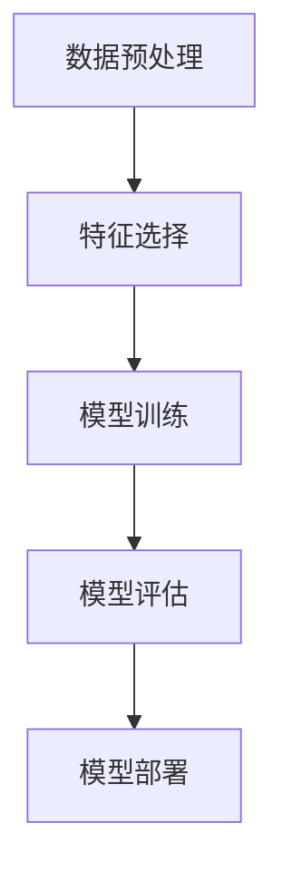
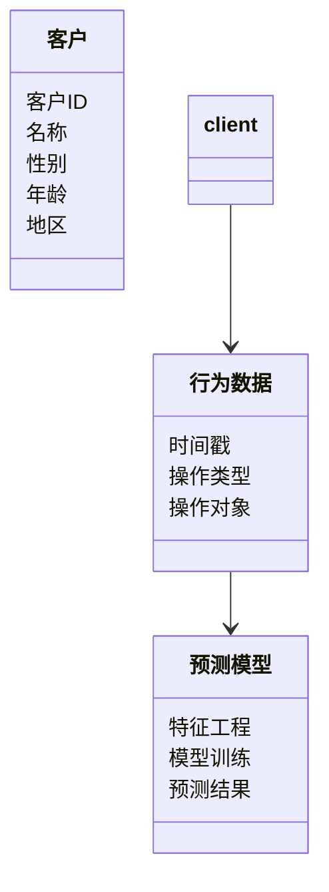
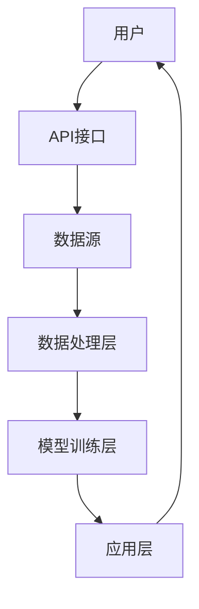
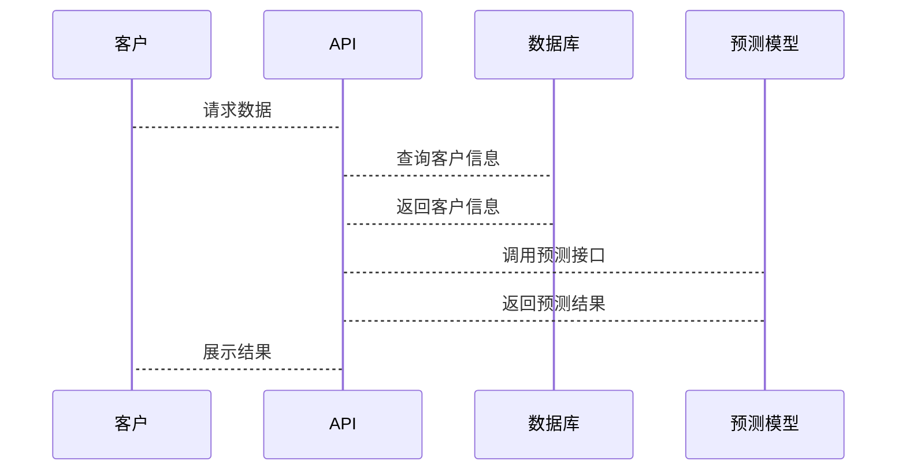

                 

<think>
嗯，用户现在要我帮他撰写一篇关于AI Agent在企业客户生命周期价值预测与管理中的应用的技术博客。首先，我得理解用户的需求。他希望文章结构清晰，逻辑紧凑，用专业的技术语言，同时要一步一步地分析推理，内容要深刻，有见解。

用户已经提供了详细的目录大纲，所以我需要按照这个结构来撰写文章。首先，我得从摘要开始，简明扼要地概括文章的核心内容。然后是关键词，列出5到7个相关的术语，比如AI Agent、客户生命周期、预测模型等等。

接下来是背景介绍，这部分需要涵盖AI Agent的基本概念和客户生命周期管理的重要性。我需要解释清楚什么是AI Agent，它与其他技术的区别，以及它在企业中的应用场景。同时，客户生命周期管理对企业的重要性，以及传统方法的不足之处，都是需要详细说明的。

然后是核心概念与原理，这部分要深入讲解AI Agent的组成和客户生命周期预测的数学模型。我得用mermaid流程图来展示算法的步骤，这样读者可以更直观地理解。同时，数学公式要用latex格式，确保准确无误。

接下来是系统分析与架构设计，这部分需要介绍系统的功能设计、架构图以及接口设计。我需要使用mermaid类图和架构图来展示系统的结构，这样读者可以清晰地看到各个模块之间的关系。

项目实战部分，我得提供具体的代码示例，解释每一步的作用，以及如何在实际中应用这些代码。同时，案例分析可以帮助读者更好地理解AI Agent在实际中的应用效果。

最后，我需要总结一下最佳实践，给出小结、注意事项和拓展阅读的内容，帮助读者进一步理解和应用这些知识。

在写作过程中，我需要确保每个部分都详细具体，同时保持语言的专业性和逻辑的清晰性。我还要注意使用适当的代码和图表，使文章更加生动有趣。总的来说，这是一篇结构严谨、内容详实的技术博客，旨在帮助企业更好地理解和应用AI Agent在客户管理中的价值。
</think>

# AI Agent在企业客户生命周期价值预测与管理中的应用

> 关键词：AI Agent，客户生命周期，价值预测，机器学习，深度学习，预测模型

> 摘要：本文深入探讨了AI Agent在企业客户生命周期价值预测与管理中的应用。从AI Agent的基本概念到客户生命周期管理的数学模型，从系统架构设计到项目实战，文章全面解析了如何利用AI Agent提升企业客户管理的智能化水平。通过详细分析AI Agent的核心算法、系统架构和实际案例，本文为企业客户提供了一套完整的解决方案，帮助企业在数字化转型中实现客户价值的最大化。

---

## 第一部分: AI Agent与企业客户生命周期管理概述

### 第1章: AI Agent与客户生命周期管理概述

#### 1.1 AI Agent的基本概念

##### 1.1.1 AI Agent的定义与核心特征
AI Agent（人工智能代理）是一种能够感知环境、自主决策并执行任务的智能实体。其核心特征包括：
- **自主性**：能够自主决策，无需人工干预。
- **反应性**：能够实时感知环境并做出反应。
- **学习能力**：能够通过数据和反馈不断优化自身的决策能力。
- **可扩展性**：能够适应不同规模和复杂度的任务。

##### 1.1.2 AI Agent与传统规则引擎的区别
传统的规则引擎依赖于预定义的规则和逻辑，而AI Agent能够通过机器学习和深度学习算法，从数据中自动学习和优化决策策略。AI Agent的优势在于其灵活性和适应性，能够应对复杂多变的业务场景。

| 对比维度 | 传统规则引擎 | AI Agent |
|----------|---------------|-----------|
| 决策方式 | 基于预定义规则 | 基于数据学习 |
| 适应性   | 固定，难以调整 | 动态优化   |
| 复杂性   | 低             | 高         |

##### 1.1.3 AI Agent在企业中的应用场景
- **客户分层**：通过AI Agent对客户进行精准分层，实现差异化管理。
- **精准营销**：利用AI Agent预测客户行为，制定个性化营销策略。
- **风险控制**：通过实时监控和预测，识别潜在风险并采取措施。

#### 1.2 客户生命周期管理的定义与价值

##### 1.2.1 客户生命周期的阶段划分
客户生命周期通常分为以下几个阶段：
1. **获取阶段**：吸引新客户。
2. **激活阶段**：促使新客户首次使用或购买。
3. **留存阶段**：提高客户忠诚度和活跃度。
4. **增长阶段**：提升客户消费频率和金额。
5. **衰退阶段**：客户逐渐减少与企业的互动，最终流失。

##### 1.2.2 客户生命周期价值的定义与计算
客户生命周期价值（CLV）是指客户在其生命周期内为企业带来的总收入。计算公式如下：
$$ CLV = \frac{ARPU \times (1 - \frac{1}{(1 + r)^n})}{1 - \frac{1}{(1 + r)^n}} $$
其中：
- ARPU：每用户平均收入
- r：贴现率
- n：客户生命周期长度

##### 1.2.3 企业客户管理的痛点与挑战
- 数据碎片化：客户数据分散在不同系统中，难以统一分析。
- 预测精度低：传统方法难以准确预测客户行为和价值。
- 响应速度慢：面对复杂场景，人工决策效率低下。

#### 1.3 AI Agent在客户生命周期管理中的应用前景

##### 1.3.1 AI Agent如何提升客户价值预测精度
通过机器学习算法，AI Agent能够从海量数据中提取特征，并构建高精度的客户价值预测模型。

##### 1.3.2 AI Agent在客户分层与精准营销中的作用
AI Agent可以根据客户特征和行为数据，自动划分客户群体，并制定个性化营销策略。

##### 1.3.3 企业客户管理的智能化转型趋势
随着AI技术的不断进步，企业客户管理将从传统的规则驱动向智能数据驱动转变，AI Agent将成为企业客户管理的核心工具。

#### 1.4 本章小结
本章介绍了AI Agent的基本概念、客户生命周期管理的定义与价值，以及AI Agent在客户管理中的应用前景。通过对比传统规则引擎与AI Agent，明确了AI Agent在企业中的独特优势。

---

## 第二部分: AI Agent的核心概念与原理

### 第2章: AI Agent的核心概念与原理

#### 2.1 AI Agent的核心要素与组成

##### 2.1.1 数据源与特征工程
AI Agent的数据来源包括客户行为数据、交易数据、 demographic data等。特征工程是将这些数据转化为适合模型输入的特征，例如：
- 时间特征：客户首次购买时间、最近一次购买时间。
- 行为特征：购买频率、购买金额、点击率。
- 人口统计特征：年龄、性别、地理位置。

##### 2.1.2 模型训练与部署
AI Agent的核心是模型训练，包括选择合适的算法（如随机森林、神经网络）并进行参数调优。训练完成后，模型需要部署到生产环境，实时处理客户数据并输出预测结果。

##### 2.1.3 交互与反馈机制
AI Agent通过与客户交互（如聊天机器人）收集反馈数据，并不断优化自身的预测模型。

#### 2.2 AI Agent与客户生命周期价值预测的关系

##### 2.2.1 客户价值预测的数学模型
客户价值预测模型是AI Agent的核心，常用的模型包括：
- 线性回归模型：适用于线性关系的预测。
- 决策树模型：适用于非线性关系的预测。
- 神经网络模型：适用于复杂关系的预测。

##### 2.2.2 AI Agent在预测中的作用
AI Agent通过实时数据采集和模型调优，提高客户价值预测的准确性和实时性。

##### 2.2.3 预测结果对企业客户管理的影响
预测结果可以帮助企业制定精准的营销策略，优化资源配置，提升客户满意度和忠诚度。

#### 2.3 AI Agent的核心算法原理

##### 2.3.1 监督学习与非监督学习的对比
| 对比维度 | 监督学习 | 非监督学习 |
|----------|----------|------------|
| 数据类型 | 标签数据 | 无标签数据 |
| 目标     | 预测目标变量 | 发现数据结构 |
| 应用场景 | 分类、回归 | 聚类、降维 |

##### 2.3.2 基于决策树的客户分层算法
决策树是一种常用的客户分层算法，通过特征选择和分裂规则，将客户分为不同的群体。

##### 2.3.3 基于深度学习的客户价值预测模型
深度学习模型（如LSTM）可以捕捉客户行为的时序特征，提高预测精度。

#### 2.4 本章小结
本章详细介绍了AI Agent的核心要素与组成，分析了AI Agent与客户生命周期价值预测的关系，并对比了监督学习与非监督学习的算法原理。

---

## 第三部分: 客户生命周期价值预测的数学模型与算法

### 第3章: 客户生命周期价值预测的数学模型

#### 3.1 客户价值预测的数学模型

##### 3.1.1 线性回归模型
线性回归模型是最简单的客户价值预测模型，适用于线性关系的预测。

##### 3.1.2 决策树模型
决策树模型通过特征选择和分裂规则，将客户分为不同的群体。

##### 3.1.3 随机森林模型
随机森林模型通过集成多个决策树，提高预测精度。

##### 3.1.4 神经网络模型
神经网络模型适用于复杂关系的预测，能够捕捉客户行为的非线性特征。

#### 3.2 客户生命周期价值预测的公式推导

##### 3.2.1 线性回归模型的公式
$$ y = \beta_0 + \beta_1x_1 + \beta_2x_2 + \dots + \beta_nx_n $$
其中：
- $y$：预测目标
- $x_i$：输入特征
- $\beta_i$：回归系数

##### 3.2.2 决策树模型的构建过程
决策树模型的构建过程包括特征选择、分裂规则、剪枝和模型优化。

##### 3.2.3 神经网络模型的数学基础
神经网络模型的数学基础包括激活函数、损失函数和优化算法。

#### 3.3 算法原理的mermaid流程图


#### 3.4 本章小结
本章详细介绍了客户价值预测的数学模型，包括线性回归、决策树、随机森林和神经网络模型，并通过mermaid流程图展示了算法的实现步骤。

---

## 第四部分: 系统分析与架构设计

### 第4章: 系统分析与架构设计

#### 4.1 问题场景介绍
企业客户管理的痛点包括数据碎片化、预测精度低和响应速度慢。通过AI Agent可以实现客户价值的精准预测和管理。

#### 4.2 项目介绍
本项目旨在构建一个基于AI Agent的企业客户生命周期价值预测与管理系统。

#### 4.3 系统功能设计

##### 4.3.1 领域模型


##### 4.3.2 系统架构设计


#### 4.4 系统接口设计
系统接口包括数据采集接口、模型调用接口和结果展示接口。

#### 4.5 系统交互流程图


#### 4.6 本章小结
本章通过系统分析和架构设计，明确了AI Agent在企业客户管理中的实现方式和系统结构。

---

## 第五部分: 项目实战

### 第5章: 项目实战

#### 5.1 环境安装
- 安装Python和必要的库（如scikit-learn、xgboost、keras）。
- 安装Jupyter Notebook用于数据分析和建模。

#### 5.2 核心代码实现

##### 5.2.1 数据预处理
```python
import pandas as pd
data = pd.read_csv('customer_data.csv')
data = data.dropna()
```

##### 5.2.2 特征选择
```python
from sklearn.feature_selection import SelectKBest
selector = SelectKBest(k=10)
selected_features = selector.fit_transform(data, labels)
```

##### 5.2.3 模型训练
```python
from sklearn.ensemble import RandomForestRegressor
model = RandomForestRegressor(n_estimators=100)
model.fit(selected_features, labels)
```

##### 5.2.4 模型部署
```python
import flask
app = flask.Flask(__name__)
@app.route('/predict', methods=['POST'])
def predict():
    data = request.json
    prediction = model.predict(data)
    return str(prediction)
```

#### 5.3 代码解读与分析
- 数据预处理：清除缺失值，确保数据质量。
- 特征选择：选择最重要的特征，提高模型精度。
- 模型训练：使用随机森林模型进行训练，调整参数以优化性能。
- 模型部署：将模型部署为RESTful API，方便其他系统调用。

#### 5.4 案例分析
通过实际案例分析，验证AI Agent在客户生命周期价值预测中的应用效果。

#### 5.5 本章小结
本章通过项目实战，详细讲解了AI Agent的实现过程，包括环境安装、数据预处理、特征选择、模型训练和部署。

---

## 第六部分: 最佳实践与总结

### 第6章: 最佳实践与总结

#### 6.1 最佳实践
- 数据质量是模型性能的基础，需要确保数据的完整性和准确性。
- 特征工程是模型优化的关键，需要根据业务需求选择合适的特征。
- 模型部署是应用的核心，需要考虑系统的可扩展性和稳定性。

#### 6.2 小结
通过本文的分析和实践，我们可以看到AI Agent在企业客户生命周期价值预测与管理中的巨大潜力。AI Agent不仅能够提高预测精度，还能够实现客户管理的智能化和自动化。

#### 6.3 注意事项
- 数据隐私和安全问题需要高度重视。
- 模型的可解释性是实际应用中的重要考量。
- 系统的实时性和稳定性需要通过优化和测试来保证。

#### 6.4 拓展阅读
建议读者进一步学习机器学习和深度学习的相关知识，以及了解最新的AI技术在企业中的应用。

---

## 作者：AI天才研究院/AI Genius Institute & 禅与计算机程序设计艺术 /Zen And The Art of Computer Programming

---

**附录：**
- 代码示例的详细解释
- 数据集的来源和预处理方法
- 模型调优的参数设置

