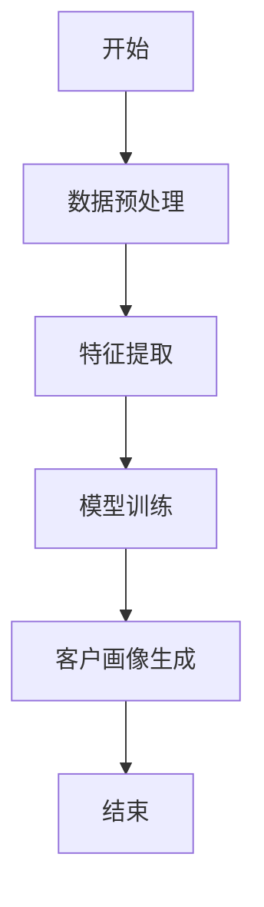
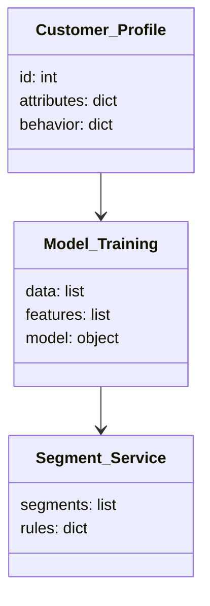
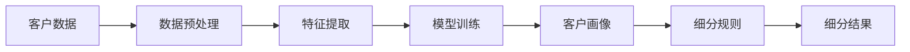

                 

<think>
嗯，我需要帮用户设计一本名为《AI Agent在企业客户画像与细分中的应用》的书籍目录大纲。用户已经给出了一些详细的要求，包括文章标题、关键词、摘要，以及详细的目录结构。首先，我需要理解这本书的主题是什么，然后按照用户的要求来构建目录。

首先，我注意到用户希望文章结构清晰，逻辑紧凑，用专业的技术语言，并且要一步一步进行分析推理。这意味着每一章和每一节都应该有明确的主题，并且逐步深入探讨相关的内容。

接下来，我需要根据用户提供的目录大纲，确保每一部分都涵盖所有必要的内容。例如，第一章是“AI Agent与客户画像的背景介绍”，需要包括AI Agent的基本概念、客户画像的背景、问题背景与描述，以及核心概念结构。这部分可能需要详细解释AI Agent是什么，它在客户画像中的应用，以及为什么需要使用AI Agent来解决客户细分的问题。

然后，第二章是“AI Agent的核心概念与联系”，需要详细讲解AI Agent的核心原理，核心概念的属性对比，以及实体关系图。这部分可能需要使用表格和图表来帮助读者更好地理解AI Agent在客户画像中的应用。

第三章是“AI Agent的算法原理与数学模型”，这里需要详细阐述算法的流程图，用Python代码实现，并给出数学模型和公式。这部分可能需要使用mermaid图来展示算法流程，以及用LaTeX公式来表达数学模型。

第四章是“系统分析与架构设计方案”，需要介绍问题场景，系统功能设计，架构设计，接口设计和交互流程。这部分可能需要使用mermaid图来展示系统架构和交互流程，帮助读者理解系统的整体结构。

第五章是“项目实战”，需要涵盖环境安装、核心代码实现、案例分析和项目总结。这部分需要提供实际的代码示例，帮助读者将理论应用到实践中。

最后，第六章是“最佳实践与总结”，需要总结全书内容，给出注意事项和扩展阅读的建议。这部分可能需要简明扼要地回顾书中的主要内容，并提供进一步学习的方向。

我还需要确保每一章都包含必要的图表和代码示例，比如使用mermaid图展示流程图和架构图，使用Python代码实现算法，以及用LaTeX公式表达数学模型。这不仅有助于读者理解，也能提升文章的专业性。

另外，用户提到文章字数要求在10000到12000字之间，这意味着每章的内容需要详细展开，但又不能过于冗长。我需要确保每一章都有足够的细节，同时保持逻辑连贯，结构合理。

在构建目录时，我可能需要多次检查，确保所有要求都被覆盖，没有遗漏。同时，要确保每一章的标题和子标题清晰明了，能够吸引读者的注意力，同时准确传达内容。

最后，我需要在文章末尾加上作者信息，确保格式正确。整个过程需要仔细规划，确保最终的目录大纲既符合用户的要求，又具备良好的逻辑性和可读性。
</think>

# AI Agent在企业客户画像与细分中的应用

> 关键词：AI Agent，客户画像，客户细分，机器学习，数据分析，企业应用

> 摘要：本文深入探讨了AI Agent在企业客户画像与细分中的应用，从基本概念到算法原理，再到系统架构和项目实战，全面分析了如何利用AI Agent提升客户画像的精准度和细分的效率。文章结合实际案例，详细阐述了AI Agent的核心原理、数学模型、系统架构设计以及项目实现步骤，为读者提供了全面的技术指导。

---

## 目录大纲

### 第一部分: AI Agent与客户画像概述

#### 第1章: AI Agent与客户画像的背景介绍

##### 1.1 AI Agent的基本概念
- 1.1.1 AI Agent的定义与核心属性
- 1.1.2 AI Agent与传统算法的区别
- 1.1.3 AI Agent在企业中的应用价值

##### 1.2 客户画像与细分的背景
- 1.2.1 客户画像的定义与意义
- 1.2.2 客户细分的必要性与挑战
- 1.2.3 AI Agent在客户画像中的应用前景

##### 1.3 问题背景与描述
- 1.3.1 客户画像中的数据挑战
- 1.3.2 客户细分中的业务需求
- 1.3.3 AI Agent如何解决这些问题

##### 1.4 问题解决与边界
- 1.4.1 AI Agent解决问题的思路
- 1.4.2 问题解决的边界与限制
- 1.4.3 客户画像与细分的外延

##### 1.5 核心概念结构
- 1.5.1 核心要素组成与对比
- 1.5.2 概念结构图
- 1.5.3 核心概念与联系的对比表格

### 第二部分: AI Agent的核心概念与联系

#### 第2章: AI Agent的核心原理与属性

##### 2.1 AI Agent的核心原理
- 2.1.1 知识表示与推理机制
- 2.1.2 行为决策与优化策略
- 2.1.3 多模态数据处理能力

##### 2.2 核心概念的属性对比
- 2.2.1 AI Agent与传统算法的对比
- 2.2.2 客户画像与传统画像的对比
- 2.2.3 细分策略与传统策略的对比

##### 2.3 ER实体关系图
- 2.3.1 实体关系图的构建与分析
- 2.3.2 实体关系图的应用案例

### 第三部分: AI Agent的算法原理与数学模型

#### 第3章: 算法原理与数学模型

##### 3.1 算法原理
- 3.1.1 算法流程图（Mermaid）


- 3.1.2 算法实现代码
```python
def customer_profile(data):
    # 数据预处理
    processed_data = preprocess(data)
    # 特征提取
    features = extract_features(processed_data)
    # 模型训练
    model = train_model(features)
    # 生成客户画像
    profile = generate_profile(model, features)
    return profile
```

##### 3.2 数学模型与公式
- 3.2.1 矩阵分解模型
$$ A = U \Sigma V^T $$
- 3.2.2 聚类算法公式
$$ \text{distance}(x_i, x_j) = \sqrt{(x_i - x_j)^2} $$
- 3.2.3 评分预测公式
$$ \hat{y}_{i,j} = \mu + u_i + v_j $$

### 第四部分: 系统分析与架构设计方案

#### 第4章: 系统分析与架构设计

##### 4.1 问题场景介绍
- 4.1.1 客户画像与细分的需求分析
- 4.1.2 系统目标与功能模块划分

##### 4.2 系统功能设计
- 4.2.1 领域模型（Mermaid类图）


##### 4.3 系统架构设计
- 4.3.1 系统架构图（Mermaid架构图）


##### 4.4 系统接口设计
- 4.4.1 接口描述与交互流程（Mermaid序列图）
```mermaid
sequenceDiagram
    客户端 -> 服务器: 请求客户画像生成
    服务器 -> 数据库: 获取原始数据
    数据库 --> 服务器: 返回数据
    服务器 -> 处理器: 进行数据预处理
    处理器 --> 服务器: 返回处理后的数据
    服务器 -> 模型: 开始训练
    模型 --> 服务器: 返回客户画像
    客户端 <-- 服务器: 返回客户画像
```

### 第五部分: 项目实战

#### 第5章: 项目实战

##### 5.1 环境安装与配置
- 5.1.1 安装必要的Python库
- 5.1.2 数据库与存储的配置

##### 5.2 核心代码实现
- 5.2.1 数据预处理代码
```python
def preprocess(data):
    # 删除缺失值
    data = data.dropna()
    # 标准化处理
    data = (data - data.mean()) / data.std()
    return data
```

- 5.2.2 模型训练代码
```python
def train_model(features):
    # 聚类算法训练
    model = KMeans(n_clusters=5)
    model.fit(features)
    return model
```

##### 5.3 案例分析与结果解读
- 5.3.1 案例背景与数据来源
- 5.3.2 实验结果与分析
- 5.3.3 结果解读与业务价值

##### 5.4 项目总结
- 5.4.1 项目实现的关键点
- 5.4.2 项目中的问题与解决方案
- 5.4.3 项目的未来优化方向

### 第六部分: 最佳实践与总结

#### 第6章: 最佳实践与总结

##### 6.1 最佳实践
- 6.1.1 数据质量的重要性
- 6.1.2 模型选择的注意事项
- 6.1.3 业务场景与技术的结合

##### 6.2 项目小结
- 6.2.1 项目的主要成果
- 6.2.2 项目中的经验与教训
- 6.2.3 项目的价值与意义

##### 6.3 注意事项
- 6.3.1 数据隐私与安全
- 6.3.2 模型的可解释性
- 6.3.3 业务目标与技术方案的匹配

##### 6.4 扩展阅读
- 6.4.1 推荐的技术书籍
- 6.4.2 相关领域的最新研究
- 6.4.3 进一步学习的方向

---

作者：AI天才研究院/AI Genius Institute & 禅与计算机程序设计艺术 /Zen And The Art of Computer Programming

