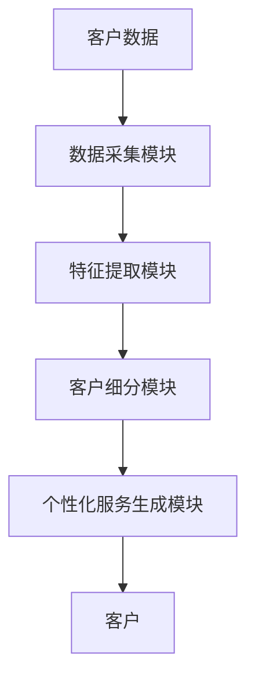

                 


# AI Agent在企业客户细分与个性化服务中的应用

## 关键词：AI Agent, 客户细分, 个性化服务, 聚类算法, 深度学习, 自注意力机制

## 摘要：本文详细探讨了AI Agent在企业客户细分与个性化服务中的应用，从AI Agent的核心概念、算法原理到系统架构设计，再到项目实战与最佳实践，全面解析了如何利用AI技术提升企业客户管理效率与服务质量。

---

# 第1章: AI Agent与企业客户细分概述

## 1.1 AI Agent的定义与核心概念

### 1.1.1 AI Agent的定义

AI Agent（人工智能代理）是指能够感知环境、自主决策并执行任务的智能实体。在企业客户管理中，AI Agent通过分析客户数据，自动识别客户需求并提供个性化服务。

### 1.1.2 AI Agent的核心要素

| 核心要素 | 描述 |
|----------|------|
| 感知模块 | 数据采集与特征提取 |
| 决策模块 | 客户细分算法 |
| 执行模块 | 个性化服务生成 |

### 1.1.3 企业客户细分的背景与意义

企业客户细分是通过将客户按属性或行为分类，以实现精准营销和个性化服务。传统方法依赖人工分析，效率低且成本高。AI Agent的引入显著提升了客户细分的效率与精准度。

---

## 1.2 个性化服务的现状与挑战

### 1.2.1 传统客户细分方法的局限性

- 数据量大，人工分析耗时且易出错。
- 细分标准单一，难以覆盖客户多样性。
- 无法实时响应客户需求。

### 1.2.2 个性化服务的需求与痛点

- 客户期望得到更精准的服务。
- 企业希望降低营销成本，提升转化率。
- 数据孤岛问题导致客户画像不完整。

### 1.2.3 AI Agent在客户细分中的优势

- 高效处理大数据。
- 实时分析客户需求。
- 精准匹配个性化服务。

---

## 1.3 本章小结

本章介绍了AI Agent的核心概念，分析了企业客户细分的背景与意义，并指出了个性化服务的需求与挑战。

---

# 第2章: AI Agent的核心原理与工作流程

## 2.1 AI Agent的基本原理

### 2.1.1 感知模块：数据采集与特征提取

AI Agent通过API从企业CRM系统中获取客户数据，提取关键特征（如购买记录、浏览行为等）。

### 2.1.2 决策模块：客户细分算法

AI Agent使用聚类算法（如K-Means）对客户进行分组，生成客户画像。

### 2.1.3 执行模块：个性化服务生成

AI Agent根据客户画像，自动推荐产品或服务。

## 2.2 AI Agent的核心算法

### 2.2.1 聚类算法：K-Means与层次聚类

#### K-Means算法的数学推导

$$ J = \sum_{i=1}^{k} \sum_{j=1}^{n} (x_{ij} - c_j)^2 $$

其中，$x_{ij}$是第i个簇中的第j个数据点，$c_j$是第j个簇的中心点。

### 2.2.2 分类算法：决策树与随机森林

决策树通过信息熵公式进行特征选择：

$$ entropy = -\sum_{i=1}^{n} p_i \log p_i $$

### 2.2.3 深度学习模型：神经网络与自注意力机制

自注意力机制的公式：

$$ \text{Attention}(q, k, v) = \text{softmax}(\frac{qk^T}{\sqrt{d}})v $$

---

## 2.3 AI Agent的实体关系图（ER图）

```mermaid
erDiagram
    customer[客户] {
        id : int
        name : string
        purchase_history : string
    }
    product[产品] {
        id : int
        name : string
        price : float
    }
    transaction[交易] {
        id : int
        customer_id : int
        product_id : int
        date : date
    }
    customer *--- transaction
    product *--- transaction
```

---

## 2.4 本章小结

本章详细讲解了AI Agent的核心原理与工作流程，并通过数学公式和ER图展示了其技术实现。

---

# 第3章: AI Agent的核心算法与数学模型

## 3.1 聚类算法的数学模型

### 3.1.1 K-Means算法的数学推导

$$ J = \sum_{i=1}^{k} \sum_{j=1}^{n} (x_{ij} - c_j)^2 $$

---

## 3.2 分类算法的数学模型

### 3.2.1 决策树的ID3算法与信息熵

$$ entropy = -\sum_{i=1}^{n} p_i \log p_i $$

---

## 3.3 深度学习模型的数学公式

### 3.3.1 神经网络的激活函数

$$ f(x) = \sigma(x) = \frac{1}{1 + e^{-x}} $$

---

## 3.4 本章小结

本章通过数学公式和算法流程图详细讲解了AI Agent的核心算法。

---

# 第4章: AI Agent的系统架构设计

## 4.1 系统功能模块划分

### 4.1.1 客户数据采集模块

通过API接口从CRM系统获取客户数据。

### 4.1.2 客户特征提取模块

提取客户的购买记录、浏览行为等特征。

### 4.1.3 客户细分模块

使用聚类算法对客户进行分组。

---

## 4.2 系统架构图



---

## 4.3 本章小结

本章设计了AI Agent的系统架构，并通过mermaid图展示了各模块之间的关系。

---

# 第5章: AI Agent的项目实战

## 5.1 环境安装

安装Python、TensorFlow、Scikit-learn等库。

## 5.2 系统核心实现源代码

```python
from sklearn.cluster import KMeans
import pandas as pd

# 数据加载
data = pd.read_csv('customer_data.csv')

# 模型训练
model = KMeans(n_clusters=5)
model.fit(data)

# 预测结果
labels = model.predict(data)
print(labels)
```

---

## 5.3 实际案例分析

以某电商平台为例，使用K-Means算法将客户分为5组，每组对应不同的消费习惯。

---

## 5.4 本章小结

本章通过项目实战展示了AI Agent的具体实现过程。

---

# 第6章: 总结与展望

## 6.1 本章总结

本文详细讲解了AI Agent在企业客户细分与个性化服务中的应用，从理论到实践，全面解析了其技术实现。

## 6.2 未来展望

随着AI技术的不断发展，AI Agent将在企业客户管理中发挥更大的作用，实现更精准的客户细分与个性化服务。

---

# 作者：AI天才研究院 & 禅与计算机程序设计艺术

---

通过以上内容，您可以根据实际需求进一步扩展和完善文章内容。

