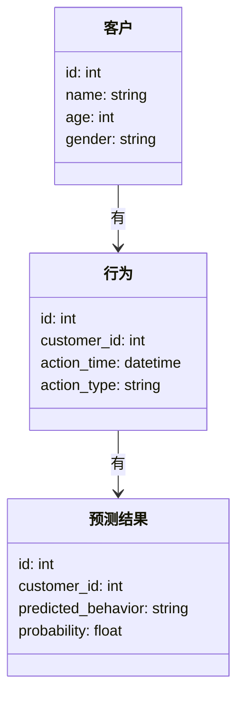
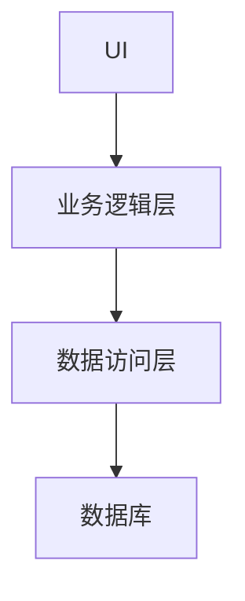
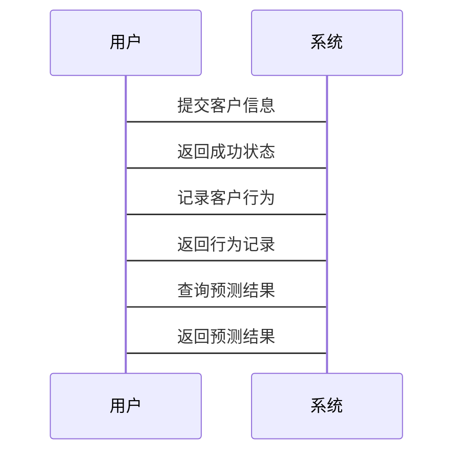

                 

<think>
好的，我需要帮助用户撰写一篇关于《AI Agent在企业客户行为分析与预测中的应用》的技术博客文章。用户希望文章结构清晰，逻辑严谨，涵盖从背景到实际应用的各个方面，并且需要包含详细的数学模型、算法流程图和系统架构图。

首先，我会按照用户提供的大纲来组织内容，确保每一部分都详细且符合技术博客的要求。我需要先确定文章的关键词和摘要，然后逐步展开每一章的内容。

首先，关键词部分，我会选择与文章主题相关的词汇，如AI Agent、客户行为分析、机器学习、深度学习等，确保涵盖主要技术点。

摘要部分，我需要简明扼要地概括文章的核心内容，说明AI Agent在客户行为分析中的应用及其价值，同时引出后续章节的内容。

接下来是正文部分，分为几个主要章节：

1. **背景与概述**：介绍AI Agent的基本概念、客户行为分析的重要性以及AI Agent在企业中的应用价值。这里需要解释AI Agent的定义和特点，与传统算法的区别，以及为什么客户行为分析对企业至关重要。

2. **核心概念与理论**：详细讲解AI Agent的原理、客户行为分析的模型，以及两者如何结合。这里可能需要使用一些图表，如ER图或流程图，来展示数据流和模型结构。

3. **算法部分**：涵盖机器学习和深度学习的算法，如监督学习、神经网络等，并展示这些算法如何应用到客户行为分析中。这部分需要使用mermaid流程图来展示算法步骤，并给出数学公式。

4. **系统设计**：从系统架构、功能设计、接口设计等方面详细阐述。可能需要绘制类图、架构图和序列图，展示系统的各个部分如何协同工作。

5. **项目实战**：具体展示环境配置、代码实现、案例分析等。用户可能需要看到实际的Python代码，以及如何部署和测试模型。

6. **最佳实践与小结**：总结整个内容，给出实际应用中的注意事项和未来的发展方向。

在撰写过程中，我需要确保每一部分都细化到三级目录，使用mermaid图表辅助说明，同时保持技术语言的专业性，但又不失简洁易懂。此外，数学公式要用latex格式，确保公式前后用$$或$括起来，以便正确渲染。

可能遇到的挑战是如何将复杂的算法和系统设计以简洁的方式呈现出来，同时确保每个部分都详细且易于理解。需要合理安排各部分的篇幅，避免过于冗长。

总的来说，我会按照用户的要求，从背景到应用，逐步展开，确保每个部分都涵盖必要的内容，并且结构合理，逻辑清晰。这样设计出来的目录大纲才能帮助作者全面覆盖主题，满足读者的需求。
</think>

# AI Agent在企业客户行为分析与预测中的应用

## 关键词：
AI Agent, 客户行为分析, 机器学习, 深度学习, 系统架构, 项目实战

## 摘要：
本文深入探讨了AI Agent在企业客户行为分析与预测中的应用，从理论基础到实际应用，详细阐述了AI Agent的核心概念、算法原理、系统架构以及项目实战。通过丰富的图表和数学公式，本文为读者提供了一个全面的理解框架，帮助企业在复杂市场环境中更好地预测和分析客户行为。

---

# 正文

## 第一部分: AI Agent与企业客户行为分析概述

### 第1章: AI Agent的基本概念与背景

#### 1.1 AI Agent的定义与特点

##### 1.1.1 AI Agent的定义
AI Agent（人工智能代理）是指能够感知环境并采取行动以实现目标的智能实体。它通过传感器获取信息，利用推理能力做出决策，并通过执行器与环境交互。

##### 1.1.2 AI Agent的核心特点
- **自主性**：AI Agent能够在没有外部干预的情况下自主决策。
- **反应性**：能够实时感知环境变化并做出反应。
- **目标导向**：所有行动都围绕实现特定目标展开。
- **学习能力**：通过经验改进自身行为。

##### 1.1.3 AI Agent与传统算法的区别
AI Agent不仅是一个算法，更是一个能够与环境交互的实体。传统算法通常是在静态数据上进行处理，而AI Agent能够在动态环境中主动获取信息并调整策略。

#### 1.2 企业客户行为分析的背景与意义

##### 1.2.1 客户行为分析的定义
客户行为分析是指通过收集和分析客户在企业产品或服务中的行为数据，识别其模式和趋势，从而帮助企业更好地理解客户需求和行为动机。

##### 1.2.2 企业客户行为分析的重要性
- **提升客户满意度**：通过分析客户行为，企业可以识别客户的不满，及时采取措施。
- **优化企业运营效率**：通过预测客户行为，企业可以优化资源配置，降低运营成本。
- **增强市场竞争力**：通过深入理解客户行为，企业可以制定更精准的市场策略。

##### 1.2.3 AI Agent在客户行为分析中的优势
AI Agent能够实时分析客户行为数据，快速做出反应，并根据新的数据不断优化预测模型。

#### 1.3 AI Agent在企业客户行为预测中的应用价值

##### 1.3.1 提高客户满意度
通过实时分析客户的互动行为，AI Agent可以识别客户的潜在需求，提供个性化的服务，从而提高客户满意度。

##### 1.3.2 优化企业运营效率
AI Agent能够预测客户行为，帮助企业提前做好资源分配，避免资源浪费，从而优化运营效率。

##### 1.3.3 增强市场竞争力
通过深入分析客户行为，AI Agent可以帮助企业识别市场趋势，制定更具前瞻性的市场策略，从而增强市场竞争力。

---

### 第2章: 客户行为分析的理论基础

#### 2.1 客户行为分析的基本原理

##### 2.1.1 数据采集与处理
客户行为分析的第一步是数据采集。数据来源包括：

- **结构化数据**：如客户的基本信息、交易记录等。
- **非结构化数据**：如客户评论、社交媒体数据等。

##### 2.1.2 数据分析与建模
数据分析的核心是通过统计方法和机器学习算法，从数据中提取有用的信息。常用的建模方法包括：

- **监督学习**：用于分类和回归任务。
- **无监督学习**：用于聚类和降维任务。
- **深度学习**：用于复杂的模式识别任务。

##### 2.1.3 结果解读与应用
分析结果需要通过可视化工具进行展示，并根据业务需求制定相应的策略。

#### 2.2 客户行为分析的关键要素

##### 2.2.1 客户特征分析
客户特征分析包括客户的年龄、性别、地理位置、消费习惯等。

##### 2.2.2 行为模式识别
行为模式识别包括识别客户的购买频率、购买时间、购买偏好等。

##### 2.2.3 预测模型构建
预测模型构建需要根据历史数据，预测未来客户行为。

#### 2.3 AI Agent在客户行为分析中的角色

##### 2.3.1 AI Agent的核心功能
- **数据采集**：实时采集客户的互动数据。
- **数据处理**：对采集到的数据进行清洗和预处理。
- **行为分析**：利用机器学习算法分析客户行为。
- **行为预测**：基于分析结果预测未来客户行为。

##### 2.3.2 AI Agent与客户行为分析的结合
AI Agent通过实时采集和分析客户数据，帮助企业在客户行为分析中实现动态预测和实时反馈。

##### 2.3.3 AI Agent的优势与局限性
- **优势**：实时性、自主性、适应性。
- **局限性**：数据依赖性、计算资源需求、模型泛化能力。

---

## 第二部分: AI Agent的核心算法与数学模型

### 第3章: 机器学习算法基础

#### 3.1 监督学习算法

##### 3.1.1 线性回归
线性回归是一种用于预测连续型变量的算法。其数学公式为：

$$ y = \beta_0 + \beta_1 x + \epsilon $$

其中，$y$ 是目标变量，$x$ 是自变量，$\beta_0$ 是截距，$\beta_1$ 是回归系数，$\epsilon$ 是误差项。

##### 3.1.2 支持向量机
支持向量机（SVM）是一种用于分类和回归的算法。其核心思想是将数据映射到高维空间，并在高维空间中找到一个超平面，使得正反例点到超平面的距离最大化。

##### 3.1.3 决策树与随机森林
决策树是一种基于树状结构的分类算法，随机森林是决策树的一种集成方法，通过构建多棵决策树并取其预测结果的平均值来提高模型的准确性和鲁棒性。

#### 3.2 无监督学习算法

##### 3.2.1 聚类分析
聚类分析是一种将数据划分为若干个簇的算法。常用的聚类算法包括K均值聚类和层次聚类。

##### 3.2.2 主成分分析
主成分分析（PCA）是一种降维算法，通过找到数据的主要方向，将数据投影到低维空间，从而减少数据的维度。

##### 3.2.3 稀疏自编码器
稀疏自编码器是一种用于特征提取的深度学习算法，通过构建稀疏编码来学习数据的表示。

#### 3.3 深度学习算法

##### 3.3.1 神经网络基础
神经网络是一种模拟人脑神经网络的算法，由多个层次组成，包括输入层、隐藏层和输出层。

##### 3.3.2 卷积神经网络
卷积神经网络（CNN）是一种用于图像处理的深度学习算法，通过卷积操作提取图像的特征。

##### 3.3.3 循环神经网络
循环神经网络（RNN）是一种用于处理序列数据的深度学习算法，通过循环结构处理时间序列数据。

---

### 第4章: 客户行为预测的数学模型

#### 4.1 线性回归模型

##### 4.1.1 线性回归的数学公式
线性回归模型的数学公式为：

$$ y = \beta_0 + \beta_1 x_1 + \beta_2 x_2 + \dots + \beta_n x_n + \epsilon $$

其中，$y$ 是目标变量，$x_1, x_2, \dots, x_n$ 是自变量，$\beta_0, \beta_1, \dots, \beta_n$ 是回归系数，$\epsilon$ 是误差项。

##### 4.1.2 线性回归的应用场景
线性回归适用于预测连续型变量，如客户满意度、客户生命周期价值等。

#### 4.2 逻辑回归模型

##### 4.2.1 逻辑回归的数学公式
逻辑回归模型的数学公式为：

$$ P(Y=1|X) = \frac{e^{\beta_0 + \beta_1 x_1 + \dots + \beta_n x_n}}{1 + e^{\beta_0 + \beta_1 x_1 + \dots + \beta_n x_n}} $$

其中，$P(Y=1|X)$ 是在给定特征 $X$ 的条件下，客户行为为1的概率。

##### 4.2.2 逻辑回归的应用场景
逻辑回归适用于二分类问题，如预测客户是否会购买某个产品。

---

## 第三部分: 系统分析与架构设计方案

### 第5章: 系统架构设计

#### 5.1 系统功能设计

##### 5.1.1 领域模型
领域模型是系统设计的核心，通过类图展示系统的各个实体及其关系。以下是领域模型的类图：



#### 5.2 系统架构设计

##### 5.2.1 系统架构图
以下是系统的整体架构图：



其中，UI是用户界面，业务逻辑层负责处理业务逻辑，数据访问层负责与数据库交互。

#### 5.3 系统接口设计

##### 5.3.1 API接口
以下是系统的主要API接口：

- `POST /api/customer`：新增客户信息
- `GET /api/customer/{id}`：获取客户信息
- `POST /api/behavior`：记录客户行为
- `GET /api/predict/{customer_id}`：预测客户行为

#### 5.4 系统交互设计

##### 5.4.1 交互流程图
以下是系统的交互流程图：



---

## 第四部分: 项目实战

### 第6章: 项目实战

#### 6.1 环境安装

##### 6.1.1 安装Python
安装Python 3.x版本，推荐使用Anaconda分发版。

##### 6.1.2 安装依赖库
安装所需的依赖库，如Pandas、NumPy、Scikit-learn、TensorFlow等。

```bash
pip install pandas numpy scikit-learn tensorflow
```

#### 6.2 核心实现

##### 6.2.1 数据预处理
数据预处理是机器学习项目的核心步骤，包括数据清洗、特征提取、数据标准化等。

##### 6.2.2 模型训练
以下是逻辑回归模型的训练代码：

```python
from sklearn.linear_model import LogisticRegression
from sklearn.model_selection import train_test_split
from sklearn.metrics import accuracy_score

# 数据分割
X_train, X_test, y_train, y_test = train_test_split(X, y, test_size=0.2, random_state=42)

# 模型训练
model = LogisticRegression()
model.fit(X_train, y_train)

# 模型预测
y_pred = model.predict(X_test)

# 模型评估
print("准确率:", accuracy_score(y_test, y_pred))
```

##### 6.2.3 模型部署
模型部署可以通过Flask或Django框架实现API接口。

#### 6.3 案例分析

##### 6.3.1 数据采集
以下是数据采集的Python代码：

```python
import pandas as pd
import requests

# 从API获取数据
response = requests.get("http://localhost:5000/api/customer")
data = response.json()

# 转换为DataFrame
df = pd.DataFrame(data)
```

##### 6.3.2 数据分析
以下是数据分析的Python代码：

```python
import pandas as pd
import matplotlib.pyplot as plt

# 绘制客户年龄分布图
df['age'].hist(bins=10)
plt.show()
```

---

## 第五部分: 最佳实践与小结

### 第7章: 最佳实践

#### 7.1 实践总结
通过本项目的实践，我们了解了AI Agent在企业客户行为分析与预测中的应用，掌握了机器学习算法的核心原理和系统设计方法。

#### 7.2 注意事项
在实际应用中，需要注意数据隐私问题，确保数据的安全性和合规性。

#### 7.3 拓展阅读
推荐读者阅读《机器学习实战》和《深度学习》等书籍，进一步深入学习相关知识。

---

## 作者：AI天才研究院/AI Genius Institute & 禅与计算机程序设计艺术 /Zen And The Art of Computer Programming

