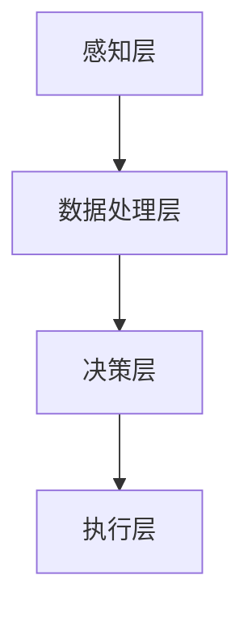
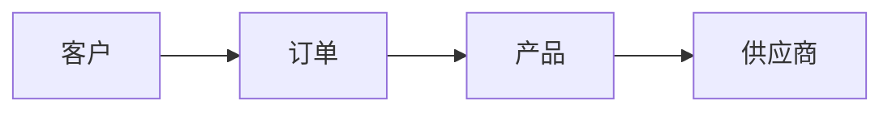
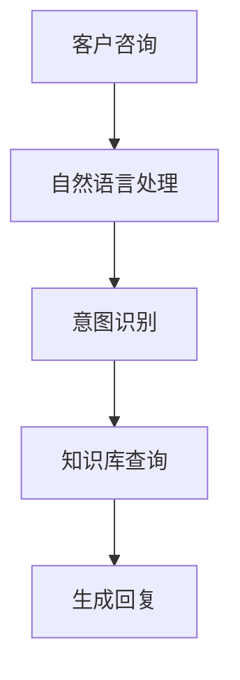
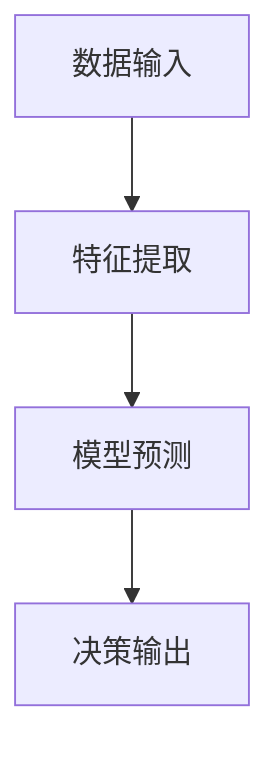
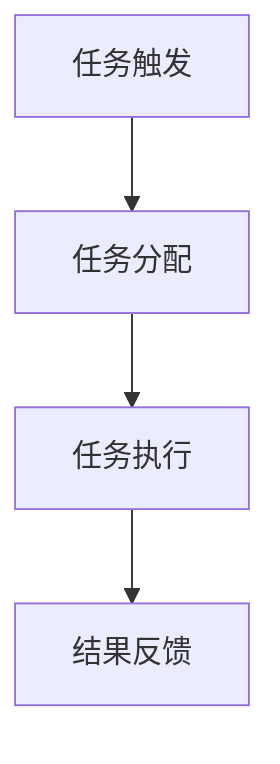

                 


# {{文章标题}}

**关键词：** AI Agent, 企业数字化转型, 战略定位, 实施路径, 技术架构, 应用场景

**摘要：** 本文探讨了AI Agent在企业数字化转型中的战略定位与实施路径。文章首先介绍了AI Agent的核心概念和应用场景，然后详细分析了其技术原理和系统架构，接着通过实际案例展示了AI Agent的项目实施过程，并总结了最佳实践和未来发展趋势。

---

# 第1章: AI Agent 的概述与背景

## 1.1 AI Agent 的定义与核心概念

### 1.1.1 AI Agent 的定义

AI Agent（人工智能代理）是一种能够感知环境、自主决策并执行任务的智能系统。它通过传感器获取信息，利用算法进行分析和推理，并通过执行器与环境互动，以实现特定目标。

### 1.1.2 AI Agent 的核心概念与属性

AI Agent的核心概念包括：

- **感知能力**：通过传感器或数据接口获取环境信息。
- **决策能力**：基于感知信息，利用算法进行推理和决策。
- **执行能力**：通过执行器或API将决策转化为具体操作。

### 1.1.3 AI Agent 与传统 IT 系统的区别

| 属性             | 传统 IT 系统         | AI Agent             |
|------------------|----------------------|-----------------------|
| 数据处理         | 基于规则和流程       | 基于机器学习和推理     |
| 决策方式         | 刚性规则             | 自主学习和优化         |
| 适应性           | 有限                 | 强大                   |
| 交互方式         | 单向                 | 双向                   |

---

## 1.2 企业数字化转型的背景与挑战

### 1.2.1 数字化转型的定义与目标

数字化转型是指通过信息技术手段优化企业业务流程、提高效率、创造新价值的过程。其目标是实现业务的智能化、自动化和数据驱动化。

### 1.2.2 企业数字化转型中的主要挑战

- **数据孤岛**：企业内部数据分散，难以整合。
- **技术复杂性**：数字化转型涉及多种技术的集成和应用。
- **人才短缺**：缺乏具备数字化转型经验的专业人才。

### 1.2.3 AI Agent 在数字化转型中的作用

AI Agent可以通过自动化处理、智能决策和实时反馈，帮助企业解决复杂问题，提升运营效率。

---

## 1.3 AI Agent 在企业中的应用场景

### 1.3.1 智能客服与客户关系管理

AI Agent可以处理客户咨询、管理客户关系，提升服务质量。

### 1.3.2 智能决策支持系统

AI Agent通过分析数据，为企业提供决策支持，优化资源配置。

### 1.3.3 智能流程自动化

AI Agent可以自动化处理业务流程，减少人工干预，提高效率。

---

## 1.4 AI Agent 的战略价值与定位

### 1.4.1 AI Agent 在企业战略中的地位

AI Agent是企业数字化转型的核心技术之一，能够推动业务创新和效率提升。

### 1.4.2 AI Agent 的核心竞争优势

- **智能决策**：基于数据进行精准判断。
- **快速响应**：实时处理任务。
- **持续优化**：通过反馈不断改进。

### 1.4.3 AI Agent 的长期发展与投资价值

AI Agent能够为企业创造长期价值，是未来技术发展的重点方向。

---

## 1.5 本章小结

本章介绍了AI Agent的核心概念、企业数字化转型的背景与挑战，以及AI Agent在企业中的应用场景和战略价值。接下来将详细探讨AI Agent的技术原理和系统架构。

---

# 第2章: AI Agent 的核心概念与技术原理

## 2.1 AI Agent 的核心概念

### 2.1.1 AI Agent 的感知机制

AI Agent通过传感器或数据接口获取环境信息，例如：

- **文本数据**：来自客户咨询的文本。
- **图像数据**：来自监控系统的图像。
- **语音数据**：来自客服对话的语音。

### 2.1.2 AI Agent 的决策机制

AI Agent通过算法对感知信息进行分析和推理，例如：

- **监督学习**：基于标记数据进行分类。
- **强化学习**：通过试错优化决策。
- **知识图谱**：基于知识库进行推理。

### 2.1.3 AI Agent 的执行机制

AI Agent通过执行器或API将决策转化为具体操作，例如：

- **发送邮件**：通过API调用邮件服务。
- **更新数据库**：通过SQL语句更新数据。
- **控制设备**：通过物联网协议控制物理设备。

---

## 2.2 AI Agent 的技术架构

### 2.2.1 AI Agent 的数据流与信息处理流程

以下是AI Agent的数据流与信息处理流程的架构图：



### 2.2.2 AI Agent 的知识表示与推理方法

AI Agent的知识表示通常采用知识图谱的形式，以下是知识图谱的示意图：



---

## 2.3 AI Agent 的算法原理

### 2.3.1 监督学习算法

监督学习算法通过标记数据进行训练，例如：

$$
\text{损失函数} = \frac{1}{N}\sum_{i=1}^{N}(y_i - \hat{y_i})^2
$$

其中，$y_i$是真实值，$\hat{y_i}$是预测值，$N$是数据样本数。

### 2.3.2 强化学习算法

强化学习算法通过试错优化决策，例如：

$$
Q(s, a) = r + \gamma \max_{a'} Q(s', a')
$$

其中，$s$是当前状态，$a$是当前动作，$r$是奖励，$\gamma$是折扣因子。

### 2.3.3 知识图谱推理算法

知识图谱推理算法通过推理规则进行推理，例如：

$$
\text{如果 } A \text{ 是 } B \text{ 的子类，那么 } A \text{ 具有 } B \text{ 的属性。}
$$

---

## 2.4 本章小结

本章详细讲解了AI Agent的核心概念与技术原理，包括感知、决策和执行机制，以及算法原理和系统架构。接下来将探讨AI Agent在企业中的应用场景和实施路径。

---

# 第3章: AI Agent 在企业中的应用场景

## 3.1 智能客服与客户关系管理

### 3.1.1 智能客服的核心流程

以下是智能客服的核心流程图：



### 3.1.2 案例分析：智能客服实现

以下是智能客服的代码实现示例：

```python
class CustomerServiceAgent:
    def __init__(self):
        self.knowledge_base = KnowledgeBase()

    def handle_query(self, query):
        intent = self.intent_detector.detect_intent(query)
        response = self.knowledge_base.get_response(intent)
        return response
```

---

## 3.2 智能决策支持系统

### 3.2.1 智能决策的核心流程

以下是智能决策的核心流程图：



### 3.2.2 案例分析：智能决策支持系统实现

以下是智能决策支持系统的代码实现示例：

```python
class DecisionSupportSystem:
    def __init__(self):
        self.model = self.load_model()

    def make_decision(self, input_data):
        features = self.extract_features(input_data)
        prediction = self.model.predict(features)
        return prediction
```

---

## 3.3 智能流程自动化

### 3.3.1 智能流程自动化的核心流程

以下是智能流程自动化的核心流程图：



### 3.3.2 案例分析：智能流程自动化实现

以下是智能流程自动化的代码实现示例：

```python
class ProcessAutomationAgent:
    def __init__(self):
        self.executor = Executor()

    def execute_task(self, task):
        self.executor.start(task)
        return self.executor.get_result()
```

---

## 3.4 本章小结

本章通过实际案例分析了AI Agent在智能客服、智能决策支持系统和智能流程自动化中的应用场景，展示了AI Agent在企业数字化转型中的巨大潜力。

---

# 第4章: AI Agent 的实施路径

## 4.1 实施AI Agent的战略规划

### 4.1.1 明确目标与范围

在实施AI Agent之前，企业需要明确目标和范围，例如：

- **目标**：提升客户满意度。
- **范围**：智能客服系统。

### 4.1.2 评估技术可行性

企业需要评估技术可行性，例如：

- **数据可用性**：是否拥有足够的训练数据。
- **技术能力**：是否有足够的技术团队支持。

### 4.1.3 制定实施计划

企业需要制定详细的实施计划，包括时间表、资源分配和风险控制。

---

## 4.2 AI Agent 的技术实现

### 4.2.1 系统架构设计

以下是AI Agent的系统架构图：


### 4.2.2 核心算法实现

以下是AI Agent的核心算法实现示例：

```python
class AI-Agent:
    def __init__(self):
        self.sensor = Sensor()
        self.executor = Executor()

    def run(self):
        while True:
            data = self.sensor感知数据()
            decision = self.decision_maker做出决策(data)
            self.executor执行操作(decision)
```

---

## 4.3 AI Agent 的测试与优化

### 4.3.1 测试策略

企业需要制定详细的测试策略，包括单元测试、集成测试和性能测试。

### 4.3.2 优化方向

企业可以通过优化算法、改进数据质量和提升系统性能来不断优化AI Agent的表现。

---

## 4.4 本章小结

本章详细讲解了AI Agent的实施路径，包括战略规划、技术实现和测试优化。接下来将总结最佳实践和未来发展趋势。

---

# 第5章: 最佳实践与未来展望

## 5.1 成功案例分析

### 5.1.1 案例1：智能客服系统

某企业通过部署AI Agent智能客服系统，显著提升了客户满意度和服务效率。

### 5.1.2 案例2：智能决策支持系统

某企业通过部署AI Agent智能决策支持系统，优化了资源配置和决策效率。

---

## 5.2 小结

AI Agent在企业数字化转型中的应用前景广阔，通过不断的技术创新和实践积累，AI Agent将为企业创造更大的价值。

---

# 附录

## 附录A: AI Agent 相关工具推荐

- **自然语言处理工具**：spaCy、NLTK。
- **机器学习框架**：TensorFlow、PyTorch。
- **知识图谱工具**：Neo4j、Ubergraph。

## 附录B: 术语表

- **AI Agent**：人工智能代理。
- **知识图谱**：结构化知识表示形式。

## 附录C: 参考文献

- [1] 李明, 《人工智能入门》.
- [2] 王强, 《机器学习实战》.

---

# 作者

**作者：AI天才研究院/AI Genius Institute & 禅与计算机程序设计艺术 /Zen And The Art of Computer Programming**

---

以上是《AI Agent在企业数字化转型中的战略定位与实施路径》的文章内容，涵盖了AI Agent的核心概念、技术原理、应用场景、实施路径和最佳实践。

