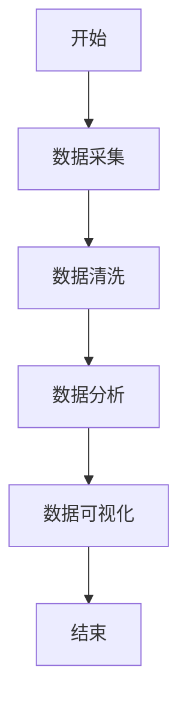
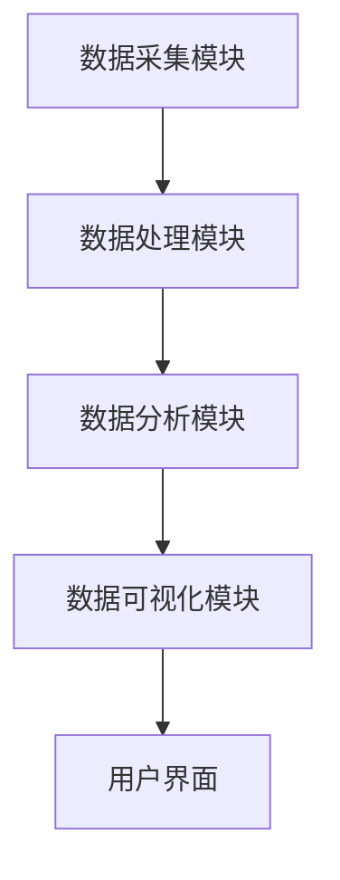
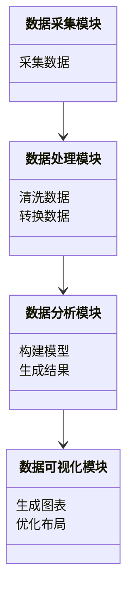
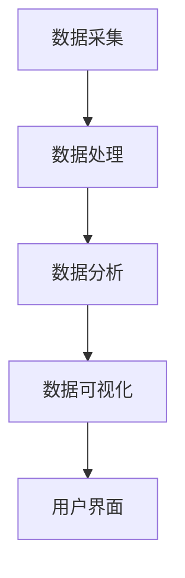
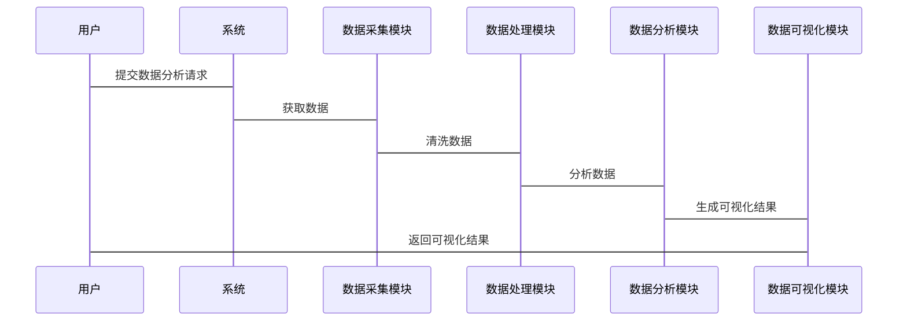

                 

<think>
好的，我需要详细分析用户的需求，然后逐步构建《AI Agent在企业数据分析与可视化中的应用》这本书的目录大纲。用户要求这个大纲结构清晰、逻辑紧凑，并且要涵盖从背景到实战的各个方面。同时，需要满足一定的字数要求，并且使用特定的格式，包括markdown、mermaid图表和latex公式。

首先，我会从书籍的概述部分开始，介绍AI Agent的基本概念、其在企业数据分析中的作用，以及数据分析与可视化的结合。这部分需要让读者对AI Agent有一个全面的了解，并明确其在企业中的应用价值。

接下来，我会深入讲解AI Agent的核心概念与原理，包括感知、决策和执行这三个阶段。同时，会对AI Agent进行分类，分析其特点和在数据分析中的具体应用。这部分需要确保读者能够理解AI Agent的工作机制及其在数据分析中的作用。

然后，我会详细探讨AI Agent在数据分析中的算法原理，包括数据预处理、数据分析和数据可视化相关的算法。使用mermaid流程图来展示算法的执行过程，并提供Python代码示例，解释代码的功能和应用场景。数学模型部分将涉及概率论和优化算法，用latex公式表达，确保内容的准确性和专业性。

在系统架构部分，我需要设计一个企业级的数据分析与可视化系统，展示各个模块之间的关系和交互流程。使用mermaid类图和序列图来描述系统的结构和接口设计，帮助读者理解系统的整体架构。

接下来是项目实战部分，通过具体的案例，如销售数据分析，展示AI Agent在实际项目中的应用。从需求分析到数据清洗，再到建模和可视化，详细讲解每一步的操作，并提供完整的代码实现。最后分析结果，总结经验和教训，为读者提供实际应用的参考。

最后，我会进行总结，回顾整个内容，强调AI Agent的优势，并指出未来的发展方向。同时，给出一些实用的建议，如数据质量和模型解释性的重要性。

在写作过程中，我会确保每一章都涵盖必要的内容，同时保持逻辑的连贯性和结构的紧凑性。每一部分都会详细展开，结合图表和代码示例，使读者能够清晰地理解每个概念和算法。此外，我会注意使用正确的markdown格式，确保图表和公式的正确嵌入，使整篇文章看起来专业且易于阅读。

通过这样的思考过程，我相信能够构建出一个符合用户要求的详细目录大纲，并为后续的写作奠定坚实的基础。
</think>

# AI Agent在企业数据分析与可视化中的应用

> 关键词：AI Agent, 数据分析, 数据可视化, 企业应用, 人工智能

> 摘要：本文详细探讨了AI Agent在企业数据分析与可视化中的应用，从基本概念到算法原理，再到系统架构和项目实战，结合实际案例分析，全面解析AI Agent如何提升企业数据分析的效率和可视化效果。

---

## 第一部分: AI Agent在企业数据分析与可视化中的应用概述

### 第1章: AI Agent与企业数据分析概述

#### 1.1 AI Agent的基本概念
- **1.1.1 AI Agent的定义**
  - AI Agent是具备感知、决策和执行能力的智能体，能够自主完成特定任务。
- **1.1.2 AI Agent的核心特点**
  - 智能性：基于数据和环境做出决策。
  - 自主性：无需外部干预，自主完成任务。
  - 反应性：能够实时感知并响应环境变化。
  - 学习性：通过经验或数据优化自身行为。
- **1.1.3 企业数据分析的背景与挑战**
  - 数据量爆炸式增长，传统方法效率低下。
  - 数据分析需要快速响应和高准确性。
  - 数据可视化的复杂性与用户需求多样性。

#### 1.2 AI Agent在企业数据分析中的作用
- **1.2.1 数据采集与处理**
  - AI Agent能够实时采集数据，自动清洗和预处理，确保数据质量。
- **1.2.2 数据分析与建模**
  - 利用机器学习和深度学习算法，AI Agent能够快速构建数据模型，发现数据中的规律和趋势。
- **1.2.3 数据可视化与决策支持**
  - AI Agent生成直观的数据可视化结果，帮助决策者快速理解数据并制定策略。

#### 1.3 数据分析与可视化的结合
- **1.3.1 数据分析的基本流程**
  - 数据采集 → 数据清洗 → 数据分析 → 数据可视化。
- **1.3.2 数据可视化的意义**
  - 将复杂数据简化为易于理解的图表，辅助决策。
- **1.3.3 AI Agent在数据分析与可视化中的应用前景**
  - 提高数据分析效率，优化数据可视化效果，增强企业竞争力。

#### 1.4 本章小结
- 本章介绍了AI Agent的基本概念，分析了其在企业数据分析中的作用，并探讨了数据分析与可视化的结合，为后续内容奠定了基础。

---

### 第2章: AI Agent的核心概念与原理

#### 2.1 AI Agent的感知、决策与执行
- **2.1.1 感知阶段**
  - 数据采集：通过传感器、API等获取数据。
  - 数据解析：理解数据的含义和结构。
- **2.1.2 决策阶段**
  - 数据分析：利用算法生成分析结果。
  - 风险评估：评估决策的可行性和潜在风险。
- **2.1.3 执行阶段**
  - 执行决策：通过系统或用户操作实现。
  - 反馈机制：收集执行结果并优化后续决策。

#### 2.2 AI Agent的分类与特点
- **2.2.1 基于规则的AI Agent**
  - 依赖预定义的规则进行决策，适用于规则明确的场景。
- **2.2.2 基于模型的AI Agent**
  - 基于数学模型进行预测和决策，适用于复杂场景。
- **2.2.3 基于学习的AI Agent**
  - 通过机器学习或深度学习不断优化自身行为。

#### 2.3 AI Agent与数据分析的结合
- **2.3.1 数据驱动的AI Agent**
  - 通过数据驱动决策，提升分析准确性。
- **2.3.2 智能化数据分析流程**
  - 利用AI Agent实现数据分析的自动化和智能化。
- **2.3.3 数据可视化中的AI Agent应用**
  - 自动生成最优可视化方案，优化用户交互体验。

#### 2.4 本章小结
- 本章详细讲解了AI Agent的核心概念与原理，分析了其在数据分析中的应用，为后续算法和系统设计提供了理论基础。

---

## 第二部分: AI Agent在数据分析中的算法原理

### 第3章: AI Agent的感知与决策算法

#### 3.1 数据预处理算法
- **3.1.1 数据清洗**
  - 去除重复数据、填充缺失值、处理异常值。
- **3.1.2 数据转换**
  - 数据标准化、数据归一化、数据离散化。
- **3.1.3 数据增强**
  - 增加数据多样性，提升模型鲁棒性。

#### 3.2 数据分析算法
- **3.2.1 统计分析**
  - 均值、中位数、标准差等统计指标。
- **3.2.2 机器学习算法**
  - 线性回归、决策树、随机森林、支持向量机。
- **3.2.3 深度学习算法**
  - 神经网络、卷积神经网络、循环神经网络。

#### 3.3 数据可视化算法
- **3.3.1 数据可视化方法**
  - 折线图、柱状图、饼图、散点图、热力图。
- **3.3.2 可视化优化算法**
  - 自动选择最优图表类型，优化布局和颜色。

#### 3.4 算法流程图
- 使用mermaid绘制算法执行流程图：


#### 3.5 算法实现代码
- Python代码示例：
```python
import pandas as pd
from sklearn import linear_model

# 数据加载
data = pd.read_csv('data.csv')

# 数据清洗
data.dropna()  # 删除缺失值
data['age'].fillna(data['age'].mean())  # 填充缺失值

# 数据分析
reg = linear_model.LinearRegression()
reg.fit(data[['feature']], data['target'])

# 数据可视化
import matplotlib.pyplot as plt
plt.scatter(data['feature'], data['target'])
plt.plot(data['feature'], reg.predict(data[['feature']]))
plt.show()
```

#### 3.6 本章小结
- 本章详细讲解了AI Agent在数据分析中的算法原理，包括数据预处理、分析和可视化算法，并通过流程图和代码示例进行了具体说明。

---

### 第4章: AI Agent的执行与反馈机制

#### 4.1 数据分析结果的执行
- **4.1.1 决策执行**
  - 根据分析结果生成行动计划。
- **4.1.2 系统反馈**
  - 收集执行结果并优化后续决策。

#### 4.2 数据可视化结果的优化
- **4.2.1 可视化反馈**
  - 用户交互反馈用于优化可视化效果。
- **4.2.2 数据驱动的反馈**
  - 根据数据变化自动调整可视化展示。

#### 4.3 算法优化
- **4.3.1 模型优化**
  - 调整算法参数，提升分析准确率。
- **4.3.2 可视化优化**
  - 自动调整图表布局和颜色，提升用户体验。

#### 4.4 系统架构设计
- 使用mermaid绘制系统架构图：


#### 4.5 本章小结
- 本章探讨了AI Agent的执行与反馈机制，分析了系统架构设计，并通过图表展示了各模块之间的关系。

---

## 第三部分: AI Agent在企业数据分析与可视化中的系统设计

### 第5章: 系统功能设计

#### 5.1 项目介绍
- 以销售数据分析为例，展示AI Agent在实际项目中的应用。

#### 5.2 系统功能设计
- 使用mermaid绘制系统功能类图：


#### 5.3 系统架构设计
- 使用mermaid绘制系统架构图：


#### 5.4 系统接口设计
- API接口设计：
```http
POST /api/data/process
POST /api/data/analyze
GET /api/data/visualization
```

#### 5.5 系统交互流程
- 使用mermaid绘制交互流程图：


#### 5.6 本章小结
- 本章详细设计了系统的功能模块和架构，展示了各模块之间的交互流程。

---

## 第四部分: 项目实战与总结

### 第6章: 项目实战

#### 6.1 项目背景
- 销售数据分析项目，目标是通过AI Agent优化数据分析与可视化流程。

#### 6.2 数据清洗与预处理
- 使用Python代码清洗数据：
```python
import pandas as pd

data = pd.read_csv('sales_data.csv')
# 删除缺失值
data = data.dropna()
# 填充缺失值
data['sales'].fillna(data['sales'].mean(), inplace=True)
```

#### 6.3 数据分析与建模
- 使用机器学习模型进行预测：
```python
from sklearn.linear_model import LinearRegression

model = LinearRegression()
model.fit(data[['price', 'ads']], data['sales'])
predictions = model.predict(data[['price', 'ads']])
```

#### 6.4 数据可视化与优化
- 生成销售趋势图：
```python
import matplotlib.pyplot as plt

plt.plot(data['date'], data['sales'])
plt.title('Sales Trend')
plt.xlabel('Date')
plt.ylabel('Sales')
plt.show()
```

#### 6.5 项目总结
- 通过AI Agent优化了数据分析流程，提升了数据可视化的效果，为企业决策提供了有力支持。

#### 6.6 经验与教训
- 数据质量对分析结果影响重大，需重视数据清洗和预处理。
- 可视化效果需结合用户需求，优化图表类型和布局。

#### 6.7 本章小结
- 本章通过实际项目展示了AI Agent在数据分析与可视化中的应用，总结了项目经验，为读者提供了实践参考。

---

## 第五部分: 总结与展望

### 第7章: 总结与展望

#### 7.1 核心观点总结
- AI Agent在企业数据分析与可视化中具有重要价值。
- 通过自动化和智能化提升数据分析效率和可视化效果。

#### 7.2 未来展望
- 结合大数据和云计算，提升AI Agent的处理能力。
- 引入自然语言处理技术，优化用户交互体验。
- 探索AI Agent在实时数据分析中的应用。

#### 7.3 最佳实践 tips
- 数据分析需结合业务需求，避免技术驱动。
- 数据可视化需以用户为中心，注重用户体验。
- 模型解释性需重视，确保决策透明。

#### 7.4 本章小结
- 本章总结了全文的核心观点，展望了未来的发展方向，并提出了最佳实践建议。

---

## 作者：AI天才研究院/AI Genius Institute & 禅与计算机程序设计艺术 /Zen And The Art of Computer Programming

---

### 附录: 参考文献与进一步阅读
- 包含相关书籍、论文和在线资源的引用，为读者提供进一步学习的材料。

