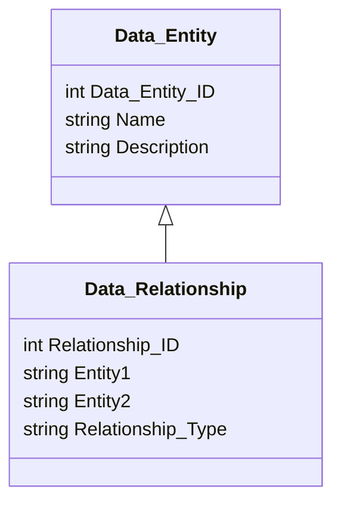
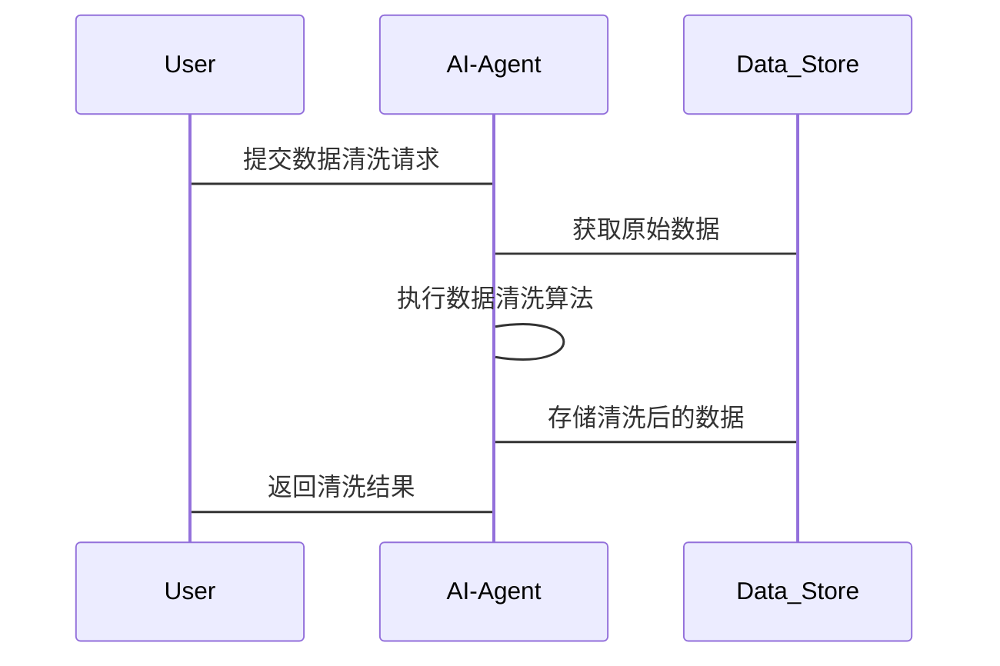

                 

<think>
嗯，用户让我写一篇关于AI Agent在企业数据质量管理与治理中的应用的技术博客。首先，我需要理解用户的需求，他们希望有一个结构清晰、内容详实的博客，涵盖背景、核心概念、算法、系统设计、项目实战和最佳实践等方面。

好的，首先，我得确定博客的标题和关键词。标题已经给出，是《AI Agent在企业数据质量管理与治理中的应用》。关键词需要5-7个，我想到的是AI Agent、数据质量管理、数据治理、企业数据管理、数据清洗、数据安全、数据完整性。摘要部分需要简明扼要，说明文章的核心内容。

接下来，目录结构部分，用户已经提供了一个示例，我需要按照这个结构来细化内容。第一部分是概述，包括背景、挑战和AI Agent的作用。这部分需要详细解释数据质量管理的重要性，以及AI Agent如何解决这些问题。

然后是核心概念与联系，这里需要详细讲解AI Agent的原理，可能还需要一些图表，比如Mermaid流程图。我得确保每个部分都有足够的细节，并且用清晰的语言表达。

接下来是算法原理，这部分需要详细解释AI Agent如何工作，可能包括数据清洗和数据增强的具体算法。我需要用Mermaid流程图展示算法步骤，并附上Python代码示例。同时，数学模型和公式要用Latex表示，确保准确性和专业性。

系统分析与架构设计部分，我需要介绍企业的数据管理挑战，设计系统的功能模块，并用Mermaid类图展示。系统架构图、接口设计和交互序列图也是必须的，这部分需要详细描述。

项目实战部分，用户需要实际案例分析，包括环境安装、核心代码实现、代码解读和实际案例分析。这部分要让读者能够动手操作，理解AI Agent的应用。

最后，最佳实践、小结、注意事项和拓展阅读也是必要的，帮助读者巩固知识，避免常见错误，并引导他们进一步学习。

在写作过程中，我需要确保每个部分都细化到三级目录，结构清晰，内容完整。同时，控制总字数在2000字以内，避免冗余。可能的挑战是如何将复杂的算法和系统架构用简洁的方式表达出来，同时确保每个部分都有足够的细节。

总结一下，我需要按照用户的要求，设计一个结构清晰、内容详实的目录大纲，涵盖背景、核心概念、算法、系统设计、项目实战和最佳实践等方面，确保每个部分都细化到三级目录，并使用Mermaid图表和Latex公式来增强理解。
</think>

# AI Agent在企业数据质量管理与治理中的应用

> 关键词：AI Agent、数据质量管理、数据治理、企业数据管理、数据清洗、数据安全、数据完整性

> 摘要：本文深入探讨了AI Agent在企业数据质量管理与治理中的应用，从背景、挑战到解决方案，系统地分析了AI Agent如何通过智能化手段提升数据管理效率和准确性。文章结合实际案例，详细讲解了AI Agent的核心原理、系统架构设计以及项目实现过程，为企业在数据质量管理与治理中的实践提供了有益的指导和参考。

---

## 第一部分: 数据质量管理与治理的背景与挑战

### 第1章: 数据质量管理的背景

#### 1.1 数据在企业中的重要性
- 数据是企业的核心资产，直接影响决策的准确性和效率。
- 数据质量决定了企业业务的可靠性和竞争力。
- 数据质量管理是企业数字化转型的关键基础。

#### 1.2 数据质量管理的概念与目标
- 数据质量管理（Data Quality Management，DQM）：通过技术手段确保数据的准确性、完整性、一致性和可用性。
- 数据质量管理的目标：提高数据质量，降低数据错误率，确保数据的可信度。

#### 1.3 数据治理的定义与范围
- 数据治理：对数据的全生命周期进行规划、监控和优化的过程。
- 数据治理的范围：包括数据架构、数据安全、数据访问权限和数据合规性管理。

### 第2章: 数据质量管理中的主要挑战

#### 2.1 数据的准确性与完整性问题
- 数据源多样，容易导致数据不一致和冗余。
- 数据清洗和标准化的复杂性高，需要人工干预。

#### 2.2 数据孤岛与数据冗余
- 数据孤岛：不同部门或系统之间的数据无法有效整合，导致信息不共享。
- 数据冗余：重复数据增加存储成本，影响数据处理效率。

#### 2.3 数据安全与隐私保护
- 数据泄露风险增加，尤其是敏感数据的保护。
- 数据隐私法规（如GDPR）对企业数据治理提出更高要求。

### 第3章: 数据治理的必要性与价值

#### 3.1 数据治理对企业的影响
- 提高数据的可信度，增强企业决策能力。
- 优化数据资源的利用效率，降低数据管理成本。

#### 3.2 数据治理的经济效益
- 提高数据处理效率，降低人工成本。
- 支持数据驱动的业务创新，提升企业竞争力。

#### 3.3 数据治理的合规性要求
- 符合数据隐私法规，避免法律风险。
- 满足行业监管要求，提升企业信誉。

---

## 第二部分: AI Agent在数据质量管理中的作用

### 第4章: AI Agent的基本概念

#### 4.1 AI Agent的定义
- AI Agent：一种智能代理系统，能够感知环境、自主决策并执行任务。
- AI Agent的核心特征：智能性、自主性、反应性和社会性。

#### 4.2 AI Agent与传统数据处理工具的区别
| 特性       | AI Agent                          | 传统数据处理工具                  |
|------------|-----------------------------------|------------------------------------|
| 智能性      | 高                                | 低                                |
| 自主性      | 高                                | 低                                |
| 反应性      | 高                                | 低                                |
| 学习能力    | 强                                | 弱                                |

#### 4.3 AI Agent在数据质量管理中的优势
- 自动化处理数据清洗、关联和异常检测。
- 提供智能化的数据质量评估和优化建议。

### 第5章: AI Agent在数据质量管理中的应用场景

#### 5.1 数据清洗与标准化
- 自动识别和修复数据中的错误和不一致。
- 使用自然语言处理（NLP）技术进行文本数据清洗。

#### 5.2 数据关联与整合
- 通过机器学习算法识别数据之间的关联性。
- 实现跨系统的数据整合与共享。

#### 5.3 数据异常检测与修复
- 利用聚类分析和回归分析检测数据异常。
- 自动修复数据中的缺失值和重复值。

### 第6章: AI Agent在数据治理中的优势

#### 6.1 提高数据处理效率
- 通过自动化技术减少人工干预，提高数据处理速度。

#### 6.2 实现数据的自动化管理
- AI Agent能够实时监控数据状态，自动调整数据存储和访问权限。

#### 6.3 降低数据管理成本
- 减少人工参与，降低人力成本。
- 提高数据资源的利用率，降低存储成本。

---

## 第三部分: 数据质量管理的核心概念与联系

### 第7章: 数据质量管理的核心概念

#### 7.1 数据生命周期
- 数据的生成、存储、处理、分析、归档和销毁过程。

#### 7.2 数据质量维度
| 维度       | 描述                              |
|------------|-----------------------------------|
| 准确性     | 数据反映真实情况的程度            |
| 完整性     | 数据的完整性和一致性              |
| 一致性     | 数据在不同系统中的统一性          |
| 可用性     | 数据的可访问性和可处理性          |

#### 7.3 数据治理框架
- 数据治理的组织架构、政策和流程。

### 第8章: 数据质量管理中的关键属性对比

#### 8.1 数据准确性与完整性的对比
| 特性       | 数据准确性                        | 数据完整性                        |
|------------|-----------------------------------|------------------------------------|
| 定义       | 数据反映真实情况的程度            | 数据的完整性和一致性              |
| 检测方法   | 对比数据来源和内容                | 检查数据是否存在缺失或重复        |

#### 8.2 数据一致性与规范性的对比
| 特性       | 数据一致性                        | 数据规范性                        |
|------------|-----------------------------------|------------------------------------|
| 定义       | 数据在不同系统中的统一性          | 数据符合预定义的格式和标准        |
| 检测方法   | 对比数据在不同系统中的表现        | 检查数据格式是否符合规范          |

### 第9章: 数据实体关系图（ER图）

#### 9.1 数据实体关系图的定义
- ER图：用于描述数据实体之间的关系，是数据建模的重要工具。

#### 9.2 数据实体关系图的构建步骤
1. 确定数据实体。
2. 确定实体之间的关系。
3. 绘制ER图。

#### 9.3 数据实体关系图的Mermaid流程图
```mermaid
erd
    table Data_Quality_Management {
        Data_Entity [Data_Entity_ID, Name, Description]
        Data_Relationship [Relationship_ID, Entity1, Entity2, Relationship_Type]
        Data_Attribute [Attribute_ID, Attribute_Name, Attribute_Type]
    }
```

---

## 第四部分: AI Agent的算法原理与实现

### 第10章: AI Agent的算法原理

#### 10.1 数据清洗算法
- 使用聚类算法识别数据异常值。
- 通过自然语言处理技术清洗文本数据。

#### 10.2 数据关联算法
- 基于图论的关联规则挖掘。
- 使用机器学习算法预测数据关联性。

#### 10.3 数据增强算法
- 数据填充：使用均值、中位数或回归模型填充缺失值。
- 数据标准化：对数据进行归一化处理。

### 第11章: AI Agent的Python实现

#### 11.1 数据清洗与标准化的代码实现
```python
import pandas as pd
from sklearn.impute import SimpleImputer

# 读取数据
data = pd.read_csv('data.csv')

# 处理缺失值
imputer = SimpleImputer(strategy='mean')
data_imputed = imputer.fit_transform(data)

# 数据标准化
from sklearn.preprocessing import StandardScaler
scaler = StandardScaler()
data_scaled = scaler.fit_transform(data_imputed)
```

#### 11.2 数据关联与整合的代码实现
```python
import networkx as nx

# 创建数据关联图
G = nx.Graph()

# 添加节点
G.add_nodes_from(['Data_Entity1', 'Data_Entity2', 'Data_Entity3'])

# 添加边
G.add_edges_from([('Data_Entity1', 'Data_Entity2'), ('Data_Entity2', 'Data_Entity3')])

# 可视化
nx.draw(G, node_size=1500, node_color='red', font_size=10)
plt.show()
```

### 第12章: 算法的数学模型与公式

#### 12.1 数据清洗的数学模型
- 使用均值填补缺失值：
  $$ x_{\text{new}} = \frac{\sum x_i}{n} $$
  
#### 12.2 数据关联的数学模型
- 使用余弦相似度计算数据关联性：
  $$ \text{similarity} = \frac{\sum x_i y_i}{\sqrt{\sum x_i^2} \sqrt{\sum y_i^2}} $$

---

## 第五部分: 系统分析与架构设计

### 第13章: 问题场景介绍

#### 13.1 企业数据管理的挑战
- 数据孤岛问题
- 数据安全与隐私保护
- 数据质量管理的复杂性

### 第14章: 系统功能设计

#### 14.1 领域模型类图


#### 14.2 系统架构设计
```mermaid
archi
    title AI Agent Data Quality Management System
    Data_Entity --> Data_Relationship
    Data_Relationship --> Data_Attribute
```

### 第15章: 接口设计与交互序列图

#### 15.1 系统接口设计
- 数据输入接口
- 数据处理接口
- 数据输出接口

#### 15.2 系统交互序列图


---

## 第六部分: 项目实战与最佳实践

### 第16章: 项目实战

#### 16.1 环境安装
- 安装Python和相关库（Pandas、Scikit-learn、Networkx）
- 安装Jupyter Notebook用于数据分析和可视化

#### 16.2 核心代码实现
```python
import pandas as pd
from sklearn.impute import SimpleImputer
from sklearn.preprocessing import StandardScaler
import networkx as nx

# 数据清洗与标准化
data = pd.read_csv('data.csv')
imputer = SimpleImputer(strategy='mean')
data_imputed = imputer.fit_transform(data)
scaler = StandardScaler()
data_scaled = scaler.fit_transform(data_imputed)

# 数据关联与整合
G = nx.Graph()
G.add_nodes_from(['Entity1', 'Entity2', 'Entity3'])
G.add_edges_from([('Entity1', 'Entity2'), ('Entity2', 'Entity3')])
nx.draw(G, node_size=1500, node_color='red', font_size=10)
plt.show()
```

#### 16.3 代码解读与分析
- 数据清洗与标准化：使用SimpleImputer处理缺失值，使用StandardScaler进行数据标准化。
- 数据关联与整合：使用Networkx库构建数据关联图，展示数据实体之间的关系。

### 第17章: 实际案例分析

#### 17.1 案例背景
- 某企业存在数据孤岛问题，数据清洗和整合效率低下。

#### 17.2 案例分析
- 使用AI Agent进行数据清洗和关联，提高数据处理效率。
- 通过数据可视化工具展示数据关联图，优化数据整合流程。

#### 17.3 案例总结
- AI Agent显著提高了数据质量管理效率。
- 数据可视化工具帮助企业更好地理解和管理数据。

### 第18章: 项目小结

#### 18.1 项目实现的关键点
- 数据清洗与标准化的实现
- 数据关联与整合的实现
- 数据可视化的实现

#### 18.2 项目实现的难点
- 数据清洗算法的选择与优化
- 数据关联算法的实现与验证
- 数据可视化的工具选择与使用

---

## 第七部分: 最佳实践与注意事项

### 第19章: 最佳实践 tips

#### 19.1 数据质量管理中的注意事项
- 数据质量管理需要结合企业实际需求进行定制化实施。
- 数据安全与隐私保护是数据治理的重要组成部分。

#### 19.2 AI Agent的使用建议
- 根据数据规模和复杂度选择合适的AI Agent解决方案。
- 定期更新和优化AI Agent算法，确保数据处理的准确性。

### 第20章: 小结

#### 20.1 数据质量管理的核心价值
- 提高数据质量，降低数据错误率。
- 优化数据资源的利用效率。

#### 20.2 AI Agent在数据治理中的应用前景
- AI Agent技术将推动数据质量管理的智能化发展。
- 数据治理将成为企业数字化转型的重要支撑。

### 第21章: 注意事项

#### 21.1 数据质量管理中的常见问题
- 数据清洗过程中的误删和误改。
- 数据关联过程中的误判和漏判。

#### 21.2 AI Agent使用的注意事项
- 数据安全与隐私保护是使用AI Agent时的重要考虑因素。
- 需要定期对AI Agent进行维护和优化，确保其性能和准确性。

### 第22章: 拓展阅读

#### 22.1 数据质量管理相关书籍
- 《Data Quality: The End-Goal of Data Integration》
- 《Data Governance: How to Design, Implement, and Sustain an Effective Data Governance Program》

#### 22.2 AI Agent相关技术文档
- AI Agent技术白皮书
- 机器学习与数据挖掘技术手册

---

## 作者：AI天才研究院/AI Genius Institute & 禅与计算机程序设计艺术 /Zen And The Art of Computer Programming

