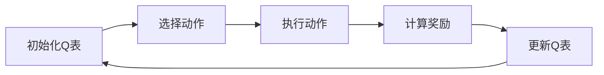
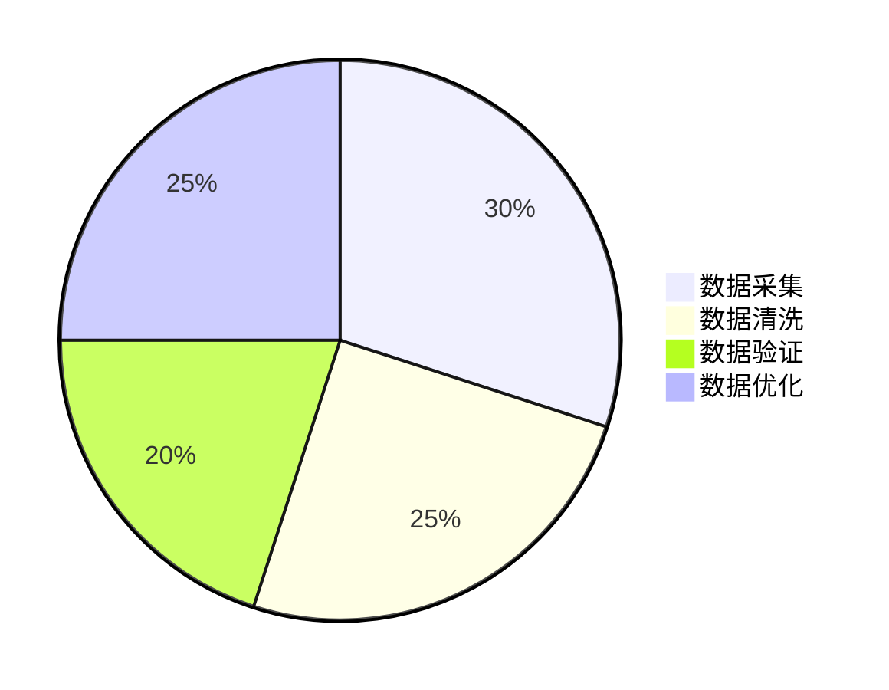
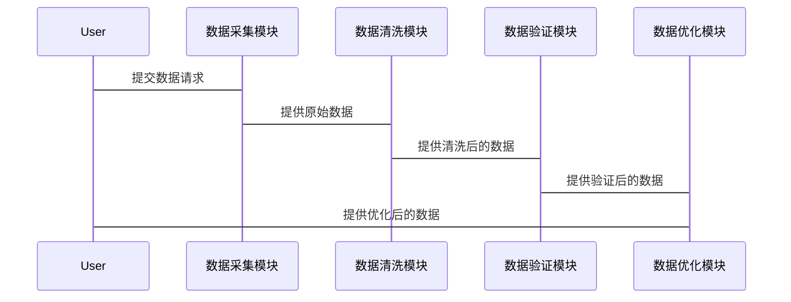

                 


# AI Agent在企业数据质量管理与治理自动化中的应用

> 关键词：AI Agent, 数据质量管理, 企业数据治理, 治理自动化, 强化学习, 数据完整性

> 摘要：随着企业数据规模的不断扩大，数据质量管理变得越来越重要。传统的数据治理方法效率低下，难以应对复杂的数据问题。AI Agent作为一种智能化工具，能够通过自动化的方式提升数据质量管理的效率和准确性。本文详细探讨了AI Agent在企业数据质量管理中的应用，分析了其核心概念、算法原理以及系统架构设计，并通过实际案例展示了其在治理自动化中的优势。文章还总结了AI Agent在数据治理中的最佳实践，为企业提供了有价值的参考。

---

## 第一章: 企业数据质量管理的背景与挑战

### 1.1 数据质量管理的定义与重要性

#### 1.1.1 数据质量管理的定义
数据质量管理（Data Quality Management）是指通过一系列方法和技术，确保数据的准确性、一致性、完整性和有效性。它是企业信息化建设中的重要组成部分，直接影响企业的决策能力和竞争力。

#### 1.1.2 数据质量管理的重要性
在当今数据驱动的时代，企业通过数据进行决策、优化业务流程和提升客户体验。如果数据质量无法保证，企业将面临严重的后果，包括错误的决策、客户信任的丧失以及合规性问题。

#### 1.1.3 企业数据质量管理的边界与外延
数据质量管理不仅关注数据本身，还涉及数据的采集、存储、处理和使用等环节。其边界包括数据来源、数据格式、数据存储和数据安全等方面，外延则涵盖数据生命周期的各个阶段。

### 1.2 企业数据质量管理的核心要素

#### 1.2.1 数据完整性
数据完整性指数据的完整性和一致性，确保数据没有缺失或损坏。

#### 1.2.2 数据一致性
数据一致性确保数据在不同系统和环节中保持一致，避免数据冗余和冲突。

#### 1.2.3 数据准确性
数据准确性指数据反映真实情况，避免错误或误导性信息。

#### 1.2.4 数据及时性
数据及时性指数据能够及时更新，反映最新的业务状态。

### 1.3 数据质量管理的现状与挑战

#### 1.3.1 传统数据质量管理方法的局限性
传统的数据质量管理方法依赖人工检查和手动修复，效率低、成本高，难以应对海量数据的挑战。

#### 1.3.2 数据孤岛与数据冗余的问题
企业内部数据孤岛和数据冗余现象严重，导致数据难以统一管理和利用。

#### 1.3.3 数据安全与隐私保护的挑战
随着数据量的增加，数据安全和隐私保护成为数据质量管理的重要内容，企业需要在数据利用和数据安全之间找到平衡。

### 1.4 AI Agent在数据质量管理中的作用

#### 1.4.1 AI Agent的定义与特点
AI Agent（人工智能代理）是一种能够感知环境、自主决策并执行任务的智能系统。它具有自主性、反应性、目标导向和协作性等特点。

#### 1.4.2 AI Agent如何提升数据质量管理效率
AI Agent可以通过自动化技术快速识别数据问题，提供优化建议，并协助修复数据，显著提升数据质量管理的效率。

#### 1.4.3 AI Agent在企业数据治理中的应用前景
AI Agent在数据治理中的应用前景广阔，可以帮助企业实现数据质量管理的自动化、智能化和高效化。

## 第二章: AI Agent的核心概念与工作原理

### 2.1 AI Agent的基本概念

#### 2.1.1 AI Agent的定义
AI Agent是一种能够感知环境、自主决策并执行任务的智能系统，广泛应用于数据治理、智能客服等领域。

#### 2.1.2 AI Agent的核心特征
- **自主性**：AI Agent能够自主决策和执行任务。
- **反应性**：AI Agent能够实时感知环境并做出反应。
- **目标导向**：AI Agent的行为以实现特定目标为导向。
- **协作性**：AI Agent能够与其他系统或人进行协作。

#### 2.1.3 AI Agent与传统数据治理工具的区别
AI Agent能够自主学习和优化，而传统数据治理工具依赖人工配置和操作。

### 2.2 AI Agent的工作原理

#### 2.2.1 数据采集与分析
AI Agent通过数据采集工具获取数据，并利用机器学习算法进行分析，识别数据中的问题和异常。

#### 2.2.2 数据清洗与预处理
AI Agent对数据进行清洗和预处理，包括去重、格式转换和缺失值处理等。

#### 2.2.3 数据验证与校正
AI Agent利用规则引擎和机器学习模型验证数据的准确性，并进行自动校正。

#### 2.2.4 数据优化与提升
AI Agent通过优化算法提升数据质量，例如通过强化学习算法优化数据分类和聚类。

### 2.3 AI Agent与数据质量管理的关系

#### 2.3.1 数据质量管理的流程与AI Agent的结合
AI Agent可以自动化执行数据质量管理的各个流程，包括数据清洗、验证和优化。

#### 2.3.2 AI Agent如何实现数据质量管理的自动化
AI Agent通过自动化技术减少人工干预，提高数据质量管理的效率和准确性。

#### 2.3.3 AI Agent在数据治理中的核心作用
AI Agent通过智能化的分析和决策，帮助企业实现数据治理的高效化和智能化。

## 第三章: 数据质量管理的理论与方法

### 3.1 数据质量管理的理论基础

#### 3.1.1 数据质量管理的定义与目标
数据质量管理的目的是确保数据的准确性、一致性和可用性，为企业提供可靠的决策支持。

#### 3.1.2 数据质量管理的五大原则
- **数据准确性**：确保数据反映真实情况。
- **数据一致性**：保证数据在不同系统中一致。
- **数据完整性**：避免数据缺失或损坏。
- **数据及时性**：数据能够及时更新。
- **数据安全性**：保护数据安全和隐私。

### 3.2 数据质量管理的核心要素

#### 3.2.1 数据完整性
数据完整性包括数据的结构完整性、内容完整性和时间完整性。

#### 3.2.2 数据一致性
数据一致性要求数据在不同系统和环节中保持一致，避免数据冗余和冲突。

#### 3.2.3 数据准确性
数据准确性指数据反映真实情况，避免错误或误导性信息。

#### 3.2.4 数据及时性
数据及时性指数据能够及时更新，反映最新的业务状态。

### 3.3 数据质量管理的方法

#### 3.3.1 传统数据质量管理方法
传统方法依赖人工检查和手动修复，效率低、成本高，难以应对海量数据的挑战。

#### 3.3.2 现代数据质量管理方法
现代方法利用大数据技术、机器学习和AI Agent等智能化工具，提升数据质量管理的效率和准确性。

### 3.4 数据质量管理的实施步骤

#### 3.4.1 数据采集
通过数据采集工具获取数据，包括内部数据和外部数据源。

#### 3.4.2 数据清洗
对数据进行去重、格式转换和缺失值处理等预处理步骤。

#### 3.4.3 数据验证
利用规则引擎和机器学习模型验证数据的准确性。

#### 3.4.4 数据优化
通过优化算法提升数据质量，例如通过强化学习算法优化数据分类和聚类。

#### 3.4.5 数据存储与应用
将处理后的数据存储在数据库中，并应用于企业的各个业务环节。

---

## 第四章: AI Agent的算法原理与数学模型

### 4.1 AI Agent的算法原理

#### 4.1.1 基于强化学习的AI Agent算法
强化学习是一种通过试错和奖励机制优化决策的算法，适用于复杂的动态环境。

#### 4.1.2 AI Agent的强化学习模型
AI Agent通过与环境的交互，学习最优策略，实现数据质量管理的自动化。

#### 4.1.3 强化学习的数学模型
强化学习的数学模型包括状态空间、动作空间、奖励函数和策略函数等。

### 4.2 AI Agent的数学模型

#### 4.2.1 强化学习算法的数学表达
强化学习算法可以通过数学公式表达，例如Q-learning算法：

$$ Q(s, a) = Q(s, a) + \alpha \left( r + \gamma \max Q(s', a') - Q(s, a) \right) $$

其中，\( Q(s, a) \) 表示状态 \( s \) 下动作 \( a \) 的价值，\( \alpha \) 是学习率，\( r \) 是奖励，\( \gamma \) 是折扣因子，\( Q(s', a') \) 是下一个状态下的最大价值。

#### 4.2.2 状态空间和动作空间的定义
状态空间是AI Agent可能遇到的所有状态，动作空间是AI Agent在每个状态下可以执行的所有动作。

#### 4.2.3 奖励函数的设计
奖励函数用于衡量AI Agent的行为是否符合预期目标，通常设计为数值型的奖励。

### 4.3 AI Agent的算法实现

#### 4.3.1 环境与状态的定义
环境是AI Agent所处的外部世界，状态是环境中的具体情况。

#### 4.3.2 动作的选择
AI Agent根据当前状态选择一个动作，并执行该动作。

#### 4.3.3 奖励的计算
根据动作的结果计算奖励，并更新Q值或策略。

#### 4.3.4 策略的优化
通过不断迭代和优化，AI Agent逐步逼近最优策略。

### 4.4 AI Agent的数学模型示例

#### 4.4.1 Q-learning算法的流程图


#### 4.4.2 状态空间的示例
状态空间可以表示为一个数组，每个元素表示一个状态，例如：
$$ Q = [0.8, 0.5, 0.9] $$

#### 4.4.3 动作空间的示例
动作空间可以表示为一个集合，例如：
$$ A = \{a_1, a_2, a_3\} $$

## 第五章: 数据治理的自动化与系统架构设计

### 5.1 数据治理的自动化

#### 5.1.1 自动化数据质量管理
AI Agent通过自动化技术实现数据质量管理的各个环节，包括数据清洗、验证和优化。

#### 5.1.2 数据治理的智能化
AI Agent利用机器学习和强化学习等技术，提升数据治理的智能化水平。

#### 5.1.3 自动化与智能化的结合
AI Agent通过自动化和智能化的结合，实现数据治理的高效化和精准化。

### 5.2 数据治理系统架构设计

#### 5.2.1 系统功能模块
数据治理系统包括数据采集模块、数据清洗模块、数据验证模块和数据优化模块。

#### 5.2.2 系统架构图


#### 5.2.3 系统接口设计
系统接口包括数据输入接口、数据输出接口和用户接口，通过API进行交互。

#### 5.2.4 系统交互流程


### 5.3 系统架构的实现

#### 5.3.1 系统功能模块的实现
数据采集模块通过API获取数据，数据清洗模块利用Python库进行数据清洗，数据验证模块通过规则引擎进行验证，数据优化模块通过机器学习模型进行优化。

#### 5.3.2 系统架构的优化
通过分布式架构和并行处理技术，提升系统的处理效率和扩展性。

#### 5.3.3 系统接口的设计
系统接口采用RESTful API，支持JSON格式的数据传输，确保系统的兼容性和易用性。

## 第六章: 项目实战与案例分析

### 6.1 项目实战

#### 6.1.1 环境安装
安装Python、Pandas、Scikit-learn等必要的库，配置开发环境。

#### 6.1.2 核心功能实现
实现数据采集、数据清洗、数据验证和数据优化的核心功能，通过Python代码实现。

#### 6.1.3 代码实现与解读
以下是数据清洗模块的代码示例：
```python
import pandas as pd

def data_cleaning(data):
    # 删除缺失值
    data.dropna(inplace=True)
    # 处理异常值
    data = data[(data['age'] >= 0) & (data['age'] <= 120)]
    return data

# 示例数据
data = pd.DataFrame({
    'name': ['A', 'B', 'C', 'D'],
    'age': [25, None, 150, 30]
})

# 调用数据清洗函数
cleaned_data = data_cleaning(data)
print(cleaned_data)
```

#### 6.1.4 代码分析
上述代码通过Pandas库实现数据清洗，包括删除缺失值和处理异常值。

### 6.2 实际案例分析

#### 6.2.1 案例背景
某企业希望通过AI Agent实现客户数据的自动化质量管理，提升数据的准确性和一致性。

#### 6.2.2 数据清洗与优化
AI Agent通过数据清洗模块去除重复数据和异常值，通过数据优化模块提升数据的分类精度。

#### 6.2.3 数据验证与校正
AI Agent利用规则引擎和机器学习模型验证数据的准确性，并进行自动校正。

### 6.3 项目小结

#### 6.3.1 项目成果
项目成功实现了客户数据的自动化质量管理，提高了数据的准确性和一致性。

#### 6.3.2 项目经验
通过本项目，我们掌握了AI Agent在数据质量管理中的应用方法，积累了丰富的实战经验。

#### 6.3.3 项目展望
未来可以通过优化算法和引入更多的数据源，进一步提升数据质量管理的效率和精度。

## 第七章: 最佳实践与未来展望

### 7.1 最佳实践

#### 7.1.1 数据质量管理的策略
- **数据来源管理**：确保数据来源的可靠性和合法性。
- **数据安全保护**：加强数据安全和隐私保护措施。
- **数据质量监控**：建立数据质量监控机制，及时发现和解决问题。

#### 7.1.2 AI Agent的优化建议
- **算法优化**：通过不断优化强化学习算法，提升AI Agent的决策能力和效率。
- **系统集成**：将AI Agent与其他企业系统集成，实现数据质量管理的全面自动化。
- **人才储备**：培养具备AI和数据治理双重能力的专业人才。

### 7.2 小结

#### 7.2.1 本文总结
本文详细探讨了AI Agent在企业数据质量管理中的应用，分析了其核心概念、算法原理以及系统架构设计，并通过实际案例展示了其在治理自动化中的优势。

#### 7.2.2 本文贡献
本文为企业提供了AI Agent在数据治理中的应用方法和最佳实践，为企业的数据质量管理提供了新的思路和解决方案。

### 7.3 未来展望

#### 7.3.1 数据质量管理的发展趋势
随着大数据和人工智能技术的不断发展，数据质量管理将更加智能化和自动化。

#### 7.3.2 AI Agent的应用前景
AI Agent将在数据治理中发挥越来越重要的作用，推动数据质量管理的全面升级。

#### 7.3.3 未来的研究方向
未来的研究方向包括AI Agent算法的优化、数据治理的智能化以及数据安全与隐私保护等方面。

---

## 作者：AI天才研究院/AI Genius Institute & 禅与计算机程序设计艺术 /Zen And The Art of Computer Programming

