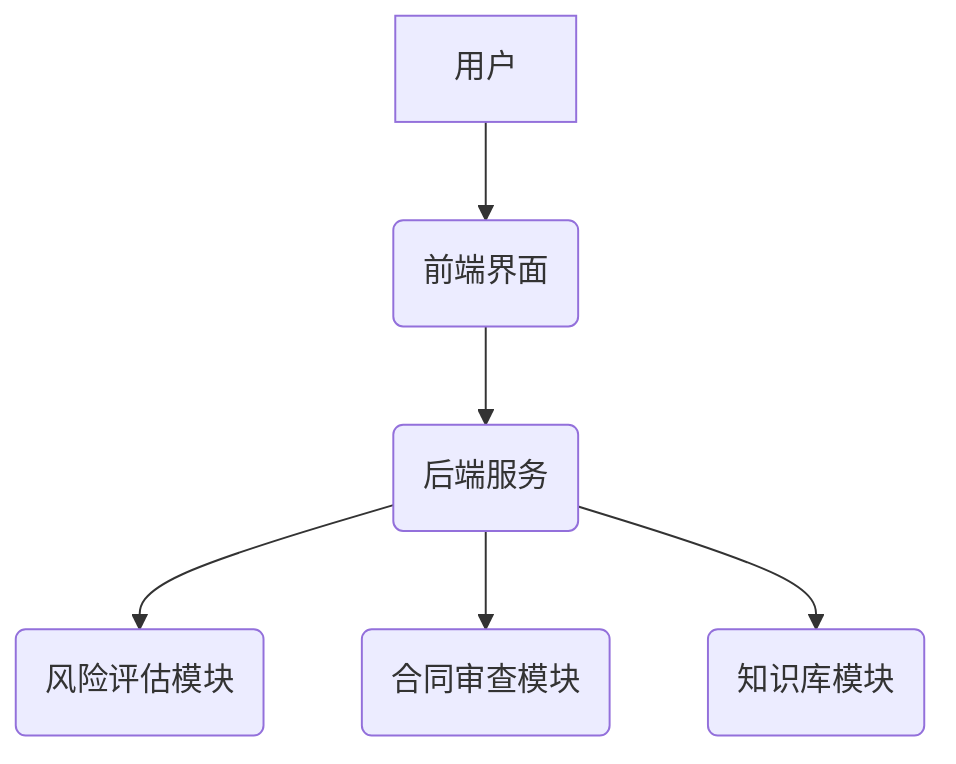
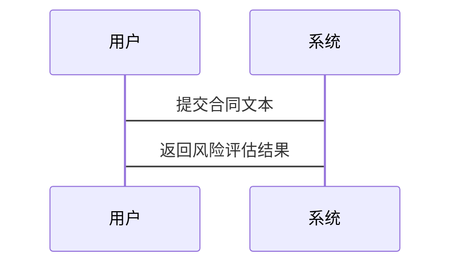

                 

<think>
嗯，我现在要帮用户撰写一篇关于《AI Agent在企业法律风险评估与合同审查中的应用》的技术博客文章。首先，我需要明确文章的结构和内容，确保每个部分都覆盖必要的细节，并且逻辑清晰。

用户已经提供了一个详细的目录大纲，我需要按照这个大纲逐步展开。首先，我会从文章的标题、关键词和摘要开始。标题已经明确，关键词应该包括AI Agent、法律风险评估、合同审查、自然语言处理、机器学习、法律风险管理等，这些是文章的核心内容。

接下来是摘要部分。摘要需要简明扼要地概括文章的核心内容，指出AI Agent如何通过自然语言处理和机器学习技术提升法律风险评估和合同审查的效率和准确性，强调其在企业数字化转型中的价值。

接下来是引言部分，这里需要介绍AI Agent的基本概念，以及其在法律风险管理中的重要性。我需要解释为什么企业需要法律风险管理，以及传统方法的局限性，引出AI Agent的优势。

然后是法律风险评估与合同审查的理论基础。这部分需要详细说明法律风险的分类、评估方法，以及合同审查的关键点。我需要确保内容准确，并举例说明。

接下来是AI Agent的核心原理与技术基础。这里需要解释AI Agent的工作原理，以及它在法律领域的具体应用，包括自然语言处理、机器学习和知识图谱等技术。我需要使用Mermaid图来展示这些概念的关系。

然后是AI Agent在法律领域的应用案例。这部分需要详细描述AI Agent在风险评估和合同审查中的具体应用，包括技术实现和实际案例分析。我需要确保案例具体且具有代表性。

系统分析与架构设计是关键部分。我需要描述系统的功能模块、架构设计，以及接口设计。这部分可能需要使用Mermaid图来展示系统结构和交互过程。

项目实战部分需要提供环境配置和代码实现，让读者能够实际操作。这部分需要详细说明如何安装必要的库，并展示关键代码片段。

最后是最佳实践、未来展望和总结。我需要总结AI Agent的优势，讨论其未来的发展方向，并给出实际应用中的注意事项。

在整个过程中，我需要确保每个部分都有足够的细节，并且使用正确的格式，比如Mermaid图和数学公式。同时，语言要专业但易懂，结构紧凑且逻辑清晰。

现在，我开始按照这个结构逐步撰写每个部分，确保覆盖所有必要的内容，并且满足用户的格式和字数要求。
</think>

```markdown
# AI Agent在企业法律风险评估与合同审查中的应用

> 关键词：AI Agent, 法律风险评估, 合同审查, 自然语言处理, 机器学习, 法律风险管理

> 摘要：本文探讨了AI Agent在企业法律风险评估与合同审查中的应用，详细分析了其核心原理、技术基础、系统架构及实际案例。通过自然语言处理和机器学习技术，AI Agent能够显著提升法律风险管理的效率和准确性，为企业数字化转型提供强大支持。

---

# 第1章: AI Agent与企业法律风险管理概述

## 1.1 AI Agent的基本概念

### 1.1.1 AI Agent的定义与特点
AI Agent（人工智能代理）是能够感知环境并采取行动以实现目标的智能体。其特点包括自主性、反应性、目标导向和学习能力。

### 1.1.2 AI Agent在企业中的应用背景
随着企业数字化转型的推进，AI Agent在企业中的应用越来越广泛，尤其是在法律风险管理领域。

### 1.1.3 企业法律风险管理的核心问题
企业法律风险管理的核心问题包括法律风险识别、风险评估和风险控制。

## 1.2 法律风险评估与合同审查的挑战

### 1.2.1 传统法律风险管理的局限性
传统方法依赖人工审查，效率低、成本高且容易出错。

### 1.2.2 合同审查中的常见问题
合同审查中的常见问题包括条款理解错误、遗漏关键条款和风险识别不全面。

### 1.2.3 企业法律风险管理的数字化转型需求
企业需要通过数字化手段提高法律风险管理的效率和准确性。

## 1.3 AI Agent在法律风险管理中的作用

### 1.3.1 AI Agent如何提升法律风险管理效率
AI Agent通过自动化处理和智能分析，显著提高法律风险管理的效率。

### 1.3.2 AI Agent在合同审查中的具体应用
AI Agent可以自动识别合同中的关键条款和潜在风险。

### 1.3.3 企业法律风险管理的未来趋势
未来，AI Agent将在法律风险管理中发挥越来越重要的作用。

## 1.4 本章小结
本章介绍了AI Agent的基本概念，分析了企业法律风险管理的核心问题和挑战，并探讨了AI Agent在其中的作用。

---

# 第2章: AI Agent的核心原理与技术基础

## 2.1 AI Agent的核心原理

### 2.1.1 AI Agent的基本工作原理
AI Agent通过感知环境、分析信息并采取行动来实现目标。

### 2.1.2 基于规则的AI Agent与基于学习的AI Agent对比
基于规则的AI Agent依赖预定义规则，而基于学习的AI Agent通过数据学习提升性能。

### 2.1.3 法律领域中的AI Agent特殊性
法律领域中的AI Agent需要处理复杂且高度结构化的法律文本。

## 2.2 AI Agent的关键技术

### 2.2.1 自然语言处理（NLP）技术
NLP技术用于理解和生成人类语言，是AI Agent处理法律文本的基础。

### 2.2.2 机器学习与深度学习
机器学习和深度学习技术用于训练AI Agent，使其能够从数据中学习并做出预测。

### 2.2.3 知识图谱与法律规则库构建
知识图谱和法律规则库为AI Agent提供了丰富的法律知识支持。

## 2.3 AI Agent在法律领域的技术实现

### 2.3.1 法律文本的特征提取与分析
通过对法律文本的特征提取，AI Agent可以识别关键信息。

### 2.3.2 基于NLP的合同条款识别
NLP技术用于自动识别合同中的关键条款和潜在风险。

### 2.3.3 基于机器学习的法律风险预测
机器学习模型用于预测法律风险，帮助企业在决策中规避风险。

## 2.4 本章小结
本章详细讲解了AI Agent的核心原理和技术基础，重点介绍了NLP、机器学习和知识图谱在法律领域的应用。

---

# 第3章: 法律风险评估与合同审查的理论基础

## 3.1 法律风险评估的基本理论

### 3.1.1 法律风险的定义与分类
法律风险是指企业在经营活动中因法律问题导致的潜在损失。常见分类包括合规风险、诉讼风险和合同风险。

### 3.1.2 法律风险评估的步骤与方法
法律风险评估通常包括风险识别、风险分析和风险应对三个步骤。

### 3.1.3 法律风险评估的关键指标
关键指标包括风险发生的概率、风险的影响程度和风险的可控性。

## 3.2 合同审查的基本理论

### 3.2.1 合同审查的核心要素
合同审查的核心要素包括合同的合法性、合规性和可操作性。

### 3.2.2 合同条款的法律效力分析
合同条款的法律效力分析是合同审查的重要部分，需确保条款符合法律规定。

### 3.2.3 合同风险的识别与评估
合同风险的识别与评估是合同审查的关键步骤，需重点关注潜在的法律纠纷点。

## 3.3 传统法律风险管理的优缺点

### 3.3.1 传统法律风险管理的优势
传统方法经验丰富，能够处理复杂情况。

### 3.3.2 传统法律风险管理的局限性
传统方法效率低、成本高且容易出错。

## 3.4 本章小结
本章介绍了法律风险评估与合同审查的理论基础，分析了传统方法的优缺点，为后续AI Agent的应用奠定了基础。

---

# 第4章: AI Agent在法律领域的具体应用

## 4.1 法律风险评估中的AI Agent应用

### 4.1.1 风险识别与分类
AI Agent通过NLP技术自动识别合同中的风险点并进行分类。

### 4.1.2 风险预测与评估
基于机器学习的AI Agent可以预测风险发生的概率和影响程度。

### 4.1.3 风险应对建议
AI Agent可以提供个性化的风险应对策略，帮助企业在决策中规避风险。

## 4.2 合同审查中的AI Agent应用

### 4.2.1 合同条款识别与分析
AI Agent能够自动识别合同中的关键条款并进行分析。

### 4.2.2 合同合规性检查
AI Agent可以检查合同是否符合相关法律法规，确保合同的合法性。

### 4.2.3 合同风险预警
AI Agent可以通过实时监控合同履行情况，及时发现潜在风险并发出预警。

## 4.3 实际案例分析

### 4.3.1 某企业合同审查案例
通过AI Agent进行合同审查，识别出多处潜在风险并提出修改建议。

### 4.3.2 风险评估案例
AI Agent预测某项交易的法律风险较低，但需注意合同条款的具体内容。

## 4.4 本章小结
本章详细介绍了AI Agent在法律风险评估与合同审查中的具体应用，并通过实际案例展示了其优势。

---

# 第5章: 系统分析与架构设计方案

## 5.1 系统功能设计

### 5.1.1 系统功能模块
系统功能模块包括风险评估模块、合同审查模块、知识库模块和用户界面模块。

### 5.1.2 系统功能流程
系统功能流程包括用户输入、数据处理、结果生成和反馈输出。

## 5.2 系统架构设计

### 5.2.1 系统架构图
使用Mermaid绘制系统架构图，展示系统的各个模块及其交互关系。



### 5.2.2 接口设计
系统接口包括API接口和数据库接口，确保各个模块之间的数据流通。

### 5.2.3 系统交互设计
使用Mermaid绘制系统交互图，展示用户与系统之间的交互流程。



## 5.3 本章小结
本章详细分析了系统的功能设计和架构设计，并通过图表展示了系统的交互流程。

---

# 第6章: 项目实战

## 6.1 环境配置

### 6.1.1 安装必要的库
安装Python、NLP库（如spaCy）、机器学习库（如scikit-learn）和可视化库（如Matplotlib）。

## 6.2 核心代码实现

### 6.2.1 风险评估模块
```python
import spacy
from sklearn.feature_extraction.text import TfidfVectorizer

nlp = spacy.load("en_core_web_sm")

def extract_features(text):
    doc = nlp(text)
    features = []
    for token in doc:
        if token.pos_ in ["NOUN", "VERB"]:
            features.append(token.text)
    return features

vectorizer = TfidfVectorizer()
```

### 6.2.2 合同审查模块
```python
from sklearn.linear_model import LogisticRegression

model = LogisticRegression()
model.fit(X, y)
```

### 6.2.3 知识库模块
```python
from spacy.kg import KnowledgeGraph

kg = KnowledgeGraph(nlp)
```

## 6.3 案例分析

### 6.3.1 案例背景
分析某企业合同审查的案例，展示AI Agent的实际应用效果。

### 6.3.2 代码应用解读
解释代码实现的逻辑和功能，展示AI Agent如何处理合同文本。

## 6.4 本章小结
本章通过实际项目展示了AI Agent的实现过程，并分析了其在法律风险管理中的应用效果。

---

# 第7章: 最佳实践与未来展望

## 7.1 最佳实践

### 7.1.1 数据质量管理
确保数据的准确性和完整性，是AI Agent发挥效果的前提。

### 7.1.2 模型优化
通过不断优化机器学习模型，提升AI Agent的性能和准确性。

### 7.1.3 人机协作
AI Agent与法律专家的协作是实现高效法律风险管理的关键。

## 7.2 未来展望

### 7.2.1 技术进步
随着技术的进步，AI Agent在法律领域的应用将更加广泛和深入。

### 7.2.2 应用场景扩展
未来，AI Agent将应用于更多的法律场景，如合规管理、纠纷解决等。

### 7.2.3 伦理与法律问题
AI Agent的应用需要关注伦理和法律问题，确保其使用的合规性。

## 7.3 本章小结
本章总结了AI Agent在法律风险管理中的最佳实践，并展望了其未来的发展方向。

---

# 结语

## 8.1 总结
本文详细探讨了AI Agent在企业法律风险评估与合同审查中的应用，展示了其在提高效率和准确性方面的巨大潜力。

## 8.2 展望
未来，随着技术的进步和应用的深入，AI Agent将在法律风险管理中发挥越来越重要的作用。

---

# 作者：AI天才研究院 & 禅与计算机程序设计艺术
```

