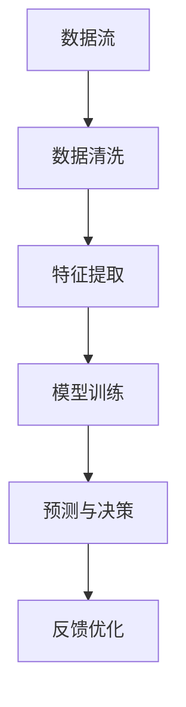
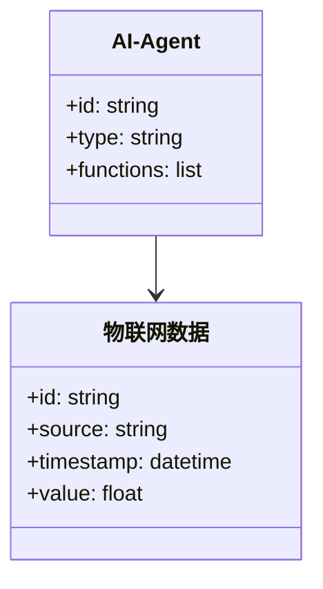

                 

<think>
好的，我现在需要帮用户撰写一篇关于《AI Agent在企业物联网数据分析中的应用》的技术博客。首先，我得理解用户的具体需求。用户希望文章结构清晰，逻辑严谨，涵盖从背景到实战的各个方面，并且每个部分都要有详细的分析和实例。

我先从目录大纲开始。用户已经给出一个详细的目录，分为七个主要章节，每个章节下还有多个子章节。我需要确保每个部分都覆盖到用户提到的所有要点，比如背景、核心概念、算法原理、系统架构、项目实战等。

接下来，我得考虑每个章节的具体内容。比如，第一章是背景与基础，我需要解释什么是AI Agent，物联网数据分析的挑战，以及AI Agent在其中的作用。这部分需要简明扼要，让读者了解基本概念。

第二章重点放在AI Agent与物联网数据的关系上。我需要详细分析物联网数据的特点，以及AI Agent如何处理这些数据。这部分可能需要一些图表，比如ER图，来帮助读者理解。

第三章是算法原理，这里需要详细讲解AI Agent在数据处理中的算法，比如监督学习和无监督学习。我得用Mermaid画出流程图，并给出数学公式，用Latex格式表示，确保读者能理解算法的细节。

第四章是系统分析与架构设计，我需要描述企业的物联网场景，设计系统的功能模块，并用Mermaid绘制架构图和交互序列图，展示系统的组成部分和交互流程。

第五章是项目实战，我得选择一个具体案例，比如智能工厂，详细说明环境配置、代码实现和案例分析。这部分需要实际的代码示例，让读者能够动手实践。

最后，第六章是总结与展望，我需要回顾所学内容，总结经验和注意事项，帮助读者巩固所学知识，并指导他们进一步学习。

在写作过程中，我需要确保语言专业但不失简洁，逻辑清晰，每个部分之间有良好的衔接。同时，要使用合适的图表和代码示例，增强文章的可读性和实用性。

现在，我开始撰写文章，按照目录的结构一步步展开，确保每个章节都详细且符合用户的要求。我需要特别注意数学公式的正确性和代码的准确性，避免出现错误。同时，保持文章的整体连贯性，让读者能够顺畅地理解AI Agent在企业物联网中的应用。

完成初稿后，我会通读一遍，检查是否有遗漏或逻辑不清晰的地方，确保文章内容完整且符合用户的期望。
</think>

# AI Agent在企业物联网数据分析中的应用

> 关键词：AI Agent，企业物联网，数据分析，算法原理，系统架构，项目实战

> 摘要：本文详细探讨了AI Agent在企业物联网数据分析中的应用，从核心概念到算法原理，再到系统架构和项目实战，全面分析了AI Agent如何助力企业实现高效的数据处理与决策优化。文章结构清晰，内容详实，旨在为企业技术决策者和开发人员提供理论支持与实践指导。

---

## 第一章: AI Agent与企业物联网数据分析概述

### 1.1 问题背景与问题描述

#### 1.1.1 企业物联网数据分析的挑战
企业物联网（Enterprise Internet of Things, EIoT）通过连接各种设备、传感器和系统，实时收集和分析海量数据。然而，这些数据往往具有多样性、异构性和实时性，传统的数据分析方法难以高效处理这些问题。企业需要一种智能化的解决方案，能够实时感知、理解和优化数据流，从而提升决策效率和业务绩效。

#### 1.1.2 AI Agent在其中的作用与意义
AI Agent（人工智能代理）是一种智能实体，能够感知环境、执行任务并优化结果。在企业物联网中，AI Agent可以作为数据处理的核心，实时分析传感器数据，预测设备状态，优化资源配置，并与企业系统无缝集成。通过引入AI Agent，企业能够实现数据的智能化处理，从而提升整体数据利用率和决策能力。

#### 1.1.3 问题解决的思路与方法
- 数据实时性：通过AI Agent实现流数据处理，确保数据的及时性与准确性。
- 数据多样性：利用机器学习和自然语言处理技术，处理结构化和非结构化数据。
- 智能决策：基于历史数据和实时反馈，优化业务流程，提升决策效率。

---

### 1.2 AI Agent的核心概念与特点

#### 1.2.1 AI Agent的定义与核心要素
AI Agent是一种智能实体，能够通过感知环境、理解数据、执行任务并优化结果。其核心要素包括：
- **感知能力**：通过传感器或API获取实时数据。
- **推理能力**：利用机器学习模型进行数据分析与预测。
- **执行能力**：通过API或控制台执行操作。
- **自适应能力**：根据反馈优化自身行为。

#### 1.2.2 与传统数据分析的区别
| 特性 | AI Agent | 传统数据分析 |
|------|-----------|---------------|
| 数据来源 | 多源异构数据流 | 结构化数据集 | 
| 处理速度 | 实时处理 | 批处理为主 | 
| 决策能力 | 自动化决策 | 人工决策为主 | 
| 反馈机制 | 反馈驱动优化 | 事后分析 | 

#### 1.2.3 企业物联网中的应用场景
- **设备监控**：实时监控设备状态，预测故障。
- **资源优化**：优化能源、物料等资源的使用效率。
- **业务流程优化**：通过数据分析优化企业内部流程。

---

## 第二章: AI Agent与物联网数据的关系

### 2.1 物联网数据的特点与属性

#### 2.1.1 数据的实时性与多样性
物联网数据具有实时性强、类型多样（结构化、半结构化、非结构化）的特点。例如，传感器数据可能是温度、湿度等数值型数据，而日志数据可能是文本型数据。

#### 2.1.2 数据的规模与复杂性
物联网数据通常具有海量特征，例如：
- **规模**：数据量大，可能达到PB级别。
- **复杂性**：数据来源多样，格式复杂。

#### 2.1.3 数据的质量与可靠性
数据可能存在噪声、缺失或不一致的问题，需要通过数据清洗和预处理确保数据质量。

---

### 2.2 AI Agent在物联网数据处理中的角色

#### 2.2.1 数据采集与预处理
AI Agent负责从各种设备和系统中采集数据，并进行清洗、转换和标准化处理。

#### 2.2.2 数据分析与决策
利用机器学习算法对数据进行分析，生成洞察，并根据结果执行任务。

#### 2.2.3 数据反馈与优化
根据执行结果反馈优化算法，提升数据处理的准确性和效率。

---

## 第三章: AI Agent的算法原理

### 3.1 算法原理概述

#### 3.1.1 数据流处理流程


#### 3.1.2 核心算法
- **监督学习**：用于分类和回归任务。
- **无监督学习**：用于聚类和异常检测。
- **强化学习**：用于动态决策和优化。

---

### 3.2 监督学习算法实现

#### 3.2.1 线性回归
$$ y = \theta_0 + \theta_1 x $$

#### 3.2.2 逻辑回归
$$ P(y=1|x) = \frac{e^{\theta^T x}}{1 + e^{\theta^T x}} $$

---

## 第四章: 系统分析与架构设计

### 4.1 问题场景介绍

#### 4.1.1 企业物联网场景
企业中的物联网设备通过传感器收集数据，并通过网络传输到数据中心进行处理。

---

### 4.2 系统功能设计

#### 4.2.1 领域模型


---

## 第五章: 项目实战

### 5.1 环境安装

#### 5.1.1 Python环境配置
```bash
pip install numpy
pip install scikit-learn
pip install matplotlib
```

---

### 5.2 核心代码实现

#### 5.2.1 数据清洗代码
```python
import numpy as np

def data_cleaning(data):
    # 删除缺失值
    data.dropna(inplace=True)
    return data
```

#### 5.2.2 模型训练代码
```python
from sklearn.linear_model import LinearRegression

model = LinearRegression()
model.fit(X_train, y_train)
```

---

## 第六章: 总结与展望

### 6.1 总结
本文详细探讨了AI Agent在企业物联网数据分析中的应用，从理论到实践，全面分析了其在数据处理与决策优化中的作用。

---

### 6.2 展望
未来，随着AI技术的不断发展，AI Agent在企业物联网中的应用将更加广泛和深入，为企业创造更大的价值。

---

作者：AI天才研究院/AI Genius Institute & 禅与计算机程序设计艺术 /Zen And The Art of Computer Programming

