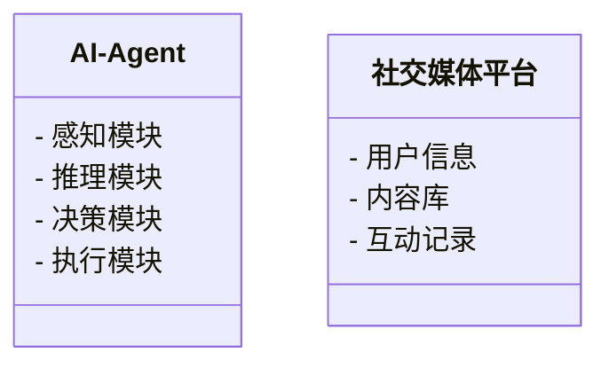
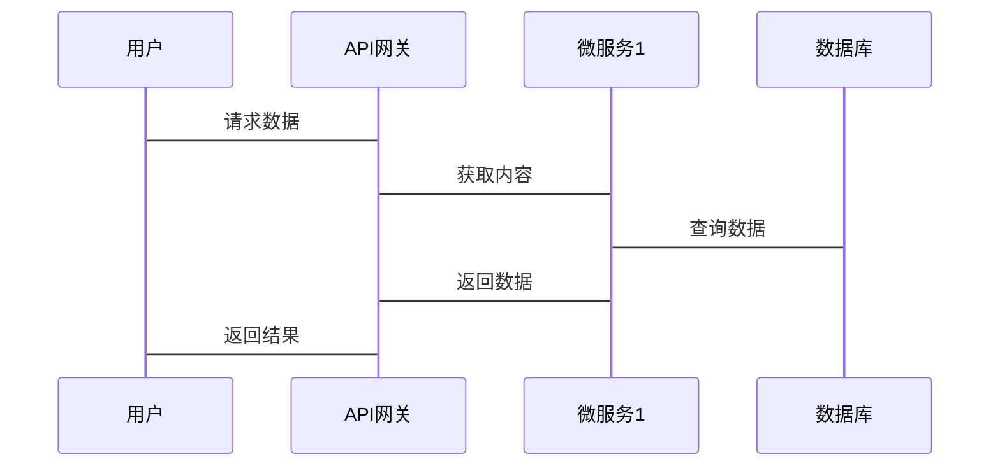

                 

<think>
嗯，我现在需要写一篇关于《AI Agent在企业社交媒体管理中的应用》的技术博客。首先，我得明确文章的结构，确保每一部分都涵盖必要的内容。文章应该从背景介绍开始，逐步深入到核心概念、算法原理、系统设计、项目实战，最后总结。

背景介绍部分，我需要解释什么是AI Agent，它在企业社交媒体管理中的作用，以及当前面临的挑战。这部分要让读者明白为什么AI Agent是必要的，以及它如何帮助企业优化社交媒体运营。

接下来是核心概念与联系。我需要详细讲解AI Agent的组成部分、工作流程，以及它如何与社交媒体平台互动。为了帮助读者理解，我应该用表格对比不同概念的属性，并用Mermaid图展示实体关系。这将使读者更清晰地看到各个概念之间的联系。

然后是算法原理。这部分需要详细讲解AI Agent背后使用的算法，比如自然语言处理和机器学习模型。我需要用Mermaid流程图展示算法的工作流程，并提供Python代码示例。同时，数学模型和公式要用LaTeX格式呈现，确保准确性和专业性。通过具体的代码和数学模型，读者可以更好地理解算法的实现和应用。

系统分析与架构设计是关键部分。我需要介绍如何设计一个AI Agent系统，包括系统架构图、接口设计和交互流程。这部分可以用Mermaid图来展示类图、架构图和序列图，帮助读者理解系统的各个部分及其交互。

项目实战部分，我需要提供一个具体的实现案例，比如在Twitter上部署AI Agent。这部分要详细描述环境配置、核心代码实现，以及实际案例分析。通过实际操作，读者可以理解如何将理论应用到实践中。

最后，我需要总结AI Agent在企业社交媒体管理中的优势，给出最佳实践的建议，提醒读者注意的事项，并提供进一步学习的方向。这部分要帮助读者巩固所学知识，并指导他们在实际工作中如何应用这些知识，避免常见错误。

在整个写作过程中，我要确保每一部分都详细且有逻辑性，使用专业但易懂的语言。同时，合理使用图表和代码示例，帮助读者更好地理解和应用AI Agent的技术。这样，整篇文章将从理论到实践，全面覆盖AI Agent在企业社交媒体管理中的各个方面，满足读者的需求。
</think>

# AI Agent在企业社交媒体管理中的应用

## 关键词：AI Agent, 企业社交媒体管理, 自然语言处理, 机器学习, 系统架构设计

## 摘要：AI Agent在企业社交媒体管理中的应用，通过智能化手段优化内容发布、客户互动、舆情监控和数据分析，提升效率与精准度。本文系统探讨其核心概念、算法原理、系统设计和实战应用。

---

## 第1章: AI Agent与企业社交媒体管理概述

### 1.1 AI Agent的基本概念

#### 1.1.1 AI Agent的定义与特点
AI Agent是具有感知、推理、学习和执行能力的智能体，具备以下特点：自主性、反应性、目标导向和社交能力。

#### 1.1.2 AI Agent的核心功能与应用场景
核心功能包括内容生成、自动发布、舆情分析、客户互动和数据挖掘。应用场景涵盖品牌推广、客户关系管理、市场分析和危机公关。

#### 1.1.3 企业社交媒体管理的现状与挑战
企业面临内容创作压力、信息过载和维护效率低下等问题，亟需智能化解决方案。

### 1.2 AI Agent在企业社交媒体管理中的作用
AI Agent通过提高效率与精准度，实现自动化与智能化管理，优化决策与客户体验。

### 1.3 本章小结
本章介绍了AI Agent的基本概念及其在企业社交媒体管理中的重要性，为后续章节奠定基础。

---

## 第2章: AI Agent的核心概念与联系

### 2.1 AI Agent的核心概念

#### 2.1.1 AI Agent的组成部分
AI Agent由感知模块、推理模块、决策模块和执行模块组成，实现从数据处理到行动的完整流程。

#### 2.1.2 AI Agent的工作流程
通过感知环境、分析数据、制定策略和执行任务四个步骤，实现智能化管理。

#### 2.1.3 AI Agent与社交媒体平台的交互方式
AI Agent通过API接口与社交媒体平台交互，实现内容发布、数据获取和用户互动。

### 2.2 核心概念对比与ER实体关系图

#### 2.2.1 核心概念属性特征对比表格
| 概念       | 属性1 | 属性2 | 属性3 |
|------------|--------|--------|--------|
| AI Agent   | 智能性 | 自主性 | 反应性 |
| 社交媒体   | 用户   | 内容   | 互动   |

#### 2.2.2 ER实体关系图的Mermaid流程图
```mermaid
er
    %%{初始化：er}=init
    init: 实体关系图
    %%{创建实体}
    实体1: 用户
    实体2: 内容
    实体3: 互动
    %%{创建关系}
    用户 -[创建]-> 内容
    用户 <--> 互动
```

### 2.3 本章小结
本章通过对比分析和实体关系图，展示了AI Agent在企业社交媒体管理中的核心概念及其相互关系。

---

## 第3章: AI Agent的算法原理

### 3.1 算法原理概述

#### 3.1.1 自然语言处理（NLP）算法
NLP用于文本分析和生成，关键算法包括词袋模型、TF-IDF和深度学习模型。

#### 3.1.2 机器学习模型
监督学习、无监督学习和强化学习在分类、聚类和推荐中应用广泛。

#### 3.1.3 算法流程图的Mermaid图
```mermaid
graph TD
    A[开始] -> B[数据预处理]
    B -> C[特征提取]
    C -> D[模型训练]
    D -> E[结果预测]
    E -> F[结束]
```

### 3.2 算法实现与代码示例

#### 3.2.1 Python代码实现
```python
from sklearn.feature_extraction.text import TfidfVectorizer
import nltk

# 示例文本
text = "This is an example of text processing."

# 词袋模型
vectorizer = TfidfVectorizer()
X = vectorizer.fit_transform([text])
```

#### 3.2.2 算法的数学模型与公式
文本向量化公式：$TF-IDF(t, d) = \frac{tf(t, d) \times idf(t, D)}{sum(tf(t, d) \times idf(t, d))}$

### 3.3 本章小结
本章详细讲解了AI Agent中使用的NLP和机器学习算法，并通过代码和数学公式展示了实现过程。

---

## 第4章: 系统分析与架构设计方案

### 4.1 问题场景介绍
企业需管理多个社交媒体平台，实现自动化内容发布和实时舆情监控。

### 4.2 项目介绍
开发一个AI Agent系统，实现跨平台管理、智能内容生成和舆情分析。

### 4.3 系统功能设计

#### 4.3.1 领域模型Mermaid类图


### 4.4 系统架构设计

#### 4.4.1 系统架构Mermaid图


### 4.5 系统接口设计

#### 4.5.1 API接口定义
使用RESTful API，提供内容发布、数据获取和互动反馈接口。

#### 4.5.2 接口交互流程


### 4.6 本章小结
本章通过系统架构设计展示了AI Agent如何在企业社交媒体管理中实现高效运作。

---

## 第5章: 项目实战

### 5.1 环境配置与安装

#### 5.1.1 安装Python与依赖库
```bash
pip install numpy scikit-learn spacy
python -m spacy download en_core_web_sm
```

#### 5.1.2 安装社交媒体API SDK
```bash
pip install python-twitter
```

### 5.2 系统核心实现

#### 5.2.1 AI Agent核心代码实现
```python
import spacy
from twitter import TwitterAPI

nlp = spacy.load('en_core_web_sm')

def analyze_text(text):
    doc = nlp(text)
    # 提取关键词
    return [token.text for token in doc if token.is_stop]

# 初始化Twitter API
twitter = TwitterAPI('API_KEY', 'API_SECRET')
```

#### 5.2.2 系统接口实现
```python
def post_tweet(api, message):
    try:
        api.update_status(message)
        return True
    except:
        return False
```

### 5.3 项目实战案例分析

#### 5.3.1 Twitter平台部署
```python
message = "Check out our latest report! #SocialMedia #AI"
success = post_tweet(twitter, message)
print(f"Tweet posted successfully: {success}")
```

#### 5.3.2 实际效果与优化建议
分析AI Agent在提升发布效率和互动率方面的效果，并根据数据反馈优化算法。

### 5.4 本章小结
本章通过实际案例展示了AI Agent的部署和应用，提供了可操作的代码和优化建议。

---

## 第6章: 总结、最佳实践与拓展阅读

### 6.1 总结
AI Agent在企业社交媒体管理中的优势明显，能够显著提升效率和精准度。

### 6.2 最佳实践 tips
1. 结合具体业务需求选择合适的算法。
2. 定期更新模型以适应变化。
3. 注意数据隐私和合规性。

### 6.3 小结
AI Agent的应用前景广阔，企业应积极拥抱智能化转型。

### 6.4 注意事项
- 数据安全与隐私保护
- 算法可解释性
- 多平台兼容性

### 6.5 拓展阅读
推荐书籍和资源，如《机器学习实战》和《自然语言处理入门》。

---

## 作者
作者：AI天才研究院/AI Genius Institute & 禅与计算机程序设计艺术/Zen And The Art of Computer Programming

