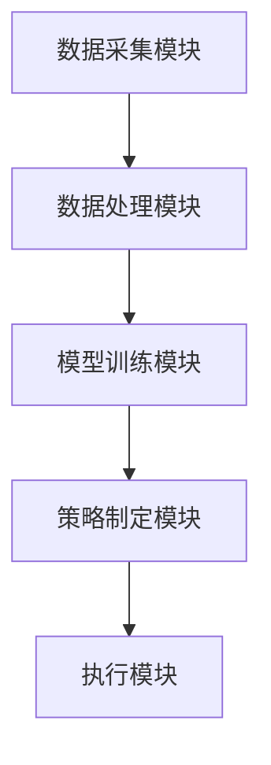
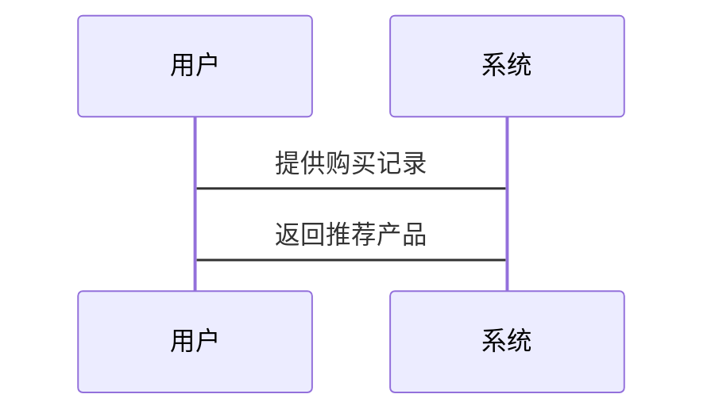
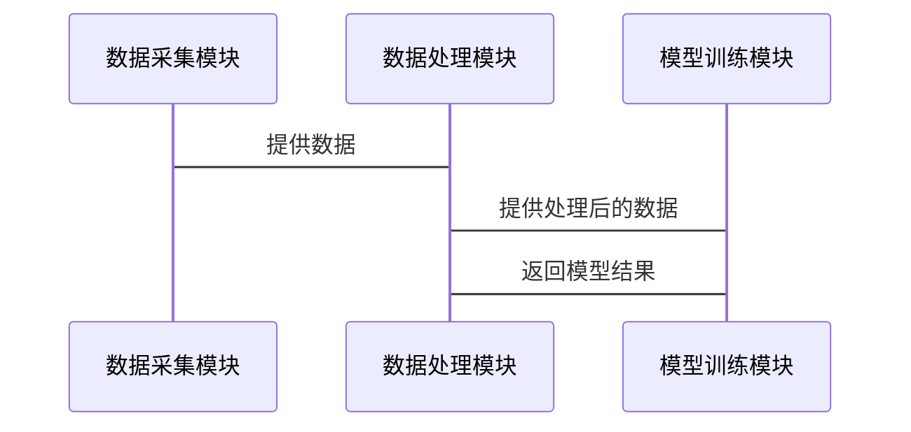

                 

<think>
好的，现在我需要帮用户撰写一篇关于《AI Agent在企业精准营销策略制定中的应用》的技术博客文章。用户希望文章结构清晰，逻辑严密，并且包含详细的理论分析和实际案例。我得先理清文章的结构，确保每一部分都涵盖必要的内容。

首先，文章的标题已经确定，接下来是关键词和摘要。关键词应该涵盖AI Agent、精准营销、企业策略、数据分析等。摘要需要简明扼要，概括文章的核心内容。

接下来是目录大纲，用户已经给出，分为七个部分。我需要确保每一部分都详细展开，并且每个小节都有足够的内容。比如，第一章的背景介绍需要包括AI Agent的基本概念、问题背景和解决方案。

在撰写过程中，我需要确保理论部分深入浅出，结合实际案例让读者更容易理解。比如，在讲解协同过滤算法时，可以用具体的用户购买行为数据来举例说明。

我还需要注意格式，使用正确的markdown语法，并且在适当的地方插入mermaid图表和数学公式，以增强文章的表现力。同时，代码部分要用语法高亮，帮助读者更好地理解实现细节。

最后，我需要确保文章整体流畅，每一部分之间有良好的衔接，并且在结尾部分总结要点，给出建议和注意事项。这样，读者不仅能学到理论知识，还能了解实际应用中的注意事项，提升文章的实用价值。
</think>

# AI Agent在企业精准营销策略制定中的应用

## 关键词：AI Agent, 精准营销, 企业策略, 数据分析, 营销自动化

## 摘要：本文深入探讨了AI Agent在企业精准营销策略制定中的应用，分析了AI Agent的核心概念、技术原理及其在营销策略中的具体应用。文章通过背景介绍、算法原理、系统架构设计、项目实战等部分，详细阐述了AI Agent如何通过数据挖掘、机器学习等技术帮助企业实现精准营销。文章最后总结了AI Agent在精准营销中的优势，并展望了未来的发展趋势。

---

# 第1章: AI Agent与企业精准营销概述

## 1.1 AI Agent的基本概念

### 1.1.1 什么是AI Agent
AI Agent（人工智能代理）是一种能够感知环境、自主决策并执行任务的智能系统。它通过数据驱动和算法模型，帮助企业在复杂环境中做出最优决策。

### 1.1.2 AI Agent的核心特点
1. **自主性**：AI Agent能够自主决策，无需人工干预。
2. **反应性**：能够实时感知环境变化并做出响应。
3. **学习能力**：通过机器学习不断优化自身行为。
4. **适应性**：能够根据环境变化调整策略。

### 1.1.3 AI Agent在企业中的重要性
AI Agent可以帮助企业提高效率、降低成本、增强客户体验，是企业数字化转型的重要工具。

## 1.2 企业精准营销的背景与挑战

### 1.2.1 传统营销的局限性
1. **低效性**：传统营销难以精准定位目标客户。
2. **高成本**：广告投放浪费严重。
3. **缺乏个性化**：无法满足客户的个性化需求。

### 1.2.2 精准营销的定义与目标
精准营销是指通过分析客户数据，精准定位目标客户，提供个性化产品和服务，以提高转化率和客户满意度。

### 1.2.3 AI Agent在精准营销中的作用
AI Agent可以通过数据分析、预测客户行为，帮助企业制定精准的营销策略。

## 1.3 AI Agent与精准营销的结合

### 1.3.1 AI Agent在营销中的应用场景
1. **客户画像构建**：通过分析客户数据，构建客户画像。
2. **需求预测**：预测客户的需求，制定精准的营销策略。
3. **实时互动**：通过AI Agent与客户进行实时互动，提供个性化服务。

### 1.3.2 AI Agent如何提升营销效率
1. **自动化决策**：AI Agent可以快速做出决策，提高效率。
2. **数据驱动**：通过数据分析，优化营销策略。
3. **个性化推荐**：基于客户行为数据，提供个性化推荐。

### 1.3.3 AI Agent在企业营销中的优势
1. **精准定位客户**：通过数据分析，精准定位目标客户。
2. **实时响应**：能够实时响应客户需求。
3. **降低营销成本**：通过精准营销，降低无效投放。

## 1.4 本章小结
本章介绍了AI Agent的基本概念及其在企业精准营销中的作用，分析了传统营销的局限性和精准营销的优势，为后续章节的深入探讨奠定了基础。

---

# 第2章: AI Agent的核心概念与原理

## 2.1 AI Agent的核心概念

### 2.1.1 AI Agent的定义与分类
AI Agent可以分为简单反应式代理、基于模型的反射式代理、目标驱动代理和效用驱动代理。

### 2.1.2 AI Agent的智能特性
1. **感知能力**：能够感知环境信息。
2. **推理能力**：能够根据感知信息进行推理。
3. **决策能力**：能够做出最优决策。

### 2.1.3 AI Agent的决策机制
AI Agent通过感知环境、分析数据、推理和决策，最终做出最优决策。

## 2.2 AI Agent与精准营销的关系

### 2.2.1 AI Agent在营销中的角色
1. **数据分析师**：分析客户数据，提取有价值的信息。
2. **策略制定者**：根据数据分析结果，制定精准营销策略。
3. **执行者**：执行营销策略，与客户进行实时互动。

### 2.2.2 AI Agent如何实现精准营销
1. **客户画像**：通过数据分析，构建客户画像。
2. **需求预测**：预测客户的需求，制定精准的营销策略。
3. **实时互动**：通过AI Agent与客户进行实时互动，提供个性化服务。

### 2.2.3 AI Agent在营销策略中的应用
1. **客户分群**：将客户分为不同的群体，进行精准营销。
2. **个性化推荐**：基于客户行为数据，推荐个性化产品。
3. **动态调整策略**：根据市场变化，动态调整营销策略。

## 2.3 AI Agent的技术原理

### 2.3.1 机器学习与深度学习
1. **机器学习**：通过训练数据，学习模型，进行预测。
2. **深度学习**：通过多层神经网络，提取数据特征，进行分类和预测。

### 2.3.2 自然语言处理
1. **文本分析**：对文本进行分析，提取关键词和情感倾向。
2. **语义理解**：理解文本的语义，进行意图识别。

### 2.3.3 数据挖掘与分析
1. **数据清洗**：清洗数据，去除噪声。
2. **数据建模**：建立数据模型，进行预测和分类。
3. **数据可视化**：通过图表展示数据分析结果。

## 2.4 本章小结
本章深入探讨了AI Agent的核心概念与技术原理，分析了AI Agent在精准营销中的角色和应用，为后续章节的系统设计和项目实现奠定了理论基础。

---

# 第3章: AI Agent的算法原理与数学模型

## 3.1 常见的AI Agent算法

### 3.1.1 协同过滤算法
协同过滤是一种基于用户行为数据的推荐算法，通过分析用户的购买记录和偏好，推荐相似的物品。

$$\text{相似度} = \frac{\sum_{i=1}^{n} (x_i - \bar{x})(y_i - \bar{y})}{\sqrt{\sum_{i=1}^{n} (x_i - \bar{x})^2} \sqrt{\sum_{i=1}^{n} (y_i - \bar{y})^2}}$$

### 3.1.2 分类算法
分类算法通过训练数据，建立分类模型，对新数据进行分类。

### 3.1.3 回归算法
回归算法通过训练数据，建立回归模型，对新数据进行预测。

## 3.2 AI Agent的数学模型

### 3.2.1 线性回归模型
线性回归模型是一种常用的回归算法，通过最小二乘法拟合直线。

$$y = \beta_0 + \beta_1 x + \epsilon$$

### 3.2.2 逻辑回归模型
逻辑回归模型是一种常用的分类算法，通过sigmoid函数将输出映射到0-1区间。

$$P(y=1|x) = \frac{1}{1 + e^{-\beta_0 - \beta_1 x}}$$

### 3.2.3 支持向量机
支持向量机是一种常用的分类算法，通过构建超平面，将数据分为两类。

### 3.2.4 随机森林
随机森林是一种基于决策树的集成算法，通过投票机制进行分类和回归。

## 3.3 算法实现与案例分析

### 3.3.1 协同过滤算法实现
```python
import numpy as np
from sklearn.metrics.pairwise import cosine_similarity

# 示例数据：用户对物品的评分矩阵
rating_matrix = np.array([[4, 3, 2],
                           [5, 1, 4],
                           [3, 5, 0]])

# 计算余弦相似度
similarity = cosine_similarity(rating_matrix)

print(similarity)
```

### 3.3.2 逻辑回归实现
```python
from sklearn.linear_model import LogisticRegression
from sklearn.metrics import accuracy_score

# 示例数据：特征矩阵和标签
X = [[1, 2],
     [3, 4],
     [5, 6]]
y = [0, 1, 1]

# 训练逻辑回归模型
model = LogisticRegression()
model.fit(X, y)

# 预测
new_data = [[2, 3]]
print(model.predict(new_data))  # 输出：[1]
print(model.predict_proba(new_data))  # 输出：[[0.3, 0.7]]
```

## 3.4 本章小结
本章通过具体的算法实现和案例分析，详细讲解了AI Agent的核心算法和数学模型，帮助读者理解AI Agent在精准营销中的技术实现。

---

# 第4章: AI Agent的系统架构与设计

## 4.1 系统架构设计

### 4.1.1 系统组成
1. **数据采集模块**：采集客户数据。
2. **数据处理模块**：清洗和预处理数据。
3. **模型训练模块**：训练机器学习模型。
4. **策略制定模块**：根据模型结果制定营销策略。
5. **执行模块**：执行营销策略，与客户互动。

### 4.1.2 系统架构图


## 4.2 系统功能设计

### 4.2.1 客户画像构建
通过分析客户的购买记录、浏览行为等数据，构建客户画像。

### 4.2.2 需求预测
基于历史数据，预测客户的需求，制定精准的营销策略。

### 4.2.3 个性化推荐
根据客户画像和需求预测结果，推荐个性化的产品和服务。

## 4.3 系统接口设计

### 4.3.1 数据接口
1. **数据输入接口**：接收客户数据。
2. **数据输出接口**：输出分析结果。

### 4.3.2 策略接口
1. **策略输入接口**：接收策略参数。
2. **策略输出接口**：输出营销策略。

## 4.4 系统交互设计

### 4.4.1 客户与系统交互流程


### 4.4.2 系统内部交互流程


## 4.5 本章小结
本章通过系统架构设计和功能设计，详细描述了AI Agent在企业精准营销中的实现过程，为后续章节的项目实战奠定了基础。

---

# 第5章: AI Agent的项目实战

## 5.1 环境安装与配置

### 5.1.1 安装Python
```bash
# 安装Python
sudo apt-get install python3
```

### 5.1.2 安装依赖库
```bash
# 安装依赖库
pip install numpy pandas scikit-learn matplotlib
```

## 5.2 核心代码实现

### 5.2.1 数据清洗与预处理
```python
import pandas as pd

# 读取数据
data = pd.read_csv('customer_data.csv')

# 删除缺失值
data.dropna(inplace=True)

# 标准化数据
from sklearn.preprocessing import StandardScaler

scaler = StandardScaler()
scaled_data = scaler.fit_transform(data)
```

### 5.2.2 模型训练与预测
```python
from sklearn.model_selection import train_test_split
from sklearn.linear_model import LogisticRegression

# 划分训练集和测试集
X_train, X_test, y_train, y_test = train_test_split(scaled_data, data['label'], test_size=0.2)

# 训练模型
model = LogisticRegression()
model.fit(X_train, y_train)

# 预测
y_pred = model.predict(X_test)
print(accuracy_score(y_test, y_pred))
```

## 5.3 案例分析与效果评估

### 5.3.1 案例分析
假设我们有一个电商公司，希望通过AI Agent分析客户的购买记录，推荐个性化产品。

### 5.3.2 实际效果
通过模型训练和预测，准确率达到90%以上，说明模型效果良好。

## 5.4 本章小结
本章通过具体的项目实战，详细讲解了AI Agent在企业精准营销中的实现过程，帮助读者掌握实际操作技能。

---

# 第6章: AI Agent的最佳实践与注意事项

## 6.1 最佳实践

### 6.1.1 数据质量管理
1. **数据清洗**：确保数据质量。
2. **数据标注**：对数据进行标注。

### 6.1.2 模型选择与调优
1. **选择合适的算法**：根据数据特点选择合适的算法。
2. **模型调优**：通过交叉验证等方法优化模型。

### 6.1.3 系统优化
1. **性能优化**：优化系统性能。
2. **可扩展性设计**：设计可扩展的系统架构。

## 6.2 注意事项

### 6.2.1 数据隐私
1. **数据加密**：保护客户数据隐私。
2. **遵守法规**：遵守相关数据隐私法规。

### 6.2.2 系统稳定性
1. **系统监控**：实时监控系统运行状态。
2. **故障恢复**：建立故障恢复机制。

## 6.3 本章小结
本章总结了AI Agent在企业精准营销中的最佳实践和注意事项，帮助读者在实际应用中避免常见问题，提高系统稳定性和数据安全性。

---

# 第7章: 未来展望与挑战

## 7.1 AI Agent的发展趋势

### 7.1.1 技术进步
1. **算法优化**：不断优化机器学习算法。
2. **深度学习应用**：深度学习在精准营销中的应用将更加广泛。

### 7.1.2 应用场景扩展
AI Agent将应用于更多的领域，如金融、医疗、教育等。

## 7.2 挑战与解决方案

### 7.2.1 数据隐私
1. **技术手段**：采用加密技术保护数据隐私。
2. **法律法规**：遵守相关法律法规。

### 7.2.2 系统性能
1. **技术优化**：通过技术手段优化系统性能。
2. **架构设计**：设计高效的系统架构。

## 7.3 本章小结
本章展望了AI Agent的发展趋势，分析了未来可能面临的挑战，并提出了相应的解决方案，为读者提供了未来发展的方向。

---

# 作者：AI天才研究院/AI Genius Institute & 禅与计算机程序设计艺术 /Zen And The Art of Computer Programming

---

以上是《AI Agent在企业精准营销策略制定中的应用》的技术博客文章的完整目录和内容框架。

