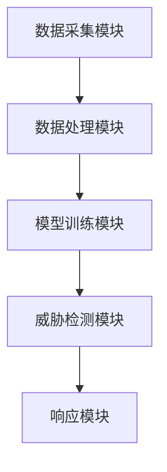
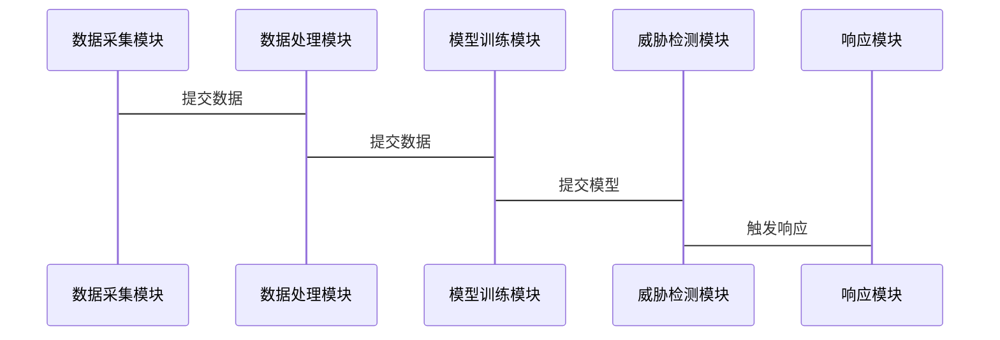

                 


# AI Agent在企业网络安全威胁情报分析中的应用

## 关键词：AI Agent，网络安全，威胁情报分析，机器学习，企业安全

## 摘要：本文将详细探讨AI Agent在企业网络安全威胁情报分析中的应用。通过分析AI Agent的核心原理、算法实现、系统架构以及实际项目案例，阐述如何利用AI技术提升企业网络安全威胁情报分析的效率和准确性。文章从背景介绍、核心概念、算法原理、系统设计、项目实战到总结展望，全面解析AI Agent在网络安全领域的应用价值。

---

## 第一部分: AI Agent与网络安全威胁情报分析概述

### 第1章: AI Agent与网络安全威胁情报分析概述

#### 1.1 AI Agent的基本概念
##### 1.1.1 什么是AI Agent
AI Agent（人工智能代理）是一种能够感知环境、自主决策并执行任务的智能实体。它通过传感器获取信息，利用算法进行分析和推理，并根据结果采取行动。AI Agent可以是软件程序、机器人或其他智能设备。

##### 1.1.2 AI Agent的核心特征
- **自主性**：能够在没有人工干预的情况下执行任务。
- **反应性**：能够实时感知环境变化并做出反应。
- **学习能力**：通过机器学习算法不断优化自身行为。
- **协作性**：能够与其他系统或AI Agent协同工作。

##### 1.1.3 AI Agent在企业中的应用价值
AI Agent在企业中的应用非常广泛，尤其是在网络安全领域。它可以帮助企业实现自动化威胁检测、实时监控、异常行为分析等功能，从而提升企业的安全防护能力。

---

#### 1.2 网络安全威胁情报分析的基本概念
##### 1.2.1 网络安全威胁的定义
网络安全威胁是指任何可能破坏网络系统完整性、保密性或可用性的行为或事件，例如病毒、木马、DDoS攻击等。

##### 1.2.2 威胁情报分析的目标与方法
威胁情报分析的目标是识别潜在的网络安全威胁，评估其风险，并制定应对策略。常用方法包括基于规则的检测、统计分析、机器学习等。

##### 1.2.3 威胁情报分析在企业中的重要性
随着网络安全威胁的日益复杂，传统的基于规则的威胁检测方法已经难以应对新型攻击。威胁情报分析可以帮助企业提前发现潜在威胁，降低安全风险。

---

#### 1.3 AI Agent在威胁情报分析中的应用背景
##### 1.3.1 传统威胁情报分析的局限性
- **效率低**：传统威胁情报分析依赖人工操作，效率较低。
- **漏检率高**：难以发现复杂的隐蔽威胁。
- **应对滞后**：无法实时响应新的威胁。

##### 1.3.2 AI Agent的优势与潜力
- **实时监控**：AI Agent可以24/7实时监控网络流量，快速发现异常行为。
- **智能分析**：利用机器学习算法，AI Agent能够从海量数据中提取有价值的信息。
- **自主决策**：AI Agent可以在发现威胁后，自动触发响应机制，减少人工干预。

##### 1.3.3 企业网络安全的新挑战与机遇
随着企业数字化转型的推进，网络安全威胁变得越来越复杂。AI Agent为企业提供了应对这些挑战的新工具和新方法。

---

### 第2章: AI Agent与网络安全威胁情报分析的核心概念

#### 2.1 AI Agent的核心原理
##### 2.1.1 AI Agent的基本工作原理
AI Agent通过感知环境、分析数据、做出决策并执行动作来实现其功能。在网络安全领域，AI Agent可以通过分析网络流量、日志数据等信息，识别潜在威胁。

##### 2.1.2 AI Agent的感知与决策机制
- **感知**：AI Agent通过传感器或API接口获取网络流量、日志等数据。
- **分析**：利用机器学习算法对数据进行分析，识别异常行为。
- **决策**：根据分析结果，决定是否触发警报或采取其他响应措施。

##### 2.1.3 AI Agent的学习与自适应能力
AI Agent可以通过监督学习、无监督学习等方法不断优化自身的威胁检测能力。例如，使用深度学习模型训练AI Agent，使其能够识别新型的、未知的威胁。

---

#### 2.2 威胁情报分析的核心原理
##### 2.2.1 威胁情报的收集与处理
威胁情报的收集可以通过多种方式实现，例如从公开的威胁情报数据库、订阅威胁情报服务等。收集到的威胁情报需要经过清洗、标准化等处理，以便后续分析。

##### 2.2.2 威胁情报的分析与评估
通过机器学习算法，对收集到的威胁情报进行分析，识别潜在的威胁模式。例如，利用聚类分析识别相似的攻击行为，利用分类算法预测未来的威胁。

##### 2.2.3 威胁情报的响应与反馈
根据分析结果，威胁情报系统可以触发相应的响应措施，例如封锁可疑IP地址、隔离受感染的设备等。同时，系统会收集反馈信息，进一步优化威胁情报分析模型。

---

#### 2.3 AI Agent与威胁情报分析的结合
##### 2.3.1 AI Agent在威胁情报分析中的角色
AI Agent可以作为威胁情报分析的核心工具，负责数据的采集、分析和响应。例如，AI Agent可以实时监控网络流量，利用机器学习算法识别潜在的威胁。

##### 2.3.2 AI Agent如何提升威胁情报分析的效率
- **自动化处理**：AI Agent可以自动处理海量数据，减少人工干预。
- **智能分析**：通过机器学习算法，AI Agent能够发现复杂的威胁模式，提升威胁检测的准确性。
- **实时响应**：AI Agent可以快速响应威胁，减少攻击的持续时间。

##### 2.3.3 AI Agent在威胁情报分析中的应用场景
- **实时监控**：AI Agent可以24/7实时监控网络流量，快速发现异常行为。
- **异常检测**：通过分析历史数据，识别异常行为模式。
- **威胁预测**：利用机器学习模型预测未来的威胁。

---

### 第3章: AI Agent在威胁情报分析中的算法原理

#### 3.1 基于监督学习的威胁检测算法
##### 3.1.1 监督学习的基本原理
监督学习是一种机器学习方法，通过训练数据集学习输入与输出之间的关系。在威胁检测中，训练数据集可以包含正常和异常的网络流量数据。

##### 3.1.2 基于决策树的威胁检测算法
- **决策树的构建**：通过训练数据构建决策树模型，每个节点表示一个特征（如源IP地址、目标端口等）。
- **异常检测**：通过决策树模型对新的网络流量进行分类，识别异常行为。
- **案例分析**：例如，AI Agent可以通过决策树模型识别DDoS攻击。

##### 3.1.3 基于随机森林的威胁检测算法
- **随机森林的优势**：随机森林是一种集成学习方法，通过构建多棵决策树来提高模型的准确性和鲁棒性。
- **异常检测**：随机森林可以用于异常检测，例如识别未知的恶意流量。

##### 3.1.4 算法实现步骤
1. 收集网络流量数据，标注正常和异常流量。
2. 将数据集分为训练集和测试集。
3. 使用随机森林算法训练模型。
4. 用测试集验证模型的准确性和召回率。

---

#### 3.2 基于无监督学习的威胁检测算法
##### 3.2.1 无监督学习的基本原理
无监督学习是一种机器学习方法，通过从数据中发现隐藏的模式或结构。在威胁检测中，无监督学习可以用于发现异常行为。

##### 3.2.2 基于聚类算法的威胁检测
- **聚类算法的选择**：常用的聚类算法包括K-means、DBSCAN等。
- **异常检测**：通过聚类算法将相似的网络流量分组，识别异常行为。
- **案例分析**：例如，AI Agent可以通过聚类算法识别同一攻击者发起的多次攻击。

##### 3.2.3 基于主成分分析（PCA）的威胁检测
- **PCA的基本原理**：PCA是一种降维技术，可以将高维数据降维到低维空间，同时保留数据的主要特征。
- **异常检测**：通过PCA降维后的数据，可以更方便地识别异常行为。

##### 3.2.4 算法实现步骤
1. 收集网络流量数据。
2. 对数据进行标准化处理。
3. 使用PCA进行降维。
4. 使用聚类算法识别异常行为。

---

#### 3.3 基于深度学习的威胁检测算法
##### 3.3.1 深度学习的基本原理
深度学习是一种机器学习方法，通过多层神经网络学习数据的高层次特征。

##### 3.3.2 基于卷积神经网络（CNN）的威胁检测
- **CNN的优势**：CNN适用于处理图像和序列数据，可以用于网络流量的特征提取。
- **异常检测**：通过CNN模型识别网络流量中的异常模式。

##### 3.3.3 基于循环神经网络（RNN）的威胁检测
- **RNN的优势**：RNN适用于处理序列数据，可以用于时间序列数据分析。
- **异常检测**：通过RNN模型识别时间序列中的异常行为。

##### 3.3.4 算法实现步骤
1. 收集网络流量数据，并将其转换为序列数据。
2. 使用RNN模型进行训练。
3. 用测试数据验证模型的准确性和召回率。

---

## 第4章: 系统分析与架构设计方案

### 4.1 系统功能设计
#### 4.1.1 系统功能模块
- **数据采集模块**：负责采集网络流量、日志等数据。
- **数据处理模块**：对数据进行清洗、标准化处理。
- **模型训练模块**：利用机器学习算法训练威胁检测模型。
- **威胁检测模块**：基于训练好的模型，实时检测网络中的异常行为。
- **响应模块**：根据检测结果，触发相应的安全响应措施。

#### 4.1.2 系统功能模型
- **数据采集模块**：通过API接口或日志文件采集数据。
- **数据处理模块**：对数据进行预处理，提取特征。
- **模型训练模块**：使用训练数据集训练机器学习模型。
- **威胁检测模块**：将实时数据输入模型，识别异常行为。
- **响应模块**：根据检测结果，触发封锁IP、隔离设备等响应措施。

---

### 4.2 系统架构设计
#### 4.2.1 系统架构图


#### 4.2.2 系统接口设计
- **数据采集模块接口**：提供采集数据的功能。
- **数据处理模块接口**：提供数据清洗、标准化的功能。
- **模型训练模块接口**：提供训练模型的功能。
- **威胁检测模块接口**：提供实时检测的功能。
- **响应模块接口**：提供触发响应的功能。

#### 4.2.3 系统交互流程图


---

## 第5章: 项目实战

### 5.1 环境安装
#### 5.1.1 安装Python
```bash
# 在终端中运行以下命令安装Python
sudo apt-get install python3
```

#### 5.1.2 安装机器学习库
```bash
# 在终端中运行以下命令安装scikit-learn、tensorflow等库
pip install scikit-learn tensorflow
```

#### 5.1.3 安装数据处理工具
```bash
# 在终端中运行以下命令安装Pandas、NumPy等库
pip install pandas numpy
```

---

### 5.2 系统核心实现源代码
#### 5.2.1 数据采集模块代码
```python
import pandas as pd

def collect_data():
    # 从CSV文件中读取数据
    data = pd.read_csv('network_traffic.csv')
    return data

if __name__ == '__main__':
    data = collect_data()
    print(data.head())
```

#### 5.2.2 数据处理模块代码
```python
import pandas as pd
from sklearn.preprocessing import StandardScaler

def preprocess_data(data):
    # 删除无关特征
    data = data.drop(columns=['timestamp'])
    # 标准化处理
    scaler = StandardScaler()
    data_normalized = scaler.fit_transform(data)
    return data_normalized

if __name__ == '__main__':
    data = pd.read_csv('network_traffic.csv')
    processed_data = preprocess_data(data)
    print(processed_data)
```

#### 5.2.3 模型训练模块代码
```python
from sklearn.model_selection import train_test_split
from sklearn.ensemble import RandomForestClassifier
from sklearn.metrics import accuracy_score

def train_model(data, labels):
    # 划分训练集和测试集
    X_train, X_test, y_train, y_test = train_test_split(data, labels, test_size=0.2)
    # 训练随机森林模型
    clf = RandomForestClassifier()
    clf.fit(X_train, y_train)
    # 模型评估
    y_pred = clf.predict(X_test)
    accuracy = accuracy_score(y_test, y_pred)
    print(f'模型准确率：{accuracy}')
    return clf

if __name__ == '__main__':
    data = pd.read_csv('network_traffic.csv')
    labels = data['label']
    model = train_model(data.drop(columns=['label']), labels)
```

#### 5.2.4 威胁检测模块代码
```python
def detect_threats(model, new_data):
    # 预测威胁
    prediction = model.predict(new_data)
    # 返回预测结果
    return prediction

if __name__ == '__main__':
    model = train_model(data.drop(columns=['label']), labels)
    new_data = preprocess_data(new_data)
    prediction = detect_threats(model, new_data)
    print(f'预测结果：{prediction}')
```

#### 5.2.5 响应模块代码
```python
def trigger_response(prediction):
    # 根据预测结果触发响应
    if prediction == 1:
        print('检测到威胁，触发封锁措施')
    else:
        print('未检测到威胁')

if __name__ == '__main__':
    prediction = detect_threats(model, new_data)
    trigger_response(prediction)
```

---

### 5.3 项目小结
通过以上代码实现，我们可以看到AI Agent在企业网络安全威胁情报分析中的强大能力。数据采集模块负责获取数据，数据处理模块对数据进行预处理，模型训练模块训练机器学习模型，威胁检测模块实时检测威胁，响应模块根据检测结果触发相应的安全措施。整个系统实现了自动化、智能化的威胁检测和响应，大大提升了企业的安全防护能力。

---

## 第6章: 总结与展望

### 6.1 小结
本文详细探讨了AI Agent在企业网络安全威胁情报分析中的应用。通过分析AI Agent的核心原理、算法实现、系统架构以及实际项目案例，我们看到AI Agent在提升威胁检测效率和准确性方面的巨大潜力。

### 6.2 注意事项
- **数据隐私**：在处理企业数据时，需要严格遵守数据隐私保护法规。
- **模型优化**：需要不断优化模型，以应对新型的网络安全威胁。
- **系统维护**：需要定期维护和更新系统，确保其正常运行。

### 6.3 拓展阅读
- **书籍推荐**：《人工智能：一种现代的方法》（Russell & Norvig）
- **论文推荐**：《Deep Learning for Cybersecurity: A Comprehensive Survey》
- **工具推荐**：Scikit-learn、TensorFlow、Keras等机器学习框架。

---

## 作者：AI天才研究院/AI Genius Institute & 禅与计算机程序设计艺术 /Zen And The Art of Computer Programming

