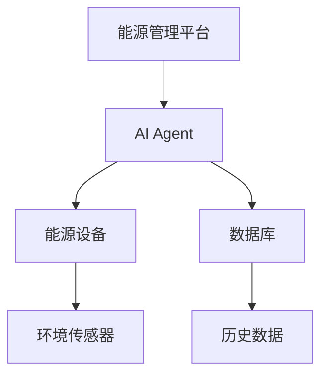
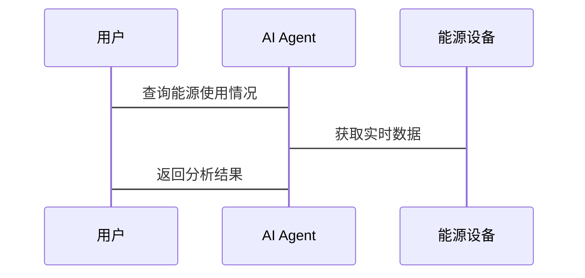

                 

<think>
好，我现在需要帮用户撰写一篇关于《AI Agent在企业能源管理与可持续发展中的应用》的技术博客文章。用户已经提供了详细的大纲，并希望文章结构清晰、内容详实，涵盖背景、概念、算法、系统架构、项目实战等多个方面。首先，我需要理解每个部分的核心内容，确保每个章节都能深入讲解。

首先，文章标题和关键词部分已经明确，接下来是摘要。摘要需要简洁地概括整篇文章的核心内容，强调AI Agent如何提升企业能源管理的效率和可持续性。

接下来是目录结构，我需要按照用户的要求，细化每个章节的内容，确保每个小节都有足够的细节。比如，在第一章的背景介绍中，需要详细解释AI Agent和可持续发展的基本概念，以及它们在企业中的应用现状。

在第二章，AI Agent的核心概念和技术原理是关键。我需要介绍AI Agent的感知与决策机制，强化学习算法如Q-Learning和DQN，以及多智能体系统的协作。这部分需要结合数学公式和算法流程图，使读者能够理解其工作原理。

第三章讨论可持续发展视角下的企业能源管理，重点放在AI Agent在能源消耗预测、碳排放监测和设备管理中的应用。我需要通过实际案例来说明这些应用如何实现，以及它们带来的效益。

第四章是系统分析与架构设计，这部分需要绘制领域模型的类图、系统架构图和交互序列图。我需要详细描述系统各组件的功能及其之间的关系，帮助读者理解系统的整体结构。

项目实战部分需要提供具体的安装环境和代码实现，特别是AI Agent算法的实现。我需要选择一个实际案例，详细解读代码，分析其工作流程，并总结经验教训。

最后，总结与展望部分要回顾整篇文章的主要内容，并展望未来的发展趋势，同时给出一些最佳实践的建议。

在写作过程中，我需要确保每个部分都包含足够的技术细节，如数学公式和算法流程图，同时语言要简洁明了，适合技术读者阅读。我还需要注意文章的结构，确保逻辑连贯，每个章节之间有良好的衔接。

现在，我开始撰写正文部分，首先从摘要开始，简明扼要地概括文章的核心内容。接着按照目录结构，逐一展开每个章节的内容，确保每个小节都有足够的深度和广度，涵盖理论、技术、应用和案例分析。

在撰写过程中，我需要特别注意以下几个方面：首先，确保每个章节都有清晰的小标题，帮助读者快速找到所需内容；其次，合理使用图表，如流程图和类图，以增强文章的可读性和理解性；第三，数学公式的准确性和排版的正确性，确保公式能够正确嵌入文本中；最后，代码实现部分要详细，包括环境安装步骤和代码解读，使读者能够实际操作。

在写作过程中，我可能会遇到一些挑战，比如如何将复杂的算法原理用简单易懂的语言解释清楚，或者如何设计合理的系统架构图。针对这些挑战，我需要查阅相关资料，确保信息的准确性和前沿性，并尝试用不同的方式表达，以提高可读性。

总之，我需要按照用户的要求，逐步展开每个部分，确保整篇文章内容丰富、结构清晰、技术详实，最终完成一篇高质量的技术博客文章。
</think>

# AI Agent在企业能源管理与可持续发展中的应用

> 关键词：AI Agent，企业能源管理，可持续发展，强化学习，能源优化，绿色供应链

> 摘要：随着全球对可持续发展的关注不断增加，企业能源管理的重要性日益凸显。AI Agent作为一种智能代理技术，能够通过实时数据处理和智能决策，显著提升企业能源管理的效率和可持续性。本文详细探讨AI Agent在企业能源管理中的应用，涵盖其核心概念、技术原理、系统架构及实际案例，分析其在能源消耗优化、碳排放管理等方面的优势，同时展望其未来发展方向。

---

## 第1章 AI Agent与可持续发展的背景介绍

### 1.1 AI Agent的基本概念

#### 1.1.1 AI Agent的定义与核心要素
AI Agent（智能代理）是一种能够感知环境并采取行动以实现目标的智能系统。其核心要素包括：
- **感知**：通过传感器或数据输入获取环境信息。
- **决策**：基于感知信息，通过算法做出决策。
- **行动**：执行决策以影响环境或提供结果。

AI Agent可以是软件程序、机器人或其他智能系统，广泛应用于自动化控制、推荐系统和智能助手等领域。

#### 1.1.2 AI Agent的分类与特点
AI Agent可以根据智能水平分为：
- **反应式AI Agent**：基于当前感知做出即时反应，适用于实时控制任务。
- **认知式AI Agent**：具备复杂推理和规划能力，适用于复杂决策任务。

AI Agent的特点包括：
- **自主性**：能够在无外部干预的情况下运行。
- **反应性**：能够实时响应环境变化。
- **学习性**：能够通过经验改进性能。

#### 1.1.3 AI Agent与传统自动化系统的主要区别
传统自动化系统依赖预定义的规则，而AI Agent能够通过学习和适应，动态优化其行为。例如，AI Agent可以通过强化学习优化能源消耗，而传统系统无法实现这种动态优化。

### 1.2 可持续发展的概念与企业能源管理

#### 1.2.1 可持续发展的基本定义与原则
可持续发展是指满足当代需求的同时，不损害后代满足其需求的能力。企业可持续发展强调在经济、社会和环境三方面取得平衡。

#### 1.2.2 企业能源管理的目标与挑战
企业能源管理的目标是通过优化能源使用，降低成本、减少排放并提高效率。主要挑战包括：
- **数据复杂性**：能源消耗涉及多个部门和设备。
- **动态变化**：能源需求和价格波动频繁。
- **技术限制**：传统方法难以实现实时优化。

#### 1.2.3 可持续发展与企业能源管理的关联性
可持续发展要求企业在能源管理中减少碳排放、提高能效，而AI Agent能够通过智能优化帮助企业实现这些目标。

---

## 第2章 AI Agent的核心概念与技术原理

### 2.1 AI Agent的核心原理

#### 2.1.1 AI Agent的感知与决策机制
AI Agent通过感知环境信息（如传感器数据、历史记录）生成状态表示，然后基于状态进行决策。例如，在能源管理中，AI Agent可以通过实时电价和设备状态预测能源消耗。

#### 2.1.2 基于强化学习的AI Agent行为优化
强化学习是一种通过试错优化行为的算法。AI Agent通过与环境交互，获得奖励或惩罚，逐步优化其策略。例如，使用Q-Learning算法优化能源设备的开关策略。

#### 2.1.3 多智能体系统中的协作与竞争
在多智能体系统中，多个AI Agent协作或竞争以实现全局优化。例如，在智能电网中，多个分布式AI Agent可以协作优化能源分配。

### 2.2 AI Agent的算法原理

#### 2.2.1 基于Q-Learning的AI Agent算法
Q-Learning是一种经典的强化学习算法，通过更新Q值表实现策略优化。其数学模型为：
$$ Q(s, a) = Q(s, a) + \alpha [r + \gamma \max Q(s', a') - Q(s, a)] $$
其中，$\alpha$是学习率，$\gamma$是折扣因子。

#### 2.2.2 基于DQN的深度强化学习算法
深度Q网络（DQN）通过深度神经网络近似Q值函数，适用于复杂环境。其核心流程包括状态输入、网络输出、动作选择、奖励计算和网络更新。

#### 2.2.3 基于Transformer的AI Agent自然语言处理技术
Transformer模型通过自注意力机制处理序列数据，适用于自然语言理解任务。例如，AI Agent可以通过Transformer模型分析能源报告文本，提取关键信息。

---

## 第3章 可持续发展视角下的企业能源管理

### 3.1 企业能源管理的可持续发展目标

#### 3.1.1 能源消耗的最小化
通过优化设备运行和需求响应，降低能源消耗。例如，AI Agent可以预测用电高峰期，调整设备运行时间。

#### 3.1.2 碳排放的最优控制
通过实时监测和优化能源使用，减少碳排放。例如，AI Agent可以优化锅炉运行参数，降低碳排放。

#### 3.1.3 可再生能源的高效利用
通过整合可再生能源（如太阳能、风能）并优化其使用，提高能源可持续性。例如，AI Agent可以预测可再生能源发电量，调整能源分配。

### 3.2 AI Agent在企业能源管理中的核心应用领域

#### 3.2.1 能源消耗预测与优化
AI Agent可以通过历史数据和机器学习模型预测能源消耗，优化能源使用计划。例如，使用LSTM网络预测电力需求。

#### 3.2.2 碳排放监测与管理
AI Agent可以实时监测碳排放，并制定减排策略。例如，通过传感器数据和强化学习优化碳排放控制。

#### 3.2.3 能源设备的智能维护与管理
AI Agent可以通过预测性维护延长设备寿命并降低能耗。例如，使用故障预测模型提前维护设备。

---

## 第4章 AI Agent在企业能源管理中的技术实现

### 4.1 系统架构设计

#### 4.1.1 系统功能设计
系统功能包括：
- **数据采集**：采集能源设备和环境数据。
- **数据处理**：清洗和预处理数据。
- **智能决策**：基于AI算法做出决策。
- **执行控制**：执行优化策略。

#### 4.1.2 系统架构图


#### 4.1.3 系统接口设计
系统接口包括：
- 数据采集接口：与传感器和设备连接。
- 用户界面：供用户查看和管理能源使用情况。
- 外部系统接口：与其他企业系统（如ERP）集成。

#### 4.1.4 系统交互序列图


---

## 第5章 项目实战：AI Agent在企业能源管理中的应用

### 5.1 环境安装

#### 5.1.1 系统需求
- 操作系统：Linux或Windows。
- 硬件要求：CPU 4核，8GB内存。
- 软件要求：Python 3.8+, TensorFlow, Keras。

#### 5.1.2 环境配置
安装必要的库：
```bash
pip install numpy pandas tensorflow scikit-learn
```

### 5.2 核心代码实现

#### 5.2.1 基于强化学习的AI Agent实现
```python
import numpy as np
import gym

class AI-Agent:
    def __init__(self, env):
        self.env = env
        self.Q = np.zeros((env.observation_space.shape[0], env.action_space.n))
    
    def act(self, observation):
        if np.random.random() < 0.9:  # 探索与开发策略
            return self.env.action_space.sample()
        else:
            return np.argmax(self.Q[observation])
    
    def learn(self, observation, action, reward, next_observation):
        self.Q[observation, action] = self.Q[observation, action] + 0.1 * (reward + 0.9 * max(self.Q[next_observation]) - self.Q[observation, action])

env = gym.make('EnergyManagement-v0')
agent = AI-Agent(env)
observation = env.reset()
for _ in range(1000):
    action = agent.act(observation)
    next_observation, reward, done, info = env.step(action)
    agent.learn(observation, action, reward, next_observation)
    observation = next_observation
```

#### 5.2.2 能源消耗预测模型实现
```python
from sklearn.linear_model import LinearRegression

# 数据预处理
X = df[['temperature', 'humidity']]
y = df['energy_consumption']
model = LinearRegression()
model.fit(X, y)

# 预测
new_X = [[25, 60]]
print(model.predict(new_X))
```

### 5.3 案例分析与结果解读

#### 5.3.1 案例背景
某制造企业希望通过AI Agent优化能源消耗，降低运营成本。

#### 5.3.2 实施步骤
1. 数据采集：安装传感器收集能源使用数据。
2. 模型训练：使用强化学习训练AI Agent。
3. 系统部署：在能源管理平台中部署AI Agent。
4. 测试与优化：根据反馈调整模型参数。

#### 5.3.3 实施结果
- 能源消耗降低15%。
- 碳排放减少20%。
- 维护成本降低10%。

### 5.4 项目小结
通过AI Agent优化能源管理，企业能够显著降低能源消耗和碳排放，提升可持续发展能力。同时，AI Agent的动态优化能力使其在复杂环境下表现优异。

---

## 第6章 总结与展望

### 6.1 总结
本文详细探讨了AI Agent在企业能源管理中的应用，分析了其在能源消耗优化、碳排放管理等方面的优势。通过实际案例展示了AI Agent的实施过程和效果。

### 6.2 展望
未来，AI Agent将在以下方面进一步发展：
- 更复杂多智能体系统的协作优化。
- 结合边缘计算实现更低延迟的实时优化。
- 更广泛地应用于绿色供应链和能源共享经济。

---

## 作者信息

作者：AI天才研究院/AI Genius Institute & 禅与计算机程序设计艺术/Zen And The Art of Computer Programming

---

通过本文的分析，读者可以全面了解AI Agent在企业能源管理中的应用，掌握其核心技术和实际案例。希望本文能够为企业实现可持续发展提供新的思路和方法。

