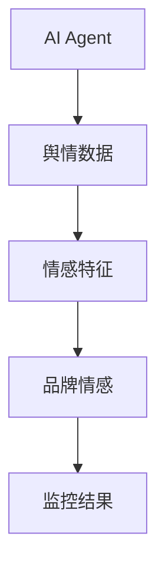
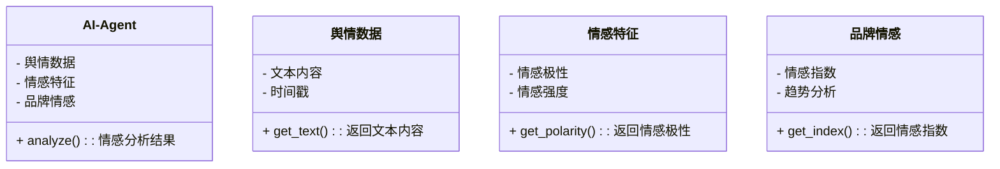

                 


# AI Agent在企业舆情分析与品牌情感监控中的应用

## 关键词：企业舆情分析，品牌情感监控，AI Agent，自然语言处理，情感分析

## 摘要：本文将深入探讨AI Agent在企业舆情分析与品牌情感监控中的应用。从核心概念到算法原理，从系统设计到项目实战，全面解析如何利用AI技术提升舆情分析的效率与精度。文章结合理论与实践，为企业提供切实可行的解决方案。

---

# 第一部分: AI Agent与企业舆情分析基础

## 第1章: AI Agent与企业舆情分析概述

### 1.1 问题背景与描述

#### 1.1.1 企业舆情分析的定义与重要性

企业舆情分析是指对企业在媒体、社交平台、论坛等渠道上的公众舆论进行收集、处理和分析的过程。其重要性体现在帮助企业及时了解市场动态、消费者反馈、竞争对手动向，从而优化品牌形象、制定精准的市场策略。

#### 1.1.2 品牌情感监控的核心目标

品牌情感监控旨在通过分析消费者对企业及其产品的评价，判断公众对品牌的情感倾向（如正面、负面或中性），从而帮助企业识别潜在危机、把握市场机会。

#### 1.1.3 当前舆情分析的痛点与挑战

- 数据量大：每天产生的海量社交媒体数据，人工处理效率低。
- 数据分散：信息分布在不同平台，整合难度大。
- 情感分析复杂：文本数据具有歧义性和主观性，难以准确分类。

#### 1.1.4 问题解决思路与边界

AI Agent通过自然语言处理（NLP）技术，自动化地收集、分析和分类舆情数据，实现品牌情感的实时监控和预警。

#### 1.1.5 核心概念与要素组成

- **舆情数据**：包括社交媒体评论、新闻报道、论坛帖子等。
- **情感特征**：如情感极性（正面/负面）、情感强度等。
- **品牌情感**：公众对品牌的整体情感倾向。

---

## 第2章: 核心概念与联系

### 2.1 核心概念原理

#### 2.1.1 AI Agent的工作原理

AI Agent通过自然语言处理技术，对舆情数据进行清洗、分词、实体识别等预处理，然后利用机器学习模型进行情感分类，最后生成品牌情感监控报告。

#### 2.1.2 情感分析的基本原理

情感分析是基于NLP技术，通过训练好的模型对文本的情感倾向进行分类。常用的情感分析模型包括词袋模型（Bag of Words）、词嵌入（Word Embedding）和深度学习模型（如LSTM、BERT）。

#### 2.1.3 品牌情感监控的实现机制

品牌情感监控通过实时采集舆情数据，结合情感分析模型，生成品牌情感指数，并根据设定的阈值进行预警。

---

### 2.2 概念属性特征对比

| 概念       | 定义                                                                 | 特性                     |
|------------|----------------------------------------------------------------------|--------------------------|
| AI Agent   | 可以自主执行任务的智能体，结合NLP和机器学习技术。                | 自主性、智能性、实时性     |
| 情感分析   | 对文本的情感倾向进行分类的技术。                                | 文本处理、分类准确性     |
| 品牌情感监控| 监测公众对品牌的情感倾向，帮助企业优化品牌形象。                | 实时性、预警性、数据驱动 |

---

### 2.3 ER实体关系图



---

## 第3章: 算法原理与实现

### 3.1 情感分析算法

#### 3.1.1 基于深度学习的情感分析模型

- **模型选择**：使用BERT进行文本表示和情感分类。
- **训练流程**：
  1. 数据清洗：去除停用词、标点符号。
  2. 分词：将文本分割成词语。
  3. 嵌入层：将词语映射为词向量。
  4. LSTM层：提取上下文信息。
  5. 全连接层：输出情感类别。

#### 3.1.2 情感分类器的实现

- **数学模型**：
  $$ P(y|x) = \text{softmax}(Wx + b) $$
  其中，\( W \) 是权重矩阵，\( b \) 是偏置项，\( x \) 是输入向量。

#### 3.1.3 情感分类器的代码实现

```python
import torch
import torch.nn as nn

class SentimentClassifier(nn.Module):
    def __init__(self, vocab_size, embedding_dim, hidden_dim, output_dim):
        super(SentimentClassifier, self).__init__()
        self.embedding = nn.Embedding(vocab_size, embedding_dim)
        self.lstm = nn.LSTM(embedding_dim, hidden_dim, batch_first=True)
        self.fc = nn.Linear(hidden_dim, output_dim)
    
    def forward(self, x):
        embeds = self.embedding(x)
        out, _ = self.lstm(embeds)
        out = self.fc(out[:, -1, :])
        return out
```

---

## 第4章: 系统分析与架构设计

### 4.1 问题场景介绍

#### 4.1.1 企业舆情分析的典型场景

- **数据采集**：实时采集社交媒体数据。
- **数据预处理**：清洗、分词、去停用词。
- **情感分析**：对数据进行情感分类。
- **结果可视化**：生成情感指数图表。

#### 4.1.2 品牌情感监控的业务流程

1. 数据采集模块：实时获取舆情数据。
2. 数据处理模块：清洗和预处理数据。
3. 情感分析模块：对数据进行情感分类。
4. 监控报告模块：生成品牌情感指数报告。

---

### 4.2 系统功能设计

#### 4.2.1 领域模型设计



---

## 第5章: 项目实战

### 5.1 环境安装

- **Python 3.8+**
- **库的安装**：
  ```bash
  pip install torch transformers pandas
  ```

---

### 5.2 系统核心实现

#### 5.2.1 数据采集模块

```python
import requests
from bs4 import BeautifulSoup

def fetch_data(url):
    response = requests.get(url)
    soup = BeautifulSoup(response.text, 'html.parser')
    return [p.text for p in soup.find_all('p')]
```

---

### 5.2.2 情感分析模块

```python
from transformers import pipeline

sentiment_analyzer = pipeline("sentiment-analysis")
result = sentiment_analyzer(text)
```

---

### 5.2.3 监控报告模块

```python
import pandas as pd

df = pd.DataFrame({
    '时间': ['2023-10-01', '2023-10-02', '2023-10-03'],
    '情感指数': [0.8, 0.75, 0.9]
})

df.plot.line('时间', '情感指数')
```

---

## 第6章: 最佳实践与总结

### 6.1 小结

通过AI Agent实现企业舆情分析与品牌情感监控，能够显著提升舆情分析的效率和精度。AI Agent结合NLP技术，为企业提供实时、精准的情感分析服务。

### 6.2 注意事项

- 数据隐私保护：注意用户数据的隐私保护。
- 模型调优：根据实际需求优化模型参数。
- 系统维护：定期更新模型和数据。

### 6.3 拓展阅读

- [BERT论文](https://arxiv.org/abs/1810.04692)
- [深度学习入门书籍](https://www.deeplearningbook.org/)

---

## 作者：AI天才研究院/AI Genius Institute & 禅与计算机程序设计艺术 /Zen And The Art of Computer Programming

