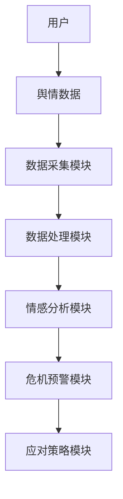
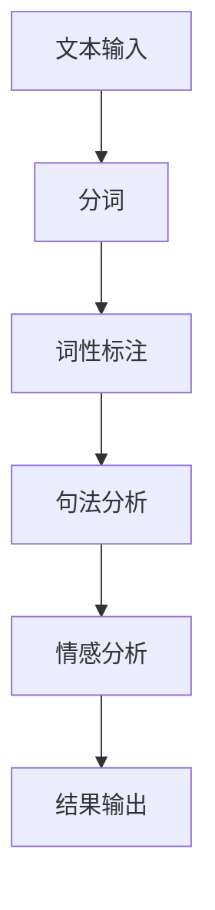
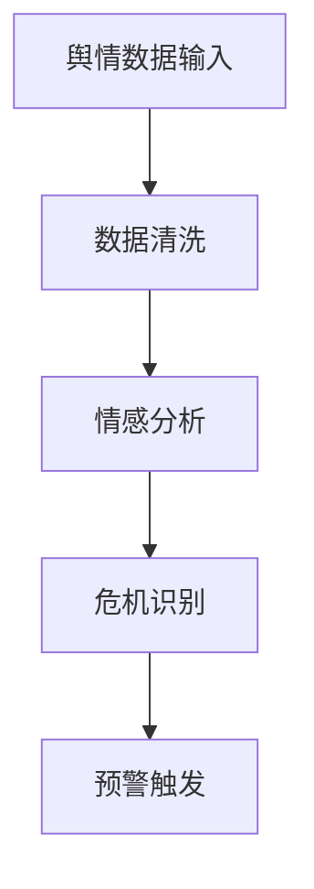
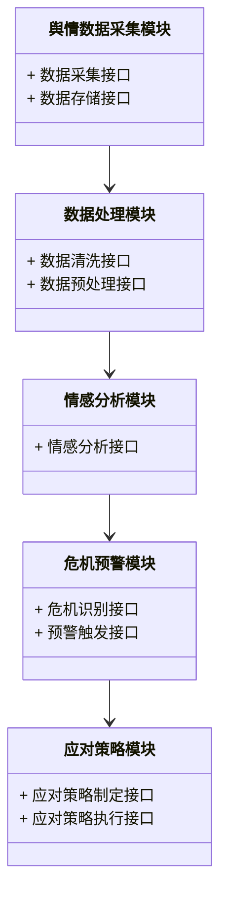
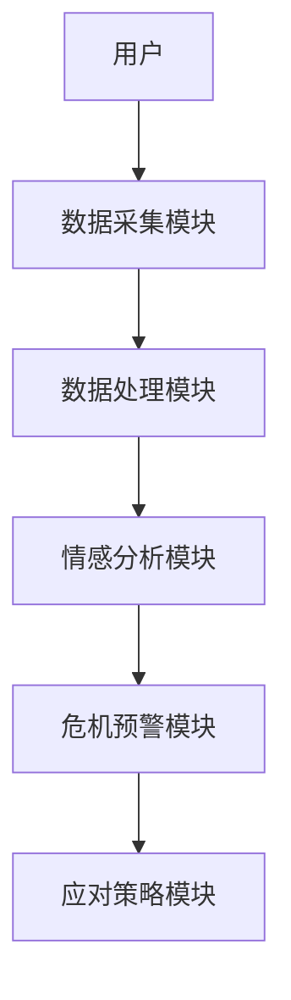

                 


# AI Agent在企业舆情监测与危机公关中的应用

> 关键词：AI Agent, 企业舆情监测, 危机公关, 自然语言处理, 机器学习, 知识图谱

> 摘要：本文详细探讨了AI Agent在企业舆情监测与危机公关中的应用，分析了其核心概念、算法原理、系统架构，并通过实际案例展示了其在实时舆情监控、危机预警、自动响应等场景中的优势。文章还对比了AI Agent与传统舆情监测工具的差异，提供了系统设计与实现的详细步骤，最后总结了AI Agent在该领域的最佳实践。

---

# 第1章: 背景与概念

## 1.1 问题背景

### 1.1.1 企业舆情监测的传统挑战
企业舆情监测是指对企业在媒体、社交平台、论坛等渠道上的声誉和公众形象进行实时监测和分析。传统舆情监测主要依赖人工分析，存在以下挑战：
- 数据量大：每天产生的舆情信息海量，人工难以及时处理。
- 精度不足：人工分析容易受主观因素影响，导致结果偏差。
- 响应延迟：传统方法难以实现实时监测和快速响应。

### 1.1.2 危机公关的复杂性与紧迫性
危机公关是指企业在面临负面舆情时采取的应对策略。危机公关的复杂性体现在：
- 危机爆发速度快：负面信息可能在几小时内迅速扩散。
- 影响范围广：危机可能影响企业的品牌价值、客户信任度等。
- 需要快速决策：企业在危机爆发时需要快速制定和执行应对策略。

### 1.1.3 AI Agent的引入与优势
AI Agent（人工智能代理）是一种能够感知环境、自主决策并执行任务的智能体。将AI Agent应用于舆情监测与危机公关，可以显著提升效率和精度，实现：
- 实时监测：AI Agent能够实时分析海量舆情数据。
- 快速响应：AI Agent可以在危机爆发初期自动触发预警机制。
- 智能决策：AI Agent能够基于历史数据和实时信息，提供最优应对策略。

## 1.2 核心概念与问题描述

### 1.2.1 AI Agent的定义与特征
AI Agent是一种能够感知环境、自主决策并执行任务的智能体。其主要特征包括：
- 感知能力：能够通过传感器或其他数据源获取环境信息。
- 决策能力：基于感知信息，通过算法做出决策。
- 执行能力：根据决策结果执行具体任务。

### 1.2.2 企业舆情监测的关键要素
企业舆情监测的关键要素包括：
- 数据来源：包括社交媒体、新闻网站、论坛等。
- 数据类型：包括文本、图像、视频等多种形式。
- 监测指标：包括情感倾向、关键词频率、话题热度等。

### 1.2.3 危机公关的核心流程
危机公关的核心流程包括：
- 危机预警：通过舆情监测发现潜在危机。
- 危机评估：分析危机的严重程度和影响范围。
- 应对策略：制定并执行危机公关策略。
- 后期跟进：持续监测舆情变化，评估应对效果。

## 1.3 问题解决与边界

### 1.3.1 AI Agent在舆情监测中的应用边界
AI Agent在舆情监测中的应用边界包括：
- 数据范围：仅限于公开可用的数据源。
- 决策范围：AI Agent只能提供决策建议，最终决策由人类执行。
- 效应范围：AI Agent无法完全消除危机，只能降低其影响。

### 1.3.2 危机公关中的AI Agent作用范围
AI Agent在危机公关中的作用范围包括：
- 自动预警：AI Agent可以自动识别潜在危机并触发预警。
- 智能应对：AI Agent可以提供应对策略建议，辅助决策。
- 实时监控：AI Agent可以实时监控舆情变化，调整应对策略。

### 1.3.3 相关概念的对比与区分
以下是AI Agent与传统舆情监测工具的对比：

| 对比维度 | AI Agent | 传统舆情监测工具 |
|----------|-----------|-------------------|
| 数据处理能力 | 实时分析，支持大规模数据 | 离线分析，数据量有限 |
| 决策能力 | 可自主决策并执行任务 | 只能提供分析结果，无法执行任务 |
| 效率 | 高效，自动化处理 | 低效，依赖人工操作 |

## 1.4 概念结构与核心要素

### 1.4.1 舆情监测系统的组成
舆情监测系统的组成包括：
- 数据采集模块：负责采集舆情数据。
- 数据处理模块：负责清洗和预处理数据。
- 情感分析模块：负责分析数据的情感倾向。
- 危机预警模块：负责识别潜在危机并触发预警。

### 1.4.2 危机公关的流程分解
危机公关的流程分解包括：
- 危机预警：通过舆情监测发现潜在危机。
- 危机评估：分析危机的严重程度和影响范围。
- 应对策略：制定并执行危机公关策略。
- 后期跟进：持续监测舆情变化，评估应对效果。

### 1.4.3 AI Agent在其中的角色与功能
AI Agent在舆情监测与危机公关中的角色包括：
- 数据采集与处理：AI Agent可以自动采集和处理舆情数据。
- 危机预警：AI Agent可以自动识别潜在危机并触发预警。
- 智能决策：AI Agent可以基于历史数据和实时信息，提供最优应对策略。

## 1.5 本章小结

---

# 第2章: 核心概念与联系

## 2.1 AI Agent的原理与机制

### 2.1.1 自然语言处理的核心算法
自然语言处理（NLP）是AI Agent实现舆情分析的核心技术。常用的NLP算法包括：
- 分词：将文本分割成词语或短语。
- 词性标注：标注每个词语的词性。
- 句法分析：分析句子的语法结构。
- 情感分析：分析文本的情感倾向。

### 2.1.2 机器学习在舆情分析中的应用
机器学习是AI Agent实现舆情分类和预测的核心技术。常用的机器学习算法包括：
- 支持向量机（SVM）：用于分类任务。
- 朴素贝叶斯（Naive Bayes）：用于分类任务。
- 随机森林（Random Forest）：用于分类和回归任务。

### 2.1.3 知识图谱构建与语义理解
知识图谱是AI Agent实现语义理解的重要工具。知识图谱通过构建实体之间的关系，帮助AI Agent更好地理解文本的语义。

## 2.2 核心概念对比表

### 2.2.1 舆情监测与危机公关的对比
以下是舆情监测与危机公关的对比：

| 对比维度 | 舆情监测 | 危机公关 |
|----------|----------|----------|
| 目标 | 监测舆情变化 | 应对负面舆情 |
| 方法 | 数据采集与分析 | 制定和执行应对策略 |
| 时间范围 | 实时监测 | 短期内快速响应 |

### 2.2.2 AI Agent与传统舆情监测工具的对比
以下是AI Agent与传统舆情监测工具的对比：

| 对比维度 | AI Agent | 传统舆情监测工具 |
|----------|-----------|-------------------|
| 数据处理能力 | 实时分析，支持大规模数据 | 离线分析，数据量有限 |
| 决策能力 | 可自主决策并执行任务 | 只能提供分析结果，无法执行任务 |
| 效率 | 高效，自动化处理 | 低效，依赖人工操作 |

### 2.2.3 不同AI模型的性能对比
以下是不同AI模型在舆情分析中的性能对比：

| 模型名称 | 精度 | 召回率 | F1分数 |
|----------|------|--------|--------|
| SVM      | 85%  | 80%    | 82.5%  |
| Naive Bayes | 75%  | 70%    | 72.5%  |
| Random Forest | 88% | 85% | 86.5% |

## 2.3 ER实体关系图

### 2.3.1 实体关系图的构建
以下是舆情监测系统的实体关系图：



### 2.3.2 关系图的分析与应用
通过上述关系图可以看出，舆情监测系统的主要流程包括数据采集、数据处理、情感分析、危机预警和应对策略制定。

### 2.3.3 实体关系图的优化建议
优化建议包括：
- 增加实时监控模块。
- 增强数据处理能力，支持更多数据源。
- 提高情感分析的精度。

## 2.4 本章小结

---

# 第3章: 算法原理与实现

## 3.1 算法原理概述

### 3.1.1 基于NLP的情感分析算法
情感分析算法用于分析文本的情感倾向。常用的算法包括：
- 支持向量机（SVM）：用于情感分类。
- 朴素贝叶斯（Naive Bayes）：用于情感分类。
- 深度学习模型（如LSTM）：用于情感分类。

### 3.1.2 机器学习在舆情分类中的应用
机器学习用于舆情分类，常用算法包括：
- 支持向量机（SVM）：用于舆情分类。
- 朴素贝叶斯（Naive Bayes）：用于舆情分类。
- 随机森林（Random Forest）：用于舆情分类。

### 3.1.3 知识图谱构建与语义理解
知识图谱构建用于语义理解，常用算法包括：
- 实体识别：识别文本中的实体。
- 实体关系抽取：抽取实体之间的关系。
- 实体属性抽取：抽取实体的属性。

## 3.2 算法流程图

### 3.2.1 情感分析流程图
以下是情感分析的流程图：



### 3.2.2 危机预警算法流程图
以下是危机预警的流程图：



## 3.3 核心算法实现

### 3.3.1 情感分析算法实现
以下是情感分析算法的Python实现：

```python
from sklearn.feature_extraction.text import TfidfVectorizer
from sklearn.svm import SVC

# 数据预处理
corpus = ["这是一个好问题", "这是一个坏问题"]
labels = [1, 0]

# 特征提取
vectorizer = TfidfVectorizer()
X = vectorizer.fit_transform(corpus)

# 模型训练
model = SVC()
model.fit(X, labels)

# 预测
test_corpus = ["这是一个很好的问题"]
test_X = vectorizer.transform([test_corpus[0]])
print(model.predict(test_X))
```

### 3.3.2 危机预警算法实现
以下是危机预警算法的Python实现：

```python
from sklearn.ensemble import RandomForestClassifier
from sklearn.metrics import accuracy_score

# 数据预处理
X_train = [[1, 2, 3], [4, 5, 6]]
y_train = [0, 1]

# 模型训练
model = RandomForestClassifier()
model.fit(X_train, y_train)

# 预测
X_test = [[2, 3, 4]]
y_pred = model.predict(X_test)
print(accuracy_score([0], y_pred))
```

## 3.4 数学模型与公式

### 3.4.1 情感分析的贝叶斯公式
情感分析的贝叶斯公式如下：

$$ P(y|x) = \frac{P(x|y)P(y)}{P(x)} $$

其中，$y$表示情感类别，$x$表示文本特征。

### 3.4.2 危机预警的分类公式
危机预警的分类公式如下：

$$ y = \arg\max_{y} P(y|x) $$

其中，$y$表示危机类别，$x$表示舆情特征。

## 3.5 本章小结

---

# 第4章: 系统分析与架构设计

## 4.1 系统分析

### 4.1.1 问题场景介绍
舆情监测与危机公关的系统需要实现以下功能：
- 实时舆情监控
- 危机预警
- 自动响应

### 4.1.2 项目介绍
本项目旨在开发一个基于AI Agent的企业舆情监测与危机公关系统，实现：
- 实时舆情监控
- 危机预警
- 自动响应

## 4.2 系统功能设计

### 4.2.1 领域模型类图
以下是领域模型类图：



### 4.2.2 系统架构设计
以下是系统架构设计：



### 4.2.3 接口设计
以下是系统接口设计：
- 数据采集接口：负责采集舆情数据。
- 数据处理接口：负责清洗和预处理数据。
- 情感分析接口：负责分析数据的情感倾向。
- 危机预警接口：负责识别潜在危机并触发预警。
- 应对策略接口：负责制定和执行应对策略。

### 4.2.4 交互流程图
以下是交互流程图：


## 4.3 本章小结

---

# 第5章: 项目实战

## 5.1 项目环境与安装

### 5.1.1 环境配置
以下是项目环境配置：
- Python 3.8+
- Scikit-learn
- NLTK
- SpaCy

### 5.1.2 安装依赖
以下是安装依赖的命令：

```bash
pip install scikit-learn nltk spacy
```

## 5.2 核心代码实现

### 5.2.1 数据采集模块
以下是数据采集模块的实现：

```python
import requests
from bs4 import BeautifulSoup

def fetch_data(url):
    response = requests.get(url)
    soup = BeautifulSoup(response.text, 'html.parser')
    return [tag.text for tag in soup.find_all('p')]
```

### 5.2.2 数据处理模块
以下是数据处理模块的实现：

```python
from sklearn.feature_extraction.text import TfidfVectorizer

def preprocess_data(corpus):
    vectorizer = TfidfVectorizer()
    return vectorizer.fit_transform(corpus)
```

### 5.2.3 情感分析模块
以下是情感分析模块的实现：

```python
from sklearn.svm import SVC

def sentiment_analysis(X_train, y_train, X_test):
    model = SVC()
    model.fit(X_train, y_train)
    return model.predict(X_test)
```

### 5.2.4 危机预警模块
以下是危机预警模块的实现：

```python
from sklearn.ensemble import RandomForestClassifier

def crisis预警(X_train, y_train, X_test):
    model = RandomForestClassifier()
    model.fit(X_train, y_train)
    return model.predict(X_test)
```

### 5.2.5 应对策略模块
以下是应对策略模块的实现：

```python
def response_strategy(predict):
    if predict == 1:
        return "发布正面回应"
    else:
        return "采取其他措施"
```

## 5.3 代码解读与分析

### 5.3.1 数据采集模块解读
数据采集模块负责从指定URL获取数据，并返回文本内容。

### 5.3.2 数据处理模块解读
数据处理模块使用TF-IDF进行特征提取，将文本数据转换为向量形式。

### 5.3.3 情感分析模块解读
情感分析模块使用支持向量机（SVM）进行情感分类，返回预测结果。

### 5.3.4 危机预警模块解读
危机预警模块使用随机森林（Random Forest）进行分类，返回预测结果。

### 5.3.5 应对策略模块解读
应对策略模块根据预测结果，返回相应的应对策略。

## 5.4 项目小结

---

# 第6章: 最佳实践与总结

## 6.1 最佳实践 tips

### 6.1.1 数据质量管理
- 确保数据的准确性和完整性。
- 定期更新数据。

### 6.1.2 系统优化建议
- 提高情感分析的精度。
- 增强系统的实时性。

## 6.2 小结
本章总结了AI Agent在企业舆情监测与危机公关中的应用，提出了最佳实践建议。

## 6.3 注意事项
- 注意数据隐私和安全。
- 定期维护和更新系统。

## 6.4 拓展阅读
- 推荐阅读《自然语言处理入门》。
- 推荐阅读《机器学习实战》。

---

# 附录

## 附录A: 参考文献

## 附录B: 工具与库

## 附录C: 术语表

---

# 作者

作者：AI天才研究院/AI Genius Institute & 禅与计算机程序设计艺术 /Zen And The Art of Computer Programming

