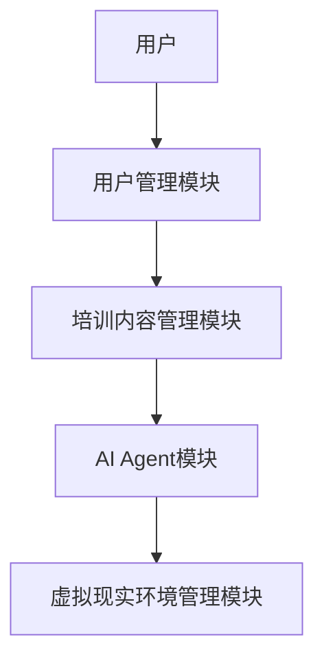
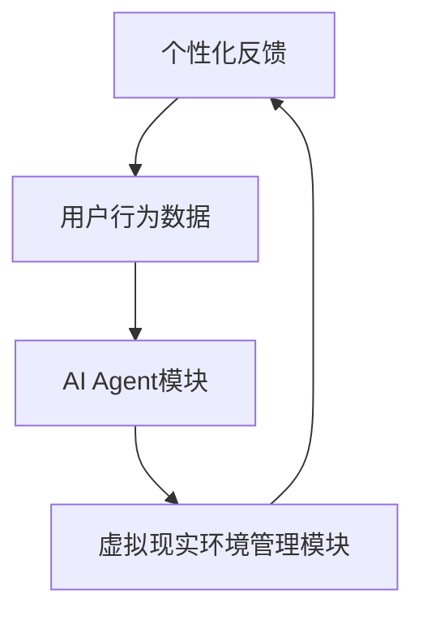
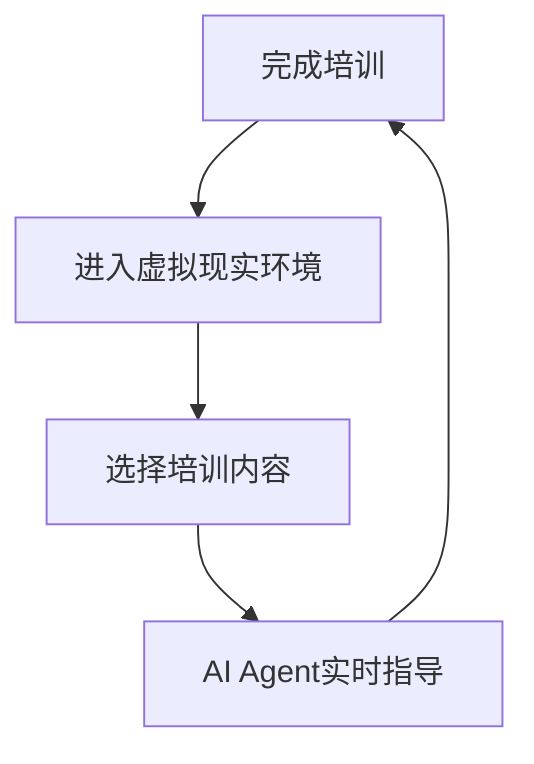

                 


# AI Agent在企业虚拟现实培训中的应用

> 关键词：AI Agent, 虚拟现实, 企业培训, 个性化学习, 实时反馈, 协作学习

> 摘要：本文探讨了AI Agent在企业虚拟现实培训中的应用，分析了AI Agent的核心原理与技术实现，结合虚拟现实技术的特点与优势，详细阐述了AI Agent在个性化学习、实时反馈与协作学习中的具体应用，并通过实际案例展示了系统架构设计与项目实现过程。本文旨在为企业提供一种创新的培训解决方案，助力企业提升员工培训效果与效率。

---

## 第1章: AI Agent与虚拟现实技术概述

### 1.1 AI Agent的核心概念

#### 1.1.1 AI Agent的定义与特点
AI Agent（人工智能代理）是一种智能实体，能够感知环境、自主决策并执行任务以实现目标。AI Agent的特点包括：
- **自主性**：能够在没有外部干预的情况下独立运作。
- **反应性**：能够实时感知环境并做出响应。
- **目标导向性**：根据设定的目标进行决策和行动。
- **学习能力**：能够通过数据和经验不断优化自身行为。

#### 1.1.2 虚拟现实技术的基本原理
虚拟现实（Virtual Reality，VR）是一种能够提供沉浸式体验的技术，通过计算机生成的三维虚拟环境，使用户能够与虚拟世界进行交互。VR的核心技术包括：
- **图形渲染**：生成高质量的三维图形。
- **人机交互**：通过头显、手柄等设备实现用户与虚拟环境的互动。
- **实时渲染**：确保虚拟环境能够实时响应用户的操作。

#### 1.1.3 企业虚拟现实培训的背景与需求
随着企业对员工培训的需求不断增长，传统的线下培训方式逐渐暴露出效率低、成本高的问题。虚拟现实技术为企业提供了一种高效、低成本的培训解决方案。AI Agent的引入进一步提升了虚拟现实培训的智能化水平，能够根据员工的学习情况动态调整培训内容和节奏。

---

### 1.2 AI Agent与虚拟现实的结合

#### 1.2.1 AI Agent在虚拟现实中的角色
AI Agent在虚拟现实培训中的角色可以是：
- **指导者**：为用户提供个性化的学习建议和实时反馈。
- **模拟对象**：在虚拟环境中模拟同事、客户或其他角色，帮助用户进行实战演练。
- **环境管理者**：动态调整虚拟环境的难度和内容，以适应用户的学习进度。

#### 1.2.2 虚拟现实技术对企业培训的价值
虚拟现实技术在企业培训中的价值主要体现在以下几个方面：
- **沉浸式体验**：用户可以在虚拟环境中身临其境地进行培训，提升学习效果。
- **高交互性**：用户可以与虚拟环境中的元素进行互动，增强学习的趣味性和实践性。
- **安全性与可控性**：在虚拟环境中进行高风险的培训场景（如火灾逃生演练），确保用户的安全。

#### 1.2.3 AI Agent如何提升虚拟现实培训的效果
AI Agent通过分析用户的行为数据，能够实时调整虚拟环境中的内容和难度，确保用户的学习体验更加个性化和高效。例如：
- 根据用户的错误率动态调整练习难度。
- 根据用户的学习进度推荐相关的学习材料。

---

## 第2章: AI Agent的核心原理与技术实现

### 2.1 AI Agent的核心原理

#### 2.1.1 AI Agent的感知机制
AI Agent的感知机制包括：
- **数据采集**：通过传感器、摄像头等设备采集环境数据。
- **数据处理**：对采集到的数据进行清洗、分析和理解。
- **情境识别**：根据数据识别当前的场景和任务需求。

#### 2.1.2 AI Agent的决策机制
AI Agent的决策机制包括：
- **目标设定**：根据任务需求设定具体的子目标。
- **策略选择**：基于当前的情境选择最优的行动策略。
- **决策优化**：通过学习和反馈不断优化决策模型。

#### 2.1.3 AI Agent的执行机制
AI Agent的执行机制包括：
- **动作规划**：根据决策结果制定具体的行动步骤。
- **动作执行**：通过执行机构（如机械臂、无人机等）完成任务。
- **结果反馈**：收集执行结果并用于后续的优化和调整。

---

### 2.2 AI Agent与虚拟现实的交互设计

#### 2.2.1 虚拟现实中的用户行为识别
用户在虚拟环境中的行为识别是AI Agent实现个性化服务的基础。常见的用户行为识别技术包括：
- **基于姿势识别的行为识别**：通过用户的动作和姿势判断其意图。
- **基于语音识别的行为识别**：通过用户的语音输入进行意图判断。
- **基于眼动追踪的行为识别**：通过用户的视线焦点判断其关注点。

#### 2.2.2 AI Agent的实时反馈机制
AI Agent的实时反馈机制包括：
- **行为分析**：分析用户的当前行为并判断其正确性。
- **反馈生成**：根据分析结果生成相应的反馈信息。
- **反馈呈现**：将反馈信息以用户易于理解的方式呈现（如文字、语音、视觉提示等）。

#### 2.2.3 虚拟现实场景中的动态调整
AI Agent可以根据用户的反馈动态调整虚拟环境中的内容和难度，例如：
- 根据用户的错误率增加相关知识点的讲解。
- 根据用户的熟练程度调整练习场景的难度。

---

## 第3章: 虚拟现实技术在企业培训中的应用

### 3.1 虚拟现实技术的特点与优势

#### 3.1.1 虚拟现实的沉浸式体验
虚拟现实技术能够为用户提供高度沉浸式的体验，使用户仿佛置身于真实的场景中。这种沉浸式体验能够显著提升用户的学习效果。

#### 3.1.2 虚拟现实的高交互性
虚拟现实技术允许用户与虚拟环境中的元素进行高度互动，这种高交互性能够增强用户的学习兴趣和参与感。

#### 3.1.3 虚拟现实的安全性与可控性
在虚拟环境中进行高风险的培训场景（如火灾逃生演练）时，用户可以在安全的环境下进行实践，避免了真实环境中的潜在危险。

---

### 3.2 企业虚拟现实培训的典型场景

#### 3.2.1 虚拟课堂
虚拟课堂是一种常见的企业培训场景，通过虚拟现实技术，员工可以在虚拟教室中参加实时的课程学习。AI Agent可以作为虚拟助教，为用户提供个性化的学习建议和实时反馈。

#### 3.2.2 虚拟演练
虚拟演练是一种模拟真实工作场景的培训方式。通过虚拟现实技术，员工可以在虚拟环境中模拟处理各种工作中的问题，例如客户投诉处理、紧急情况应对等。AI Agent可以模拟客户或其他角色，与员工进行互动，帮助其提升应对能力。

#### 3.2.3 虚拟评估
虚拟评估是一种通过虚拟现实技术进行的考核方式。通过AI Agent的实时反馈机制，可以对员工在虚拟环境中的表现进行全面评估，并根据评估结果提供个性化的反馈和改进建议。

---

### 3.3 虚拟现实技术在企业培训中的挑战与解决方案

#### 3.3.1 技术挑战
虚拟现实技术在企业培训中的主要技术挑战包括：
- **设备成本高**：高端虚拟现实设备的价格较高，企业需要投入大量资金购买设备。
- **内容开发难**：虚拟现实内容的开发需要专业的技术和人员支持，开发周期较长。
- **数据处理复杂**：虚拟现实场景中的数据量较大，对数据处理能力要求高。

#### 3.3.2 应用挑战
虚拟现实技术在企业培训中的主要应用挑战包括：
- **用户接受度**：部分员工可能对虚拟现实技术感到陌生或抗拒，影响培训效果。
- **培训效果评估**：如何准确评估虚拟现实培训的效果是企业关注的重点。
- **维护与更新**：虚拟现实内容需要定期更新和维护，否则可能过时。

#### 3.3.3 解决方案
针对上述挑战，可以采取以下解决方案：
- **设备共享**：通过设备共享和分时使用的方式降低设备成本。
- **模块化开发**：采用模块化开发方式，降低内容开发的难度和成本。
- **数据分析与优化**：利用大数据分析技术，优化虚拟现实培训的内容和流程，提升培训效果。

---

## 第4章: AI Agent在企业虚拟现实培训中的核心应用

### 4.1 AI Agent在个性化培训中的应用

#### 4.1.1 基于AI Agent的个性化学习路径设计
AI Agent可以根据员工的学习需求、兴趣和能力水平，为其量身定制个性化的学习路径。例如：
- 根据员工的知识水平推荐适合的学习材料。
- 根据员工的学习进度动态调整学习内容和节奏。

#### 4.1.2 AI Agent如何分析学习者的行为特征
AI Agent可以通过以下方式分析学习者的行为特征：
- **学习时间分析**：分析用户的学习时间分布，判断其学习习惯。
- **学习效果评估**：通过测试结果评估用户的学习效果。
- **行为模式识别**：识别用户在虚拟环境中的行为模式，判断其学习态度和能力。

#### 4.1.3 AI Agent如何动态调整培训内容
AI Agent可以根据用户的反馈动态调整培训内容，例如：
- 根据用户的错误率增加相关知识点的讲解。
- 根据用户的兴趣推荐相关的学习材料。
- 根据用户的学习进度调整练习场景的难度。

---

### 4.2 AI Agent在实时反馈与指导中的应用

#### 4.2.1 基于AI Agent的实时行为分析
AI Agent可以通过以下方式实现实时行为分析：
- **实时监测**：通过传感器和摄像头实时监测用户的动作和行为。
- **行为识别**：利用机器学习算法识别用户的特定行为。
- **行为分析**：分析用户行为的正确性，判断其是否需要指导。

#### 4.2.2 AI Agent的实时反馈机制
AI Agent的实时反馈机制包括：
- **实时指导**：根据用户的错误行为提供即时的指导和建议。
- **实时反馈**：通过语音、文字或视觉提示的方式，实时反馈用户的学习情况。
- **动态调整**：根据用户的反馈动态调整培训内容和节奏。

---

### 4.3 AI Agent在协作学习中的应用

#### 4.3.1 基于AI Agent的协作学习场景设计
AI Agent可以设计多种协作学习场景，例如：
- **团队任务分配**：根据团队成员的能力和特长分配任务。
- **实时协作指导**：在团队成员协作过程中提供实时的指导和反馈。
- **团队绩效评估**：根据团队成员的协作表现进行绩效评估。

#### 4.3.2 AI Agent如何促进团队协作
AI Agent可以通过以下方式促进团队协作：
- **任务分解**：将复杂的任务分解为多个子任务，明确每个成员的责任。
- **实时沟通**：通过虚拟现实环境中的实时语音和视频通信促进团队成员之间的沟通。
- **协作反馈**：根据团队成员的协作表现提供反馈和改进建议。

#### 4.3.3 AI Agent的动态指导策略
AI Agent可以根据团队成员的协作表现动态调整指导策略，例如：
- 根据团队成员的协作效率调整任务分配。
- 根据团队成员的协作质量提供个性化的反馈和建议。

---

## 第5章: 系统架构设计与项目实战

### 5.1 项目介绍
本项目旨在开发一个基于AI Agent的企业虚拟现实培训系统，系统包括以下几个模块：
- **用户管理模块**：负责用户的注册、登录和信息管理。
- **培训内容管理模块**：负责虚拟现实培训内容的管理与发布。
- **AI Agent模块**：负责用户的个性化学习路径设计、实时行为分析和动态反馈。
- **虚拟现实环境管理模块**：负责虚拟现实环境的搭建和管理。

---

### 5.2 系统功能设计

#### 5.2.1 系统功能模块划分
- **用户管理模块**
  - 用户注册与登录
  - 用户信息管理
- **培训内容管理模块**
  - 培训内容的上传与管理
  - 培训内容的分类与标签化
- **AI Agent模块**
  - 用户行为分析
  - 个性化学习路径设计
  - 实时反馈与指导
- **虚拟现实环境管理模块**
  - 虚拟环境的搭建
  - 虚拟环境的动态调整

#### 5.2.2 系统功能流程设计
系统功能流程设计如下：
1. 用户登录系统。
2. 系统根据用户的学习需求和能力水平设计个性化学习路径。
3. 用户进入虚拟现实环境进行学习。
4. AI Agent实时监测用户的行为，并根据行为数据动态调整培训内容和难度。
5. 学习结束后，系统根据用户的表现提供个性化的反馈和改进建议。

---

### 5.3 系统架构设计

#### 5.3.1 系统架构设计图


#### 5.3.2 系统数据流设计


---

### 5.4 系统交互设计

#### 5.4.1 系统交互流程图


---

### 5.5 项目实战

#### 5.5.1 环境安装
- 操作系统：Windows 10或更高版本
- 虚拟现实设备： Oculus Rift、HTC Vive等
- 开发工具：Unity、Unreal Engine、Python、TensorFlow

#### 5.5.2 系统核心实现源代码
以下是一个简单的AI Agent行为分析模块的Python代码示例：
```python
import numpy as np
from sklearn import tree

# 数据预处理
X = np.array([[age, experience, score], ...])  # 特征数据
y = np.array([target])  # 标签数据

# 构建决策树模型
model = tree.DecisionTreeClassifier()
model.fit(X, y)

# 行为分析
def analyze_behavior(age, experience, score):
    prediction = model.predict([[age, experience, score]])
    return prediction[0]

# 动态调整培训内容
def adjust_training(age, experience, score):
    result = analyze_behavior(age, experience, score)
    if result == 'high':
        return "增加高难度训练"
    else:
        return "增加基础训练"
```

#### 5.5.3 代码应用解读与分析
上述代码实现了一个简单的基于决策树的用户行为分析模块。通过分析用户的年龄、经验和成绩，系统可以预测用户的培训需求，并动态调整培训内容的难度。这种动态调整能够显著提升培训的效果和效率。

---

## 第6章: 总结与展望

### 6.1 本章总结
本文详细探讨了AI Agent在企业虚拟现实培训中的应用，分析了AI Agent的核心原理与技术实现，结合虚拟现实技术的特点与优势，详细阐述了AI Agent在个性化学习、实时反馈与协作学习中的具体应用，并通过实际案例展示了系统架构设计与项目实现过程。

### 6.2 未来展望
随着人工智能和虚拟现实技术的不断发展，AI Agent在企业虚拟现实培训中的应用前景将更加广阔。未来的研究方向可能包括：
- **更智能化的AI Agent设计**：通过深度学习和强化学习等技术，提升AI Agent的自主决策能力。
- **更沉浸式的虚拟现实体验**：通过高分辨率的显示技术和更先进的交互设备，提升虚拟现实的沉浸感。
- **更个性化的培训方案**：通过大数据分析和机器学习技术，进一步提升个性化学习路径的设计能力。

---

## 作者：AI天才研究院/AI Genius Institute & 禅与计算机程序设计艺术 /Zen And The Art of Computer Programming

---

以上是《AI Agent在企业虚拟现实培训中的应用》的完整目录大纲和部分章节内容。希望这篇文章能够为企业提供一种创新的培训解决方案，并为相关领域的研究和实践提供有价值的参考。

