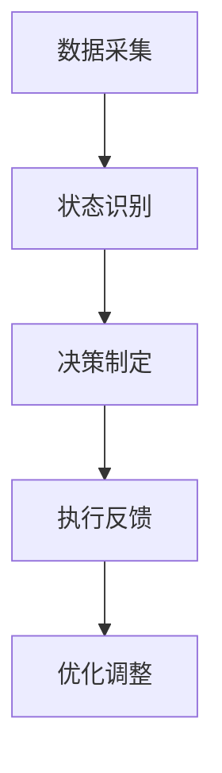

                 


# AI Agent在企业资产管理与维护中的应用

## 关键词：AI Agent, 企业资产管理, 资产维护, 强化学习, 智能系统, 数字化转型

## 摘要：  
本文探讨了AI Agent在企业资产管理与维护中的应用，分析了其核心概念、技术原理、系统架构及实际案例。通过强化学习、监督学习和深度学习等技术，AI Agent能够优化资产维护策略，提升管理效率，降低运营成本，并实现资产全生命周期的智能化管理。本文旨在为企业提供技术指导和实践参考，助力数字化转型。

---

## 第一章：AI Agent与企业资产管理概述

### 1.1 AI Agent的基本概念

#### 1.1.1 AI Agent的定义
AI Agent（人工智能代理）是指能够感知环境、做出决策并执行任务的智能实体。它通过传感器获取信息，利用算法处理数据，并通过执行器采取行动，以实现特定目标。

#### 1.1.2 AI Agent的核心特征
- **自主性**：无需人工干预，自主完成任务。
- **反应性**：实时感知环境变化并做出反应。
- **目标导向**：以实现特定目标为导向。
- **学习能力**：通过数据和经验不断优化决策能力。

#### 1.1.3 AI Agent与传统管理工具的对比
| 特性       | AI Agent                     | 传统管理工具             |
|------------|------------------------------|--------------------------|
| 数据处理   | 处理复杂非结构化数据         | 处理结构化数据           |
| 决策能力   | 自主学习优化决策             | 需人工或固定规则         |
| 效率       | 高效且实时                   | 较低，依赖人工操作         |
| 可扩展性   | 高，适用于大规模数据         | 较低，难以扩展             |

### 1.2 企业资产管理的背景与挑战

#### 1.2.1 企业资产管理的基本概念
企业资产管理（Enterprise Asset Management，EAM）是指对企业所有资产（如设备、设施、数据等）进行全生命周期管理，包括规划、采购、使用、维护和处置等环节。

#### 1.2.2 传统资产管理的痛点
- **效率低下**：人工管理耗时且易出错。
- **数据孤岛**：各部门数据分散，难以整合。
- **维护成本高**：故障响应慢，维修成本高昂。
- **缺乏预测性**：难以预知设备故障，导致突发问题。

#### 1.2.3 数字化转型对资产管理的影响
数字化转型通过引入AI、大数据和物联网技术，将资产管理从传统模式转向智能化、数据驱动的模式，显著提升了效率和决策能力。

### 1.3 AI Agent在资产管理中的应用价值

#### 1.3.1 提高资产管理效率
AI Agent能够实时监控资产状态，快速识别潜在问题，优化维护计划，减少停机时间。

#### 1.3.2 降低运营成本
通过预测性维护和资源优化配置，AI Agent能够大幅降低维护成本和能源消耗。

#### 1.3.3 提升资产全生命周期管理能力
AI Agent能够整合资产全生命周期数据，提供从采购到处置的全链条管理，提升决策的科学性和前瞻性。

### 1.4 本章小结
本章介绍了AI Agent的基本概念及其在企业资产管理中的应用价值，分析了传统资产管理的痛点，并指出了数字化转型对企业资产管理的影响。

---

## 第二章：AI Agent的核心技术

### 2.1 强化学习算法

#### 2.1.1 强化学习的基本原理
强化学习是一种通过试错机制学习策略的方法。AI Agent通过与环境交互，获得奖励或惩罚，逐步优化行动策略。

$$
Q(s, a) = r + \gamma \max_{a'} Q(s', a')
$$

其中：
- \( Q(s, a) \) 表示状态 \( s \) 下采取动作 \( a \) 的价值。
- \( r \) 是即时奖励。
- \( \gamma \) 是折扣因子，表示未来奖励的权重。
- \( s' \) 是下一个状态。

#### 2.1.2 状态空间与动作空间的定义
- **状态空间**：AI Agent所处环境的所有可能状态。
- **动作空间**：AI Agent在给定状态下可执行的所有动作。

#### 2.1.3 奖励函数的设计与优化
奖励函数定义了AI Agent在特定状态和动作下的奖励值，引导AI Agent学习最优策略。例如，当AI Agent成功预测设备故障时，给予正向奖励。

### 2.2 监督学习与无监督学习

#### 2.2.1 监督学习在AI Agent中的应用
监督学习通过训练数据学习输入与输出之间的映射关系，常用于分类和回归任务。例如，预测设备剩余寿命。

$$
y = f(x) + \epsilon
$$

其中：
- \( y \) 是目标变量。
- \( x \) 是输入变量。
- \( f \) 是模型函数。
- \( \epsilon \) 是误差项。

#### 2.2.2 无监督学习在异常检测中的作用
无监督学习用于发现数据中的异常模式，常用于设备故障预测。例如，使用聚类算法识别设备运行中的异常状态。

### 2.3 深度学习模型

#### 2.3.1 CNN与RNN在资产管理中的应用
- **卷积神经网络（CNN）**：用于图像识别，如设备缺陷检测。
- **循环神经网络（RNN）**：用于时间序列分析，如预测设备寿命。

#### 2.3.2 Transformer模型的优势与挑战
Transformer模型在自然语言处理领域表现出色，但在时间序列数据处理上仍需进一步优化。

### 2.4 本章小结
本章介绍了AI Agent的核心技术，包括强化学习、监督学习和深度学习的原理及其在资产管理中的应用。

---

## 第三章：AI Agent在资产管理中的系统架构

### 3.1 系统功能模块划分

#### 3.1.1 数据采集模块
通过传感器和物联网设备实时采集资产运行数据。

#### 3.1.2 状态识别模块
利用机器学习模型分析数据，识别资产当前状态。

#### 3.1.3 决策制定模块
根据识别的状态和历史数据，制定维护策略。

#### 3.1.4 执行反馈模块
执行决策并反馈结果，优化后续决策。

### 3.2 系统架构图


### 3.3 数据流与交互流程

#### 3.3.1 数据采集流程
1. 传感器采集设备数据。
2. 数据传输至数据处理模块。
3. 数据预处理并存储。

#### 3.3.2 状态识别与分析
1. 使用机器学习模型分析数据。
2. 识别设备运行状态。
3. 生成异常报告。

#### 3.3.3 决策执行与反馈
1. 根据状态制定维护计划。
2. 执行维护任务。
3. 反馈结果并优化模型。

### 3.4 本章小结
本章详细描述了AI Agent在资产管理中的系统架构，包括功能模块划分和数据流设计。

---

## 第四章：AI Agent在资产管理中的项目实战

### 4.1 项目背景与目标

#### 4.1.1 项目背景
某制造企业希望优化设备维护流程，减少停机时间。

#### 4.1.2 项目目标
- 实现设备状态实时监控。
- 提供预测性维护建议。
- 优化维护成本。

### 4.2 环境配置与数据准备

#### 4.2.1 环境配置
- 操作系统：Linux
- 开发工具：Python、TensorFlow、Keras
- 数据库：MySQL

#### 4.2.2 数据来源
- 设备传感器数据
- 历史维护记录
- 故障维修记录

### 4.3 核心代码实现

#### 4.3.1 数据预处理
```python
import pandas as pd
data = pd.read_csv('equipment_data.csv')
data = data.dropna()
```

#### 4.3.2 模型训练
```python
model = Sequential()
model.add(LSTM(64, input_shape=(timesteps, features)))
model.add(Dense(1))
model.compile(optimizer='adam', loss='mean_squared_error')
model.fit(X_train, y_train, epochs=100, batch_size=32)
```

#### 4.3.3 系统功能设计
- 实时监控界面
- 预测性维护提醒
- 维护记录查询

### 4.4 系统功能设计

#### 4.4.1 预测性维护
通过模型预测设备故障时间，提前安排维护。

#### 4.4.2 维护记录管理
记录每次维护的操作、结果和成本。

#### 4.4.3 数据可视化
使用图表展示设备运行状态和维护历史。

### 4.5 实际案例分析与优化

#### 4.5.1 案例分析
某设备通过AI Agent预测故障，避免了计划外停机，降低了维护成本。

#### 4.5.2 数据分析与优化
通过分析维护数据，优化维护策略，提高设备利用率。

### 4.6 本章小结
本章通过一个实际项目展示了AI Agent在资产管理中的应用，详细描述了项目的实施过程和优化策略。

---

## 第五章：AI Agent在资产管理中的案例分析

### 5.1 智能制造中的应用

#### 5.1.1 案例背景
某制造企业引入AI Agent优化设备维护流程。

#### 5.1.2 应用价值
- 提高设备利用率
- 降低维护成本
- 实现智能化生产

### 5.2 智慧城市中的应用

#### 5.2.1 案例背景
某城市使用AI Agent管理公共设施设备。

#### 5.2.2 应用价值
- 提高城市基础设施可靠性
- 降低运营成本
- 实现城市智能化管理

### 5.3 本章小结
本章通过具体案例展示了AI Agent在不同场景下的应用价值。

---

## 第六章：总结与展望

### 6.1 本章总结
本文详细探讨了AI Agent在企业资产管理中的应用，分析了其核心技术、系统架构及实际案例。

### 6.2 技术展望
- AI Agent将更加智能化和自适应。
- 结合边缘计算，提升实时性。
- 在更多领域得到广泛应用。

### 6.3 最佳实践 tips
- 数据质量是AI Agent性能的关键。
- 定期更新模型以适应环境变化。
- 结合领域知识优化模型效果。

### 6.4 作者观点
AI Agent作为企业资产管理的重要工具，将推动企业数字化转型迈向更高层次。

### 6.5 本章小结
本文总结了AI Agent在资产管理中的应用，并展望了未来的发展方向。

---

## 作者：AI天才研究院 & 禅与计算机程序设计艺术

---

**说明：**  
本文为《AI Agent在企业资产管理与维护中的应用》的完整目录和文章内容，涵盖从基础概念到实际应用的全链条分析。通过系统的讲解和丰富的案例，帮助读者全面理解AI Agent在资产管理中的价值和应用方式。

