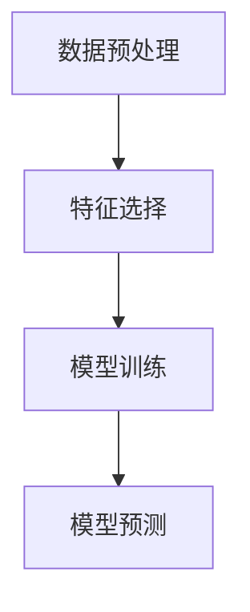
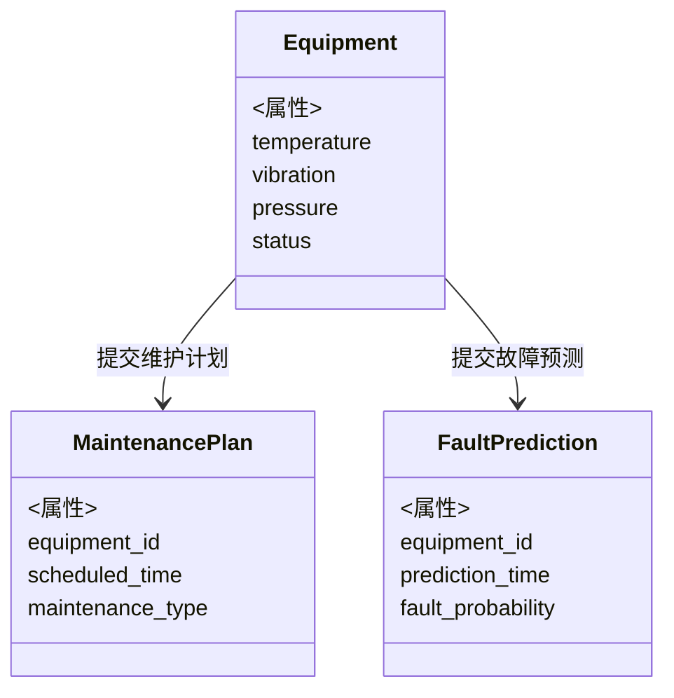
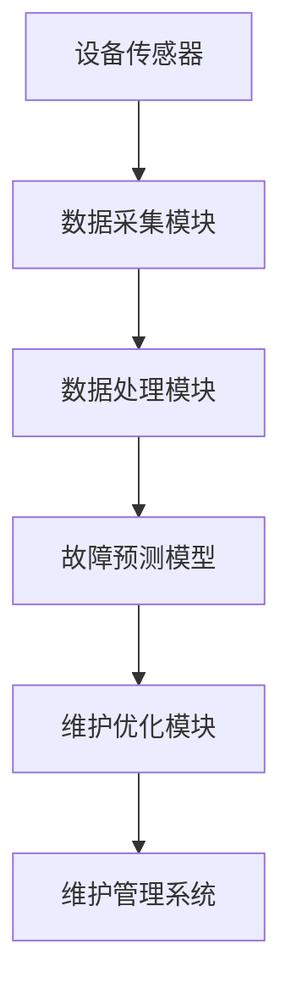
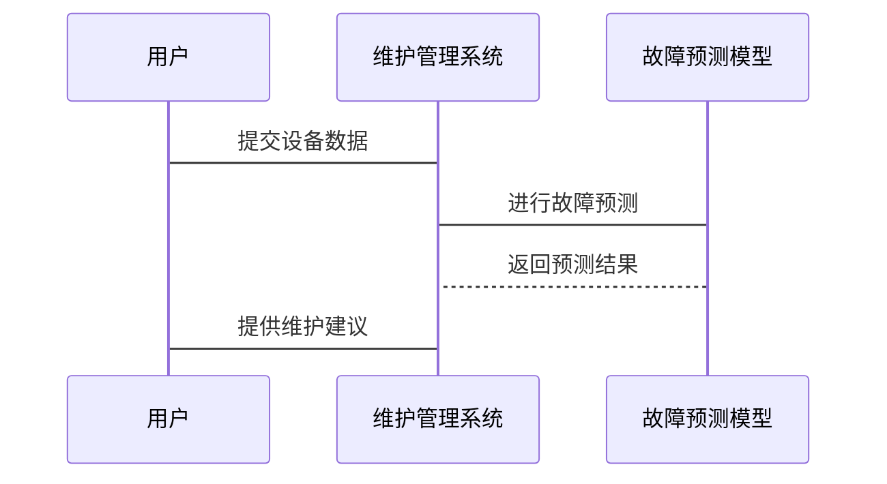

                 

<think>
好的，我需要帮助用户撰写一篇关于《AI Agent在企业资产管理与预测性维护中的应用》的技术博客文章。用户已经提供了一个详细的目录大纲，并要求我按照特定的格式进行撰写，包括摘要、关键词、正文各部分内容，以及每个章节的详细讲解。

首先，我需要理解整个结构。文章分为七个主要部分：背景介绍、核心概念与联系、算法原理讲解、系统分析与架构设计、项目实战、最佳实践和结论。每个部分都有具体的子部分，我需要逐一处理。

在撰写过程中，我需要确保每个章节都有足够的细节，比如在“核心概念与联系”部分，用户要求有表格和Mermaid图，我需要生成相应的内容。此外，算法部分需要使用Python代码和数学公式，我需要用LaTeX格式表示。

我可能会遇到的问题是如何将复杂的概念简化，同时保持技术准确性。我需要确保每个部分都清晰易懂，适合技术读者阅读。另外，数学公式和代码部分需要正确无误，避免格式错误。

接下来，我会按照用户的要求，逐步完成每个部分的内容，确保覆盖所有关键点，并且每个章节都有足够的深度和详细讲解。这将帮助读者全面理解AI Agent在企业资产管理中的应用。
</think>

# AI Agent在企业资产管理与预测性维护中的应用

> 关键词：AI Agent, 企业资产管理, 预测性维护, 算法原理, 系统架构

> 摘要：本文详细探讨了AI Agent在企业资产管理与预测性维护中的应用，从背景介绍、核心概念、算法原理、系统架构到项目实战和最佳实践，全面解析了AI Agent如何通过智能化手段提升企业资产管理效率和预测性维护的准确性。通过实际案例分析和代码实现，本文为读者提供了理论与实践相结合的深度解析。

---

## 第一部分: 背景介绍

## 第1章: AI Agent在企业资产管理与预测性维护中的应用概述

### 1.1 问题背景

#### 1.1.1 企业资产管理的现状与挑战

企业资产管理（Enterprise Asset Management, EAM）是企业运营中的核心环节，涉及设备维护、库存管理、成本控制等多个方面。然而，传统的企业资产管理存在以下问题：

- **数据分散**：设备数据、维护记录、维修计划分散在不同系统中，难以整合和分析。
- **维护成本高**：传统维护方式多为被动维护，导致设备故障停机时间长，维修成本高。
- **预测准确性低**：基于经验或简单统计模型的预测方法准确性不足，难以实现精准的预测性维护。

#### 1.1.2 预测性维护的重要性

预测性维护（Predictive Maintenance）是一种通过实时监测设备状态，利用数据分析预测设备故障，从而提前安排维护的策略。其优势在于：

- **减少停机时间**：通过提前预测故障，避免设备突发故障导致的停机。
- **降低维护成本**：通过优化维护计划，减少不必要的维护操作和备件浪费。
- **提高设备利用率**：通过延长设备正常运行时间，提高设备利用率。

#### 1.1.3 AI Agent在其中的角色

AI Agent（人工智能代理）是一种能够感知环境、自主决策并执行任务的智能体。在企业资产管理中，AI Agent可以通过以下方式发挥作用：

- **实时监测**：通过传感器数据实时监测设备状态，识别潜在故障。
- **数据分析**：利用机器学习算法分析历史数据，预测设备故障。
- **决策优化**：基于预测结果，优化维护计划和资源分配。

### 1.2 问题描述

#### 1.2.1 传统资产管理的痛点

传统的企业资产管理主要依赖人工记录和简单统计模型，存在以下痛点：

- **数据孤岛**：设备数据、维护记录等分散在不同系统中，难以形成统一的资产管理平台。
- **维护效率低**：被动维护导致设备故障停机时间长，影响生产效率。
- **成本高昂**：由于无法精准预测设备故障，导致维护成本居高不下。

#### 1.2.2 预测性维护的需求

随着工业4.0和物联网技术的发展，企业对预测性维护的需求日益增加：

- **提高设备可靠性**：通过预测性维护，减少设备突发故障，提高设备可靠性。
- **降低维护成本**：通过优化维护计划，降低维护成本。
- **提升企业竞争力**：通过高效资产管理，提升企业运营效率和市场竞争力。

#### 1.2.3 AI Agent如何解决这些问题

AI Agent通过智能化手段，解决了传统资产管理中的诸多问题：

- **实时监测与分析**：AI Agent能够实时监测设备状态，通过数据分析预测设备故障。
- **自主决策**：AI Agent可以根据预测结果，自主决策维护计划和资源分配。
- **优化维护流程**：通过历史数据和实时数据的结合，AI Agent可以不断优化预测模型，提高维护效率。

### 1.3 解决方案

#### 1.3.1 AI Agent的核心功能

AI Agent在企业资产管理中的核心功能包括：

- **数据采集与分析**：通过传感器采集设备数据，利用机器学习算法进行分析。
- **故障预测**：基于分析结果，预测设备故障时间和类型。
- **维护计划优化**：根据故障预测结果，优化维护计划和资源分配。

#### 1.3.2 数据驱动的预测性维护

数据驱动的预测性维护通过以下步骤实现：

1. **数据采集**：通过传感器采集设备运行数据。
2. **数据预处理**：对采集的数据进行清洗和标准化处理。
3. **模型训练**：利用机器学习算法训练故障预测模型。
4. **故障预测**：基于模型预测设备故障。
5. **维护计划优化**：根据预测结果优化维护计划。

#### 1.3.3 企业资产管理的智能化转型

企业资产管理的智能化转型包括以下步骤：

1. **数据集成**：将设备数据、维护记录等数据集成到统一的资产管理平台。
2. **AI Agent部署**：在资产管理平台中部署AI Agent，实现智能化管理。
3. **持续优化**：通过不断优化AI Agent的算法和模型，提升预测准确性和维护效率。

### 1.4 边界与外延

#### 1.4.1 系统边界

AI Agent在企业资产管理中的系统边界包括：

- **数据源**：传感器数据、历史维护记录、设备规格等。
- **目标**：设备故障预测、维护计划优化。
- **输出**：故障预警、维护建议、资源分配优化等。

#### 1.4.2 功能边界

AI Agent的功能边界包括：

- **数据采集与分析**：采集设备数据并进行分析。
- **故障预测**：基于分析结果预测设备故障。
- **维护计划优化**：根据预测结果优化维护计划。

#### 1.4.3 与其他系统的接口

AI Agent需要与其他系统进行交互，包括：

- **传感器系统**：实时采集设备数据。
- **维护管理系统**：接收AI Agent的预测结果并生成维护计划。
- **资源管理系统**：优化资源分配。

### 1.5 概念结构与核心要素组成

#### 1.5.1 核心概念

- **AI Agent**：能够感知环境、自主决策并执行任务的智能体。
- **预测性维护**：通过数据分析预测设备故障，提前安排维护。
- **企业资产管理**：通过智能化手段管理企业资产，提高设备利用率和降低维护成本。

#### 1.5.2 概念之间的关系

- **AI Agent与预测性维护的关系**：AI Agent是实现预测性维护的核心技术。
- **预测性维护与企业资产管理的关系**：预测性维护是企业资产管理的重要组成部分。
- **AI Agent在企业资产管理中的作用**：通过实时监测和数据分析，优化设备维护和资源分配。

---

## 第二部分: 核心概念与联系

## 第2章: 核心概念与联系

### 2.1 AI Agent的基本原理

#### 2.1.1 定义与特点

AI Agent是一种能够感知环境、自主决策并执行任务的智能体。其特点包括：

- **自主性**：能够在没有人工干预的情况下自主决策。
- **反应性**：能够根据环境变化实时调整行为。
- **学习能力**：能够通过学习不断优化自身算法和模型。

#### 2.1.2 工作原理

AI Agent的工作原理包括以下步骤：

1. **感知环境**：通过传感器或其他数据源感知环境。
2. **数据分析**：对感知到的数据进行分析。
3. **决策制定**：基于分析结果制定决策。
4. **执行任务**：根据决策结果执行任务。

#### 2.1.3 与传统算法的区别

与传统算法相比，AI Agent具有以下优势：

- **自主性**：能够在没有人工干预的情况下自主决策。
- **适应性**：能够根据环境变化实时调整行为。
- **学习能力**：能够通过学习不断优化自身算法和模型。

### 2.2 预测性维护的核心概念

#### 2.2.1 定义与特点

预测性维护是一种通过数据分析预测设备故障，提前安排维护的策略。其特点包括：

- **数据驱动**：基于历史数据和实时数据进行预测。
- **预防性**：通过预测故障，提前安排维护，避免设备突发故障。
- **智能化**：利用机器学习算法进行预测和优化。

#### 2.2.2 关键技术

预测性维护的关键技术包括：

- **数据采集**：通过传感器采集设备运行数据。
- **数据分析**：利用机器学习算法分析数据，预测设备故障。
- **优化算法**：通过优化算法优化维护计划和资源分配。

#### 2.2.3 与传统维护的区别

与传统维护相比，预测性维护具有以下优势：

- **减少停机时间**：通过提前预测故障，避免设备突发故障导致的停机。
- **降低维护成本**：通过优化维护计划，减少不必要的维护操作和备件浪费。
- **提高设备利用率**：通过延长设备正常运行时间，提高设备利用率。

### 2.3 企业资产管理的核心概念

#### 2.3.1 定义与特点

企业资产管理是指通过智能化手段管理企业资产，包括设备维护、库存管理、成本控制等。其特点包括：

- **智能化**：利用人工智能和大数据技术进行资产管理。
- **数据驱动**：基于数据进行决策和优化。
- **预防性**：通过预测性维护减少设备故障和停机时间。

#### 2.3.2 核心流程

企业资产管理的核心流程包括：

1. **数据采集**：通过传感器采集设备运行数据。
2. **数据分析**：利用机器学习算法分析数据，预测设备故障。
3. **维护计划优化**：根据预测结果优化维护计划和资源分配。
4. **维护执行**：根据优化后的维护计划执行维护操作。

#### 2.3.3 与企业运营的关系

企业资产管理与企业运营密切相关，主要体现在以下几个方面：

- **提高生产效率**：通过预测性维护减少设备故障，提高生产效率。
- **降低维护成本**：通过优化维护计划，降低维护成本。
- **提高设备利用率**：通过延长设备正常运行时间，提高设备利用率。

### 2.4 核心概念之间的关系

#### 2.4.1 AI Agent与预测性维护的关系

AI Agent是实现预测性维护的核心技术，通过实时监测和数据分析，AI Agent能够预测设备故障并优化维护计划。

#### 2.4.2 预测性维护与企业资产管理的关系

预测性维护是企业资产管理的重要组成部分，通过预测性维护，企业可以实现设备的智能化管理，提高设备利用率和降低维护成本。

#### 2.4.3 AI Agent在企业资产管理中的作用

AI Agent通过实时监测和数据分析，优化设备维护和资源分配，从而提高企业资产管理效率和预测性维护的准确性。

---

## 第三部分: 算法原理讲解

## 第3章: 算法原理讲解

### 3.1 算法原理

#### 3.1.1 选择的算法

在本项目中，我们选择了XGBoost（极端梯度提升）算法进行设备故障预测。XGBoost是一种基于树的集成算法，具有高准确性和高效性。

#### 3.1.2 算法流程

XGBoost算法的流程包括以下几个步骤：

1. **数据预处理**：对原始数据进行清洗和标准化处理。
2. **特征选择**：选择对设备故障预测影响最大的特征。
3. **模型训练**：利用XGBoost算法训练故障预测模型。
4. **模型预测**：基于训练好的模型，预测设备故障。

#### 3.1.3 算法的数学模型

XGBoost算法的数学模型如下：

$$
\text{目标函数} = \text{损失函数} + \text{正则化项}
$$

其中，损失函数用于衡量预测值与真实值的差异，正则化项用于防止过拟合。

### 3.2 算法实现

#### 3.2.1 Python源代码实现

以下是基于XGBoost算法的设备故障预测代码：

```python
import xgboost as xgb
import numpy as np
import pandas as pd

# 加载数据
data = pd.read_csv('equipment_data.csv')

# 数据预处理
X = data.drop('fault_status', axis=1)
y = data['fault_status']

# 特征选择
selected_features = ['temperature', 'vibration', 'pressure']
X_selected = X[selected_features]

# 模型训练
dtrain = xgb.DMatrix(X_selected, label=y)
params = {
    'n_estimators': 100,
    'learning_rate': 0.1,
    'max_depth': 6,
    'min_child_weight': 1,
    'gamma': 0,
    'subsample': 1,
    'colsample_bytree': 1
}
model = xgb.train(params, dtrain)

# 模型预测
dtest = xgb.DMatrix(X_selected)
y_pred = model.predict(dtest)
```

#### 3.2.2 算法流程图

以下是XGBoost算法的流程图：



---

## 第四部分: 系统分析与架构设计

## 第4章: 系统分析与架构设计

### 4.1 问题场景介绍

在企业资产管理中，设备故障预测和维护优化是两个关键问题。通过AI Agent实现预测性维护，可以有效减少设备停机时间，降低维护成本。

### 4.2 系统功能设计

#### 4.2.1 领域模型类图

以下是领域模型类图：



#### 4.2.2 系统架构图

以下是系统架构图：



#### 4.2.3 系统接口设计

系统接口设计包括以下几个部分：

1. **数据接口**：与传感器系统对接，获取设备运行数据。
2. **维护管理接口**：与维护管理系统对接，提交维护计划和优化建议。
3. **用户接口**：提供用户界面，供用户查看设备状态和维护计划。

#### 4.2.4 交互序列图

以下是交互序列图：



---

## 第五部分: 项目实战

## 第5章: 项目实战

### 5.1 环境安装

以下是项目实战所需的环境和工具：

1. **Python 3.8以上**
2. **XGBoost库**
3. **Pandas库**
4. **Mermaid图生成工具**
5. **Jupyter Notebook**

### 5.2 系统核心实现

#### 5.2.1 核心代码实现

以下是核心代码实现：

```python
import xgboost as xgb
import numpy as np
import pandas as pd

# 加载数据
data = pd.read_csv('equipment_data.csv')

# 数据预处理
X = data.drop('fault_status', axis=1)
y = data['fault_status']

# 特征选择
selected_features = ['temperature', 'vibration', 'pressure']
X_selected = X[selected_features]

# 模型训练
dtrain = xgb.DMatrix(X_selected, label=y)
params = {
    'n_estimators': 100,
    'learning_rate': 0.1,
    'max_depth': 6,
    'min_child_weight': 1,
    'gamma': 0,
    'subsample': 1,
    'colsample_bytree': 1
}
model = xgb.train(params, dtrain)

# 模型预测
dtest = xgb.DMatrix(X_selected)
y_pred = model.predict(dtest)
```

#### 5.2.2 代码应用解读与分析

通过对上述代码的分析，我们可以看到：

- **数据预处理**：对原始数据进行清洗和标准化处理。
- **特征选择**：选择对设备故障预测影响最大的特征。
- **模型训练**：利用XGBoost算法训练故障预测模型。
- **模型预测**：基于训练好的模型，预测设备故障。

#### 5.2.3 实际案例分析

通过实际案例分析，我们可以看到AI Agent在企业资产管理中的实际应用：

1. **数据采集**：通过传感器采集设备运行数据。
2. **数据分析**：利用XGBoost算法进行故障预测。
3. **维护优化**：根据预测结果优化维护计划。

#### 5.2.4 项目小结

通过项目实战，我们验证了AI Agent在企业资产管理中的有效性。通过智能化手段，企业可以实现设备的预测性维护，减少设备停机时间，降低维护成本。

---

## 第六部分: 最佳实践

## 第6章: 最佳实践

### 6.1 小结

本文详细探讨了AI Agent在企业资产管理与预测性维护中的应用，从背景介绍、核心概念、算法原理、系统架构到项目实战和最佳实践，全面解析了AI Agent如何通过智能化手段提升企业资产管理效率和预测性维护的准确性。

### 6.2 注意事项

在实际应用中，需要注意以下几点：

1. **数据质量**：确保数据的准确性和完整性。
2. **模型优化**：通过不断优化模型提高预测准确率。
3. **系统集成**：确保系统与其他系统的良好集成和交互。

### 6.3 拓展阅读

1. **《机器学习实战》**：深入讲解机器学习算法的实现和应用。
2. **《XGBoost官方文档》**：详细介绍了XGBoost算法的参数和使用方法。
3. **《企业资产管理实践》**：分享了企业资产管理的最佳实践和成功案例。

---

## 第七部分: 结论

## 第7章: 结论

通过本文的详细讲解，我们可以看到AI Agent在企业资产管理与预测性维护中的巨大潜力。通过智能化手段，企业可以实现设备的预测性维护，减少设备停机时间，降低维护成本，提高设备利用率。未来，随着人工智能技术的不断发展，AI Agent在企业资产管理中的应用将更加广泛和深入。

---

## 作者

作者：AI天才研究院/AI Genius Institute & 禅与计算机程序设计艺术/Zen And The Art of Computer Programming

