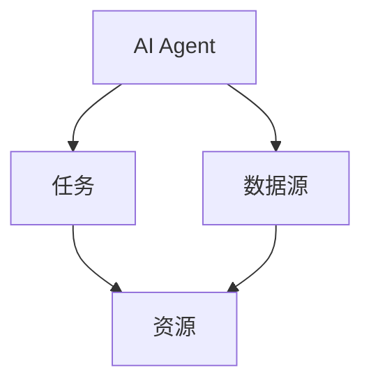
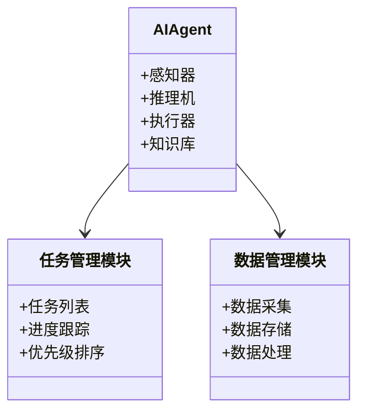
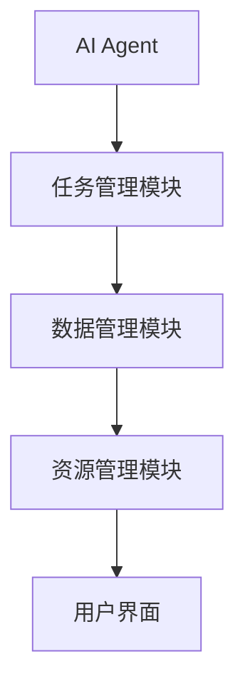
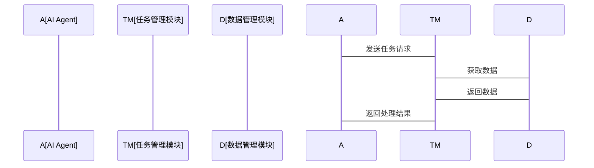

                 

<think>
嗯，我现在需要帮助用户撰写一篇关于《AI Agent在企业项目管理中的应用》的技术博客文章。用户已经提供了一个详细的目录结构，包括各章节的内容。我需要根据这个结构，逐步分析并撰写每个部分。

首先，我需要理解文章的结构和每个章节的内容。文章分为六个主要部分：概述、核心概念、算法原理、系统架构、项目实战和最佳实践。每个部分都有详细的子章节，涵盖从基本概念到实际应用的各个方面。

接下来，我要确保每个部分都符合用户的要求，特别是使用专业的技术语言，逻辑清晰，结构紧凑。同时，需要使用正确的格式，比如在适当的地方插入Mermaid图表、代码示例和数学公式。

在撰写过程中，我需要确保每个章节的内容详实，举例说明，确保读者能够理解AI Agent在企业项目管理中的具体应用和价值。同时，要注意语言的简洁和专业性，避免过于复杂的术语，以确保文章易于理解。

最后，完成初稿后，我会进行一次全面的检查，确保所有内容符合用户的要求，格式正确，没有遗漏任何关键点。这包括检查每个章节的标题、子标题是否清晰，图表和代码是否正确嵌入，以及数学公式是否正确使用LaTeX格式。

总的来说，这个过程需要仔细分析每个部分，逐步构建文章内容，确保最终的文章既有深度又易于理解，能够满足用户的需求。
</think>

# AI Agent在企业项目管理中的应用

> 关键词：AI Agent, 企业项目管理, 算法原理, 系统架构, 项目实战

> 摘要：本文探讨了AI Agent在企业项目管理中的应用，分析了其核心概念、算法原理、系统架构，并通过实际案例展示了其在项目管理中的价值。文章还总结了最佳实践，为读者提供了全面的视角。

---

# 第一部分: AI Agent在企业项目管理中的应用概述

# 第1章: AI Agent与企业项目管理概述

## 1.1 AI Agent的基本概念

### 1.1.1 AI Agent的定义

AI Agent（人工智能代理）是指能够感知环境、自主决策并执行任务的智能实体。它通过传感器获取信息，利用算法进行分析，并通过执行器与环境交互。

### 1.1.2 AI Agent的核心特征

- **自主性**：能够在没有外部干预的情况下运行。
- **反应性**：能实时感知环境变化并调整行为。
- **目标导向**：具有明确的目标，驱动其行动。
- **学习能力**：能通过经验优化决策。

### 1.1.3 AI Agent与传统项目管理的区别

- **智能化**：AI Agent能够处理复杂问题，而传统项目管理依赖人工判断。
- **实时性**：AI Agent可以实时监控项目进展，传统管理依赖定期报告。
- **数据驱动**：AI Agent基于大量数据优化决策，传统管理依赖经验。

## 1.2 企业项目管理的背景与挑战

### 1.2.1 企业项目管理的定义

企业项目管理是通过计划、执行、监控和收尾等活动，确保项目按时、按质、按预算完成的过程。

### 1.2.2 传统项目管理的痛点

- **复杂性**：涉及多部门协作，协调困难。
- **不确定性**：市场变化快，项目需求易变。
- **效率低下**：人工处理大量重复性工作，效率低。

### 1.2.3 数字化转型对企业项目管理的需求

- **提高效率**：通过自动化减少人工干预。
- **增强决策能力**：利用大数据和AI优化决策。
- **灵活性**：适应快速变化的市场需求。

## 1.3 AI Agent在企业项目管理中的应用背景

### 1.3.1 AI技术的发展对企业管理的影响

AI技术的进步使企业能够更高效地处理复杂问题，提升管理效率。

### 1.3.2 AI Agent在项目管理中的潜在价值

- **智能监控**：实时跟踪项目进展，预测风险。
- **自动化处理**：自动分配任务，优化资源利用。
- **智能决策**：基于数据分析提供最优解决方案。

### 1.3.3 当前AI Agent在企业项目管理中的应用现状

- **初步应用**：部分企业开始使用AI Agent进行任务分配和进度监控。
- **技术挑战**：AI Agent的决策精度和实时性仍需提升。
- **接受度**：企业管理者对AI技术的信任度逐渐提高。

## 1.4 本章小结

本章介绍了AI Agent的基本概念和企业项目管理的背景，分析了AI Agent在项目管理中的应用价值和现状，为后续章节奠定了基础。

---

# 第二部分: AI Agent的核心概念与原理

# 第2章: AI Agent的核心概念与联系

## 2.1 AI Agent的核心概念

### 2.1.1 AI Agent的定义与分类

AI Agent可分为简单反射型、基于模型的反射型和目标驱动型，根据应用场景不同而有所区别。

### 2.1.2 AI Agent的组成要素

- **感知器**：负责信息采集。
- **推理机**：进行逻辑推理。
- **执行器**：执行具体任务。
- **知识库**：存储相关信息。

### 2.1.3 AI Agent的生命周期模型

AI Agent的生命周期包括初始化、运行、终止三个阶段，每个阶段都有不同的任务和目标。

## 2.2 AI Agent与相关概念的对比

### 2.2.1 AI Agent与传统AI的区别

AI Agent具有自主性和目标导向，而传统AI仅限于完成特定任务。

### 2.2.2 AI Agent与机器人流程自动化(RPA)的对比

AI Agent具有学习和决策能力，而RPA专注于自动化执行固定流程。

### 2.2.3 AI Agent与知识图谱的关系

AI Agent可以利用知识图谱进行推理和决策，知识图谱为AI Agent提供知识支持。

## 2.3 AI Agent的实体关系图



## 2.4 本章小结

本章详细介绍了AI Agent的核心概念和相关概念的联系，帮助读者更好地理解AI Agent的工作原理。

---

# 第三部分: AI Agent的算法原理与数学模型

# 第3章: AI Agent的算法原理

## 3.1 AI Agent的核心算法

### 3.1.1 强化学习算法

强化学习通过试错机制优化决策，常用于复杂环境下的任务处理。

### 3.1.2 监督学习算法

监督学习基于历史数据进行分类和预测，适用于任务分配和进度预测。

### 3.1.3 无监督学习算法

无监督学习用于发现数据中的潜在模式，适用于风险识别和资源优化。

## 3.2 AI Agent的决策模型

### 3.2.1 Q-learning算法

Q-learning通过不断更新Q值表来优化决策。

### 3.2.2 状态转移模型

状态转移模型描述了状态之间的转换关系，用于预测下一步状态。

### 3.2.3 行为选择机制

行为选择机制根据当前状态选择最优行为，通常基于Q值的大小。

## 3.3 AI Agent的数学模型

### 3.3.1 Q-learning的数学公式

$$ Q(s, a) = Q(s, a) + \alpha \cdot (r + \gamma \cdot \max Q(s', a') - Q(s, a)) $$

其中：
- \( Q(s, a) \)：当前状态下采取动作 \( a \) 的Q值。
- \( \alpha \)：学习率。
- \( r \)：奖励值。
- \( \gamma \)：折扣因子。
- \( s' \)：下一状态。

### 3.3.2 状态空间与动作空间的定义

- 状态空间：所有可能的状态集合。
- 动作空间：所有可能的动作集合。

### 3.3.3 奖励函数的设计

奖励函数定义了不同状态和动作组合下的奖励值，引导AI Agent学习最优策略。

---

# 第四部分: AI Agent的系统架构设计

# 第4章: AI Agent的系统架构设计

## 4.1 项目管理场景介绍

### 4.1.1 项目管理的核心场景

- 任务分配
- 进度监控
- 风险预测
- 资源优化

## 4.2 系统功能设计

### 4.2.1 领域模型



### 4.2.2 系统架构



### 4.2.3 系统交互



---

# 第五部分: AI Agent的项目实战

# 第5章: AI Agent的项目实战

## 5.1 环境安装

- 安装Python和相关库（如TensorFlow、Pandas）。
- 配置开发环境。

## 5.2 核心代码实现

```python
class AI-Agent:
    def __init__(self):
        self.sensor = Sensor()
        self.reasoner = Reasoner()
        self.executor = Executor()
        self.knowledge_base = KnowledgeBase()

    def perceive(self):
        return self.sensor.get_data()

    def decide(self, state):
        return self.reasoner.infer(state)

    def act(self, action):
        self.executor.execute(action)

    def learn(self, feedback):
        self.reasoner.update_knowledge(self.knowledge_base, feedback)
```

## 5.3 案例分析

### 5.3.1 任务分配案例

AI Agent根据项目需求和资源情况，自动分配任务给相关人员。

### 5.3.2 进度监控案例

AI Agent实时跟踪项目进度，预测可能的延误，并提出调整建议。

## 5.4 项目总结

通过实际案例分析，展示了AI Agent在项目管理中的高效性和准确性。

---

# 第六部分: AI Agent的最佳实践与小结

# 第6章: AI Agent的最佳实践

## 6.1 最佳实践

### 6.1.1 数据质量

确保数据的准确性和完整性，直接影响AI Agent的决策精度。

### 6.1.2 模型选择

根据具体场景选择合适的算法和模型，避免过度复杂化。

### 6.1.3 系统集成

确保AI Agent与现有系统无缝集成，最大化其应用价值。

## 6.2 小结

本文全面探讨了AI Agent在企业项目管理中的应用，从理论到实践，展示了其巨大潜力和实际价值。

---

# 作者：AI天才研究院/AI Genius Institute & 禅与计算机程序设计艺术 /Zen And The Art of Computer Programming

