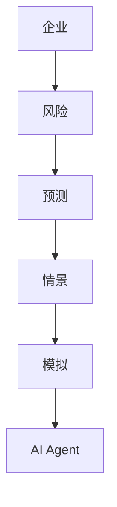
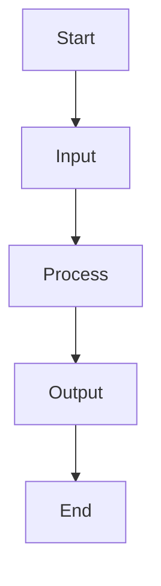
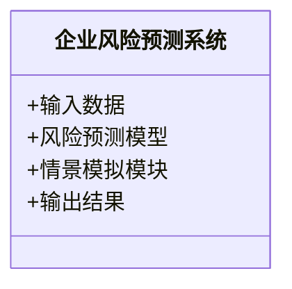
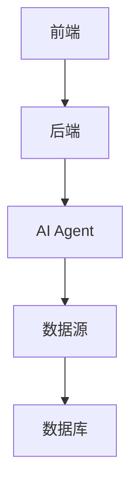
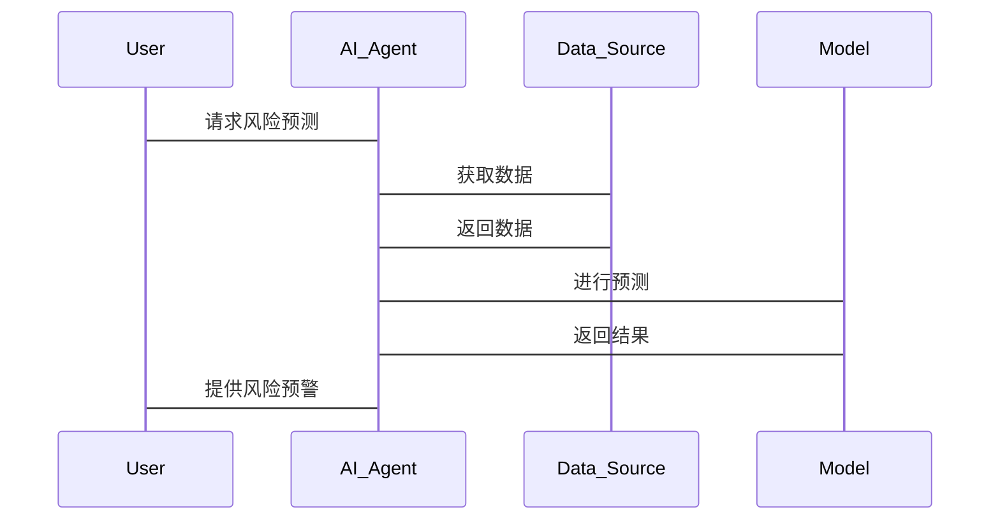

                 

<think>
嗯，我现在需要为用户撰写一篇关于《AI Agent在企业风险预测与情景模拟中的前沿应用》的技术博客文章。首先，我得仔细阅读用户的需求，确保完全理解他们想要的内容结构和风格。

用户已经提供了一个详细的目录大纲，我需要按照这个结构来撰写文章。文章的开头包括标题、关键词和摘要，然后是各个章节的详细内容。关键词部分需要列出5-7个核心词汇，摘要部分需要简明扼要地概括文章的核心内容。

接下来，我需要考虑每个章节的具体内容。第一部分是背景介绍，包括问题背景、问题描述、问题解决和边界与外延。这部分需要详细解释企业风险管理的痛点，AI Agent如何解决这些问题，以及相关的概念结构。

第二部分是核心概念与联系，这里需要详细讲解AI Agent的原理，与风险预测和情景模拟的联系，并通过对比表格和ER图来展示概念之间的关系。

第三部分是算法原理，我需要使用mermaid流程图和Python代码示例来解释AI Agent在风险预测中的具体算法流程，同时提供数学模型和公式，确保内容深入浅出。

第四部分是系统分析与架构设计，包括系统功能设计、架构设计、接口设计和交互流程图，这部分需要清晰的类图和架构图来展示系统结构。

第五部分是项目实战，需要提供具体的案例分析、环境安装、代码实现和案例解读，让读者能够实际操作和理解。

最后，还包括最佳实践、小结、注意事项和拓展阅读等内容，帮助读者进一步理解和应用相关知识。

在撰写过程中，我需要确保语言专业且易懂，使用适当的术语，同时避免过于复杂的表达。数学公式要用latex格式，代码部分要清晰展示，并解释每部分的功能。

另外，用户特别提到文章末尾需要署名，所以我会在文章最后加上作者信息。整体结构要逻辑清晰，每部分内容详实，符合用户的要求。

最后，我会通读整篇文章，检查是否有遗漏或不清晰的地方，确保内容完整且符合字数要求。这样，用户就能得到一篇高质量、结构严谨的技术博客文章了。
</think>

# AI Agent在企业风险预测与情景模拟中的前沿应用

## 关键词：AI Agent, 风险预测, 情景模拟, 企业风险管理, 人工智能

## 摘要：  
本文深入探讨了AI Agent在企业风险预测与情景模拟中的前沿应用。通过分析企业风险管理的核心问题，结合AI Agent的感知与决策能力，提出了基于AI Agent的风险预测模型和情景模拟方案。文章详细讲解了AI Agent的核心原理、算法实现、系统架构，并通过实际案例展示了AI Agent在企业风险管理中的应用价值。本文旨在为企业风险管理提供一种全新的技术思路，助力企业在复杂多变的商业环境中实现风险可控、决策优化的目标。

---

## 第一部分: 背景介绍

### 1.1 问题背景  
企业在经营过程中面临诸多不确定性，如市场波动、供应链中断、政策变化等，这些风险可能对企业造成重大损失。传统的风险管理方法依赖于人工分析和静态模型，难以应对动态变化的商业环境。AI Agent作为一种具备感知、推理和决策能力的智能体，能够实时分析企业内外部数据，提供动态的风险预测和情景模拟解决方案，从而帮助企业更好地应对复杂风险。

### 1.2 问题描述  
- **风险预测的核心目标**：识别潜在风险并评估其影响，以便提前采取应对措施。  
- **情景模拟的复杂性与多样性**：企业可能面临多种复杂情景，如经济危机、供应链断裂等，需要通过模拟找到最优应对策略。  
- **传统方法的局限性与AI Agent的优势**：传统方法依赖于历史数据和静态模型，难以应对动态变化；而AI Agent能够实时学习和自适应，提供更精准的预测和模拟。

### 1.3 问题解决  
- **AI Agent在风险预测中的应用价值**：通过实时数据分析和智能推理，AI Agent能够快速识别潜在风险并提供预警。  
- **AI Agent在情景模拟中的创新解决方案**：利用强化学习和模拟优化技术，AI Agent可以生成多种情景并评估其影响，为企业提供决策支持。  
- **企业风险管理的新范式**：结合AI Agent的动态预测能力，企业可以实现从被动应对到主动防控的转变。

### 1.4 边界与外延  
- **AI Agent在企业风险管理中的适用范围**：适用于复杂、动态且数据丰富的场景，如金融、供应链、制造等领域。  
- **风险预测的边界条件**：数据质量和模型假设是影响预测准确性的重要因素。  
- **相关领域的区别与联系**：与传统统计模型和机器学习模型相比，AI Agent具有更强的动态适应性和自主决策能力。

### 1.5 概念结构与核心要素  
- **AI Agent的基本构成**：感知层、推理层、决策层和执行层。  
- **风险预测的核心模型**：基于机器学习的分类模型和时间序列模型。  
- **情景模拟的关键要素**：情景生成、情景评估和情景优化。

---

## 第二部分: 核心概念与联系

### 2.1 AI Agent的核心原理  
- **AI Agent的基本原理**：通过感知环境数据，利用推理和学习能力生成决策，并通过执行层实现目标。  
- **AI Agent的感知与决策机制**：结合自然语言处理和计算机视觉技术，AI Agent能够从多源数据中提取信息并生成决策。  
- **AI Agent的自适应能力**：通过强化学习和在线学习，AI Agent能够动态调整模型参数以适应环境变化。

### 2.2 AI Agent与风险预测的关联  
- **风险预测的数学模型**：基于概率论和统计学的模型，如逻辑回归、随机森林和LSTM网络。  
- **AI Agent在风险预测中的角色**：作为智能决策者，AI Agent能够实时分析数据并生成风险预警。  
- **风险预测的实时性与动态性**：AI Agent能够处理实时数据流，提供动态风险评估。

### 2.3 AI Agent与情景模拟的联系  
- **情景模拟的定义与分类**：情景模拟是通过构建虚拟场景来评估不同策略下的结果，分为定量模拟和定性模拟。  
- **AI Agent在情景模拟中的应用**：利用强化学习和模拟优化技术，AI Agent可以生成多种情景并评估其影响。  
- **情景模拟的动态性与复杂性**：AI Agent能够处理复杂的情景，并通过动态调整模型参数实现优化。

### 2.4 核心概念对比  
| **核心概念** | **传统算法** | **AI Agent** |  
|--------------|---------------|---------------|  
| **感知能力** | 无感知能力 | 具备感知能力 |  
| **决策能力** | 基于规则 | 基于推理和学习 |  
| **适应能力** | 静态模型 | 动态自适应 |  

### 2.5 ER实体关系图  


---

## 第三部分: 算法原理讲解

### 3.1 算法原理概述  
- **AI Agent的核心算法**：基于强化学习和在线学习的算法，如Q-Learning和Deep Q-Network。  
- **风险预测的算法选择**：结合时间序列分析和机器学习模型，如LSTM和XGBoost。  
- **情景模拟的算法框架**：基于强化学习的多智能体模拟框架。

### 3.2 算法流程图  


### 3.3 算法实现代码  
```python
import numpy as np
import tensorflow as tf

class AI_Agent:
    def __init__(self, state_space, action_space):
        self.state_space = state_space
        self.action_space = action_space
        self.model = self.build_model()

    def build_model(self):
        model = tf.keras.Sequential([
            tf.keras.layers.Dense(64, activation='relu', input_dim=self.state_space),
            tf.keras.layers.Dense(self.action_space, activation='linear')
        ])
        model.compile(optimizer='adam', loss='mean_squared_error')
        return model

    def perceive(self, state):
        return state

    def decide(self, state):
        prediction = self.model.predict(np.array([state]))
        action = np.argmax(prediction[0])
        return action

    def learn(self, state, action, reward, next_state):
        target = reward + self.model.predict(np.array([next_state]))[0]
        self.model.fit(np.array([state]), np.array([target]), epochs=1, verbose=0)
```

### 3.4 数学模型与公式  
AI Agent的风险预测模型可以表示为：  
$$ P(risk) = f(x, y, z) $$  
其中，$x$、$y$、$z$分别表示企业内外部因素，$f$为预测函数。  
强化学习中的Q值更新公式为：  
$$ Q(s, a) = Q(s, a) + \alpha (r + \gamma \max Q(s', a') - Q(s, a)) $$  
其中，$\alpha$为学习率，$\gamma$为折扣因子。

---

## 第四部分: 系统分析与架构设计

### 4.1 系统功能设计  


### 4.2 系统架构设计  


### 4.3 系统接口设计  
- **输入接口**：接收企业内外部数据流。  
- **输出接口**：提供风险预警和情景模拟结果。  
- **API接口**：提供给企业其他系统调用。

### 4.4 系统交互流程图  


---

## 第五部分: 项目实战

### 5.1 环境安装  
- **Python版本**：Python 3.8+  
- **依赖库**：TensorFlow、Keras、numpy、pandas  

### 5.2 核心实现代码  
```python
import pandas as pd
import numpy as np

# 数据预处理
data = pd.read_csv('risk_data.csv')
X = data.drop('label', axis=1)
y = data['label']

# 模型训练
model = AI_Agent(X.shape[1], len(np.unique(y)))
model.model.fit(X, y, epochs=100, batch_size=32)

# 情景模拟
def simulate_scenario(initial_state):
    state = initial_state
    for _ in range(100):
        action = model.decide(state)
        reward = calculate_reward(state, action)
        next_state = transition(state, action)
        model.learn(state, action, reward, next_state)
        state = next_state
```

### 5.3 案例分析  
- **案例背景**：某制造企业在供应链中断风险下的情景模拟。  
- **案例实现**：通过AI Agent生成多个情景，评估不同应对策略的影响。  
- **案例解读**：AI Agent能够快速识别潜在风险并提供最优应对策略。

### 5.4 项目小结  
通过本项目，我们可以看到AI Agent在企业风险预测与情景模拟中的强大能力。AI Agent能够实时分析数据，提供动态预测和模拟，帮助企业更好地应对复杂风险。

---

## 第六部分: 最佳实践与总结

### 6.1 最佳实践  
- **数据质量**：确保数据的完整性和准确性。  
- **模型优化**：定期更新模型参数，保持模型的适应性。  
- **人机协同**：结合人类专家的判断，避免AI Agent的过度依赖。

### 6.2 小结  
本文详细探讨了AI Agent在企业风险预测与情景模拟中的前沿应用，从理论到实践，为企业风险管理提供了全新的技术思路。

### 6.3 注意事项  
- **数据隐私**：确保数据的安全性和隐私性。  
- **模型解释性**：提供可解释的模型，便于企业理解和信任。  
- **系统稳定性**：确保系统的高可用性和容错能力。

### 6.4 拓展阅读  
- 推荐阅读《强化学习：算法与应用》和《人工智能：现代方法》。

---

## 作者：AI天才研究院/AI Genius Institute & 禅与计算机程序设计艺术 /Zen And The Art of Computer Programming

