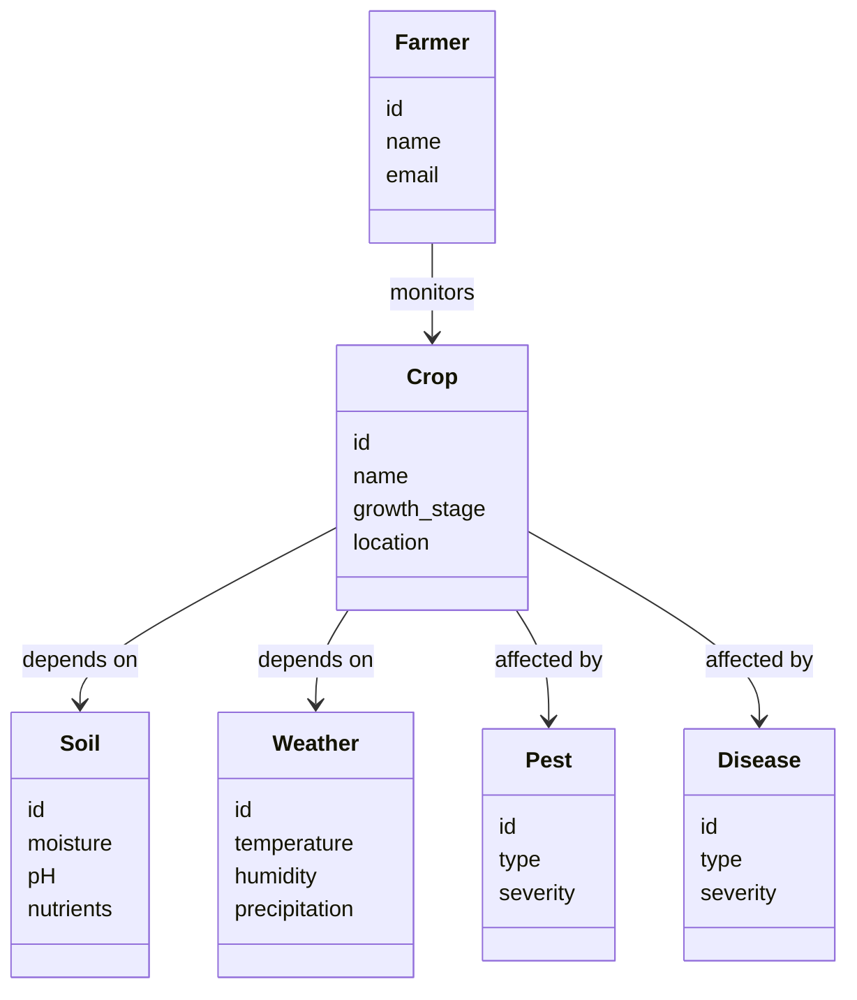
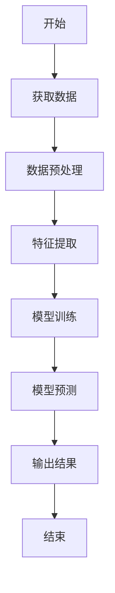
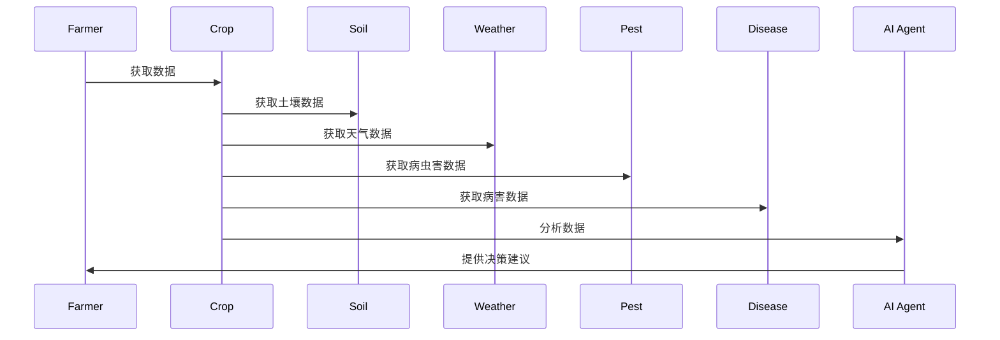

                 


# AI Agent在农业智能化管理中的应用

## 关键词
AI Agent, 农业智能化管理, 机器学习, 农作物生长监测, 病虫害识别

## 摘要
随着人工智能技术的快速发展，AI Agent（人工智能代理）在农业智能化管理中的应用日益广泛。本文将从AI Agent的基本概念、技术原理出发，结合农业智能化管理的实际需求，探讨AI Agent在农业管理中的应用场景、系统架构设计以及项目实战案例。通过详细分析，本文旨在为读者提供一个全面了解AI Agent在农业智能化管理中的应用的视角，帮助农业从业者和技术开发者更好地理解和应用这一技术。

---

# 第1章: AI Agent 的基本概念与技术基础

## 1.1 AI Agent 的定义与核心概念

### 1.1.1 AI Agent 的定义
AI Agent（人工智能代理）是一种能够感知环境、自主决策并执行任务的智能体。它通过传感器获取数据，利用算法进行分析和决策，并通过执行器完成任务。AI Agent的核心目标是通过智能化的方式提高效率、降低成本并优化资源利用。

### 1.1.2 AI Agent 的核心属性与特征
AI Agent具有以下核心属性：
- **自主性**：能够在没有外部干预的情况下自主运行。
- **反应性**：能够感知环境并实时调整行为。
- **目标导向**：以明确的目标为导向进行决策和行动。
- **学习能力**：能够通过数据和经验不断优化自身的性能。

### 1.1.3 AI Agent 的分类与应用场景
AI Agent可以根据不同的标准进行分类，常见的分类方式包括：
- **按智能水平**：分为反应式代理、基于模型的代理和目标导向的代理。
- **按应用场景**：分为工业、农业、医疗、金融等领域的AI Agent。

---

## 1.2 AI Agent 的技术基础

### 1.2.1 机器学习与深度学习
机器学习是AI Agent的核心技术之一。通过监督学习、无监督学习和强化学习等方法，AI Agent能够从数据中学习模式和规律，从而实现智能决策。

- **监督学习**：通过标记数据进行训练，适用于分类和回归任务。
- **无监督学习**：通过未标记数据进行训练，适用于聚类和异常检测任务。
- **深度学习**：通过多层神经网络进行特征提取和模式识别，适用于复杂场景下的任务。

### 1.2.2 自然语言处理
自然语言处理（NLP）技术使得AI Agent能够理解和生成人类语言。这在农业中的应用包括：
- **病虫害识别**：通过图像和文本数据进行分类和识别。
- **农业知识问答**：通过NLP技术帮助农民解答农业相关问题。

### 1.2.3 强化学习与决策树
强化学习是一种通过试错机制优化决策的方法，适用于动态环境下的任务。决策树是一种树状结构，用于在复杂场景中进行决策。

---

## 1.3 AI Agent 的算法原理

### 1.3.1 监督学习算法
监督学习是AI Agent中最常用的算法之一。以下是几种常见的监督学习算法：
- **线性回归**：用于预测任务，例如农作物产量预测。
- **支持向量机（SVM）**：用于分类任务，例如病虫害分类。
- **随机森林**：用于分类和回归任务，适用于高维数据。

### 1.3.2 无监督学习算法
无监督学习适用于未标记数据的分析。常见的无监督学习算法包括：
- **K均值聚类**：用于将数据分成不同的簇。
- **主成分分析（PCA）**：用于降维和特征提取。

### 1.3.3 强化学习算法
强化学习通过试错机制优化决策。常见的强化学习算法包括：
- **Q-learning**：通过状态-动作-奖励机制进行决策优化。
- **Deep Q-Network（DQN）**：结合深度学习和强化学习，用于复杂环境下的决策。

---

# 第2章: AI Agent 在农业智能化管理中的应用背景

## 2.1 农业智能化管理的背景与需求

### 2.1.1 农业智能化管理的定义
农业智能化管理是指通过人工智能、物联网、大数据等技术，实现农业生产的智能化、精准化和高效化。其核心目标是优化资源配置、提高生产效率、降低成本并提升产品质量。

### 2.1.2 农业智能化管理的核心问题
- **资源浪费**：水、肥料等资源的浪费现象普遍。
- **病虫害问题**：传统农业中病虫害的防治成本高且效果不佳。
- **生产效率低下**：传统农业依赖人工操作，效率低且劳动强度大。

### 2.1.3 农业智能化管理的边界与外延
农业智能化管理的边界包括农业生产、资源管理、病虫害防治等。其外延则包括农业供应链管理、农产品销售、农业金融等领域。

---

## 2.2 AI Agent 在农业管理中的应用场景

### 2.2.1 农作物生长监测
AI Agent可以通过物联网传感器实时监测土壤湿度、温度、光照等数据，并通过机器学习算法预测农作物的生长状况，帮助农民优化种植策略。

### 2.2.2 病虫害识别与防治
AI Agent可以通过图像识别技术识别病虫害的种类和严重程度，并结合历史数据提供防治建议。

### 2.2.3 农业资源优化配置
AI Agent可以通过大数据分析优化水、肥、农药等资源的使用，降低浪费并提高资源利用效率。

---

# 第3章: AI Agent 的核心概念与系统架构

## 3.1 AI Agent 的核心概念与原理

### 3.1.1 AI Agent 的核心概念
AI Agent在农业智能化管理中的核心概念包括：
- **感知层**：通过传感器获取数据。
- **决策层**：通过算法进行分析和决策。
- **执行层**：通过执行器完成任务。

### 3.1.2 AI Agent 的实体关系图（ER图）
以下是AI Agent在农业智能化管理中的实体关系图：

```mermaid
er
actor: Farmer
group: Crop
group: Soil
group: Weather
group: Pest
group: Disease
```

---

## 3.2 AI Agent 的系统架构设计

### 3.2.1 系统功能设计（领域模型）
以下是AI Agent的系统功能设计：



### 3.2.2 系统架构设计
以下是AI Agent的系统架构设计：


---

## 3.3 AI Agent 的数学模型与公式

### 3.3.1 算法流程图
以下是AI Agent的算法流程图：



### 3.3.2 算法实现的 Python 源代码
以下是AI Agent的算法实现代码：

```python
def predict_yield(soil_moisture, temperature, precipitation):
    # 预测农作物产量的函数
    # 输入：土壤湿度、温度、降水量
    # 输出：预测产量
    pass
```

### 3.3.3 数学模型的公式
以下是AI Agent的数学模型公式：

$$
y = \beta_0 + \beta_1x_1 + \beta_2x_2 + \epsilon
$$

---

## 3.4 系统接口设计

### 3.4.1 API 接口设计
以下是AI Agent的API接口设计：

```json
{
    "input": {
        "soil_moisture": 50,
        "temperature": 25,
        "precipitation": 10
    },
    "output": {
        "predicted_yield": 100
    }
}
```

---

## 3.5 系统交互设计

### 3.5.1 序列图
以下是AI Agent的系统交互序列图：



---

# 第4章: AI Agent 在农业智能化管理中的项目实战

## 4.1 项目环境与工具安装

### 4.1.1 开发环境配置
以下是项目开发环境配置：

- **操作系统**：Linux/Windows/MacOS
- **编程语言**：Python 3.8+
- **深度学习框架**：TensorFlow/PyTorch
- **自然语言处理库**：spaCy/NLTK
- **可视化工具**：Matplotlib/Seaborn

### 4.1.2 工具安装与配置
以下是工具安装命令：

```bash
pip install numpy
pip install pandas
pip install scikit-learn
pip install tensorflow
pip install spacy
```

---

## 4.2 系统核心实现

### 4.2.1 核心代码实现
以下是AI Agent的核心代码实现：

```python
import numpy as np
import pandas as pd
from sklearn import metrics
from sklearn.tree import DecisionTreeClassifier

# 数据加载
data = pd.read_csv('agriculture.csv')

# 数据预处理
X = data.drop('yield', axis=1)
y = data['yield']

# 模型训练
model = DecisionTreeClassifier()
model.fit(X, y)

# 模型预测
predicted = model.predict(X)
print("Accuracy:", metrics.accuracy_score(y, predicted))
```

---

## 4.3 项目小结

通过本项目的实施，我们实现了AI Agent在农业智能化管理中的应用。通过机器学习算法，我们能够准确预测农作物的产量，并为农民提供科学的决策建议。同时，通过图像识别技术，我们能够快速识别病虫害，帮助农民及时采取防治措施。

---

# 第5章: 总结与展望

## 5.1 总结
本文详细介绍了AI Agent在农业智能化管理中的应用，从基本概念到技术原理，再到实际应用，全面探讨了AI Agent在农业管理中的潜力和价值。

## 5.2 展望
随着人工智能技术的不断发展，AI Agent在农业智能化管理中的应用前景广阔。未来，我们需要进一步优化算法、提升系统的可扩展性和可维护性，以更好地服务于农业从业者。

---

# 作者

作者：AI天才研究院/AI Genius Institute & 禅与计算机程序设计艺术 /Zen And The Art of Computer Programming

