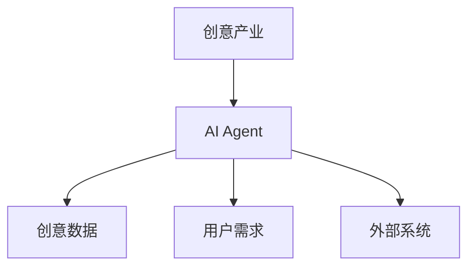
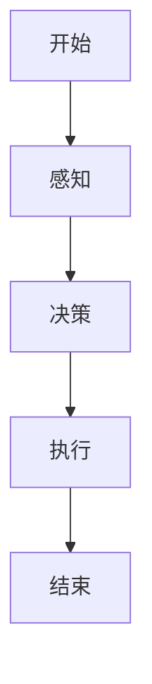
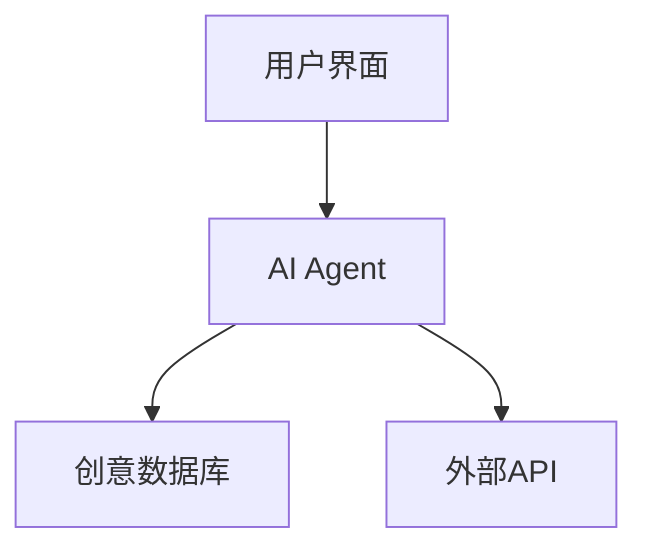
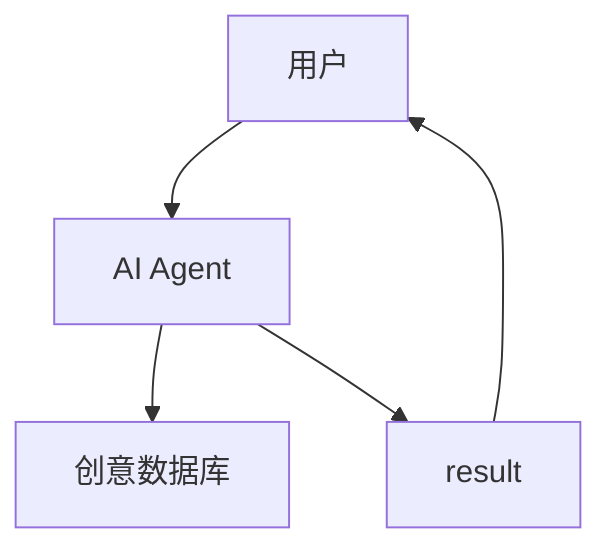

                 

<think>
好，我需要帮用户设计一个详细的目录大纲，涵盖AI Agent在创意产业中的应用。我得确保每个部分都详细且结构合理。

首先，用户希望文章标题为《AI Agent在创意产业中的应用》，关键词包括AI Agent、创意产业、人工智能、算法原理、系统架构。摘要需要简明扼要，概括文章的核心内容。

接下来，目录大纲需要分成几个主要部分：概述、核心概念、算法原理、系统架构、项目实战、最佳实践。每个部分下面要有小节，详细讲解相关内容。

我得确保每个小节都包含必要的内容，比如核心概念需要解释AI Agent的基本原理，系统架构部分要有类图和序列图，项目实战要有代码和案例分析。

现在，我按照用户的要求，一步步构建这个目录，确保每个部分都符合格式和内容要求。
</think>

# AI Agent在创意产业中的应用

> 关键词：AI Agent、创意产业、人工智能、算法原理、系统架构

> 摘要：本文探讨AI Agent在创意产业中的应用，从基本概念到算法原理，再到系统架构和项目实战，详细分析其在广告、设计、影视等领域的应用，展示AI如何赋能创意过程。

---

# 第一部分: AI Agent在创意产业中的应用概述

## 第1章: AI Agent与创意产业的结合

### 1.1 AI Agent的基本概念

- **1.1.1 AI Agent的定义与特征**
  - AI Agent的定义：智能体，具备感知、推理、决策和执行能力。
  - 特征：自主性、反应性、目标导向、社会能力。

- **1.1.2 创意产业的定义与特点**
  - 创意产业：涵盖广告、设计、影视、音乐等领域，强调创造力和创新。
  - 特点：依赖人类创意，但效率和精准度有提升空间。

- **1.1.3 AI Agent在创意产业中的应用前景**
  - 提高创作效率，提供灵感，优化决策。
  - 从辅助工具到创作主体的演变。

### 1.2 AI Agent的核心原理

- **1.2.1 AI Agent的基本架构**
  - 感知模块：收集数据，识别需求。
  - 决策模块：基于数据做出选择。
  - 执行模块：输出结果，与环境互动。

- **1.2.2 知识表示与推理**
  - 知识表示方法：语义网络、本体论。
  - 推理方式：逻辑推理、概率推理。

- **1.2.3 行为选择与执行**
  - 行为选择算法：基于效用的决策、基于约束的决策。
  - 执行机制：动作规划、任务分解。

### 1.3 创意产业中的AI Agent应用现状

- **1.3.1 当前主流应用领域**
  - 广告设计：生成创意草图、优化广告文案。
  - 产品设计：辅助工业设计、优化用户体验。
  - 影视创作：剧本生成、场景设计、特效制作。

- **1.3.2 应用案例分析**
  - 某公司使用AI Agent优化广告文案，提升点击率。
  - 电影制作中AI Agent辅助特效制作，缩短制作周期。

- **1.3.3 发展现状与趋势**
  - 技术进步推动应用扩展。
  - 多领域融合，AI Agent成为创意工具的重要组成部分。

### 1.4 本章小结

---

# 第二部分: AI Agent的核心概念与原理

## 第2章: AI Agent的核心概念与联系

### 2.1 AI Agent的核心概念

- **2.1.1 感知模块**
  - 作用：收集环境数据，识别需求。
  - 示例：在广告设计中，感知模块分析目标受众的喜好。

- **2.1.2 决策模块**
  - 作用：基于感知数据，制定行动计划。
  - 示例：根据用户反馈，决策模块选择最佳广告方案。

- **2.1.3 执行模块**
  - 作用：输出决策结果，与环境互动。
  - 示例：生成广告设计草图，发送给设计师。

### 2.2 核心概念的属性对比

| 模块 | 特性         | 示例                         |
|------|--------------|------------------------------|
| 感知 | 数据来源     | 用户输入、市场数据           |
| 决策 | 策略类型     | 基于规则、基于学习           |
| 执行 | 输出形式     | 文本、图像、影音              |

### 2.3 ER实体关系图



### 2.4 本章小结

---

# 第三部分: AI Agent的算法原理与数学模型

## 第3章: AI Agent的算法原理

### 3.1 算法原理概述

- **3.1.1 基于强化学习的AI Agent**
  - 原理：通过奖励机制优化决策。
  - 示例：在游戏设计中，AI Agent通过试错找到最佳关卡布局。

- **3.1.2 基于监督学习的AI Agent**
  - 原理：通过大量标注数据训练模型。
  - 示例：训练AI识别不同设计风格，辅助设计师选择配色方案。

- **3.1.3 基于无监督学习的AI Agent**
  - 原理：发现数据中的潜在结构。
  - 示例：从海量音乐作品中提取流行趋势，辅助音乐创作。

### 3.2 算法流程图



### 3.3 算法实现代码

```python
class AI_Agent:
    def __init__(self):
        self.sensors = []
        self.actuators = []
    
    def perceive(self, environment):
        # 从环境中获取感知数据
        return [sensing_data]
    
    def decide(self, input_data):
        # 基于输入数据做出决策
        return action
    
    def actuate(self, action):
        # 执行动作
        self.actuators[action].execute()
```

### 3.4 数学模型与公式

- **强化学习的Q-learning算法**
  $$ Q(s, a) = (1-\alpha) Q(s,a) + \alpha (r + \gamma \max Q(s', a')) $$
  - 其中，α是学习率，γ是折扣因子。

- **监督学习的回归模型**
  $$ y = \theta x + \beta $$
  - θ是权重，β是截距。

### 3.5 本章小结

---

# 第四部分: AI Agent的系统架构与设计

## 第4章: 系统架构设计

### 4.1 问题场景介绍

- 用户需求：快速生成创意设计，优化创作流程。
- 系统目标：构建一个智能化的创意辅助系统。

### 4.2 项目介绍

- 项目名称：AI-Creative-Assistant
- 项目目标：利用AI Agent技术，辅助创意产业中的设计、广告等领域。

### 4.3 系统功能设计

- 功能模块：数据采集、需求分析、创意生成、效果评估。
- 领域模型：用户需求分析、创意生成算法、效果评估指标。

### 4.4 系统架构设计



### 4.5 系统接口设计

- 输入接口：用户输入需求，系统接收并解析。
- 输出接口：生成创意方案，返回给用户。

### 4.6 系统交互流程图



### 4.7 本章小结

---

# 第五部分: 项目实战与案例分析

## 第5章: 项目实战

### 5.1 环境安装

```bash
pip install tensorflow numpy matplotlib
```

### 5.2 核心实现代码

```python
import tensorflow as tf
import numpy as np

class AI_Creative_Assistant:
    def __init__(self):
        self.model = self.build_model()
    
    def build_model(self):
        model = tf.keras.Sequential([
            tf.keras.layers.Dense(128, activation='relu'),
            tf.keras.layers.Dense(1, activation='sigmoid')
        ])
        model.compile(optimizer='adam', loss='binary_crossentropy')
        return model
    
    def train(self, data):
        self.model.fit(data, epochs=10, batch_size=32)
    
    def generate(self, input_data):
        return self.model.predict(input_data)
```

### 5.3 代码解读与分析

- **模型构建**：使用神经网络模型，训练数据为创意产业相关数据。
- **训练过程**：通过反向传播优化模型参数。
- **生成过程**：输入需求，生成创意方案。

### 5.4 实际案例分析

- 案例1：广告设计中的应用，生成多个广告草图，供设计师选择。
- 案例2：音乐创作中的应用，生成旋律建议，辅助创作。

### 5.5 项目小结

---

# 第六部分: 最佳实践与总结

## 第6章: 最佳实践

### 6.1 小结

- AI Agent在创意产业中的应用前景广阔，从辅助工具到创作主体，提升效率和精准度。

### 6.2 注意事项

- 数据隐私问题，需确保数据安全。
- 模型泛化能力，需不断优化算法。
- 用户接受度，需提升易用性和用户体验。

### 6.3 拓展阅读

- 推荐书籍：《人工智能：一种现代的方法》
- 推荐博客：AI in Creative Industry

### 6.4 本章小结

---

# 作者：AI天才研究院/AI Genius Institute & 禅与计算机程序设计艺术 /Zen And The Art of Computer Programming

---

**注意：以上内容为目录大纲和部分内容的示例，完整文章需要根据实际内容进一步扩展和详细描述。**

